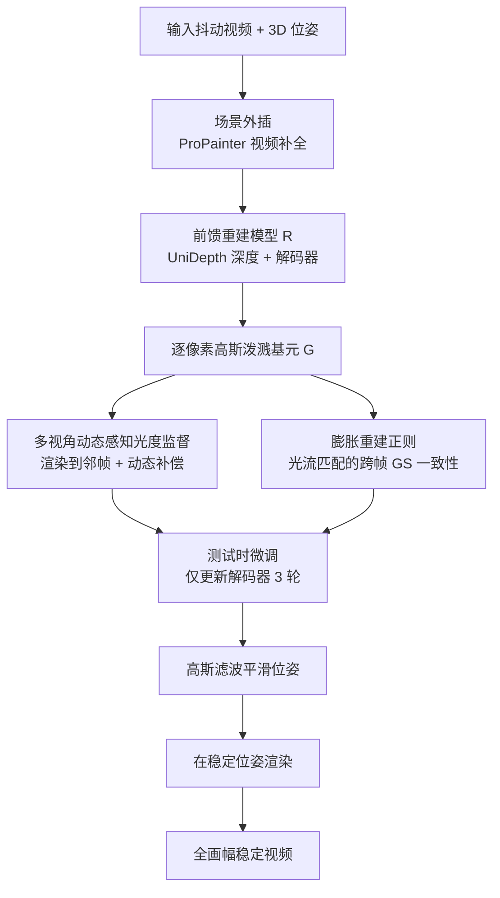

## 一句话总结

GaVS 把视频防抖重新表述为"逐帧局部重建 + 渲染"的 3D 问题：给定 3D 相机位姿，用前馈重建模型为每帧预测逐像素高斯泼溅基元，并通过测试时优化（多视角动态感知的光度监督 + 跨帧正则）得到时序一致的局部重建，再在平滑后的位姿处渲染出无裁剪的稳定帧。

## 研究背景

视频防抖是几乎所有视频处理流水线的基础环节，其典型三步为：从抖动视频中追踪相机运动、平滑相机运动以滤除抖动同时保留用户意图、合成稳定视频。文献中相机运动（乃至场景本身）大多在 2D 域建模，用帧变换（仿射、单应）或光流（像素级或网格级）表示，缺乏显式 3D 建模，容易在稳定视频中产生令人不适的几何畸变。

后续工作引入了基于学习的表示、深度线索甚至额外传感器来缓解畸变，但仍存在两类问题：

- **泛化差**：预训练模型面对开放域视频（多样的相机运动与场景动态）时存在域间隙，效果下降。
- **逐帧变换导致裁剪**：几乎所有方法都逐帧变换对应的抖动帧来合成稳定帧，不可避免地要裁剪画面，造成内容丢失。虽然 2D/2.5D 的多帧融合被用于实现全画幅（无裁剪）防抖，但由于仍缺乏显式 3D 场景建模，容易出现不一致与畸变伪影。

作者据此提出 GaVS，一个基于高斯泼溅（GS）的 3D-grounded 防抖流水线，在不使用额外传感器的前提下，同时实现全画幅稳定、最小化不一致与畸变。

## 方法

### 整体框架

核心思想来自两点观察：其一，防抖中对应的抖动帧与稳定帧只有微小差异，因此没必要为渲染稳定帧而全局重建整个场景（动态场景的全局重建尤其困难），可用一个前馈网络预测**局部重建**；其二，3D-grounded 防抖要最小化伪影，本质上要求相邻局部重建之间保持一致。

流水线分两阶段。测试时微调阶段：预训练重建模型先从输入帧预测深度，再把深度与图像送入解码器得到高斯泼溅形式的局部重建；微调只更新解码器。先用视频补全对帧做外插以提供初始重建，再用多视角光度损失（含动态物体补偿）监督每个局部重建，并在膨胀时间窗内对匹配的 GS 基元施加一致性正则。推理阶段：把每个外插后的重建渲染到其对应的稳定位姿，得到全画幅稳定视频。

记源帧（抖动）为 $$I_k^s$$、目标帧（稳定）为 $$I_k^t$$，相机为针孔模型 $$K$$，抖动与稳定位姿分别为 $$P_k^s$$、$$P_k^t$$。合成目标帧的基本操作为：从源帧用前馈模型 $$R(\cdot)$$ 预测逐像素 GS 基元，再在目标位姿渲染：

$$I_k^t = \mathrm{GSplat}(G_k^s,\, P_k^t \otimes \mathrm{inv}(P_k^s)) \quad \text{其中} \quad G_k^s = R(I_k^s)$$

该设计统一了静态与动态场景部分的重建，但局部性无法保证相邻重建的时序一致，且预训练模型在测试时易泛化不足，故引入以下三项测试时措施。

### 关键设计一：多视角动态感知光度监督

用源帧的局部重建 $$G_k^s$$ 渲染到时序相邻的源帧位姿 $$P_i^s$$ 上得到 $$\hat{I}_i^s$$，施加 L1 与 SSIM 组合的光度损失：

$$L_{RGB} = \frac{1}{\vert N_k\vert } \sum_{i \in N_k} \left( \lVert \hat{I}_i^s - I_i^s \rVert_1 + \lambda_{ssim}\, \mathrm{SSIM}(\hat{I}_i^s, I_i^s) \right)$$

其中 $$N_k$$ 是由源帧及其在时间窗 $$[k-W, k+W]$$ 内随机采样的 $$S-1$$ 个邻帧组成的集合。但动态物体会破坏光度损失所依赖的对极几何，为此作者提出补偿机制：把总 2D 像素运动解耦为相机运动与物体运动。设总光流 $$F_{i \to k}$$（由 RAFT 估计），相机运动流 $$F_{i \to k}^{cam}$$，物体动态流 $$F_{i \to k}^{obj}$$，则

$$F_{i \to k}^{obj} = F_{i \to k} - F_{i \to k}^{cam}$$

由于深度只在源帧 $$D_k^s$$ 已知，先反投影像素到 3D 点、施加相对位姿变化、再投影回 2D 得到"逆向"相机运动流：

$$F_{k \to i}^{cam} = \mathrm{Project}_{K,P_i^s}(\mathrm{Un\text{-}project}_{K,P_k^s}(D_k^s)) - \mathrm{Coordinates}_k$$

再经前向泼溅得到所需的 $$F_{i \to k}^{cam}$$。借助双向一致性与前向泼溅权重仅在有效区域监督，可把邻帧动态物体"扭"回源帧时刻的"标准"姿态，从而剔除物体运动带来的错误监督。

### 关键设计二：膨胀重建正则

光度监督只是隐式地促进一致性，为显式约束，作者对相邻帧匹配到的 GS 基元施加 L2 正则。给定两邻帧重建 $$G_i^s = R(I_i^s)$$、$$G_j^s = R(I_j^s)$$，以双向光流 $$F_{i \to j}$$、$$F_{j \to i}$$ 建立稠密对应：

$$L_{pair}(i,j) = M_{i,j} \cdot \lVert G_i^s - \mathrm{warp}(G_j^s, F_{j \to i}) \rVert_2$$

其中 $$M_{i,j}$$ 为双向一致性检查后的有效区域。在大小为 $$s$$ 的时间窗内引入膨胀 $$d$$，测试时逐步增大 $$d$$ 以覆盖更宽的时间范围：

$$L_{consistent} = \frac{1}{s} \sum_{j=-\lfloor s/2 \rfloor}^{\lfloor s/2 \rfloor} L_{pair}(i,\, i + j\cdot(d+1))$$

### 关键设计三：场景外插与运动平滑

由于相机运动，局部重建可能缺少渲染全画幅所需的内容。作者用视频补全方法（ProPainter）对源帧做外插：在源帧上加边界掩码指示待填充区域，再利用光流传播跨帧内容，从而实现无裁剪的全画幅稳定。

总损失为光度、一致性、尺度、偏移四项加权：

$$L = L_{RGB} + \lambda_{consistent} L_{consistent} + \lambda_{scale} L_{scale} + \lambda_{offset} L_{offset}$$

其中 $$L_{scale}$$ 惩罚过大尺度的 GS 基元，$$L_{offset}$$ 阻止基元偏离深度图反投影的 3D 点太远。稳定位姿通过对平移与旋转做高斯滤波获得：

$$P_k^t = \sum_{i=t-w/2}^{t+w/2} g^*(i,k)\, P_i^s$$

$$g(i,k) = e^{-\frac{1}{2}\left(\frac{\vert i-k\vert }{\sigma_s}\right)^2}$$

调节 $$\sigma_s$$ 即可合成不同稳定程度的视频。实现上重建模块基于 Flash3D 与 UniDepth，预处理用到 GLOMAP（3D 位姿）、Grounded SAM（前景掩码）、ProPainter（外插）、RAFT（光流），微调仅更新解码器 3 轮，实验在单张 RTX 5000 GPU 上进行。

## 实验结果

数据集为重构的 DeepFused 防抖数据集，分为 Mild、Intense、Dynamics 三组（各 5 个样本），分别对应不同抖动程度的静态场景与含动态物体的场景。评测指标包括裁剪比（CR）、畸变（D）、稳定性（S），以及作者新引入的稀疏几何一致性（GC-S/GC-C，用 GLOMAP 的重投影误差）与稠密几何一致性（GC-D，用 3DGS 稠密重建的 PSNR）。

与全画幅基线的对比（S↑ 稳定性、GC-S↓ 稀疏几何一致性、GC-D↑ 稠密几何一致性、D↑ 畸变，加粗为最优）：

| 方法 | 类型 | Mild S↑ | Mild GC-S↓ | Mild GC-D↑ | Intense S↑ | Intense GC-S↓ | Intense GC-D↑ | Dynamics S↑ | Dynamics GC-S↓ | Dynamics GC-D↑ | Mean D↑ | Mean S↑ | Mean GC-S↓ | Mean GC-D↑ |
|------|------|------|------|------|------|------|------|------|------|------|------|------|------|------|
| DIFRINT | 2D | 0.87 | 1.83 | 21.71 | 0.79 | 1.71 | 21.30 | 0.75 | 1.73 | 21.50 | 0.52 | 0.8 | 1.78 | 21.53 |
| FuSta | 2D | 0.93 | 0.75 | 29.38 | 0.87 | 1.07 | 26.30 | 0.93 | 0.88 | 26.81 | 0.97 | 0.91 | 0.90 | 27.21 |
| MetaStab | 2D | 0.92 | 0.53 | 30.72 | 0.79 | 0.61 | 29.50 | 0.91 | 0.50 | 29.13 | 0.99 | 0.87 | 0.55 | 29.79 |
| GaVS（$$\sigma_s=4$$） | 3D | 0.93 | 0.52 | 32.31 | 0.85 | 0.60 | 31.22 | 0.93 | 0.49 | 30.28 | 0.98 | 0.90 | 0.53 | 31.27 |
| GaVS（$$\sigma_s=8$$） | 3D | 0.93 | 0.53 | 32.26 | 0.89 | 0.61 | 30.55 | 0.94 | 0.50 | 30.16 | 0.97 | 0.92 | 0.54 | 30.99 |

与裁剪类基线的对比（CR↑ 裁剪比、D↑ 畸变、S↑ 稳定性、GC-C↓ 稀疏几何一致性、GC-D↑ 稠密几何一致性）：

| 方法 | 类型 | CR↑ | D↑ | S↑ | GC-C↓ | GC-D↑ |
|------|------|------|------|------|------|------|
| L1 | 2D | 0.65 | 0.83 | 0.91 | 1.18 | 27.09 |
| Yu | 2D | 0.88 | 0.95 | 0.91 | 0.93 | 29.67 |
| Deep3D | 2.5D | 0.91 | 0.89 | 0.90 | 0.72 | 22.78 |
| GaVS（$$\sigma_s=4$$） | 3D | 1.0 | 0.98 | 0.90 | 0.54 | 31.27 |
| GaVS（$$\sigma_s=8$$） | 3D | 1.0 | 0.96 | 0.92 | 0.55 | 30.99 |

- 对全画幅基线：GaVS 在几何一致性（GC-S、GC-D）与稳定性上全面领先，畸变指标保持可比；DIFRINT 泛化失败产生严重伪影，MetaStab 在剧烈运动与动态场景下难以建模复杂运动，FuSta 用几何一致性换稳定性。
- 对裁剪类基线：GaVS 在所有指标上更优，裁剪比达 1.0（全画幅无损）。
- 用户研究：28 名参与者在 15 组并排视频对比中评价，GaVS 被选中的比例超过 60%，且不受相机运动或场景动态分组影响。
- 与全局 4D 重建对比：在 455 帧的动态舞蹈场景上，相比 Shape-of-Motion，GaVS 在预处理与优化阶段分别取得约 12× 与 20× 提速，且全局 4D 方法在复杂动态下常因像素追踪不准而渲染次优。

## 亮点与局限

亮点：
- 把视频防抖从 2D/2.5D 视角提升为"局部重建 + 渲染"的 3D 视角，天然统一静态与动态场景，对多样相机运动与场景动态鲁棒，并同时实现时序一致与全画幅。
- 用前馈局部重建替代昂贵的全局 4D 优化，配合仅更新解码器的轻量测试时优化，几分钟即可完成一段视频，效率比全局方法高一个量级。
- 动态物体补偿把总光流解耦为相机流与物体流，解决了动态物体破坏对极几何的问题；膨胀正则显式约束跨帧 GS 一致性。

局限：
- 依赖视觉里程计：需要局部时间窗内准确的 3D 位姿，GLOMAP 在欠曝/低质视频或缺少静态线索的自拍视频中会失败，且以旋转为主的场景因缺乏平移视差而更敏感。
- 无约束的轨迹平滑：当前为开环方式（固定尺度外插 + 独立高斯滤波），强运动下重建可能覆盖不满整帧。
- 重建模型的失败：测试时优化能纠正轻微深度误差，但无法从 UniDepth 的失败中恢复。
- 高分辨率下逐像素 GS 基元扩展性差，GPU 需求高。

## 延伸思考

- 动态补偿依赖 RAFT 光流与深度反投影的相机流做差，若在低纹理或大遮挡区域光流不可靠，补偿质量会受限；结合更鲁棒的场景流或显式动态分割或许能进一步提升。
- 开环的"外插 + 独立平滑"可改为带视场约束的相机路径联合优化，把稳定强度与画面覆盖率耦合起来，避免强运动下的覆盖不足。
- 逐像素 GS 的高分辨率瓶颈提示可探索层次化重建或基元剪枝，把这套局部重建范式推广到更高分辨率与更长视频。
- 该"局部重建 + 渲染"范式对小基线场景高效，是否可迁移到需要小视角变化的其他任务（如轻量新视角合成、视频重定向）值得思考。
