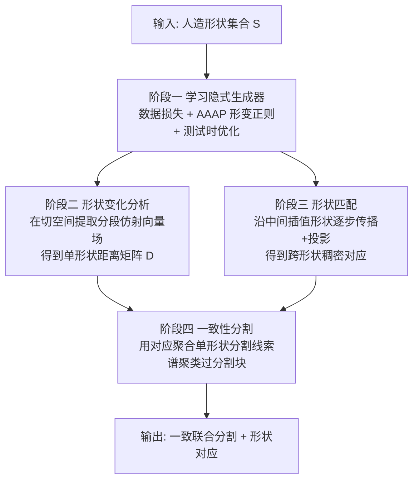

## 一句话总结

GenAnalysis 通过学习一个带「尽可能仿射（AAAP）」形变正则的隐式形状生成器，把人造物体集合统一到一个连续形状流形上，从而无监督地完成形状对应与联合分割两大任务，并在 ShapeNet 上超越现有方法。

## 研究背景

形状分析是几何处理的核心问题。有监督方法效果好但需要昂贵的人工标注、难以规模化；无监督方法则更受青睐。既有无监督范式主流是「基于模板」的：把每个形状抽象成一组可非刚性形变的部件，学习模板参数去拟合训练数据。这类方法测试时只需把模板拟合到新形状，简单高效，但有两个硬伤：

- 依赖对部件的强先验知识（比如部件数量、空间位置），显式或隐式都绕不开；
- 学习和推理阶段都容易陷入局部极小值。

作者的洞见来自把形状集合看作一个「可微流形」的思路，以及近年隐式生成模型（DeepSDF、IM-Net 等）已经能高精度拟合几何变化很大的人造形状。学得的连续形状空间天然提供两种分析能力：一是两形状间的平滑插值可用于计算对应；二是在每个形状的切空间里分析形状变化，可为分割提供线索。

难点在于：直接学生成器是欠约束的，通用的分布对齐范式（GAN、VAE、扩散）学出来的生成器，其中间形状和切空间对匹配与分割并没有意义。而人造形状的结构变化太复杂，无法像有机体那样用等距形变这类统一先验去概括。GenAnalysis 的答案是设计一个专门服务于形状分析、面向人造形状「分段仿射假设」的正则损失。

## 方法

核心假设是「分段仿射」：把每个部件用包围盒抽象后，部件级形变近似为仿射变换。GenAnalysis 用一个尽可能仿射（As-Affine-As-Possible, AAAP）的形变模型，作用在生成器潜空间中彼此相邻的合成形状之间。整个流程分四个阶段。

关键设计一：AAAP 诱导的对应。生成器 $$g_\theta(\boldsymbol{x}, \boldsymbol{z}): \mathbb{R}^3 \times \mathcal{Z} \to \mathbb{R}$$ 输出 SDF 值（潜码维度 $$q=256$$）。用 Marching Cube 把零等值面离散成约 2000 个顶点。为确定顶点在邻近形状 $$g_\theta(\boldsymbol{x}, \boldsymbol{z}+\epsilon\boldsymbol{v})=0$$ 上的对应位置，用一阶泰勒展开 $$\boldsymbol{p}_i^\theta(\boldsymbol{z}+\epsilon\boldsymbol{v}) \approx \boldsymbol{p}_i^\theta(\boldsymbol{z}) + \epsilon\boldsymbol{d}_i^{\boldsymbol{v}}(\boldsymbol{z})$$，对隐式约束求导得到线性约束：

$$\frac{\partial g_\theta}{\partial \boldsymbol{x}}\big(\boldsymbol{p}_i^\theta(\boldsymbol{z}), \boldsymbol{z}\big)^T \boldsymbol{d}_i^{\boldsymbol{v}}(\boldsymbol{z}) + \frac{\partial g_\theta}{\partial \boldsymbol{z}}\big(\boldsymbol{p}_i^\theta(\boldsymbol{z}), \boldsymbol{z}\big)^T \boldsymbol{v} = 0$$

隐式表示只给出一个约束，位移 $$\boldsymbol{d}_i^{\boldsymbol{v}}$$ 不唯一。于是联合求解一个带线性约束的二次优化：每个顶点关联局部变换 $$I_3 + A_i$$，把 $$A_i$$ 重参数化为标量缩放、旋转和与共形矩阵正交的剩余分量之和，便于用二次项正则。形变能量为

$$e\big(\boldsymbol{p}^\theta(\boldsymbol{z}), \boldsymbol{d}^{\boldsymbol{v}}(\boldsymbol{z})\big) = \min_{\{A_i\}} \sum_{i=1}^{n} \sum_{j \in \mathcal{N}_i} \big\| A_i\big(\boldsymbol{p}_i^\theta - \boldsymbol{p}_j^\theta\big) - \big(\boldsymbol{d}_i^{\boldsymbol{v}} - \boldsymbol{d}_j^{\boldsymbol{v}}\big)\big\|^2 + \mu_r s_i^2 + \mu_s \|\boldsymbol{a}_i\|^2$$

该能量对参数二次，可写成 $$e = \boldsymbol{d}^{\boldsymbol{v}}(\boldsymbol{z})^T L_\theta(\boldsymbol{z}) \boldsymbol{d}^{\boldsymbol{v}}(\boldsymbol{z})$$，最终在线性约束下解得闭式位移场 $$\boldsymbol{d}^{\boldsymbol{v}}(\boldsymbol{z}) = M_\theta(\boldsymbol{z})\boldsymbol{v}$$，其中 $$M_\theta$$ 可由稀疏矩阵的 LU 分解高效求得。作者发现 AAAP 相比只用共形分量的 ACAP 能显著减少对应漂移。

关键设计二：结构保持正则。生成器训练目标含三项：DeepSDF 风格的数据项、把潜码分布对齐高斯先验的 KL 项，以及核心贡献——AAAP 形变正则：

$$r(\theta, \boldsymbol{z}) := \int_{\boldsymbol{v} \in \mathcal{B}^q} \sum_{i=1}^{n} \sum_{j \in \mathcal{N}_i} r_{ij}^{\alpha}(\boldsymbol{z}, \boldsymbol{v}) \, d\boldsymbol{v}, \quad r_{ij}(\boldsymbol{z}, \boldsymbol{v}) := \big\| A_i\big(\boldsymbol{p}_i^\theta - \boldsymbol{p}_j^\theta\big) - \big(\boldsymbol{d}_i^{\boldsymbol{v}} - \boldsymbol{d}_j^{\boldsymbol{v}}\big)\big\|$$

取 $$\alpha=1$$（鲁棒范数）而非 $$L_2$$，是为了让残差呈重尾分布，从而真正逼近分段仿射形变——这一点在插值实验里被验证为关键。注意计算对应时用 $$L_2$$ 即可，但学习生成器的正则损失必须用鲁棒范数。

关键设计三：测试时优化。对测试集做轻量微调，一方面改善对测试形状的重建，另一方面在正则前加权重，把分段仿射的畸变「推离」感兴趣形状的切空间。对目标形状 $$S$$ 设权重为 1，随潜码距离增大而衰减：

$$\min_{\theta} \frac{1}{\vert \mathcal{S}_{\text{test}}\vert } \sum_{S} \Big( l_{\text{data}}\big(S, g_\theta(\cdot, \boldsymbol{z}_S^0)\big) + \mu \int_{\boldsymbol{z} \in \mathcal{B}^q(\boldsymbol{z}_S^0, c_1)} \exp\Big(-\frac{\|\boldsymbol{z}-\boldsymbol{z}_S^0\|}{2c_2^2}\Big) r(\theta, \boldsymbol{z}) \, d\boldsymbol{z} \Big)$$

阶段二在切空间做模态分析：取 $$H_\theta(\boldsymbol{z}_S) = M_\theta^T L_\theta M_\theta$$ 的 $$L=20$$ 个最小特征向量作为向量场 $$\boldsymbol{u}_l = M_\theta \boldsymbol{v}_l$$，对每个采样点局部拟合仿射变换，用拟合残差 $$\epsilon_{lij}$$ 判断两点是否同属一个部件，加权得到部件感知的距离矩阵。阶段三做形状匹配：直接匹配大变化形状效果差，改为沿 $$K=5$$ 个中间插值形状交替执行「传播」与「投影」，投影步把点吸附回目标面上，避免对应漂移；同时用传播过程中累积的局部畸变定义相似度权重，标识部分相似导致的无效对应。阶段四做一致性分割：每个形状先用 NormalizedCut 生成 $$m=60$$ 个过分割块，再构造块-块亲和矩阵（对角块编码单形状线索，非对角块编码跨形状对应，每个测试形状连 10 个最相似形状），最后谱聚类得到跨形状一致分割。

## 实验结果

数据集为 ShapeNet，沿用 ShapeNetPart 的训练/测试划分。训练用 8 张 Nvidia Quadro RTX 6000，4000 epoch 约 3 天；700 个测试形状的测试时优化约 30 分钟，阶段二/三/四分别约 1 小时/4 小时/10 分钟。

部件标签迁移（5-shot，报告 mIOU，越高越好）：GenAnalysis 在三类上全面领先。Chair 82.6、Table 73.0、Airplane 73.3；对比 SemanticDIF 的 80.6 / 69.5 / 71.8，DIF 的 80.4 / 68.6 / 71.9。去掉 AAAP 正则的 Ours-NR 降到 80.3 / 70.0 / 70.7。

关键点迁移（报告 PCK@0.01/0.02）：GenAnalysis 为 Chair 34.9/58.6、Table 43.1/64.2、Airplane 40.5/67.8，明显高于次优 DIF 的 32.9/52.5、40.5/61.4、36.9/54.7。作者指出关键点迁移的相对提升比分割迁移更大，因为方法直接优化点级对应。

联合分割（15 类 mIoU）：GenAnalysis 平均 80.1，超过 DAE-Net 的 76.9（约 3.2 个百分点）、BAE-Net 的 56.2、RIM-Net 的 53.6。除 Bag 类被 RIM-Net 以 0.1% 微弱领先外，其余各类均最优。代表数字：Chair 88.4、Table 82.6、Guitar 92.2、Knife 89.8、Lamp 77.6、Laptop 97.1（把与真值的差距相对 DAE-Net 缩小 40%，从 95.0 提到 97.1）、Rocket 52.7、Skateboard 70.4。

消融（Chair / Table / Airplane 的 mIoU）：完整方法 88.4 / 82.6 / 79.1。去 AAAP 正则（NR）暴跌至 58.1 / 49.2 / 52.4（降幅约 30%）；去切空间分割线索（No-TanAnal）为 72.3 / 69.2 / 62.4；去测试时优化（No-TestTime）为 85.7 / 79.2 / 74.3；去潜码加权（No-Weighting）为 87.6 / 81.5 / 77.6。过分割数量 $$m$$ 在 60 附近达到峰值，过大过小都略降，整体稳健。

## 亮点与局限

亮点：

- 摆脱模板依赖。用隐式生成器 + AAAP 正则替代「部件模板」，无需预设部件数量与位置，缓解模板方法的局部极小值和表达力不足问题。
- AAAP 正则针对人造形状量身定制，用鲁棒范数逼近分段仿射，既保住薄结构又让插值保持部件结构，是性能的决定性因素（去掉后 mIoU 掉约 30%）。
- 匹配阶段的「传播 + 投影」设计有效抑制大结构差异下的对应漂移，关键点迁移提升尤其明显。
- 测试时优化能把生成器微调到任意测试形状，这是模板方法不具备的能力。

局限：

- 一致性分割依赖谱聚类，对于对应质量差的孤立形状会失败（如椅子扶手与靠背未分开），偶尔出现过分割或欠分割。
- 计算开销大：训练约 3 天，测试时优化额外微调网络权重，比直接前向推理昂贵得多。
- 分段仿射假设对部件变化更复杂的类别（如飞机、摩托）增益有限，最适合具备强分段仿射结构的类别（笔记本、吉他、刀等）。

## 延伸思考

这项工作最具启发性的一点，是把「生成器」重新定位为「分析工具」——不追求采样新形状，而是利用其潜空间的连续性与切空间结构去做匹配和分割。这与把形状集合当作可微流形的经典思路一脉相承，但用隐式神经生成器扩展到了几何变化极大的人造物体。

作者提出的未来方向也值得关注：把潜空间解耦成「几何潜码」和「结构潜码」，用结构潜码建模结构变化以避免显式聚类，进而为每个结构相似簇学专门的生成器。这实际上指向了一种「结构感知的生成式形状理解」范式。此外，鲁棒范数与 $$L_2$$ 范数在「求对应」与「学生成器」两处的不同选择，提醒我们正则设计需要区分「推理用」与「训练用」目标，这在其他隐式表示任务里可能同样适用。代价上，测试时优化的高开销是落地瓶颈，如何在保留其收益的同时降低成本（例如只微调部分参数或用更快的适配策略）是值得探索的工程问题。
