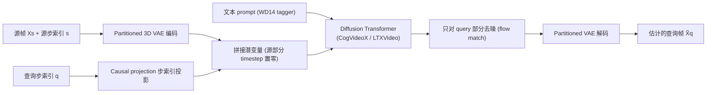

# Generating Past and Future in Digital Painting Processes

## 一句话总结

提出 PaintsAlter 框架：给定用户上传的一张画布图像，用重新利用（repurpose）的视频扩散模型生成这张画"之前（past）"与"之后（future）"的绘画过程帧，把绘画过程建模成一个"集合到集合（set-to-set）"的映射问题，支持一对一、多对多以及非连续帧的任意查询。

## 研究背景

记录、可视化并操纵创作过程一直是数字创作的核心需求，从撤销/重做、历史面板到脚本宏，学界和工业界积累了大量"过程编辑"手段。把创作过程录成视频是另一种通用做法，艺术家常把"设计备选方案"视为创作的有机组成部分：绘制时会回到早期阶段、重新想象或重画局部来尝试不同设计。

在大规模预训练模型时代，作者提出一个问题：能否构建一个系统，既能生成绘画过程的"未来"，也能生成"过去"？这样用户不仅能探索可能的结果，还能通过可视化替代过程来激发创意方向。

要回答这个问题，作者观察到这类系统必须应对多种查询类型（见下方分类）。用户查询往往是一对一或多对多的帧映射，且很多时候涉及非连续（non-contiguous）帧。例如从成品重建草图是典型的"一对一非连续"查询；从半成品可视化多个未来帧则是"一对多"。这要求后端能处理任意数量、任意组合的源帧与查询帧，同时保持全局一致性。

查询类型可归纳为：

- 源帧/查询帧数量：one-to-one、one-to-many、many-to-one、many-to-many
- 帧的连续性：contiguous（连续）与 non-contiguous（非连续）

## 方法

核心思路是把绘画过程"帧化"，再重新利用视频扩散模型学习"集合到集合"的映射。

### 帧化表示

将一段有 $s_{max}$ 步的绘画过程中，第 $s$ 步的画布记作 RGB 图像 $X_s$。约定 $X_0$ 是纯空白图、$X_{s_{max}}$ 是成品。每一步 $s$ 称为一个 operation step，每张画布 $X_s$ 称为一帧。

关键设计是固定最大步数 $s_{max}=1000$：从位置编码（PE）角度看，这样保证所有成品都对应确定的 PE 向量。实际步数少于 1000 时取最近邻采样；多于 1000 时用随机跳步采样出 1000 步作为数据增强。

绘画过程被统一形式化为一个集合到集合映射 $F$：

$$F : \{X_{s_1}, \dots, X_{s_n},\ s_1, \dots, s_n,\ q_1, \dots, q_m\} \mapsto \{X_{q_1}, \dots, X_{q_m}\}$$

即根据给定的源帧 $\{X_{s_1}, \dots, X_{s_n}\}$ 及其源步索引 $\{s_1, \dots, s_n\}$，估计查询步 $\{q_1, \dots, q_m\}$ 对应的查询帧。源/查询步以及数量 $m, n$ 都是任意的。

### 重新利用视频扩散模型

基础是 Diffusion Transformer（DiT）+ rectified-flow 调度。噪声潜变量为：

$$z_{t_i} = (1-t_i) z_0 + t_i \epsilon, \quad \epsilon \sim \mathcal{N}(0, I)$$

VAE 压缩：$z_0 = E(X)$，$\hat{X} = D(z_0)$。以 LTXVideo 为例，图像序列 $X \in \mathbb{R}^{f \times h \times w \times 3}$ 被压缩为 $z_0 \in \mathbb{R}^{\frac{f}{8} \times \frac{h}{32} \times \frac{w}{32} \times 128}$。

### 关键设计一：Partitioned 3D VAE（分区 3D VAE）

视频扩散一般用带因果卷积的 3D VAE 把多帧一起编码，能保持时序一致，但编码"非连续帧"时会引入鬼影伪影（ghosting）。作者的做法是：当帧索引 $s_{1\dots n}$ 含非连续子序列时，先切分成若干连续段 $\Omega_{1\dots k}$，各段独立编码后再拼接：

$$z = [E(X_{\Omega_1}) \ \dots \ E(X_{\Omega_k})]$$

若某段只有一帧（或少于 VAE 因果卷积最小帧数），用因果卷积做前缀复制填充，$n$ 帧编码成 $\lfloor 1 + \frac{n-1}{8} \rfloor$ 个潜变量。

### 关键设计二：Causal projection 条件化操作步

每帧 $X_s$ 配一个步索引 $s$；多帧经 3D VAE 编码成潜变量立方体后，步索引需投影以匹配潜变量的时间维度。作者用一组因果 2D 卷积层，其填充配置与 3D VAE 完全一致（对每个核大小 $k_s$，因果填充总是把首元素填充 $k_s-1$ 次），保证无论 $n$ 多大，第一个向量始终只编码首个输入的特征。投影层用零初始化的线性层门控，再加到 DiT 的 timestep embedding 上。

### 源帧与查询帧的条件化

源帧与查询帧始终被视为分区 VAE 里的"非连续段"，各占独立的潜变量时间条目。训练时把源帧部分的扩散时间步 $t_i$ 用掩码 $M(t_i)$ 置零，使模型只对查询帧去噪、把源帧当参考。联合学习目标：

$$\mathbb{E}_{z, c, s, t_i, \epsilon} \left\| (\epsilon - z) - G_\theta\left(z_{M(t_i)}, M(t_i), c, s\right) \right\|_2^2$$

### 关键设计三：额外图像模型变体与高效推理调度

虽然视频扩散模型已能处理所有查询，但"单源帧→单查询帧"这类高频查询（如从草图直接查成品、从成品查草图）可用专门的图像扩散模型提高质量、降低开销。作者训练了独立的 SDXL 图像模型：给 SDXL 输入卷积加 4 个零初始化通道以接收源帧潜变量，并扩展 timestep embedding 接收源步 $s$ 和查询步 $q$ 两个标量。

默认推理调度：(1) 源与查询都是单帧 → 用图像模型；(2) 源为单帧、查询是大于 500 帧的大集合 → 先用图像模型每 200 步生成一个中间帧，再用视频模型补齐区间内其余帧；(3) 其余所有查询 → 只用视频模型。

### 数据与实现

数据于 2018 冬至 2020 秋收集，逐一征得约 19 位艺术家同意（半数以上为艺术学校学生，其余为职业艺术家）。内容涵盖人物、非人（动物/机器人）、场景、植物、玩具、奇幻元素，风格以商业数字绘画为主，兼有水彩、涂鸦、超现实等。用 LTX 的准则检测长视频中的突变以切镜头，过滤变化不显著的镜头。默认上下文长度取 145 帧，长于 145 帧的镜头用随机跳步采样（每镜头最多采样 32 次），最终得到 2 万个视频片段。

训练用 Adafactor 优化器、学习率 1e-5、bf16 精度，设备为 8×H100 80G。训练了 LTXVideo（约 4 天）、CogVideoX 1.5（约 9 天，上下文长度改为 145 帧）两个视频模型及 SDXL 图像模型（约 3 天）。视频模型用 512px 分辨率桶，SDXL 用 1024px。梯度裁剪范数 0.5，不用 EMA。prompt 一律用 WD14 tagger 从最大步索引的输入帧生成。

## 实验结果

### 定量重建指标（Table 1）

在训练时未见过的 5% 留出子集上评测：

| 方法 | PSNR ↑ | SSIM ↑ | LPIPS ↓ |
|------|--------|--------|---------|
| Zhao et al. 2020 | 12.27 | 0.4847 | 0.6851 |
| Song et al. 2024 | 13.52 | 0.4901 | 0.6143 |
| Ours (LTXVideo) | 16.31 | 0.6510 | 0.4259 |
| Ours (CogVideo) | 17.04 | 0.6712 | 0.4022 |
| Ours (image model, SDXL) | 15.98 | 0.5995 | 0.4515 |

CogVideo 骨干在三项指标上全面最优；三个变体都超过此前方法。InversePainting 因基于分割式方法、与本数据集不兼容而被排除。

### 用户研究（Table 2）

选 50 张野外数字绘画（模型未见过），13 名参与者（1 名学生、8 名众包工人、4 名有经验的助理艺术家）用各配置生成过程序列，用平均偏好率作指标（重复 5 轮取均值）：

| 候选 | 质量 ↑ | 响应性 ↑ |
|------|--------|----------|
| Zhao et al. 2020 | 1.20±0.0% | / |
| Song et al. 2024 | 3.61±1.21% | / |
| Ours (LTXVideo) | 18.07±4.3% | 27.49±9.7% |
| Ours (CogVideo) | 20.48±5.2% | 8.46±6.5% |
| Ours (LTXVideo + image model) | 26.51±6.1% | 47.43±9.1% |
| Ours (CogVideo + image model) | 30.12±5.8% | 16.62±5.2% |

CogVideo 骨干感知质量最高但速度较慢；响应性上用户更偏好速度更快的 LTXVideo；所有加了"+ image model"调度的配置在质量与响应性上都优于其余。

### 消融与运行时

- Partitioned VAE：去掉该设计后，非连续帧编码会因潜空间时间压缩产生模糊/鬼影；启用后各段独立编码，重建干净。
- 运行时（Nvidia L40S，无高级优化，单位秒，Table 3）：

| 模型 | 1 帧 | 65 帧 | 129 帧 |
|------|------|-------|--------|
| CogVideoX 1.5 | 7.2 | 193.1 | 327.4 |
| LTXVideo | 4.8 | 8.4 | 41.3 |
| SDXL (图像模型) | 3.9 | 251.2 | 495.1 |

LTXVideo 在多帧场景效率显著更优（65 帧约 0.13s/帧），SDXL 只适合单帧。

- 突变行为统计（Table 4，每作品平均次数，人工计数 50 样本）：模型生成过程与真人在"元素可见性变化、缩放变形、导入/删除、色彩曲线调整、图层顺序变化"等突变行为上频率接近（真人总计 13.1±0.7，本方法 11.4±0.8），说明模型学到了绘画的过程性行为。

### 附加应用

- 草图生成：把目标步设为低值（如 $s=50$）并改随机种子，可生成带不同艺术决策的草图，比传统边缘检测更贴近真实绘画的结构抽象。
- 风格泛化：对梵高、莫奈等非数字绘画，模型也能重建过程，呈现"先铺色块、后加细笔触"的模式。

## 亮点与局限

亮点：

- 把"生成过去与未来"统一形式化为 set-to-set 映射，覆盖一对一/多对多、连续/非连续的任意查询，问题定义清晰。
- Partitioned 3D VAE 巧妙解决非连续帧编码鬼影；causal projection 让步索引精确对齐潜变量时间维度，训练更稳。
- 多模型变体 + 分层推理调度，在质量与交互响应性之间取得平衡，落地为可交互前端。

局限：

- 对与训练数据风格差异过大的输入（真实照片、UI 设计布局）会出现风格漂移、文字/结构渲染错误。
- 为真实照片重建绘画过程属于本质病态问题，最优映射分布可能不存在；扩数据集只能部分缓解。

## 延伸思考

- 该工作把"时间轴生成"从自然视频迁移到"抽象的创作步索引轴"，$s_{max}=1000$ 的固定步长归一化是一个很实用的技巧，值得在其他"过程/历史生成"任务（3D 建模历史、文档编辑历史）借鉴。
- 集合到集合 + 掩码 timestep 的条件化方式，本质上把源帧当"零噪声参考"，与图像编辑里的 inpainting 条件化思路相通，可推广到"任意子集已知、补全其余"的更一般序列补全问题。
- 数据依赖真人录屏且规模有限（2 万片段），泛化边界明显；若能结合合成绘画过程或程序化笔触数据，或可拓宽风格覆盖并缓解病态输入问题。
