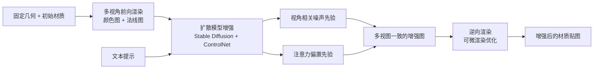

## 一句话总结

用一个现成（无需训练）的 2D 扩散模型给渲染视图添加磨损、老化、锈蚀等细节，再通过逆向渲染把这些细节反传回原始 PBR 材质贴图，从而为已有 3D 资产"自动补全"高保真外观细节。

## 研究背景

- 领域现状：为 3D 资产创作外观时遵循帕累托原则——确立整体外观只占很少时间，而为其注入真实世界的细节与瑕疵（磨损、老化、风化）却要耗费大量精力。扩散模型能生成逼真视觉效果并可用文本与图像条件引导，是补充这类细节的自然工具。
- 核心痛点：直接用扩散模型做材质生成的方法（如从头生成材质贴图的工作）往往需要专门的 3D/材质数据集来训练或微调，代价高昂；而这类数据集在规模与多样性上远不及自然图像数据集，限制了模型能力。此外，多视图生成的最大难题是同一细节在不同视角下不一致，导致逆向渲染时结果相互叠加或无法收敛。
- 本文 idea：不训练、不微调，直接用在互联网级自然图像上训练的现成扩散模型；把它与可微渲染器结合，在多视图上生成细节后逆向渲染回材质。为解决多视图一致性，提出两个先验：让扩散初始噪声在视角间相关，并对自注意力施加基于像素对应关系的偏置。

## 方法

整体框架分三个阶段：先对给定资产（固定几何 + 初始材质）从 9 到 16 个环绕视角做前向渲染，得到颜色图与法线辅助缓冲；再把这些视图拼成网格（如 $$3\times3$$ 或 $$4\times4$$）连同文本提示送入多视图扩散模型生成增强后的视图；最后用可微渲染器把增强前后的差异反传，优化空间变化的 albedo、法线、粗糙度贴图。

关键设计：

1. 保持结构的细节增强：借鉴向渲染图注入可控噪声量作为扩散初始状态的思路，在保留输入材质特征的同时增强细节。仅此不够，还额外用两个公开的 ControlNet 做条件约束——把原本用于超分的 ControlNet tile 复用为"在尊重输入视图的前提下增强细节"，并用 ControlNet normal 以法线缓冲为输入来保留光照与曲率细节。这样避免了先前工作中训练任务专用 ControlNet 的高昂代价。

2. 视角相关噪声先验：扩散的初始噪声与输出图像虽是高度非线性关系，但二者相关。作者不像已有时序方法那样按运动场把参考视图噪声形变过去（稀疏视角间存在大量遮挡消失，难以形变），而是把参考噪声场锚定在资产的 UV 空间（使用 $$1024\times1024$$ 噪声纹理），再投影到各视图。为保证投影后噪声在视图内互不相关且方差均匀，采用超采样：把每个像素细分为 $$4\times4$$ 子像素并投影到 UV 空间，做面积加权平均 $$\sum_i f_i \cdot A_i$$ 。由于多个子像素可能映射到同一噪声纹素，需同时校正方差与协方差，用 $$\mathrm{Cov}_i = \max(A_{\text{texel}}/A_i - 1,\, 0)$$ 估计过采计数，最终归一化因子为 $$\sqrt{\sum_i A_i^2 (1 + \mathrm{Cov}_i)}$$ ，使投影噪声与参考噪声方差匹配。极端放大时还会平滑地把投影噪声与独立白噪声混合作为兜底。

3. 像素对应注意力偏置：目标是让不同视图中观察同一表面块的隐空间像素相互加强注意，以提高去噪后视觉的一致性。构造一个 $$N\times N$$ 偏置矩阵 B，对隐空间网格中的像素对 $$(i, j)$$ ，从像素 $$j$$ 中心投射光线求首个命中点 p，再把 p 投影到含像素 $$i$$ 的像平面得到 q 并检查互相可见；若 q 落在 $$i$$ 的邻域内则令 $$B[i,j] = w$$ 。修改后的注意力为 $$\text{Attention}(Q,K,V) = \text{softmax}\!\left(\frac{QK^\top + B}{\sqrt{d_k}}\right)V$$ 。U-Net 在多个尺度施加自注意力，邻域大小随层调整（各层分别约 $$9^2, 5^2, 3^2, 1^2$$ ）以对应到原图同样大小的图块。$$w$$ 越大一致性越好，但过大会让扩散失去对图像的全局把握、外观变差，经验取值区间约 $$[0, 3.5]$$ ，在示例场景 1.2 到 1.8 之间取得较好平衡。

实现上系统基于 PyTorch，使用 Stable Diffusion 1.5 与公开的 tile / normal 版 ControlNet（两者输出相加），用 Mitsuba 3 做 GPU 加速可微渲染，逆向渲染时对高动态范围渲染图做色调映射后与扩散生成目标图算相对 L2 损失，并对物体边界附近像素停止梯度传播、按余弦因子下调掠射角处的损失。注意力偏置的 $$N\times N$$ 矩阵无法显式存储，测试的多种注意力框架中只有 FlexAttention 能在 16 视图、$$1024^2$$ 分辨率下按需在线施加偏置。

## 实验结果

主实验为不同视图数与分辨率下的运行时间与显存占用（NVIDIA RTX 5880），对比 FlexAttention（FA）与 xFormers（xF）两种注意力实现。xFormers 大约快 2 倍，但在 9 视图及以上、$$1024\times1024$$ 分辨率时超出显存，凸显 FlexAttention 的可扩展性。

| 配置 | 4 视图 $$512^2$$ | 4 视图 $$1024^2$$ | 9 视图 $$512^2$$ | 9 视图 $$1024^2$$ | 16 视图 $$512^2$$ | 16 视图 $$1024^2$$ |
|------|------|------|------|------|------|------|
| FA 运行时间（秒） | 17 | 187 | 67 | 923 | 187 | 2816 |
| FA 峰值显存（GB） | 6.2 | 9.2 | 7.6 | 15.2 | 9.7 | 20.4 |
| xF 运行时间（秒） | 8 | 102 | 34 | — | 100 | — |
| xF 峰值显存（GB） | 6.9 | 33.2 | 13.8 | >45 | 33.2 | >45 |

其余实验以定性对比为主：与图像生成类方法（SPAD、Diffusion Handles、RGB↔X）相比，这些方法要么无法准确复现输入几何、要么缺乏多视图一致性；与材质/纹理生成类方法（DreamMat、Paint-it、TexPainter）相比，基于 SDS 的方法结果偏模糊，TexPainter 不支持视角相关效果，而本文在忠于初始资产的同时提供更真实的细粒度细节。消融实验表明：仅用 ControlNet tile 能改外观但视图不一致；加入视角相关噪声后细节在视图间更一致但仍有错位；再加注意力偏置的完整模型进一步提升一致性。分类器无关引导（CFG）的缩放因子可让用户控制细节增强的强弱。

## 亮点与局限

- 亮点：
  - 无需训练或微调扩散模型，几乎完全由现成预训练组件搭建，避免了构建专用 3D/材质数据集的高昂代价。
  - 对所用材质模型不可知，输入输出都是传统 3D 表示（三角面 + 贴图），天然多视图一致，可被艺术家用常规工作流进一步编辑，契合"人在环中"的创作范式。
  - 两个一致性先验（UV 空间锚定的视角相关噪声、基于几何重投影的注意力偏置）思路清晰且互补，均利用了已知几何与 UV 映射。

- 局限：
  - 多视图一致性仍非完美，小尺度偏差仍会出现；高频视角相关效果（如镜面反射）可能被逆向渲染"烘焙"进 albedo 贴图，与用户意图不符。
  - 仅暴露文本提示作为控制手段，缺乏更细粒度的用户控制。
  - 只增强可被贴图表达的外观，不细化输入宏观几何。
  - 注意力偏置 $$w$$ 是手动调的超参数，尚无参数无关的自动方案。

## 延伸思考

方法本质是把"生成先验（扩散）+ 物理先验（可微渲染）"耦合起来：扩散负责想象真实世界的细节，逆向渲染负责把想象落到物理可解释、可复用的材质参数上，二者以多视图一致性为桥梁。这条思路可推广到更多"把 2D 生成结果蒸馏回结构化 3D 表示"的场景。作者也指出多个自然的改进方向：换用更强的 Stable Diffusion 3.x 及其文本编码器与 ControlNet 提升可控性；用视频模型或多步优化、乃至在镜面表面上用流形游走求对应点来进一步缓解一致性偏差；以及把逆向渲染扩展到更新网格宏观几何。值得追问的是，当细节的视角相关性本就很强时（如各向异性、强镜面），把它"压平"到视角一致的贴图是否总是合理，是否需要区分应保留的视角相关效应与应统一的材质本征属性。
