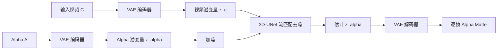

## 一句话总结

本文提出 GVM（Generative Video Matting），把传统的回归式视频抠图重新表述为"以输入视频为条件的视频生成问题"，借助预训练视频扩散模型 Stable Video Diffusion 的时空先验，配合大规模合成/伪标注分割数据与自建高质量合成发丝抠图数据，实现对真人与动物都鲁棒、且时序一致的细粒度视频抠图。

## 研究背景

- 领域现状：视频抠图（预测每帧前景的 alpha 透明度）是背景替换、合成、视觉特效等编辑应用的基础环节。已有全自动方法（如 MODNet、RVM）无需 trimap 或背景图等人工先验，但在多样前景类别、复杂运动和真实物理条件下仍不够稳。
- 核心痛点：一是数据稀缺且质量差——人工标注的抠图数据集边界不准、发丝等细节缺失，且多数视频抠图数据是把前景合成到人工背景上，光照不匹配导致画面失真，模型难以泛化到真实场景；二是回归式方法逐帧处理、再用独立解码器聚合时序信息，既容易在瑕疵标注上过拟合成"过度平滑"的结果，又难保证时序一致。
- 本文 idea：从两条互补路线破题。数据上，先用大规模合成分割数据（BEDLAM、Dynamic Replica）和 SAM2 伪标注真实视频做预训练，再用 Blender 渲染 200 段带精细发丝与 alpha 标注的 4K 视频（SynHairMan）做微调；模型上，首次把视频扩散先验引入视频抠图，用生成式建模天然应对标注瑕疵、并弥合合成与真实的域差。

## 方法

### 整体框架

GVM 以图像到视频的 Stable Video Diffusion（SVD）为基座，把抠图建模为"给定输入视频 $$z_c$$、生成 alpha matte $$z_\alpha$$"的条件分布 $$p(z_\alpha \mid z_c)$$。输入视频经冻结的 VAE 编码为潜变量 $$z_c$$，与含噪 alpha 潜变量沿通道拼接后送入 3D-UNet 去噪器；训练用流匹配（flow matching）目标学习从噪声到 alpha 的直线速度场，推理时仅需 1 到 3 步即可去噪出 alpha 潜变量，再由冻结的 VAE 解码器还原为逐帧 alpha。这里只在空间维压缩、保留时间维，以避免解码 alpha 时产生运动模糊。

### 关键设计 1：生成式重表述 + 流匹配加速

作者不再让网络直接回归 alpha，而是用扩散模型建模 alpha 的分布，从而对瑕疵标注更鲁棒（回归模型在模糊标注上会学出过平滑结果）。相比图像抠图方法 AlphaLDM 需要 50 步去噪加多尺度精修，GVM 把噪声调度器从 SVD 原本的 EDM 换成流匹配调度器，数据腐蚀被建模为噪声与 alpha 的线性插值 $$\phi_t(z_\alpha) = t z_\alpha + (1-t)\epsilon$$，对应恒定速度场 $$v_t(z_\alpha) = z_\alpha - \epsilon$$，训练目标为 $$L_{latent} = \mathbb{E}_t \lVert v_\theta(\phi_t(z_\alpha), z_c, t) - v_t(z_\alpha) \rVert^2$$。直线轨迹让推理压缩到 1 到 3 步，满足长视频的效率需求。此外丢弃 SVD 原有的 CLIP 图像嵌入，代之以同尺寸的全零 alpha 嵌入注入 3D-UNet。

### 关键设计 2：潜空间 + 像素空间混合监督

只在潜空间监督不足以还原发丝级细节。得益于流匹配的直线轨迹，训练时可从含噪样本直接解出 $$z_{\alpha_0}$$ 并经 VAE 解出估计 alpha $$\hat{\alpha}$$，从而在像素空间叠加 L1 损失、金字塔拉普拉斯损失 $$L_{lap}$$ 与梯度惩罚损失 $$L_{gp}$$：$$L_{pixel} = L1 + L_{lap} + \lambda L_{gp}$$。总损失为 $$L_{total} = L_{latent} + \lambda L_{pixel}$$。像素监督让网络对边界更敏感、局部更平滑。

### 关键设计 3：三阶段训练与数据构建

沿用大视频基础模型"先大规模预训练、再小规模高质量微调"的范式，全程冻结 VAE：

- 阶段一：在 BEDLAM、Dynamic Replica、伪标注 VideoHuman60 上以多种低分辨率训练一个 epoch，全量微调 3D-UNet，只用流匹配损失，学习时序分割先验。
- 阶段二：冻结 3D-UNet 的所有时序层，在更高分辨率（最高 1024×1024）上继续微调其余层，并加入 VideoMatte240K。
- 阶段三：冻结全部 3D-UNet 层，引入 rank=32 的 LoRA，混入 VideoMatte240K 与自建 SynHairMan，同时用流匹配与像素空间损失精修发丝级细节。

配套数据包括：合成分割数据 BEDLAM（人体）、Dynamic Replica（人+动物），伪标注 VideoHuman60（SAM2/Sapiens 标注的 60 段真实视频），以及用 Blender 渲染、含风吹发丝湍流效果的 200 段 4K 合成抠图数据 SynHairMan。

## 实验结果

评测指标沿用 RVM，报告 MAD、MSE、Grad（梯度误差）、Conn（连通性）与时序一致性 dtSSD，全部越低越好。评测在合成数据集 VideoMatte240K 测试集与 V-HIM60 上进行，对比无辅助输入的 RVM、以及需要额外引导掩码的 MaGGle、SparseMat。下表为 VideoMatte240K 上的主实验结果：

| 方法 | MAD↓ | MSE↓ | Grad↓ | Conn↓ | dtSSD↓ |
| --- | --- | --- | --- | --- | --- |
| RVM | 6.39 | 1.82 | 9.95 | 6.53 | 1.85 |
| SparseMat | 441.49 | 270.74 | 166.68 | 908.79 | 6.25 |
| MaGGle | 36.22 | 32.02 | 12.64 | 68.22 | 2.45 |
| GVM（本文） | 5.88 | 1.71 | 5.00 | 5.27 | 1.11 |

GVM 在全部指标上领先，Grad（细节保真）与 dtSSD（时序一致）优势尤为明显。在按难度分三档的 V-HIM60 上同样全面占优：最难子集上 MSE 从 RVM 的 11.51 降到 1.55、Conn 从 34.52 降到 13.16，说明复杂场景下鲁棒性显著更强。零样本迁移方面，未在目标集训练的 GVM 在人像数据集 P3M-500 和动物数据集 AM-2K 上均超过其他视频抠图与图像抠图方法（如 AM-2K 上 MAD 24.3 对 AlphaLDM 的 57.3），显示跨域泛化能力。消融进一步表明：去掉预训练扩散先验模型无法收敛；加入像素空间损失与 LoRA 都能带来一致提升；只用合成 SynHairMan 训练存在明显域差，混入 BEDLAM 分割数据与伪标注数据后泛化显著改善。

## 亮点与局限

亮点：

- 首个把视频扩散先验用于视频抠图的工作，将回归任务重表述为条件视频生成，天然缓解瑕疵标注导致的过平滑，并弥合合成与真实的域差。
- 用流匹配把去噪压到 1 到 3 步，兼顾质量与长视频效率；潜空间+像素空间混合监督还原发丝/皮毛级细节。
- 贡献了带精细发丝标注和多样运动的合成抠图数据集 SynHairMan，并给出"大规模分割预训练 + 少量高质量抠图微调"的可扩展训练配方。
- 泛化力强：仅在人/动物数据上训练即可零样本迁移到未见的动物类别与真实自然场景。

局限：

- 只在人与动物上训练，对玻璃、水、火、烟尘等具有复杂光学与透明特性的材质尚未验证，能否处理仍是开放问题。
- 尽管只需 1 到 3 步去噪，推理速度仍不及传统回归式视频抠图方法，实时性有差距。

## 延伸思考

- "把判别/回归任务重表述为条件生成、复用扩散先验"这条思路正在深度估计（Marigold）、抠图等多个稠密预测任务上被反复验证，GVM 是其在视频时序维度上的延伸；值得追问的是这种生成式范式在效率与确定性要求高的工业管线中如何落地。
- 数据侧的核心洞见是"用大规模分割数据补时序与语义先验、用少量高保真合成数据补发丝细节"，这种分工对其他缺乏高质量标注的稠密视频任务（如视频反射分离、透明层估计）有借鉴意义。
- 论文展示了用 alpha matte 结合深度图做视频合成散焦（bokeh）的应用，并指出单层深度在主体边界处精度不足——这提示抠图与深度、分层表示的联合建模可能是更完整的视频编辑基础。
- 推理速度与材质覆盖是两条清晰的改进方向：前者可探索更激进的少步/一步蒸馏，后者需要构造涵盖半透明材质的多样训练数据。
