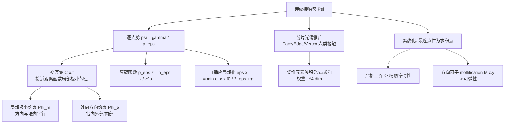

## 一句话总结

本文从"接触势应满足哪些自然性质"出发，系统推导出一个定义在光滑与分片光滑曲面上、与网格离散无关的连续接触障碍势，并给出可作为 IPC 直接替换件的离散化方案，从根本上消除了现有障碍势方法中的虚假接触力与分辨率依赖问题。

## 研究背景

无摩擦接触问题本质上是一个受几何约束的优化：

$$\min_{u} E(u), \quad \text{subject to} \quad g(u) \ge 0$$

其中 $u$ 是曲面的形变，$g$ 是纯几何量，度量到接触的距离。接触模拟中的鲁棒性问题几乎都源于对几何约束的处理不当——一旦约束被违反，求解器往往难以恢复。障碍势方法（barrier potential）近年来因其鲁棒性而流行，其思想是把约束优化转化为无约束优化：

$$\min_{u} E(u) + b(u)$$

其中 $b(u)$ 是在穿透时趋于无穷、无接触时为零的障碍项。以 IPC [Li et al. 2020] 为代表的方法配合连续碰撞检测（CCD）和线搜索，可保证迭代过程始终无穿透。

然而现有障碍势存在几个共性缺陷。作者归纳出四类核心问题：

- **有限性**：如何区分"真正趋于接触的点"与"仅在静止形状上本就相邻的材料点"（下图中 A、B 趋于接触，而 A、C 只是天生相邻），否则势会处处发散。
- **虚假斥力**：若把斥力施加到错误的点对上，会在静止或压缩状态下凭空产生力和形变。
- **网格依赖**：IPC 的势范围被限制在最短边长以内，局部加密会迫使势范围大幅缩小，改变模拟结果。
- **离散化性质**：连续形式即使能精确防止接触，其离散化也可能只近似成立。

现有方法各有取舍：IPC 纯离散定义、强网格依赖且压缩下出现虚假力；Kamensky 等的曲面双重积分势通过排除固定自接触区域来保证有限性，但极端形变下会失去无穿透保证；Sassen 等的排斥壳（repulsive shells）依赖法向对齐，对含尖锐特征的分片光滑曲面会发散；基于间隙函数（gap function）的障碍则或不连续（DND）或不可微（CP）。作者用一张对照表总结：没有任何一个已有方法能同时满足全部自然性质。

## 方法

### 六条自然要求

作者首先把"好的接触势"形式化为六条要求，全部围绕定义在物质域 $\text{Int}(\Omega)$ 及其边界 $\Omega$ 上的总势积分：

$$\Psi(f) := \iint_{\Omega \times \Omega} \psi_\epsilon(x, y; f)\, dx\, dy$$

1. **有限性**：对任意不接触的分片光滑曲面，逐点势可积分、总势有限，且随到接触距离 $d_c(x,f)$ 单调非增。
2. **障碍性**：当 $d_c(x, f_t) \to 0$ 时 $\Psi \to \infty$，配合 CCD 可保证全程无接触。
3. **无虚假力**：静止配置（及其刚体变换）下 $\Psi$ 与 $\nabla\Psi$ 均为零。
4. **局部化**：存在局部化参数 $\epsilon_{trg}$，当 $d_c(x,f) > \epsilon_{trg}$ 时势消失；随 $\epsilon_{trg}$ 递减逼近标准约束接触问题的解。
5. **可微性**：$\Psi$ 对形状参数可微、且分片二次可微，支持二阶隐式时间积分。
6. **离散化**：离散版本本身（而非仅在加密极限下）满足要求 1–5。

### 核心思想：交互集与到接触距离

方法的关键是用**交互集（interaction set）** $C(x, f)$ 来定义势——它是 $\Omega$ 中远离 $x$、且在该处障碍势不消失的点集。逐点势写成：

$$\psi_\epsilon(x, y; f) := \gamma(x, y)\, p_{\epsilon(x)}(\|f(y) - f(x)\|)$$

其中 $\gamma$ 在 $C(x,f)$ 之外消失（方向局部化因子），$p_{\epsilon(x)}$ 在距离 $\epsilon(x)$ 处消失（距离局部化）。到接触距离定义为 $d_c(x,f) := \min_{y \in C(x,f)} \|f(y) - f(x)\|$。

对光滑曲面，两点接触当且仅当空间重合且法向相反。作者不直接度量法向距离，而是给出一个能自然推广到非光滑点的判据：**交互集是"接近于距离函数 $d_x(y)=\|f(y)-f(x)\|$ 局部极小、且不同于 $x$ 的点"**。这一想法完全不依赖法向或曲面光滑性，是推广到分片光滑曲面的关键。具体用两个约束刻画：

- **局部极小约束**：$\Phi_m(x, y) := \|(f(y) - f(x))^+ \times n(y)\| = 0$（$(\cdot)^+$ 表示归一化），用 $\Phi_m \le \alpha$ 圈定接近极小的点。
- **外向方向约束**：$\Phi_e(x, y) := -n(y) \cdot (f(y) - f(x))^+ > 0$，确保方向向量在 $x$ 处指向外部、在 $y$ 处指向内部，这对处理薄物体至关重要。

### 障碍函数与自适应局部化

障碍函数取 $p_\epsilon(z) := h_\epsilon(z)\, z^{-p}$，其中 $h_\epsilon(z) := \frac{3}{2}B_3(2z/\epsilon)$ 是支撑于 $|z| \le \epsilon$ 的三次 $C^2$ 样条基，指数取 $p = n-1$（$n=2,3$ 为场景维度）——这个取值恰好保证光滑曲面下有限、又不会在分片光滑曲面上爆掉。为满足"无虚假力"，对每个点自适应地取

$$\epsilon(x) := \min(d_c(x, f_0)/2,\ \epsilon_{trg})$$

使静止形状下势恰好为零。方向因子 $\gamma_S$ 用三次样条和光滑化的 Heaviside 函数 $H_\alpha$ 对 $\Phi_m$、$\Phi_e$ 做 mollification 构造，保证势被限制在交互集内且保持可微。作者证明（命题 1）该光滑曲面势满足要求 1–5。

### 分片光滑曲面推广

分片光滑曲面上有六类接触（Face-Face、Face-Edge、Face-Vertex、Edge-Edge、Edge-Vertex、Vertex-Vertex），法向和切向在棱、顶点处不唯一，需统一处理。局部极小约束推广为"沿任意切向距离不减"：$t^\top (f(y)-f(x))^+ \ge 0$，每个面只需沿三个方向检验。由于顶点、边等接触发生在零测集上，直接曲面积分会得零势，因此对低维元素单独处理——沿棱做线积分（权重 $L$）、对顶点做点求和（权重 $L^2$），总势写成对九类元素对的求和：

$$\Psi(f) = \sum_{(g,h)} \sum_{\substack{i \in I_g, j \in I_h \\ G_i \cap H_j = \emptyset}} L^{4 - \dim g - \dim h} \int_{G_i} \int_{H_j} P(x, y; G_i, H_j)\, dx\, dy$$

命题 2 证明该势同样满足要求 1–5。参数 $\alpha$ 控制交互集大小与光滑度，$\epsilon_{trg}$ 控制势的最大延伸，$L$ 控制低维接触强度（顶点取周围平均边长、边取边长）。

### 离散化：兼顾障碍性与可微性

这是全文最精细的部分。若像 Kamensky 等那样用标准求积点，障碍性只近似成立、可能穿透。作者改用**元素对上的最近点作为求积点**：

$$\Psi_D(f) = \sum_{(g,h)} \sum_{(i,j)} L^{4-\dim g - \dim h} P(x_i, y_j; G_i, H_j)\, A(G_i) A(H_j)$$

由于用最近点距离，离散项严格从上方界定连续项，从而**精确保证障碍性**。分片线性曲面下只需 Vertex-Face、Edge-Edge、Vertex-Edge、Vertex-Vertex 四类。但最近点位置对形变只 $C^0$ 连续，故引入一个额外的 mollification 因子 $M(x,y)$ 恢复可微性（要求 5）。自适应 $\epsilon$ 保证静止无接触，且得益于局部极小和外向约束，$\epsilon$ 可远大于 IPC 允许的值。命题 3 证明离散势满足要求 2–5。

摩擦沿用 IPC 的半隐式表述，只需把接触力幅值 $\lambda_k^n$ 替换为本方法的对应量即可，改动很小。

## 实验结果

实现基于 IPC Toolkit + PolyFEM，用 Eigen、Pardiso 求解，运行在 AMD Threadripper PRO 3995WX（限 16 线程）上，对比对象为 IPC [Li et al. 2020] 与 Convergent IPC [Li et al. 2023]。

**消除虚假力（单元测试）**：在非均匀 squircle 网格（直边 0.21 m、圆角 0.01 m）上，IPC 用 $\hat d=0.1$ m 会在加密圆角处产生虚假力和形变，本方法通过切向过滤避免。在两块初始间距小于 $\hat d=0.025$ m 的立方体、带狭缝的块体、压缩至原高 33% 的立方体（泊松比 0）、充气至极薄的气球和甜甜圈等场景中，IPC 均出现虚假接触压力，本方法始终无虚假力。在 $\chi$ 形结构尖点压缩中，IPC 与 Convergent IPC 都在尖点处出现大接触力，本方法因局部极小与外向约束显著降低。

**性能对比**：
- Armadillo-Bar 场景（$\hat d=0.001$ m）：本方法 512 次迭代、55 分钟；IPC（$\epsilon_{trg}=0.0004$ m）1555 次迭代、161 分钟——本方法快约 2/3。
- Monkey saddle（法向剧烈振荡的自适应网格）：本方法 $\epsilon_{trg}=2\times10^{-4}$ m，4255 次迭代、3.7 小时；IPC $\hat d=5\times10^{-5}$ m，6710 次迭代、5.7 小时——快约 1/3。

**接触对数量**（图 29 场景 40 s 帧，见下表，单位 k）：即便 $\alpha=1$（局部极小约束失效），本方法因外向约束也比 IPC 少；$\alpha$ 减小后接触对急剧下降。

| $\epsilon_{trg}$ | IPC | Convergent | $\alpha{=}1$ | $\alpha{=}0.8$ | $\alpha{=}0.5$ | $\alpha{=}0.1$ |
|---|---|---|---|---|---|---|
| 0.001 | 226k | 250k | 215k | 176k | 128k | 53k |
| 0.002 | 372k | 405k | 322k | 225k | 155k | 56k |
| 0.005 | 1690k | 1772k | 830k | 433k | 273k | 78k |

**其他验证**：复现了 Erleben 单元测试、海豚过漏斗、垃圾压缩机、垫子扭转等大形变复杂接触场景，均无穿透与翻转；cliff edge 测试中本方法显著减少了 IPC/Convergent IPC 的虚假水平滑移。逆向设计实验中，因 IPC 要求 $\hat d$ 小于最小边长导致初始无接触力、形状导数为零而无法优化；本方法可用大 $\hat d$ 使钳子在优化后成功抓取圆环。与局部化后的 Tangent-Point Energy 相比，本方法在球面/立方体角上梯度精确为零（TPE 处处非零、且在尖角处随加密发散），且保留尖锐特征。收敛性研究表明在固定 $\epsilon_{trg}$ 下势随网格加密收敛（Convergent IPC 需同步加密 $\hat d$）。

**无穷势特性**：以 234 m/s 的方块角撞平面为例，Convergent IPC 的连续势在零距离处有限，导致动能超过势垒时最小距离随加密不断缩小；本方法因障碍函数在距离趋零时积分不有限，所有加密层级轨迹重合，最小距离与网格分辨率无关。

## 亮点与局限

亮点：
- 从公理化的六条自然要求出发系统推导，把 IPC、Kamensky、排斥壳、间隙函数等已有障碍势统一为同一框架下的特例，理论上把它们联系起来。
- 提出不依赖法向、只基于"距离函数局部极小"的交互集定义，优雅地统一处理光滑与分片光滑（含尖锐特征）曲面的六类接触。
- 用最近点作求积点保证离散精确障碍性、再用 mollification 恢复可微性，是"可作为 IPC 直接替换件"的关键工程设计。
- 彻底解耦势的延伸范围 $\epsilon_{trg}$ 与网格分辨率，为形状优化等应用提供了实用的自由度，并在多个场景下比 IPC 更快、接触对更少。

局限：
- 推导多处假设闭合无边界曲面，对余维（codimensional）物体和带边界曲面需要额外修改，作者列为未来工作。
- 未解决 Du et al. [2024] 指出的非均匀离散下平面上的虚假切向力问题（无摩擦下立方体自由滑动仍不理想），需要高阶求积或高阶离散来改善。
- 离散势到光滑极限势的收敛性只给出直觉论证（$L$ 需随边长调整），缺乏严格数学证明。
- 引入了 Vertex-Edge、Vertex-Vertex 等更多接触对类型，虽然总数因约束更窄不高于 IPC，但实现复杂度明显增加。

## 延伸思考

这项工作的价值不只在于又快又准的接触求解器，更在于它把"接触势设计"从工程试错提升为可验证的公理化推导：先明确要满足哪些性质，再反推势的形式。这种"需求驱动"的思路对其他物理模拟组件（如摩擦、塑性、断裂的势/障碍设计）同样有借鉴意义。

最值得玩味的是"局部极小 + 外向方向"这套几何判据——它本质上回答了"什么才算真正趋于接触"这一被大多数方法用启发式排除规则回避的问题。相比 IPC 靠"排除相邻元素、限制 $\hat d$ 小于边长"这类离散层面的补丁，本文在连续层面直接给出判据，这也是它能摆脱网格依赖的根源。

未来若能补上向余维元素（布料、杆、壳）和高阶离散的推广，并解决非均匀网格下的切向虚假力，这套框架有望成为下一代通用接触内核的理论基础。而收敛性的严格证明，则是把它从"经验上收敛"推向"理论上可靠"的必要一步。
