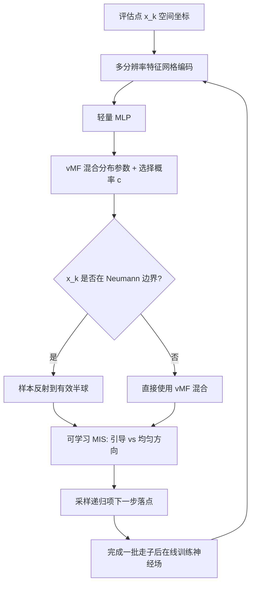

## 一句话总结

把渲染里的"路径引导（path guiding）"思想搬到求解偏微分方程的 Walk on Stars（WoSt）估计器上：用在线学习的神经场解码出 von Mises-Fisher 混合分布，对此前无法重要性采样的**递归项**做方向重要性采样，从而在同等时间或同等样本预算下显著降低方差。

## 研究背景

基于蒙特卡洛的偏微分方程求解方法近年在图形学中受到关注，因为它们无需网格剖分、能处理复杂几何、支持局部求值。这一系列方法始于把 Walk on Spheres（WoS）用于 Dirichlet 泊松问题，随后由 Walk on Stars（WoSt）扩展到支持 Neumann 边界条件，已被用于体渲染、流体模拟、热模拟、机器人、形状建模等诸多场景。

但 WoSt 存在方差大、收敛慢的问题，尤其在复杂域或复杂边界条件下更明显。为缓解方差，已有工作借鉴渲染中的方差缩减技术。其中重要性采样是渲染里非常有效的一类，此前也有人对 WoSt 的非递归项（Neumann 贡献、源贡献）做重要性采样。问题在于 WoSt 估计器的**递归项**：它在计算前既没有闭式表达，也没有形状信息，传统的重要性采样手段（例如下一事件估计 NEE）难以施展，因此原始 WoSt 只能对递归项用均匀方向采样，方差居高不下。

作者观察到：渲染里的路径引导是一种自适应重要性采样，它通过在线学习、从此前样本中估计引导分布，无需先验分布形状，天然契合"递归项形状未知"这一难点。于是他们把路径引导迁移到 WoSt。

## 方法

### 整体框架

论文聚焦最典型的带 Dirichlet 与 Neumann 边界的泊松方程：

$$\Delta u(x) = f(x) \text{ on } \Omega,\quad u(x)=g(x) \text{ on } \partial\Omega_D,\quad \frac{\partial u(x)}{\partial n_x}=h(x) \text{ on } \partial\Omega_N$$

单样本 WoSt 估计器把解写成"递归项 + 非递归 Neumann 贡献 + 非递归源贡献"三部分。作者只针对第一项——递归项——做重要性采样。核心思路是学一个定义在方向球面 $$S^{d-1}$$（$$d=2,3$$）上的引导分布 $$p_g$$，使其近似正比于递归被积函数的绝对值：

$$p_g(\nu\mid x_k) \propto \vert u(\nu; x_k)\vert $$

整个求解器以波前（wavefront）风格在 GPU 上批量推进：每一步做几何查询确定球半径，评估边界/源贡献，再用引导分布采样下一步落点；每完成一批走子（walk）就用收集到的信息训练神经场，更新后的分布用于采样下一批。

### 关键设计

**用 vMF 混合建模引导分布。** 采用 von Mises-Fisher 混合模型作为引导分布，因为它有闭式表达、便于拟合与采样，且天然定义在各维度球面上，契合递归项的方向特性。混合分布是 $$K$$ 个 vMF 分量的凸组合：

$$V(\nu\mid\Theta) = \sum_{i=1}^{K}\lambda_i \cdot v(\nu\mid\mu_i,\kappa_i)$$

**神经场解码空间条件分布。** 用一个由多分辨率特征网格加轻量 MLP（3 层、每层 64 神经元）构成的神经场 $$NN(x\mid\Phi)$$，输入空间坐标，输出未归一化的 vMF 混合参数（权重、集中度、均值）以及一个选择概率 $$c$$，再经归一化映射得到合法参数。训练目标是最小化目标分布与 vMF 混合之间的 KL 散度，用单样本蒙特卡洛估计其梯度并反向传播到网格与 MLP，用基于梯度的优化更新。实现基于 tiny-cuda-nn。

**Neumann 边界的样本反射。** 在 Neumann 边界上，随机游走只有一侧有效，即当 $$\nu\cdot n(x)\le 0$$ 时 PDF 必须为 0，而 vMF 混合的样本会覆盖整个球面。作者提出把无效半球的样本沿局部切平面反射回有效半球，PDF 相应写为：

$$p_g(\nu\mid x) = V(\nu_+\mid\Theta(x)) + V(\nu_-\mid\Theta(x))$$

其中 $$\nu_-=\nu_+ - 2(\nu_+\cdot n(x))\,n(x)$$。作者指出，渲染中已有路径引导实现直接拒绝对侧半球样本、且不用截断分布计算 PDF，这在偏微分方程问题上会带来明显性能退化。

**可学习选择概率的多重重要性采样（MIS）。** 线性椭圆方程常含较平滑区域，这些区域均匀方向采样反而更优，而只依赖学到的分布可能引入方差甚至偏差。作者基于单样本平衡启发式，用一个可学习选择概率 $$c(x)$$ 在引导采样与均匀方向采样间混合：

$$\tilde{p}(\nu\mid x) = c(x)\,p_g(\nu\mid x) + (1-c(x))\,p_u(\nu\mid x)$$

$$c(x)$$ 同样由神经场解码，用一个带固定比例 $$e=0.2$$ 的损失学习，保证无偏并自适应平衡两种采样。

**GPU 系统实现。** 波前求解器分为逻辑、评估、走子三个阶段，用 Structure-of-Arrays 内存布局与线程安全队列在核函数间传数据；神经场与 WoSt 积分器跑在不同 CUDA 流上并行执行。由于官方 Zombie 仅 CPU、FCPW 的 Slang 与 tiny-cuda-nn 集成困难，作者自研了基于线性 BVH 的 CUDA 几何查询库，并用 NanoVDB 做 2D/3D 稀疏源查询。

## 实验结果

实验在 AMD EPYC 9754 处理器加 RTX 4090D GPU 上完成，用相对均方误差（relMSE）作为量化指标，在等时间与等样本两种条件下与原始 WoSt 对比，数据集包括 6 个 3D 几何问题（覆盖 Dirichlet、源、Neumann 以及含正负值的情形）和 2D 扩散曲线（Fille、Ladybug）。所有实验用 1024×1024 评估网格、每点 1024 走子（wpp），无预训练。结果显示在所有问题上本方法都在定性与定量上优于原始 WoSt；虽然同 wpp 下运行更慢，但等时间条件下方差缩减足以抵消开销。

关于 MIS 可学习选择概率的消融（relMSE，越低越好）：

| 问题 | 仅均匀采样 | 固定 c(x)=0.5 | 仅引导采样 | 本方法 |
|------|-----------|--------------|-----------|--------|
| Bob | 0.00385 | 0.00181 | 0.00136 | 0.00098 |
| Bunny | 0.01511 | 0.00690 | 0.00591 | 0.00564 |
| Dragon | 0.00353 | 0.00158 | 0.00135 | 0.00088 |
| Gear | 0.00153 | 0.00085 | 0.00075 | 0.00072 |
| Bottle | 0.00459 | 0.00305 | 0.00288 | 0.00274 |
| Fille | 0.00523 | 0.00210 | 0.00241 | 0.00208 |

评估还表明：训练批大小取总 wpp 的四分之一是合理折中（训练步是阻塞的，对运行时影响大，而模型收敛较快）；vMF 分量数从 4 增到 8 有显著提升，增到 16 收益不明显还增加运行时。Neumann 边界反射的消融显示，不反射会让边界附近方差比原始 WoSt 更差，加入反射后方差显著下降。

## 亮点与局限

亮点：这是首个针对 WoSt 递归项做重要性采样的方法，填补了此前只能用均匀方向采样的空白；把渲染中的路径引导、vMF 混合、神经场编码与 MIS 系统性迁移到偏微分方程求解；针对 Neumann 边界提出样本反射这一契合物理约束的处理；配套一个实用的波前 GPU 实现与自研 CUDA 几何/源查询库。

局限（作者自述）：一是**正化（positivization）**问题，对实值被积函数无法用正值 PDF 消除符号方差；二是无法单独处理 delta 边界或 delta 源，需与 Reverse Walk Splatting 或类 NEE 手段结合；三是当前只讨论了带 Dirichlet/Neumann 的泊松方程，未涉及 Robin 边界与其它偏微分方程；四是只对递归项做重要性采样，源项其实是 $$d$$ 维而非 $$d-1$$ 维方向分布，可能有更好的采样策略（如光树）。

## 延伸思考

这篇工作最有意思的地方在于把"蒙特卡洛偏微分方程求解"与"蒙特卡洛渲染"之间的桥梁又拓宽了一步：递归项之于 WoSt，恰如递归的入射辐射之于渲染方程，两者都缺乏先验形状信息，因而路径引导这类在线自适应方法几乎可以直接类比迁移。作者也明确指出本方法与已有的控制变量、缓存类方差缩减方法在理论上正交，二者结合有望进一步降方差，这为后续把整套渲染方差缩减工具箱（NEE、光树、可微引导等）系统性移植到偏微分方程求解上留出了清晰的路线图。
