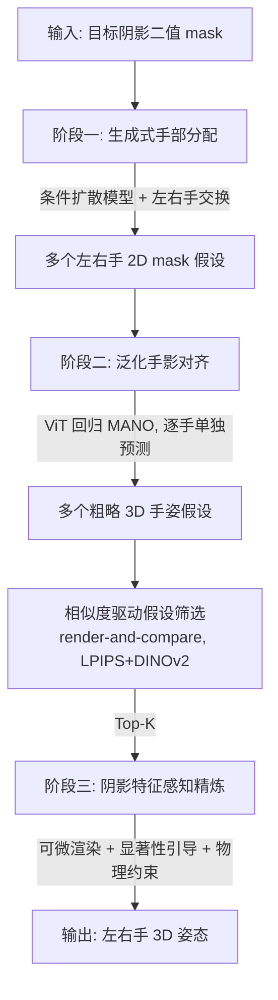

# Hand-Shadow Poser

## 一句话总结

给定一张目标剪影（二值 mask），本文用一个三阶段流水线反解出左右双手的 3D 姿态（MANO 参数），让两只手投出的阴影尽可能贴合输入形状，并且只依赖通用公开手部数据训练，无需专门的手影数据集。

## 研究背景

手影艺术（shadowgraphy）是一门古老而迷人的技艺：只需手、光源和一面投影墙，人们就能在墙上投出动物、植物、人物肖像等各种形象。本文研究的是它的**逆问题**——已知目标剪影，反推能投出该剪影的双手 3D 姿态。这个问题很棘手：

- **本质歧义**：3D 手部姿态空间巨大，同一个阴影可由多种不同手势产生；一旦涉及左右两只手，选择空间更大。
- **无色无纹理**：阴影只有二值轮廓，手部形状恢复是病态的。手姿的显著变化可能完全不改变阴影，导致可微渲染优化时出现大片"平坦区"（梯度失效），极易陷入局部最优、对初始化极其敏感。
- **数据稀缺**：几乎没有标注好的手影艺术数据集，方法必须能只靠通用手部数据泛化。
- **特征保留**：受手部解剖结构限制，不可能逐像素匹配阴影，必须优先保住最关键的特征（如鹦鹉的喙、老鹰和狼的眼睛）。

已有最相近的工作要么需要专业演员手工指定轮廓对应点（难以推广），要么直接用可微渲染最小化图像损失（对初始化敏感、只展示少量案例）。本文是**首个系统性研究手影艺术生成**的数据驱动方法。

## 方法

核心洞察是**解耦**：把逆问题拆成两个子任务——先解决"手"的解剖学约束（恢复解剖正确的手形与姿态），再解决"阴影"的语义约束（让粗略手姿复现输入特征）。这个解耦让整个流程可以只用带合规手部配置的通用数据来训练。

### 阶段一：生成式手部分配（Generative Hand Assignment）

目标是从一张双手混合的阴影 mask 中，分配出左右手各自的 2D 形状（mask），此阶段**不涉及 3D 姿态**。

作者最初尝试用图像分割（把每个像素分类为左手/右手/重叠），但发现三个缺陷：分割的确定性无法刻画阴影到手的映射不确定性；分割强调像素级精度，模型过度关注局部手形而忽略全局线索；无色无纹理的输入使学习难度远高于常规分割。

改用**条件去噪扩散模型**（DDPM + classifier-free guidance）：把输入 mask $\hat{M}$ 与时刻 $t$ 的含噪输出 $x_t$ 拼接，去噪网络逐步得到双通道分配图

$$x_0 = f_{assign}(\hat{M}, \mathrm{PE}(t))$$

再按通道切分得到左右手 mask：$M_l, M_r = \mathrm{Split}(x_0)$。推理时用 DDIM 采样，随机采 $N$ 个初始噪声向量以产生多样假设，并额外**交换左右手**来建模镜像对称。去噪网络用 U-Net。训练损失为带噪声加权的 L2：

$$L_{assign} = \frac{\bar{\alpha}_t}{1-\bar{\alpha}_t} \sum_{*\in\{l,r\}} \|M_* - \hat{M}_*\|_2^2$$

**训练数据**：因为解耦设计让此阶段只需学 2D 手形知识，可直接用现有公开手部数据集（InterHand2.6M、RenderIH、Two-hand 500K 等）。通过两种增强扩充：随机拼接单手数据合成更多双手样本、多视角渲染双手网格。最终得到 770 万训练样本。

### 阶段二：泛化手影对齐（Generalized Hand-Shadow Alignment）

给定左右手 mask，恢复各自的 3D 粗略姿态——即 61 维 MANO 系数（手朝向、15 个关节的 axis-angle 姿态、手形、腕关节 3D 坐标）。此阶段只求**粗对齐**，不求细节。

策略是逐手单独预测以缩小搜索空间：$\theta_*, \beta_*, t_* = f_{align}(M_*)$。为了鲁棒与泛化，采用大规模全 Transformer 设计（ViT backbone + Transformer decoder 回归 MANO），并用两个关键手段：

- 用 RGB 图像预训练权重（来自 HaMeR/Pavlakos 等）初始化，迁移大规模 RGB 先验；
- **半监督微调**：把无标注图像经预训练网络估出 MANO 作为伪标签，再渲染成二值 mask，与有标注样本一起训练。这样不需要高精度伪标签，只需保证解剖正确。

训练损失：

$$L^{3D}_{align} = \|\theta - \hat{\theta}\|_2^2 + \|\beta - \hat{\beta}\|_2^2 + \|J_{3D} - \hat{J}_{3D}\|_1, \quad L^{2D}_{align} = \|J_{2D} - \hat{J}_{2D}\|_1$$

最终训练集约 270 万样本。

**相似度驱动假设筛选**：因为推理时没有真值，用 render-and-compare 评估质量——把每个 3D 姿态假设渲染成二值 mask，用 LPIPS 和 DINOv2 语义分数计算与输入的感知相似度，对 $N$ 个假设排序后选 Top-$K$ 进入下一阶段（默认 $N=20$，$K=3$）。

### 阶段三：阴影特征感知精炼（Shadow-Feature-Aware Refinement）

基于可微渲染迭代优化关节角与腕位（手形参数固定），使投影阴影在感知上更贴近目标，同时兼顾物理可行。前两阶段的粗输出提供了良好初始化，是收敛更快更好的关键。四个精心设计的约束：

**(i) 带显著性引导的相似度约束**：不逐像素等权对齐，而是用 DINOv2 提取输入阴影的显著性图，给关键区域更高权重：

$$L_{sim} = \sum \big(1 + \mathrm{DINO}(\hat{M})\big) \odot \big\vert M - \hat{M}\big\vert $$

**(ii) 解剖约束** $L_{atm}$：采用 twist-splay-bend 帧，把关节旋转轴投到三个独立轴上，惩罚异常轴向分量。

**(iii) 穿透约束** $L_{pen}$：手间穿透惩罚为一只手内部顶点到另一只手最近顶点的距离；

$$L_{inter\text{-}pen} = \frac{1}{\vert P_{in}\vert }\sum_{p\in P_{in}} \min_i \|p - V_i\|_2^2$$

再加上基于锥形距离场近似的自穿透惩罚 $L_{self\text{-}pen}$。

**(iv) 双手距离约束**：因优化对深度轴移动不敏感，双手可能沿深度方向拉得过远，故约束两腕关节距离超过阈值 $\tau_{dist}$ 时惩罚：

$$L_{dist} = \begin{cases} \|t_l - t_r\|_2^2 & \text{if } \|t_l - t_r\|_2^2 \ge \tau_{dist} \\ 0 & \text{otherwise} \end{cases}$$

总目标为加权和：

$$\min_{\theta_l, t_l, \theta_r, t_r} \big[ w_{sim}L_{sim} + w_{atm}L_{atm} + w_{pen}L_{pen} + w_{dist}L_{dist} \big]$$

用 Adam 优化 $L$ 次迭代。实现细节：权重 $w_{sim}=10.0$、其余为 $1.0$，$\tau_{dist}=0.5$，最多 6000 次迭代，显著性图施加 15×15 高斯模糊。场景用 Blender 搭建（光源到投影面 2.5 m），训练在 8 块 V100 上进行。

## 实验结果

**基准**：作者构建了首个手影艺术基准，共 210 个二值 mask，分三类——62 个字母数字（C1）、87 个经典手影艺术形状（C2，来自手影书籍）、61 个日常物体形状（C3，来自 MPEG-7 与网络）。

**指标**：五个视觉相似度指标——LPIPS（越低越好）、CLIP-Global、CLIP-Semantic、DINO-Global（越高越好）、DINO-Semantic（局部特征保留，越低越好），外加用户研究的 Human-Global、Human-Semantic（1–5 分）。

**三个基线**：Baseline 1 为纯可微渲染优化（随机初始化 3 次取最优）；Baseline 2 用单网络直接回归双手粗姿再优化；Baseline 3 用分割模型替换阶段一的生成模型。

主表（平均值）：

| 方法 | LPIPS ↓ | CLIP-Global ↑ | CLIP-Semantic ↑ | DINO-Global ↑ | DINO-Semantic ↓ | Human-Global ↑ | Human-Semantic ↑ |
|------|------|------|------|------|------|------|------|
| Baseline 1 | 0.19 | 0.88 | 0.20 | 0.55 | 0.72 | 2.27 | 2.41 |
| Baseline 2 | 0.19 | 0.88 | 0.17 | 0.55 | 0.74 | 2.29 | 2.33 |
| Baseline 3 | 0.16 | 0.91 | 0.27 | 0.69 | 0.66 | 3.42 | 3.33 |
| **Ours** | **0.14** | **0.93** | **0.36** | **0.78** | **0.56** | **4.53** | **4.35** |

本文方法在所有指标、所有类别上均为最佳。

**收敛效率**（RTX 2080Ti，收敛所需迭代数与秒数，平均）：

| 方法 | 迭代数 ↓ | 时间(秒) ↓ |
|------|------|------|
| Baseline 1 | 5314 | 318 |
| Baseline 2 | 4728 | 283 |
| Baseline 3 | 1841 | 110 |
| **Ours** | **945** | **56** |

本文方法优化时间约为随机初始化 Baseline 1 的 1/6，仅为 Baseline 3 的一半，说明生成式初始化既提升质量又加速收敛。前两阶段前馈模型平均耗时 3 分钟又 30 毫秒每形状。

**消融**（精炼模块）：去掉整个精炼模块后 DINO-Semantic 从 0.56 恶化到 0.76；去掉显著性引导后各指标中度下降（LPIPS 0.15、CLIP-Semantic 0.36、DINO-Global 0.74、DINO-Semantic 0.59）。去掉解剖/穿透/双手距离三个约束会分别导致明显的物理伪影。

**用户研究**：13 名志愿者。质量对比上本文各类别 Human-Global、Human-Semantic 均优于基线。真人复现实验中，参考本文生成的 3D 手模型后，参与者复现单个阴影的平均耗时从 121.4 秒降到 65.8 秒，复现质量从 2.4 分提升到 4.0 分。作者还对 7 个结果做了 1:4 缩放的 3D 打印验证。

## 亮点与局限

**亮点**：
- 首个系统性、数据驱动的手影艺术逆问题框架，覆盖动物、植物、人像、建筑、字母数字、日常物体等丰富形状，超过 85% 的基准案例能有效生成双手姿态。
- 解耦"解剖约束"与"语义约束"的三阶段设计极为巧妙，直接带来最大的实用价值——**只用通用公开手部数据即可训练，无需专门手影数据集**。
- 三个新组件（生成式手部分配、泛化手影对齐、阴影特征感知精炼）各司其职，用生成模型解决歧义与多样性、用 render-and-compare 筛选质量、用 DINOv2 显著性引导保住关键特征。
- 贡献了首个含 210 形状的手影基准与一套阴影专用评测指标（含新的 DINO-Semantic 局部特征指标）。

**局限**（作者自述）：
- 对含细小/纤薄结构的过于复杂形状可能无法复现（受手部可行性限制）。
- 无法直接用于任意个体的手，因指长手形差异需先指定该个体的手形参数定制。
- 假设光源固定，某些需要扭曲阴影的目标形状难以处理。
- 难以保证真人的整体可达性——并非所有双手姿态在人体解剖上都能做到，仅靠手部物理约束无法完全解决。
- 未考虑前臂，实际中前臂可能遮挡手影轮廓；可考虑用 SMPL-X 扩展 MANO 加入前臂参数。

## 延伸思考

这项工作把"逆向手影"这个看似小众的艺术问题，转化成了一个干净的"解耦 + 生成初始化 + 可微精炼"范式，其思路对其他病态逆问题很有借鉴意义：当直接端到端优化因梯度平坦区而失效时，用生成模型提供多样化的良好初始化、再用可微渲染做局部精炼，是一条有效路径。显著性引导的相似度损失也提醒我们，在"无法逐像素匹配"的受限系统中，识别并优先保住语义关键区域比追求全局像素对齐更重要。

未来方向包括动画化手影叙事、引入手持道具、以及协调多人的多只手，这些都会显著扩展手影创作的表达力。此外，把"人体可达性"作为更强的约束纳入优化（而非仅约束手部），是让结果真正可被真人复现的关键一步。
