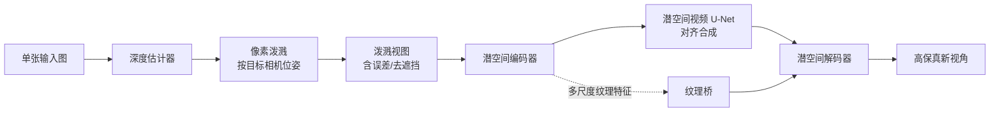

## 一句话总结

SplatDiff 用像素泼溅（pixel splatting）的结果作为条件去引导视频扩散模型，取两者之长——泼溅保纹理、扩散补几何，从单张图片合成几何一致且纹理高保真的新视角。

## 研究背景

- 领域现状：从单张或稀疏图片前馈式合成新视角（Novel View Synthesis, NVS）是当前热点。主流路线有两条：一条是基于泼溅（splatting）的方法（如 Flash3D、DepthSplat 这类前馈 3D Gaussian Splatting），另一条是基于扩散模型的方法（如 ViewCrafter、GenWarp）。
- 核心痛点：两条路线各有硬伤。泼溅类方法靠像素/特征级约束训练，能较好地保留输入视角的纹理，但单/稀疏观测下几何线索有限，深度估计不准会带来泼溅误差（如物体边界的飞散像素），导致新视角几何扭曲。扩散类方法有互联网规模数据训练出的丰富 3D 先验、几何更合理，但生成本性会带来纹理幻觉（texture hallucination），生成的纹理和输入视角对不上。
- 本文 idea：把两者结合。作者发现相比 3D Gaussian Splatting，简单的像素泼溅（前向 warping）在单/稀疏输入下反而更能保留外观，因为从有限观测里估准高斯参数（如不透明度）很难，误差还会带来飘浮物（floaters）。于是用像素泼溅产出的"泼溅视图"作为条件，交给一个视频扩散模型来修正泼溅误差、补全遮挡区域，同时通过一个纹理桥模块把输入的真实纹理注回去，抑制幻觉。

## 方法

### 整体框架

给定单张输入图，先用现成深度估计器预测深度，再按目标相机位姿做像素泼溅，得到一串带误差和未知区域（如去遮挡处）的"泼溅视图"。把泼溅视图作为条件送入潜空间视频扩散模型：微调潜空间 U-Net 实现"对齐合成"（生成与条件几何一致的新视角，同时纠正泼溅误差），并用一个纹理桥模块把编码器里的纹理特征补进解码器，得到高保真结果。

### 关键设计

1. 训练对偶对齐（Training Pair Alignment, TPA）。这是"是什么"：一种构造扩散训练数据对的策略。"为什么"：以往方法从源视图 $$x_{src}$$ 渲染出条件视图 $$v_{tgt}$$ 再让模型预测目标视图 $$x_{tgt}$$，但受光照差异、深度误差影响，条件视图和目标视图在纹理与几何上并不对齐，导致模型学出与条件错位的结果，难以精确控制视角。"怎么做"：TPA 反过来用目标视图 $$x_{tgt}$$ 来造条件——先用光流估计器算出源、目标视图间的变换，经像素泼溅得到有效区域掩膜 $$m_{splat}$$，再对目标视图做掩膜得到对齐条件 $$\tilde{v}_{tgt} = x_{tgt} \odot m_{splat}$$。这样条件与目标天然在几何和纹理上对齐，模型学会忠实于条件视图。

2. 泼溅误差模拟（Splatting Error Simulation, SES）。"是什么/为什么"：只用 TPA 训练的模型会被真实泼溅视图里的误差（尤其是物体边界的飞散像素）带偏，产生伪影。"怎么做"：主动在训练对里模拟这类误差——用 Sobel 算子从变换图提取边缘掩膜 $$m_{edge}$$，抽取输入视图的边缘区域 $$e_{src} = x_{src} \odot m_{edge}$$ 并泼溅到目标视图得到 $$e_{tgt}$$，再用随机掩膜 $$m_{error}$$ 注入误差：$$\hat{v}_{tgt} = e_{tgt} \odot m_{error} + \tilde{v}_{tgt} \odot (1 - m_{error})$$。模型借此学会利用几何先验主动纠正泼溅误差，保持几何一致。

3. 纹理桥（Texture Bridge）。"是什么/为什么"：对齐合成解决了几何，但扩散输出仍会有纹理幻觉；直接把泼溅视图和扩散输出硬融合又会引入锯齿、模糊和残留误差。"怎么做"：在解码器每个特征尺度放一个融合块，把从泼溅视图提取的编码器特征 $$f^i_{enc}$$ 与解码器特征 $$f^i_{dec}$$ 自适应融合，$$f^i_{fuse} = \mathrm{Fuse}_i(f^i_{enc}, f^i_{dec})$$，再解码出新视角。每个融合块用两个残差块实现。多尺度融合让模型在有泼溅误差处更依赖扩散输出、在有幻觉处更依赖泼溅视图。

4. 纹理退化训练（Texture Degradation）。"是什么/为什么"：想训练纹理桥学会"自适应取舍"，但扩散输出在未知区域（去遮挡）与目标差异过大，直接监督效果不好。"怎么做"：用扩散模型主动退化目标视图的纹理，得到内容接近目标、但带幻觉纹理的退化视图来喂纹理桥训练。监督用 $$\ell_1$$ 损失与感知损失：$$\mathcal{L} = \mathcal{L}_1 + \alpha \mathcal{L}_{LPIPS}$$，其中 $$\alpha = 0.1$$。

实现上，SplatDiff 基于开源视频扩散模型 DynamiCrafter、用 ViewCrafter 权重初始化；先微调潜空间 U-Net 做对齐合成（1.5K 步），再训练纹理桥（10K 步），单块 NVIDIA RTX A6000 上约 2.5 天，推理用 50 步 DDIM 采样。

## 实验结果

主实验为 RealEstate10K 与 DL3DV-10K 上的单视角 NVS 定量对比（各分 easy / hard 两个基线范围）。作者强调指标重要性排序为分布级（FID）> 特征级（LPIPS、DISTS）> 像素级（PSNR、SSIM），因深度误差会让生成视图与真值难以逐像素对齐。下表取两数据集的 hard set 与代表性基线对比（DepthSplat 用两视角输入）：

| 数据集 / 方法 | PSNR↑ | SSIM↑ | LPIPS↓ | DISTS↓ | FID↓ |
|------|------|------|------|------|------|
| RealEstate10K · ViewCrafter（扩散） | 16.64 | 0.588 | 0.347 | 0.185 | 18.30 |
| RealEstate10K · Flash3D（泼溅） | 24.93 | 0.833 | 0.160 | 0.098 | 8.42 |
| RealEstate10K · SplatDiff（本文） | 25.17 | 0.820 | 0.154 | 0.088 | 6.04 |
| DL3DV-10K · ViewCrafter（扩散） | 19.77 | 0.565 | 0.249 | 0.349 | 59.56 |
| DL3DV-10K · DepthSplat（两视角） | 21.79 | 0.709 | 0.221 | 0.124 | 61.37 |
| DL3DV-10K · SplatDiff（本文） | 22.48 | 0.732 | 0.181 | 0.092 | 41.22 |

SplatDiff 在特征级与分布级指标上普遍领先；在深度更可靠的 DL3DV-10K 上，甚至超过用两视角输入的 DepthSplat。

消融实验（DL3DV-10K）显示四个设计逐级有效：加 TPA 相比基线带来约 1.69 dB 的 PSNR 提升；再加 SES 进一步纠正泼溅误差；纹理桥（TB）让各项指标大幅改善（FID 从约 43.6 降到 25.5）；纹理退化（TD）再微调至最佳（PSNR 26.14 / FID 24.23）。

此外，无需额外训练，把单视角 NVS 上预训练的模型直接迁移到稀疏视角 NVS 与立体视频转换两个任务上：稀疏视角在 DL3DV-10K（域内）与 DTU（跨域）上超越 MVSplat、DepthSplat 等（对两个泼溅视图生成结果取平均的 SplatDiff† 在 DTU 上全指标胜出）；立体视频转换在 Spring 数据集上也取得最佳，展现出跨域、跨任务的泛化力。

## 亮点与局限

- 亮点：
  - 思路清晰地"取长补短"——泼溅负责保纹理与视角控制，扩散负责补几何与遮挡，用泼溅视图当条件把两者接起来。
  - 对齐合成（TPA + SES）直击扩散 NVS 的错位与幻觉根因，用目标视图反向造对齐训练对、并主动模拟泼溅误差让模型学会纠错，设计巧妙。
  - 训练成本相对可控（单卡 A6000 约 2.5 天），且只在单视角 NVS 上训练就能零样本迁移到稀疏视角与立体视频转换，泛化性强。
  - 作者论证并选择了更简单的像素泼溅而非 3D Gaussian Splatting，理由（有限观测下高斯参数难估、易出飘浮物）有说服力且有消融支撑。

- 局限：
  - 强依赖现成深度估计器与光流估计器的质量，深度或流估计出错会直接影响泼溅条件与最终结果。
  - 在跨域的 DTU 上，像素级指标（PSNR/SSIM）并非全面领先，泼溅类方法靠模糊细节反而拿到更高像素分；需要额外做双视图平均才能全指标胜出，说明单条件下仍有错位残留。
  - 基于视频扩散的多步采样（50 步 DDIM）推理开销不小，实时性未展开讨论。
  - 未知区域（去遮挡）的内容本质上仍是生成补全，一致性与可信度受扩散先验约束。

## 延伸思考

- 用"几何可靠但纹理会幻觉"的扩散、配"纹理可靠但几何会扭曲"的显式渲染，两者互为条件互补，是近来 NVS/重建里很有代表性的融合范式；SplatDiff 把这一思路落在"像素泼溅 + 视频扩散"上，与用 3DGS 做条件的路线（如各类 diffusion-guided 3DGS 修复）值得横向对照。
- TPA "用目标视图反向构造对齐条件"的做法，本质是消除训练时的条件-目标错位，这个思想在其他条件生成任务（如可控编辑、图像修复）里可能同样适用。
- 纹理桥的自适应多尺度融合目前用残差块实现，作者也提到可换成自注意力等更强结构；把"何处信生成、何处信观测"的取舍显式建模，是抑制幻觉同时保真的通用杠杆。
- 对深度/光流估计器的依赖提示了一个改进方向：把几何估计与视图合成端到端联合优化，或引入不确定性感知，可能进一步减少泼溅误差的传播。
