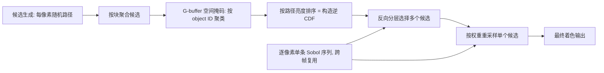

## 一句话总结

在 ReSTIR（时空蓄水池重采样）里，先把每个像素邻域的候选样本按亮度排成"局部直方图"，再用准蒙特卡洛与反向（antithetic）分层模式去挑候选，从而以极小开销显著降低实时渲染噪声。

## 研究背景

- 领域现状：实时光线追踪普遍受限于"每像素一条路径"，图像噪声很高。重采样重要性采样（RIS）及其时空版本 ReSTIR 通过维护一批候选样本来逼近理想采样分布，再从中重采样一个样本，已成为实时降噪的主流路线，且不需要神经网络或复杂数据结构。
- 核心痛点：现有 RIS/ReSTIR 在从候选池中挑样本时基本靠**随机抽取**，没有充分利用候选之间的结构关系，候选池的潜力没有被榨干；另一方面，准蒙特卡洛、分层、反向采样这些经典方差缩减手段一直很难和 RIS 有效结合。
- 本文 idea：在"挑候选"这一步之前，先对候选做**局部有序化**（按输出亮度排序，等价于构造该局部区域的逆累积分布函数），使得后续可以在这个一维有序空间里施加分层与反向采样等相关化策略，让被选中的候选更贴近理想分布，从而直接压低估计误差。

## 方法

### 整体框架

方法建立在标准 ReSTIR 管线之上，把原来"从邻域随机选若干候选再重采样"改成"先排序成局部直方图、再做分层/反向选择、最后重采样"。每帧分三个 pass：候选生成、逆 CDF 构造（对候选排序）、重采样与最终着色。整套流程只额外增加了一次候选排序，内存上每个蓄水池只多存一个亮度浮点数和一个 G-buffer 整数。

### 关键设计

**1）局部直方图 = 对候选排序。** 为每个像素每帧建直方图代价过高，作者改为对一整块像素（block，典型 8×8 到 32×32）共享一个直方图。关键洞察来自直方图采样理论：直接对直方图做逆 CDF 采样，在数学上等价于"把样本按函数值排序、再从有序列表里按下标取值"。因此这里不显式构造直方图，而是直接用 GPU 的 bitonic 排序把块内候选按其路径总亮度排好序，得到的有序列表就是该块的逆 CDF 表示。排序把复杂的高维路径问题压缩进一维亮度空间，天然适配准蒙特卡洛。

**2）跨帧一致的分层采样。** 每个像素分配一条固定的 Sobol 序列并跨帧复用，每帧从中取一个样本，用其两个维度分别驱动"从有序列表选候选"和"最终重采样"两步。因为 ReSTIR 本身是时间方法，让采样在多帧间协调能提升时间稳定性、降低闪烁。相比经典 ReSTIR 的流式蓄水池更新，这里最终重采样直接用一个伪随机数做逆 CDF 采样，实现更简单。

**3）反向（antithetic）分层选择。** 从有序候选中一次选多个候选时（实验用 4 个），采用一种对称、分层的反向模式：由单个伪随机数出发，先在 $$[0,0.25)$$ 采一个初始样本，再依次围绕 0.25、0.5 做镜像得到其余样本。对单调函数而言，对称样本能让高值与低值互相补偿，从而抵消误差。与需要在样本空间构造空间填充曲线来分层的做法不同，本文直接在候选的输出值（亮度）上分层，因而与具体渲染方法解耦。

**4）空间掩码保证块内相似性。** 一个块里可能横跨不同物体，路径若跨物体复用会引入偏差。作者用 G-buffer 信息（实现中用 object ID，也可用法线/深度/材质）对块内像素聚类，为每个簇单独排序、每个像素只从同簇候选里取样，从而在保持块级共享直方图的同时避免不合理的路径复用。

配套的估计器仍是无偏 RIS 估计：候选权重 $$w_i = q(x_i)/p(x_i)$$，选择概率 $$P(i)=w_i/\sum_{j=1}^{k} w_j$$，最终估计为 $$\langle F\rangle = \frac{f(x_i)}{q(x_i)}\left(\frac{1}{k}\sum_{j=1}^{k} w_j\right)$$，其中目标密度取包含可见性的路径总亮度。

## 实验结果

实现基于 Falcor 渲染器并遵循 ReSTIR PT，主要在 NVIDIA RTX 3090 上测试（时间另在 Intel ARC A770 上评估），块大小取 16×16、每像素选 4 个候选、蓄水池累积上限 20（超过后用指数滑动平均）。评价指标为 RelMSE 与感知加权的 pRelMSE（对高斯滤波后的输出算 RelMSE，以体现蓝噪声的感知收益）。

下面这张在 4 个场景（Station-Demerzel、Sea-House、Sun Temple、Veach-Ajar）上平均的直方图采样策略消融，最能说明核心结论——本文完整方法在两个指标上都取得最优：

| 候选采样策略 | RelMSE ↓ | pRelMSE ↓ |
|------|------|------|
| 非相关候选（即 ReSTIR 基线） | 0.049 | 0.132 |
| 每帧 4 样本低差异序列 | 0.034 | 0.100 |
| 随机偏移分层 | 0.043 | 0.103 |
| 随机偏移 + 时间蓝噪声 | 0.034 | 0.095 |
| 反向采样 + 时间蓝噪声（本文） | 0.034 | 0.095 |

其余结论以文字补充：

- 在等时间、不做时间候选复用而是直接帧累积的设置下，本文在多个场景一致取得更低误差，同时保留了更好的感知误差分布（蓝噪声），画面更平滑。
- 跨 5 个场景、2/4/8/16/32 帧的对比中，误差随帧数呈典型收敛曲线并在达到候选累积上限后趋于稳定，本文在每个帧数上都稳定优于 ReSTIR，且收敛到更低的平衡误差。
- 开销很小：排序带来的额外时间约占整体渲染的 3% 到 10%，取决于块大小。综合误差与耗时，16×16 是最佳折中——更小的块更快但误差偏高且出现低频伪影，更大的块（32×32）因块内远距离像素相似性下降反而略有退化。

## 亮点与局限

- 亮点：
  - 思路简洁且正交——只在候选选择前插入一次排序，就把准蒙特卡洛、分层、反向采样、蓝噪声这些经典方差缩减手段接入了 ReSTIR，几乎零结构改动。
  - 在一维亮度空间做分层，使方法与具体光传输/渲染方式解耦，可扩展到高维路径；相比需要在样本空间构造空间填充曲线的做法更通用。
  - 开销与内存都很低（每蓄水池仅多一个浮点+一个整数），并能顺带获得感知友好的蓝噪声误差分布。
- 局限：
  - 基于块的直方图在相邻块统计差异明显时会产生块状伪影，需靠增大块、累积更多帧或帧间抖动块位置来缓解。
  - 最终仅用单条着色光线时，残余误差常表现为色噪声，方法对这部分以及被高方差区域主导的整幅图误差改善有限。
  - ReSTIR 引入的相邻像素正相关虽利于时间稳定，但可能对实时神经降噪器产生影响，本文未深入评估。

## 延伸思考

- 该方法把"直方图采样"（原本用于把误差分布成屏幕空间蓝噪声）重新用作"降低逐像素误差"的工具，说明排序/逆 CDF 这一原语在重采样框架里还有更多可挖的用法，例如换用法线、深度或材质做更细的簇划分。
- 作者提出的一个值得追问的方向是：ReSTIR 造成的邻域正相关究竟会怎样影响下游神经降噪器——是干扰还是可被利用？这对"重采样 + 学习式降噪"的实时管线组合很关键。
- 把反向/分层选择推广到更高路径维度、与 ReSTIR PT/GI 等更一般光传输场景更深度结合，以及自适应地选择块大小以规避块状伪影，都是自然的后续。
