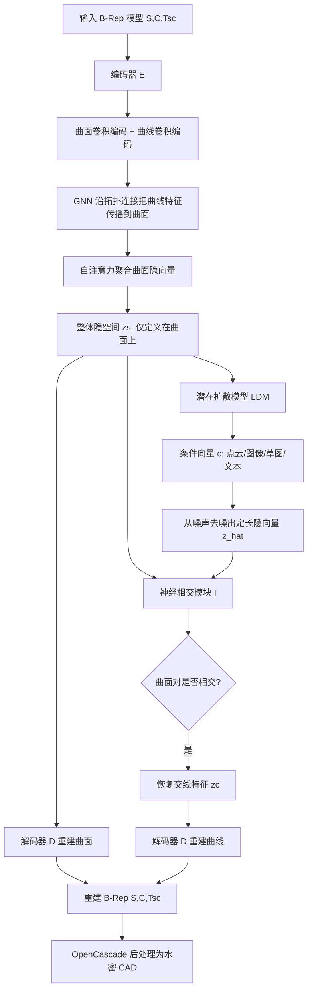

# HoLa: B-Rep Generation using a Holistic Latent Representation

## 一句话总结

HoLa 把 B-Rep 中曲面、曲线、顶点的几何与离散拓扑连接全部融合进一个只定义在曲面上的"整体隐空间"，靠一个神经相交模块从曲面对反推出交线几何与连接关系，从而首次用单一扩散模型支持点云、图像、草图、文本等多种条件的 B-Rep 生成，并把无条件生成的有效率从约 50% 提升到 82%。

## 研究背景

边界表示（Boundary Representation, B-Rep）是 CAD 领域最基础的三维形状格式，由参数化的曲面、曲线、顶点及其拓扑连接关系组成。它同时包含连续的几何参数和离散的拓扑关系，这种"连续 + 离散"的混合本质，使得直接把现代机器学习方法用于 B-Rep 生成非常困难。

以往方法几乎都采用多阶段训练流水线来规避离散性问题：为曲面、曲线、顶点分别设计独立的解码器或生成器，每个生成器只负责单类图元的形成，却不显式约束图元之间的拓扑关系。例如 BRepGen 的曲线生成器只负责生成能正确裁剪曲面的曲线，SolidGen 的曲面生成器则要从输入曲线中挑子集来构成曲面片，二者都对"两个曲面是否通过某条曲线相连"这一关键拓扑关系无感知。

这类模型的核心问题在于训练时缺乏显式的拓扑约束或先验，再叠加多步生成中的误差累积，导致生成的 B-Rep 常出现图元之间的歧义、不连贯与冗余，进而产生无效输出或依赖复杂的后处理（如 BRepGen 需要去重来删除重复曲线）。作者据此提出：能否把几何与拓扑统一进一个隐空间，让拓扑学习从离散问题变成欧氏空间中的几何重建问题。

## 方法

核心观察极其朴素：B-Rep 中任何一条曲线，本质上都是两个曲面的交线。因此"两个高阶图元（曲面）之间是否连接"这一拓扑关系，内在地绑定于一个低阶图元（曲线）的几何。这个 topo-geometrical 先验成了把不同类别图元及其拓扑统一起来的天然桥梁。

据此，作者把隐空间只定义在曲面上，在解码时用一个神经相交模块（neural intersection）从一对曲面隐向量判断它们是否相交、并恢复交线几何。这样一来，隐空间中不再显式存在曲线、顶点和任何拓扑连接，拓扑学习被重构为"从曲面对推断交线"的几何重建问题，网络结构相比 BRepGen、SolidGen 大幅简化。

**整体表示与编码器。** 一个 B-Rep 模型表示为 $(S, C, T_{SC})$：曲面用 UV 空间的均匀采样点 $S_i \in \mathbb{R}^{16\times16\times3}$，曲线用 $C_i \in \mathbb{R}^{16\times3}$，拓扑连接用二值邻接矩阵编码。顶点被合并为曲线的两个端点。编码器先用卷积把曲面、曲线降维成几何特征，再用图神经网络 GATv2 沿 $T_{SC}$ 把曲线特征传播到曲面，得到 curve-aware 的曲面特征，随后用自注意力层交换各曲面隐向量的信息，最后经 MLP 映射到隐高斯的均值与方差，采样得到 $z_s \in \mathbb{R}^{m\times(2\times2\times d)}$，其中 $d=8$。这里刻意保留 UV 空间分辨率 2，是为了保住图元的方向信息（最后的 max pooling 是置换不变的，会丢失朝向）。

**神经相交模块与解码。** 给定一对采样后的曲面隐向量，相交模块 $I: (\mathbb{R}^{32}, \mathbb{R}^{32}) \to (\mathbb{R}^{16}, \{0,1\})$ 恢复交线特征并预测两曲面是否相交。它先用自注意力交换各曲面特征，为每对曲面加上表示"第一/第二个曲面"的位置编码（使相交结果依赖曲面顺序），再用交叉注意力（第一个曲面作 query，第二个作 key/value）、最后用 MLP 得到交线特征，并用二分类器判定是否相交。解码器用 CNN + 上采样从曲面隐向量和交线特征重建曲面与曲线采样点。

**损失函数。** 由三部分组成：图元采样点的 $L_1$ 重建损失、相交分类的二值交叉熵、以及把隐向量约束到标准高斯的 KL 正则：

$$\mathcal{L} = w_1 \mathcal{L}_{recon} + w_2 \mathcal{L}_{inter} + w_3 \mathcal{L}_{reg}$$

$$\mathcal{L}_{recon} = \sum_{i=1}^{m} \lVert S_i - \hat{S}_i \rVert_1 + \sum_{j=1}^{n} \lVert C_j - \hat{C}_j \rVert_1$$

权重取 $w_1=1$、$w_2=10^{-1}$、$w_3=10^{-6}$。

**半边（half-curve）结构。** 作者发现直接对采样点做 $L_1$ 损失会让网络学到数据准备时随机指定的固定朝向。为此训练网络按曲面对顺序预测有向的半曲线：作为曲面外边界时形成逆时针环，作为内部孔洞时形成顺时针环；曲面对顺序交换时，半曲线朝向也相应翻转。曲线朝向对后续形成裁剪曲面的环路至关重要。

**潜在扩散生成。** 把 $z_s$ 通过随机重复填充到定长 $z \in \mathbb{R}^{M\times32}$，用标准 Transformer 架构的 LDM 从高斯噪声去噪出隐向量 $\hat{z}$，并以 256 维条件向量 $c$ 为条件（无条件时置 0）：

$$\hat{z} = \mathrm{LDM}(\mathcal{N}, c)$$

不同条件的编码方式：单/多视图图像与草图用冻结的 DINOv2 提取 1024 维特征（多视图加位姿位置编码后平均），点云用可训练的 PointNet，再各接 MLP 映射到 256 维。得到 $\hat{z}$ 后送回相交模块与解码器，最终用 OpenCascade 拟合 $C^2$ 光滑 BSpline、检测公共端点连成有向环路、裁剪曲面并缝合成水密 CAD 模型。

**模型规模。** BRepGen 用两个 VAE（88.6M）加四个扩散模块（共 202M），模块间层层依赖、各自独立训练。HoLa 只用单个 VAE（181M）加单个扩散模型（205M），共享隐空间端到端训练，避免了多组件协调的开销。条件变化时也只需重训一个扩散模型。

## 实验结果

**无条件生成（DeepCAD 数据集）。** 数据集过滤掉过简单（少于 7 个曲面）和过复杂（多于 30 个曲面）的模型，得到 53,225 个模型。有效率（Val.）上，DeepCAD 为 50.82%，BRepGen 过滤简单模型后降到 47.74%，HoLa 达到 82.68%，显著领先；覆盖率 Cov. 为 78.87%（对比 69.27% 与 70.61%），MMD 0.01069、JSD 0.00536 均最优，圈复杂度 CC 14.22、平均曲率 MC 2.07 也最高，说明生成更复杂多样。在更难的 ABC 数据集上，HoLa 有效率 60.46% 对 BRepGen 的 32.68%，同样全面领先。DeepCAD 虽然 LFD（新颖度）更高，但其 sketch-and-extrude 流程偏向平面形状（低平均曲率），且多数样本只有 1-2 次拉伸操作，多样性受限。

**点云条件生成（DeepCAD）。** 与 HPNet+Point2CAD、SEDNet+Point2CAD、NVD-Net 对比。单次采样版 Chamfer 距离 0.0474（对比 HPNet+P2C 的 0.1676、SEDNet+P2C 的 0.1534），几何 F-score（Vertex/Edge/Face）0.86/0.89/0.94、拓扑 F-score（FE/EV）0.86/0.84 均领先，有效率 83.87%。采样 32 次的 Ours32 变体全面最优：Chamfer 0.0424、有效率提升到 98.23%。相较 NVD-Net，Ours32 在多数指标尤其拓扑上更优。速度上标准版每个模型仅 0.56s（去噪 0.27s + 后处理 0.27s + 选择 0.02s），Ours32 为 12.46s，而 HPNet、SEDNet 因聚类与拟合都需 30s 以上。

**鲁棒性。** 在逐步引入随机裁剪、2% 高斯噪声、遮蔽法向、下采样到 1024 点等退化条件下，性能仍可用：基线 Chamfer 0.0494，加裁剪 0.0698，加噪声 0.0652，去法向 0.0836，稀疏化后 0.0993。在结构光扫描的真实带噪点云上也能生成多个合理候选。多次运行可显著提升有效率，从 1 次的 83.87% 提升到 32 次的 98.23%。

**文本条件生成（Text2CAD 数据集）。** 因文本监督较弱且常含歧义，仅给出定性结果，显示能从文本描述生成更合理的模型，并对分布外、更抽象的描述（如"a hexagonal screw"、"a U-bolt"）仍保持鲁棒。失败主要源于图元数量、对称约束、具体几何细节与描述不对齐。

**图像条件生成。** 多视图效果最好，Chamfer 0.0451、几何 F-score 0.82/0.84/0.87、有效率 84.03%；单视图 Chamfer 0.0684、有效率 86.37%；草图 Chamfer 0.0770、有效率 86.28%。对同一单视图/草图输入能生成多个合理候选，在可见部分保持一致、在不可见区域引入变化，体现对不可见区域不确定性的建模。

**消融（holistic VAE）。** 相交准确率始终高达 99.99%。完整模型有效率 94.18%；去掉采样后自注意力降到 91.63%；再去掉隐向量的空间分辨率降到 88.37%；再去掉半边表示骤降到 79.62%。说明空间结构与半边显式建模的方向线索对学习 B-Rep 拓扑至关重要——VAE 标准的池化与展平是置换不变的，会丢失方向信息。

## 亮点与局限

**亮点。**
- 抓住"曲线即两曲面交线"这一朴素事实作为归纳偏置，把离散拓扑学习优雅地转化为欧氏空间的几何重建，隐空间只需定义在曲面上却编码了完整 B-Rep。
- 用单一 VAE + 单一扩散模型取代 BRepGen 的多 VAE 多扩散级联，端到端训练，条件切换时只需重训一个扩散模型。
- 首个直接从多种条件（点云、单/多视图、草图、文本）生成 B-Rep 的方法，无条件有效率从约 50% 提升到 82%。
- 半边结构与保留空间分辨率的设计经消融验证是有效率的关键。

**局限。**
- 隐空间仍以曲面图元为基本单元，曲面图元的不一致会导致裁剪错误、生成非水密模型。
- 曲面数量可变，需填充到固定数量；随机填充虽优于零填充，但"填充 - 去重"策略在训练中引入噪声与歧义，会传播到生成结果。
- 条件信号被编码成单一 1D 特征向量，可能无法充分捕捉输入的复杂性或内在特征，导致输入与生成结果不一致。

## 延伸思考

作者提出的未来方向是把隐空间进一步压缩成表示整个 B-Rep 的全局隐向量，这可能带来更紧凑的表示并提升有效率。这与当前"逐曲面隐向量 + 填充"方案形成对比——全局隐向量能天然回避可变图元数量和填充去重带来的歧义，但要在一个向量里编码任意复杂的拓扑，对解码器的表达力是更大的考验。

另一个值得深挖的点是条件注入机制。目前把点云、图像、文本统统压成 256 维向量，信息瓶颈明显，尤其对文本这类弱监督、对多视图这类结构化输入都不够。引入交叉注意力式的密集条件、或让条件与隐向量在空间上对齐，很可能进一步缩小输入与生成的不一致。

更广义地看，"把离散关系绑定到低阶几何、从而转为连续重建问题"的思路，或许能迁移到其他含离散拓扑的结构化生成任务（如网格连接、场景图、装配关系），这是该工作方法论层面最有启发性的部分。
