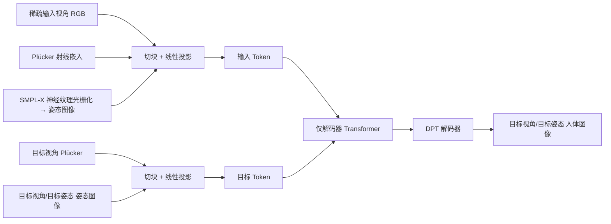

## 一句话总结

HumanRAM 把人体重建与动画统一进一个前馈的大重建模型（LRM），通过向 Transformer 注入基于 SMPL-X 神经纹理的显式姿态条件，从单张或稀疏视角图像直接合成新视角、新姿态下的高保真人体图像。

## 研究背景

- 领域现状：高质量人体重建与动画长期依赖密集视角采集系统与耗时的逐主体优化，硬件复杂、周期长。近年出现两条前馈路线：一是 PIFu 系列用像素对齐的隐式函数恢复几何，二是从大重建模型 LRM 出发、用可扩展 Transformer 直接从图像回归三维表示或新视角渲染。
- 核心痛点：现有 LRM 主要面向物体/场景静态重建，在复杂姿态与衣物形变下难以刻画人体细节；更关键的是它们只做静态重建，忽略了交互应用必需的动态动画能力。而传统的逐主体三维人体方法在稀疏输入下容易失败、优化耗时。
- 本文 idea：以纯 Transformer 的新视角合成模型 LVSM 为骨架，借助其"隐式学习三维结构、直接回归目标视角"的特性绕开稀疏观测下几何约束不足的问题；再引入 SMPL-X 参数化人体先验，通过一套共享神经纹理光栅化出的"姿态图像"，让同一框架既能高质量重建，又能受姿态控制地做动画。

## 方法

整体框架：给定若干标定过的稀疏输入视角，模型把每个视角的 RGB 图像、相机的 Plücker 射线嵌入，以及一张由 SMPL-X 神经纹理光栅化得到的"姿态图像"沿通道拼接后切块投影成输入 token；给定目标视角与目标姿态，同样构造目标 token；两组 token 一起送入仅解码器的 Transformer，输出 token 再经一个 DPT 风格的解码器回归成目标视角、目标姿态下的人体图像。控制目标视角即"重建"，同时替换目标姿态即"动画"。

关键设计：

- SMPL-X 神经纹理（姿态条件的来源）：在由规范姿态、平均体型确定的规范空间里，用三平面（tri-plane）表示一套可学习、跨所有身份共享的神经纹理。对规范 SMPL-X 表面上的每个位置 $$v$$，其神经纹理特征是三个平面上双线性插值特征的拼接 $$F(v; T) = [\mathrm{BLerp}(v_{xy}; T_{xy}), \mathrm{BLerp}(v_{xz}; T_{xz}), \mathrm{BLerp}(v_{yz}; T_{yz})]$$ 。三平面兼顾表达力与紧凑性，共享设计让姿态先验在不同身份间通用。

- 姿态图像与 token 化：先用带规范位置作为顶点颜色的 SMPL-X 渲染出"位置图"，再据此采样神经纹理，得到与 RGB、相机 token 空间对齐的姿态图像。输入 token 由 RGB、Plücker 嵌入与姿态图像拼接切块得到 $$x_{ij} = \mathrm{Linear_{inp}}([I_{ij}, P_{ij}, F_{ij}])$$ ；重建的目标 token 只拼接目标视角的 Plücker 与姿态图像，动画则把目标姿态 $$\hat{\theta}$$ 变换成带姿态的 SMPL-X 后再光栅化神经纹理，得到同时编码新视角与新姿态的目标 token。

- 为什么姿态条件同时利好重建与动画：从新视角合成看，LVSM 靠注意力在 RGB 与相机信息间做跨视角匹配来"重组"目标视角，额外注入的 SMPL-X 神经纹理提供了更显式的对应关系，从而提升合成质量；从动画看，共享神经纹理让不同姿态间的外观得以匹配，实现新姿态合成。作者称这是首个赋予大重建模型动画能力的工作。

- DPT 解码器：原始 LVSM 用单个线性层直接把 token 解码成 RGB，在自遮挡严重或细结构区域会出现明显的块状伪影，原因是解码时相邻 patch token 之间缺乏信息交换。本文改用类 DPT 的残差 CNN 堆叠，融合第 3、6、9、12 层的中间 token，得到 $$\hat{I}_t = \mathrm{Sigmoid}(\mathrm{DPT}(\{y_i \mid i = 3, 6, 9, 12\}))$$ ，增强局部与多尺度信息融合、抑制块状伪影。

训练用均方误差加感知损失联合优化 $$L = \frac{1}{M}\sum_{i=1}^{M}(L_{MSE}(\hat{I}_i, I_i) + \lambda \cdot L_{Perc}(\hat{I}_i, I_i))$$ ，其中感知损失基于 VGG-19 特征的 $$L_1$$ 差异，权重 $$\lambda = 1.0$$ 。

## 实验结果

主实验为稀疏视角重建：在 THuman2.1 与 Human4DiT 上输入 4 个均匀视角（GPS-Gaussian 因需立体校正用 5 个等高视角），与前馈重建及 LRM 类方法对比 PSNR、SSIM、LPIPS。所有方法均在 THuman2.1 上训练或微调以保证公平。

| 方法 | THuman2.1 PSNR↑ | THuman2.1 SSIM↑ | THuman2.1 LPIPS↓ | Human4DiT PSNR↑ | Human4DiT SSIM↑ | Human4DiT LPIPS↓ |
|------|------|------|------|------|------|------|
| 本文 | 30.34 | 0.9535 | 0.0184 | 26.35 | 0.9373 | 0.0211 |
| LVSM | 28.24 | 0.9396 | 0.0226 | 25.56 | 0.9247 | 0.0248 |
| GPS-Gaussian | 22.11 | 0.9007 | 0.0421 | 20.87 | 0.8953 | 0.0419 |
| GHG | 21.88 | 0.8780 | 0.0517 | 19.47 | 0.8539 | 0.0586 |
| LaRa | 23.71 | 0.8913 | 0.0679 | 22.91 | 0.8900 | 0.0663 |

本文在两套数据、三项指标上全面领先。其余实验以文字概述：

- 泛化性：直接在真实采集的 ActorsHQ 上（不训练不微调，输入 5 视角）评测，本文 PSNR 25.47、SSIM 0.9088、LPIPS 0.0350，而 LVSM、GHG、LaRa 均无法生成合理结果，说明共享 SMPL-X 神经纹理提供的跨视角粗对应显著改善了泛化。
- 动画：在 ZJUMoCap 上，多视角动画本文 PSNR 23.40、SSIM 0.9529、LPIPS 0.0252，优于 NNA（21.29）与 3DGS-Avatar（18.50）；单视角动画在"未见姿态"与"未见身份"两种设定下也均超过 SHERF 与 3DGS-Avatar。
- 消融：把姿态图像替换成 3 维位置图会掉点，说明可学习神经纹理更优；把 DPT 解码器换回线性层也变差，印证跳连与卷积对消除块状伪影的作用。视角数从 1、2、4 增到 8，质量单调提升（8 视角 PSNR 达 32.34）。

## 亮点与局限

- 亮点：
  - 首次把动画能力引入前馈大重建模型，用同一框架统一了人体重建与姿态可控动画。
  - 用共享 SMPL-X 神经纹理光栅化出的"姿态图像"作为显式条件，既为跨视角匹配提供对应、又为跨姿态外观匹配搭桥，设计简洁且一图两用。
  - 借助 LVSM 的隐式特性绕开稀疏观测下几何约束不足的难题，在合成与真实数据、单/稀疏视角上都表现稳健，泛化到真实数据明显优于基线。
  - DPT 解码器针对性地解决线性解码的块状伪影，是实用的工程改进。

- 局限：
  - token 数随图像分辨率二次增长，无法直接处理高分辨率输入；作者建议未来把输入输出迁移到压缩的低分辨率隐空间来缓解。
  - 依赖由现成工具估计的 SMPL-X 注册结果作为几何代理，姿态估计质量会影响上限（属方法结构上的隐含假设）。

## 延伸思考

- 方法沿袭 LRM → LVSM 这条"用纯 Transformer 隐式学三维、直接回归视图"的路线，把物体级的大重建模型迁移到人体域，关键补丁是引入参数化人体先验；这提示同样的"骨干 + 领域先验条件"范式可能推广到人脸、手、动物等有成熟参数化模型的类别。
- 与显式 3D Gaussian 或 NeRF 的人体 avatar 相比，隐式回归省去了逐主体优化，但也放弃了可导出的显式几何，下游若需网格或可编辑资产仍需额外步骤，值得关注隐式速度与显式可用性之间的权衡。
- 高分辨率的二次开销是核心瓶颈，隐空间 token 化、层级/局部注意力等降本手段是自然的后续方向；把动画从姿态条件进一步扩展到表情、手势乃至衣物动力学，也是有价值的追问点。
