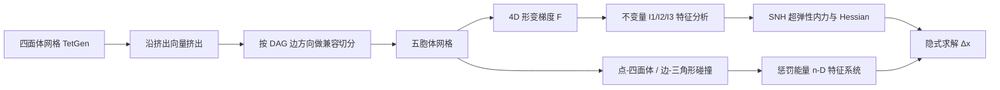

## 一句话总结

本文提出首个四维（4D）可变形物体仿真框架，把传统仿真流水线中的网格生成、弹性内力计算和碰撞处理全部推广到四维空间，并给出可延伸至任意 $$n$$ 维的形变与碰撞能量特征系统分析。

## 研究背景

- 领域现状：四维几何早已出现在艺术、可视化、感知、影视与 VR 领域，图形学此前的高维工作集中在高维物体的渲染与刚体仿真（如 ten Bosch 的 N 维刚体动力学），而三维可变形体仿真（四面体网格 + 超弹性应变能 + 碰撞处理）技术已相当成熟。
- 核心痛点：物理驱动的可变形仿真从未被推广到四维。四维形变需要一整套新的能力：可用的四维体网格、四维形变梯度与超弹性内力、以及四维下更细粒度的碰撞检测与响应，这些都缺乏成熟方法。特别是刚体的处理方式（只需 4D 惯性张量、允许多胞体重叠）不足以支撑形变。
- 本文 idea：逐个环节把三维流水线"升维"——用挤出填充法从成熟的四面体网格造出五胞体网格，把形变不变量推广到四维得到超维弹性力，并推导四维点-四面体、边-三角形碰撞的惩罚能量。所有特征分析进一步给出任意 $$n$$ 维的通用形式。

## 方法

整体框架：沿用与空间维度无关的隐式积分器求解 $$\left(M - h\frac{\partial f}{\partial v} - h^2\frac{\partial f}{\partial x}\right)\Delta x = h^2 f + h\left(M - h\frac{\partial f}{\partial v}\right)v_n$$ ，其中唯一需要"升维"的是内力 $$f$$ 及其导数的计算。方法沿三条主线展开：造网格、算内力、处理碰撞。

关键设计：

1. 挤出填充造五胞体网格。四维单纯形是 5 顶点的五胞体（pentachoron），没有现成网格也没有标准生成算法。作者先用成熟的 TetGen 生成高质量四面体网格，再沿一个第四维非零的挤出向量把它挤成"四维棱柱"，然后切分成五胞体。为保证相邻棱柱切面兼容，关键洞见是把每条边赋一个方向、只要这些方向构成有向无环图（DAG，用顶点序号做全序即可），切分就一定兼容且无需 Steiner 点。他们指出此前有人猜测这等价于 NP 完全的单色三角形问题，实际上只需构造 DAG 即可。若挤出向量过长会产生病态"瘦长"五胞体，导致形变梯度矩阵求逆灾难性失稳，因此把挤出拆成多步小位移完成。

2. 四维形变梯度与不变量。四维下 $$F \in \mathbb{R}^{4\times 4}$$ ，由五胞体的 5 个静止点与形变点构造边矩阵 $$F = D_s D_m^{-1}$$ 。以 Stable Neo-Hookean（SNH）能量 $$\psi_{\text{SNH}} = \tfrac{1}{2}\mu(I_2 - 4) + \tfrac{1}{2}\lambda(I_3 - \alpha)^2$$ 为例，用到的不变量 $$I_2 = \text{tr}(F^\top F)$$ 与 $$I_3 = \det(F)$$ 本身与维度无关。

3. 不变量特征分析与 $$n$$ 维推广。这是方法的理论核心。$$I_2$$ 的 Hessian 恒为 $$2I$$ ，$$n$$ 维下即 $$n^2$$ 个等于 2 的特征值。$$I_3$$ 需要先定义四维叉积（对三向量取行列式式展开得到第四个正交向量）与相应线性算子，再据此写出梯度与 Hessian；其 16 个特征对是三维结果的四维推广，分为扭转模、翻转模（特征值互为相反数）与拉伸模，并用 Jacobi 公式和伴随矩阵给出任意 $$n\ge 2$$ 的解析导数。$$I_1$$ 通过极分解 $$F = RS$$ 给出 $$(n^2-n)/2$$ 个非零特征对，使 ARAP 等各向同性能量也能写到 $$n$$ 维。作者声称已在最高 100 维数值验证这些假设成立。这些特征系统支持能量 Hessian 的特征钳制（eigenclamping），保证隐式求解正定。

4. 四维碰撞处理。维度 $$n$$ 下碰撞图元对数量等于把 $$n+1$$ 个点分成两个单纯形的方式数 $$\lceil n/2 \rceil$$ ：三维是点-面与边-边，四维则是点-四面体与边-三角形两类。两类都用越过距离阈值 $$\epsilon$$ 触发的弹簧惩罚能量（点-四面体带符号 $$s$$ 区分内外）。作者进一步用 Kronecker 积把点-单纯形、单纯形-单纯形的无符号距离 Hessian 分解为 $$ww^\top$$ 与投影矩阵 $$P$$ 两个子系统的特征系统之积，得到一个压缩模加若干正交屈曲模，从而对任意 $$n$$ 维惩罚能量都能靠符号判断加绝对值来滤波，避免数值特征求解。

## 实验结果

作者用 Chu 等的 GL4D 切片法可视化四维网格，用 TetGen 加挤出填充生成仿真网格，展示了旋转兔子、犰狳相拥、超维扭转、四维面条、悬臂梁等一系列此前从未见过的视觉现象。下面是补充材料性能表中各场景的规模与单帧耗时（在 2.9GHz Intel Xeon 上运行）：

| 场景 | 顶点数 | 五胞体数 | 核心数 | 单帧耗时 |
|------|--------|----------|--------|----------|
| 旋转兔子 | 7,235 | 76,176 | 16 | 6.27s |
| 犰狳相拥 | 18,819 | 205,920 | 12 | 24.5s |
| 外星人扭转 | 23,551 | 245,040 | 12 | 45.1s |
| 章鱼扭转 | 24,957 | 245,184 | 12 | 1:25 |
| 薄款拧绞 | 26,100 | 218,488 | 12 | 46.9s |
| 悬臂梁 | 17,589 | 262,144 | 12 | 14-15s |
| 四维面条 | 33,415 | 256,000 | 12 | 49.1s |

关键结论：碰撞处理在多数场景中主导了运行时间（即便已用 AABB 树与基础多线程），且随维度升高会更加主导。一个有趣的定量观察是四维空间的"体积直觉"会失效——长度 20、半径 1 的五根面条在半径 6 的四维半球里只填约 13% 空间，而三维同类情形约填 69%。旋转兔子实验还展示了四维特有的双独立平面旋转（如 $$yz$$ 与 $$wx$$ 平面同时旋转）。

## 亮点与局限

- 亮点：
  - 首个四维可变形体仿真器，系统性地把网格、内力、碰撞三大环节全部升维。
  - 挤出填充配 DAG 的造网格思路简单可靠，且证明所谓 NP 完全难题实为构造 DAG 的简单问题。
  - 形变与碰撞能量的特征系统不止解决 4D，而是给出任意 $$n$$ 维的通用解析形式，并数值验证到 100 维，理论贡献超出图形应用本身。
  - 特征系统支持无需数值特征求解的 Hessian 滤波，兼顾稳定性与效率。

- 局限：
  - 挤出填充生成的网格形态单一（"特定的样子"），更丰富形状需高阶 Delaunay 等替代方案。
  - 五胞体网格存在"维度诅咒"：需要大量顶点才能得到高分辨率网格，但多数顶点并不出现在最终可视化中；作者建议未来发展仅表面的四维边界元方法。
  - 未针对 4D 结构设计专门的碰撞检测或系统求解加速，仍有优化空间。

## 延伸思考

- 形变不变量是 $$F$$ 特征多项式的系数，维度更高时会出现更高阶不变量；本文 4D 下 SNH 用现有不变量即够，但新不变量的刻画留待未来。
- 作者指出既然形变方程与维度无关，Navier-Stokes 方程同样可推广到四维；构建四维流体仿真并与本文形变耦合，是产生更多新奇视觉的方向。可与本仓库中的高斯流体、四叉树高塔液体等三维流体工作对照思考升维的可行性。
- 该工作把大量三维弹性/碰撞的既有分析（Smith 等的解析特征系统、Shi 与 Kim 的统一惩罚碰撞能量）优雅地统一到 $$n$$ 维框架，对研究维度无关的仿真数值方法有参考价值。
