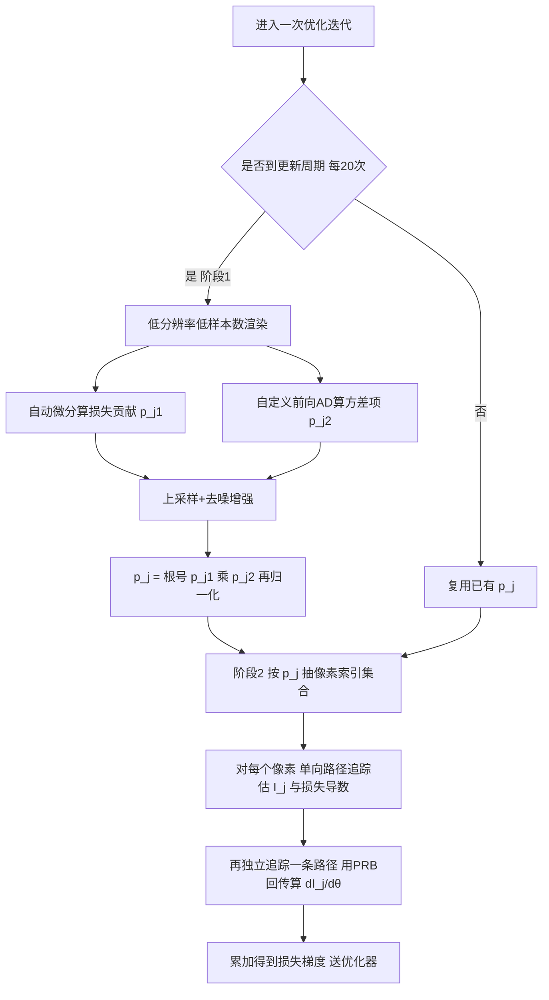

## 一句话总结

把"自适应采样"从前向渲染搬到逆向渲染的像素级 mini-batch 上：在每次优化迭代中只渲染一部分像素，并根据每个像素对损失的贡献以及其前向/微分渲染方差来分配采样概率，从而在同等时间预算下让梯度估计方差更低、逆向渲染收敛更快。

## 研究背景

逆向渲染以"分析即合成"的方式，把从图像恢复场景参数（材质、几何、光照、体积）建模成一个优化问题：寻找使渲染结果与目标图像之间损失最小的场景参数。可微渲染的进展让整个成像过程可以对场景参数求导，于是可以用 SGD、Adam 这类基于梯度的方法来求解。

问题在于计算开销。真实逆向渲染配置通常用很多张（如多视角）高分辨率输入图像，若每次迭代都渲染所有像素，无论计算时间还是显存都难以承受。业界普遍采用像素级 mini-batch 缓解：每次迭代只随机选一部分图像或像素来估计损失。但绝大多数现有管线在选像素时只用均匀采样。均匀采样虽然无偏、在很多情形下够用，却会让损失梯度的估计噪声很大，显著拖慢收敛。

作者的关键洞察是：逆向渲染时并不需要计算每个像素，通过有策略地分配样本，就能在降低渲染成本的同时提升整体性能。此前 Su 与 Gkioulekas 曾提出按 $$p_j \propto \vert (\partial_{\boldsymbol{I}} L)_j\vert $$ 分配，但这只考虑了损失对像素的导数，忽略了不同像素的微分渲染估计器均值/方差差异巨大这一事实，效果有限。

## 方法

### 整体框架

设场景由参数 $$\boldsymbol{\theta}$$ 控制，渲染图像 $$\boldsymbol{I}(\boldsymbol{\theta})$$ 含 $$m_I$$ 个像素，目标是最小化损失 $$L(\boldsymbol{I}(\boldsymbol{\theta}); \boldsymbol{I}_{target})$$。梯度按链式法则写成对像素求和：

$$\frac{dL}{d\boldsymbol{\theta}} = \sum_{j=1}^{m_I} (\partial_{\boldsymbol{I}} L)_j \frac{dI_j}{d\boldsymbol{\theta}}$$

由于每个 $$dI_j/d\boldsymbol{\theta}$$ 都要跑微分渲染，对所有像素求和代价高昂。于是用单样本蒙特卡洛（即 mini-batch）替代求和：以概率质量 $$p_j$$ 随机抽像素索引 $$j$$，得到估计器

$$\left\langle \frac{dL}{d\boldsymbol{\theta}} \right\rangle = \frac{\langle (\partial_{\boldsymbol{I}} L)_j \rangle}{p_j} \left\langle \frac{dI_j}{d\boldsymbol{\theta}} \right\rangle$$

方法的核心目标就是求出使该估计器方差最小的一组概率 $$p_j$$。

### 关键设计

**方差最优的采样概率。** 从最小化估计器二阶矩出发，用拉格朗日乘子法可得全局最优解。在参数为向量的一般情形下：

$$p_j \propto \sqrt{p_{j1}\, p_{j2}}, \quad p_{j1} := \mathbb{E}[\langle (\partial_{\boldsymbol{I}} L)_j \rangle^2], \quad p_{j2} := \sum_{k=1}^{m_\theta} \mathbb{E}\left[\left(\frac{\partial I_j}{\partial \theta_k}\right)^2\right]$$

$$p_{j1}$$ 刻画像素对损失梯度的贡献，$$p_{j2}$$ 刻画该像素微分渲染的二阶矩（方差信息）。作者指出，若假设 $$(\partial_{\boldsymbol{I}} L)_j$$ 已知且各像素二阶矩恒定，该式就退化为前人的 $$p_j \propto \vert (\partial_{\boldsymbol{I}} L)_j\vert $$，因此本方法是对既有方法的严格推广。

**近似计算而不破坏无偏性。** 精确算 $$p_j$$ 需要对所有像素做微分渲染，违背了 mini-batch 的初衷。关键观察是：$$p_j$$ 只用于抽样像素索引，只要保证 $$p_j>0$$，即使近似计算也不影响最终梯度 $$\langle dL/d\boldsymbol{\theta} \rangle$$ 的无偏性。于是阶段一用低分辨率、低样本数先估出 $$p_{j1}$$ 与 $$p_{j2}$$，再把它们当成图像，用现成的 OptiX 去噪器与 DLSS 做去噪和上采样来增强；并且每隔约 20 次迭代才重算一次 $$p_j$$，进一步摊薄开销。

**多分辨率建模。** 当场景里物体细节水平差异很大（如有纹理与无纹理物体混合）时，逐像素方差公式无法完全捕捉"同组参数控制的像素间相关性"，可能把过多样本分给低细节物体。作者引入可选步骤：在多个下采样层级 $$d=0,\dots,D$$ 上分别算概率再融合：

$$p_j := \sum_{d=0}^{D} 4^d \cdot p_{j_d, d}$$

这样某个下采样层级上受很多参数影响的粗像素会拿到较大权重，再传播回原分辨率的对应像素，提升高细节区域被采样的概率。

**高效自定义求导。** 计算 $$p_{j2}$$ 需要对每个像素求"偏导平方和"。朴素做法要对每个像素做反向 AD，不现实。作者利用 Dr.Jit 的前向模式函数 forward_to：其反向入队阶段一次性从所有 $$f_j$$ 反向遍历计算图找出梯度可流经的路径，前向遍历阶段沿各变量累积梯度。作者再定制一个版本，在前向遍历累加前先对每个叶节点梯度做平方，从而直接算出平方和。整套实现构建在路径重放反向传播（PRB）之上，兼容且省显存。

**两阶段梯度估计。** 阶段二按概率抽出像素索引集合后，对每个像素先用单向路径追踪估 $$I_j$$ 与损失导数 $$(\partial_{\boldsymbol{I}} L)_j$$，再独立追踪另一条路径、用 PRB 算 $$dI_j/d\boldsymbol{\theta}$$ 并累加进最终梯度。以 L2 损失为例 $$(\partial_{\boldsymbol{I}} L)_j = 2(I_j - I^{target}_j)$$，可仅凭 $$I_j$$ 估出损失导数。

## 实验结果

实现基于 Dr.Jit GPU 后端，用 Adam 优化器，覆盖 SVBRDF 重建、形状优化、逆向体渲染等多类问题，其中不少含复杂光传输效应。所有逆向渲染实验将每次迭代总样本预算设为约 100K 条光路，多分辨率深度 $$D=4$$，每 20 次迭代更新一次 $$p_j$$。比较在等时间条件下进行（每次迭代执行时间大致相等），单个实验总优化时长从 10 秒到 8 分钟不等（RTX 4090）。对比对象是两个基线：常数 $$p_j$$（均匀）与 $$p_j \propto \vert \partial_{\boldsymbol{I}} L_j\vert $$。

在"三个漫反射物体置于镜前、优化镜面粗糙度"的单次迭代方差实验中，固定粗糙度下反复评估梯度估计器 1024 次并统计方差，结果如下（方差越低越好）：

| 采样概率方案 | 损失梯度方差 $$V[\langle dL/d\boldsymbol{\theta}\rangle]$$ |
|------|------|
| $$p_j \propto \|\partial_{\boldsymbol{I}} L\|$$（前人方法） | 1.04 |
| 本方法 | 0.31 |

即相比 Su 与 Gkioulekas 的简单方案，本方法把方差降低了 3 倍以上。其余实验以定性收敛对比为主：在 JumpyDumpy 场景中对绝对 L2 与相对 L2 两种损失，本方法均优于均匀 mini-batch，体现对损失函数选择的鲁棒性；多分辨率方案让有纹理的 Catcake 与无纹理 TrashCan 联合优化时收敛更均衡；对采用可微 BSDF 采样的例子（Belhe 等的可微采样器），均匀采样因噪声大卡在初值不动，本方法则能顺利收敛。在 Dodoco、Pottery、Earth2Mars、Smoke 等材质/体积重建，以及 Earth、DodocoA、Bowl、Lego、DodocoB、Kirby（含形状优化，用 warped-area 采样与 large-step 更新网格）等更多例子中，等时间下本方法凭借更低的梯度方差均优于基线。

## 亮点与局限

亮点：把前向渲染里成熟的自适应采样思路系统性引入逆向渲染的像素级 mini-batch，且同时考虑损失贡献与微分渲染方差两方面，是对以往仅看损失导数方法的严格推广；借助"概率只用于抽样、近似不破坏无偏性"的观察，用低分辨率估计加去噪/上采样、并每 20 次迭代才更新一次，把额外开销压得很低；不改动底层的前向/微分渲染流程，可即插即用；多分辨率建模巧妙处理了细节水平不均的场景；配合 Dr.Jit 前向 AD 与 PRB 给出省显存的高效实现。

局限（作者自述）：一是方法假设单向路径追踪，对需要伴随法或双向方法的场景（如强焦散效应）不适用，此时估出的 $$p_j$$ 会不可靠，除非用不切实际的高样本数；把技术推广到路径空间等更复杂采样策略是重要的后续方向。二是对 LPIPS 这类复杂损失，如何高效估计 $$(\partial_{\boldsymbol{I}} L)_j$$ 仍待探索——当前依赖"仅凭 $$I_j$$ 即可算出损失导数"的假设，这在 L2 损失下成立，但一般损失并不成立。

## 延伸思考

这项工作把"方差感知"这条主线从前向渲染、可微渲染一路延伸到了逆向渲染的采样调度层。它与作者团队此前"对方差求导"（Differentiating Variance）的工作正好互补：那里是求方差的导数，这里是估计导数的方差再据此分配采样，两条路都指向同一个目标——让梯度更省更准。由于它不触碰底层渲染算法、只在像素采样这一层做文章，理论上可以和多重重要性采样、路径引导、可微 BSDF 采样等既有方差缩减手段叠加。一个自然的追问是：既然像素级 mini-batch 可以自适应，视角级/图像级的选择（多视角输入下选哪几张图渲染）是否也能用同一套方差最优框架统一处理，从而在大规模多视角重建里进一步省算力。
