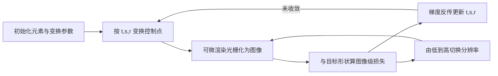

## 一句话总结

把传统上在"物体空间"里求解的图形拼贴与打包问题搬到"图像空间"，借助可微渲染器用图像级损失来优化元素布局，从而以固定复杂度处理任意形状，并比现有方法快一个数量级。

## 研究背景

- 领域现状：拼贴（collage）与打包（packing）是把一组几何形状组织进目标区域的经典技术，广泛用于圆形填充图、词云、照片拼贴等视觉设计。绝大多数已有方法在物体空间（object space）中优化，把拼贴建模成几何约束满足问题。
- 核心痛点：物体空间方法需要为形状精心设计几何描述子与能量函数。这带来三个问题：其一，减少两个形状的重叠往往要刻画各自的边界描述子，形状需要细致分析；其二，描述子泛化性差，有的方法只能处理带曲率的闭合形状、有的只能填凸边界容器；其三，优化开销随物体数量和复杂度快速增长，规模化困难。
- 本文 idea：主张一次范式转移，把几何打包优化从物体空间迁移到图像空间。核心是把几何表示及其空间关系投影到像素网格上，网格的复杂度是固定且与物体无关的。再借助可微渲染，让梯度能从图像级损失反传到几何物体的变换参数，从离散的图像空间来驱动整个拼贴优化。

## 方法

整体框架：给定拼贴容器 $$C$$ 和一组二维几何元素 $$G=\{g_1,\dots,g_n\}$$，每个元素带有平移、缩放、旋转三类可调变换参数。每一轮迭代里，元素先按变换参数作用到其控制点上，再由可微渲染器光栅化成图像 $$\hat I$$；同时把容器光栅化成目标图像 $$I_C$$（内部黑、外部白）。在图像空间计算一组损失，梯度反传回变换参数并用梯度下降更新，如此迭代直到布局收敛。整个过程在由低到高的多档分辨率上进行。

关键设计分为四部分：

1. 统一的向量表示与可微渲染。任意形状的二维元素都用 $$N$$ 条三次贝塞尔曲线围成的闭合区域表示（文中取 $$N=20$$ 平衡效率与精度），通过可微渲染拟合到元素轮廓。光栅化被看作从向量图参数 $$\Theta$$ 到像素网格的场景函数 $$I(x,y;\Theta)$$，可微渲染让这个映射对 $$\Theta$$ 可导，从而支持从图像域到向量图域的反传。作者采用 Li 等人的可微向量图渲染方法，其思想是抗锯齿后像素颜色变得连续因而可微。

2. 图像级损失，服务两个基本约束。形状包含用带空间惩罚掩码的加权均方误差（WMSE）：把元素渲成黑白图，掩码 $$W$$ 对目标区域内的像素差异只给小惩罚（权重 1），对区域外的差异给大惩罚（权重 100），鼓励元素铺满目标形状且不越界，形式为 $$L_{\text{containment}}=\frac{1}{w\cdot h}\,W\odot\lVert \hat I_{b\&w}-I_C\rVert^2$$ 。非重叠约束在图像空间检测很直接：以固定透明度 $$\tau$$ 渲染所有元素，统计透明度偏离 $$\tau$$ 的像素数即为重叠区域，无需任何几何计算。

3. 均匀分布损失。仅有前两项会出现分布不均。作者用可微图像膨胀（一系列带宽递增的卷积核，起始 5 像素、每步加 6 像素）近似距离场，对容器内未被占据区域的像素按核带宽加权求和：带宽越大的膨胀标记越大的空隙、被赋予越高权重，从而优先压缩大空洞、逼近均匀分布。总损失为 $$L=\alpha L_{\text{containment}}+\beta L_{\text{overlap}}+\gamma L_{\text{uniform}}$$ ，其中权重取 $$\alpha=3\mathrm{e}3$$、$$\beta=8\mathrm{e}4$$、$$\gamma=5\mathrm{e}{-4}$$。

4. 层级分辨率策略与初始化。图像分辨率在损失精度与计算成本之间权衡：低分辨率算得快但对重叠、包含的判定粗糙，高分辨率精细但昂贵。于是采用由粗到精的层级策略，从 50×50 起步做大胆的整体调整，逐步升到 600×600 做精细修饰。初始化用中轴变换（MAT）提取目标形状骨架并计算中轴宽度，把较大元素放到中轴宽度更大的位置，实现形状内的均匀铺放，对管状、颈部等形状尤其有效；方法对较差的初始化也具鲁棒性。

在此基础上方法还能自然扩展：引入吸引/排斥力源作为额外损失，实现向心或向下重力式打包、开放区域填充；渐进优化过程本身会产生"下落""扩张"等动画效果；文字被当作特殊几何形状即可生成词云；还支持单元可视化（每个元素编码一个数据项，尺寸做面积编码）。

## 实验结果

主实验是与三个基线（ShapeWordle、PAD、ShapeCollage）在六个目标形状上的定量对比，用三项指标：布局覆盖率 LC（越大越好）、物体重叠 OO（越小越好）、越界面积 EA（越小越好）。

| 示例（对比方) | 方法 | 覆盖率 LC↑ | 重叠 OO ↓（×10⁻³) | 越界 EA ↓（×10⁻³) |
|------|------|------|------|------|
| Flower（ShapeWordle) | 基线 | 0.25 | 0 | 0 |
| Flower | 本文 | 0.28 | 0 | 0 |
| Leaf（ShapeWordle) | 基线 | 0.18 | 0 | 0 |
| Leaf | 本文 | 0.29 | 0.02 | 0 |
| Letter P（PAD) | 基线 | 0.94 | 33.83 | 7.17 |
| Letter P | 本文 | 0.80 | 0.14 | 0 |
| Australia（PAD) | 基线 | 0.91 | 55.30 | 21.84 |
| Australia | 本文 | 0.75 | 0.30 | 0 |
| Moon（ShapeCollage) | 基线 | 0.67 | 41.44 | 18.31 |
| Moon | 本文 | 0.86 | 0.09 | 0 |
| Fish（ShapeCollage) | 基线 | 0.67 | 40.04 | 7.86 |
| Fish | 本文 | 0.87 | 0.08 | 0 |

结论：相较 ShapeWordle 与 ShapeCollage，本文在覆盖率上全面更优且分布更均匀、重叠与越界都大幅更低。相较 PAD，PAD 在 Letter P、Australia 上布局更紧凑、覆盖率更高，但重叠和越界严重得多；本文以极小的重叠/越界换取略低的覆盖率，整体更干净。

效率方面提升尤为突出：在约 100 个元素的例子上，本文约 6 分钟完成，而 PAD 需超过 700 分钟；Minkowski Penalty 因排布约束对的 $$O(n^2)$$ 复杂度，随元素增多耗时显著变长。消融实验还表明：去掉均匀损失会留下明显空隙、布局非均匀度上升；层级分辨率策略（如 50+200+600）能在保持较低耗时的同时取得有竞争力的质量，200 轮优化耗时约 20.74 秒，明显低于恒定 600×600 的 32.54 秒。

## 亮点与局限

- 亮点：
  - 范式转换清晰有力，把形状相关的复杂几何描述子替换成与物体无关、固定复杂度的图像级损失，天然适配任意形状（含开放形状、凹形、条形块）。
  - 层级分辨率带来数量级的加速，可扩展性远好于物体空间方法。
  - 框架高度通用：力场吸引、动画效果、词云、单元数据可视化都能以"加一项图像损失"的方式统一接入；渐进优化顺带产出平滑动画。
  - 重叠、越界指标显著优于基线，布局更干净均匀。

- 局限：
  - 与 PAD 相比，追求紧凑覆盖率时略逊，本文更偏"低重叠低越界"的取舍。
  - 和所有迭代优化一样会陷入局部极小：小元素被完全包进大元素时会被"阴影困住"而停滞。
  - MAT 初始化只验证了一种方案，对"圆肚子"类形状并非最优。
  - 缺乏针对物体属性（如平衡、和谐）的精细控制，这正是物体空间方法的长处。

## 延伸思考

作者指出的几个方向都值得追问：一是把图像空间与物体空间做混合，用物体空间损失补上对空间关系与物体属性的精细控制；二是结合文生图基础模型做文本驱动的拼贴编辑，以及交互式的目标图像编辑系统；三是自适应的元素初始化，根据目标形状的几何特征自动建议初始基元。更广地看，"把结构化布局问题投影到可微图像域再反传优化"这一思路，与可微向量图形、SVG 生成、排版设计等方向相通，图像级损失的即插即用特性也让它有望承载更多设计约束（美学、语义、显著性）。局部极小问题或可借助全局监控式的"牧羊人"算法来缓解。
