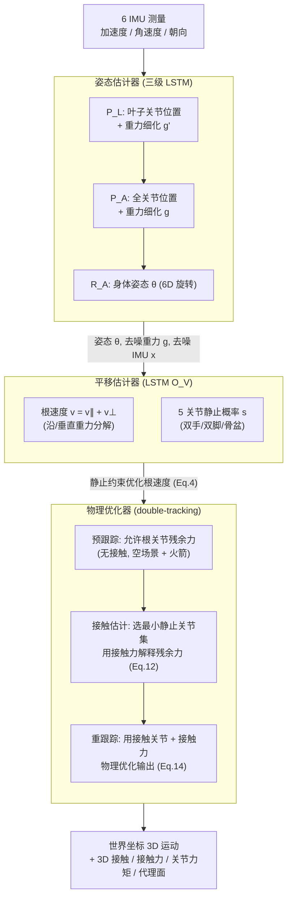

## 一句话总结

只用 6 个 IMU，就通过"重力先验 + 3D 接触物理优化"把稀疏惯性动捕从被绑死在平地上的 2D 平移、且全局朝向长期漂移的困境中解放出来，实现了不受地面约束的真正 3D 全局运动重建，同时顺带估计出 3D 接触、接触力、关节力矩和交互代理面。

## 研究背景

基于稀疏惯性测量单元（IMU）的动作捕捉近年借助深度学习取得进展：仅在前臂、小腿、头、骨盆佩戴 6 个传感器，靠学到的人体姿态先验就能从稀疏、含噪的信号里恢复全身姿态。相比视觉方法，它不受遮挡与固定拍摄空间限制，也比 Xsens 这类密集阵列便宜、少侵入。

但真正的痛点在"全局 6 自由度运动"（全局平移 + 全局朝向）。局部姿态先验能对局部姿态去噪，却几乎帮不上全局运动：

- **全局平移**：以往方法（如 PIP、PNP）用地面接触把人约束在一个 2D 地平面上，因此无法捕捉上楼、躺床这类真正的 3D 空间移动，尤其是竖直（z 方向）运动。
- **全局朝向**：大多数方法直接依赖根关节 IMU 的朝向测量，长时间跟踪会累积漂移。

作者的判断是：数据驱动（学局部先验）无法有效对全局运动去噪，应该引入**物理**来解决。由此提出一个从物理视角设计的稀疏 IMU 动捕框架，既能做无约束 3D 空间平移估计、又能提升全局朝向精度，还顺带产出 3D 接触、接触力、关节力矩、代理面等物理量。

两个核心观察支撑整套方法：

1. **接触可从运动反推**：看到一个人向上走，我们自然假定脚下有台阶——因为支撑力必须存在以防跌倒，且支撑力更可能作用在静止的脚上。据此可以设计算法反推 3D 接触。
2. **重力与局部姿态强相关**：在重力对齐坐标系里，人绕重力轴的朝向（heading $\theta$）与局部姿态无关，但反映身体倾斜的那部分朝向（$\phi$）被局部姿态强约束。一个平躺的人不可能摆出走路的姿态。因此"根坐标系下的重力方向"是这部分朝向的可靠指示量。

## 方法

系统由三个模块串联：姿态估计器（估局部姿态与全局朝向）、平移估计器（估根速度与静止关节）、物理优化器（识别 3D 接触并做物理优化）。此外还有一套走步标定方法。

### 关键设计一：重力感知的姿态估计

姿态估计器基于 PNP，核心改进是把重力信息织进网络。输入除了根相对 IMU 测量 $\boldsymbol{x}''$，还加入根坐标系下的重力方向 $\boldsymbol{g}''$，它由根 IMU 测得的全局朝向算出：

$$\boldsymbol{g}'' = (\boldsymbol{R}''_{root})^T \boldsymbol{g}_M$$

其中 $\boldsymbol{g}_M$ 是世界坐标下的重力方向，上标撇号越多表示噪声越大。三级 LSTM（$P_L$ 叶子关节位置、$P_A$ 全关节位置、$R_A$ 姿态）在每一级都额外输入重力方向、并让网络同时输出细化后的重力作为副产物，从而学到局部姿态与全局朝向的联合先验分布。

去噪的巧妙之处：重力在世界坐标下恒定，但换到不同的根坐标系里表现不同。通过对齐重力方向来反推、修正根坐标系朝向。每级根据细化后的重力更新全局朝向：

$$\boldsymbol{R}'_{root} = \boldsymbol{R}''_{root}\,\mathcal{R}\{\boldsymbol{g}' \to \boldsymbol{g}''\}$$

即用把 $\boldsymbol{g}'$ 以最小角度旋到 $\boldsymbol{g}''$ 的旋转矩阵去修正朝向，逐级把根朝向越修越准。消融显示：只输入不细化重力反而更差（原始重力太噪，网络用不好），细化后才拿到最佳结果。

### 关键设计二：重力感知的平移估计

平移估计器（一个 LSTM $O_V$）输入去噪后的 IMU、重力、姿态 $\boldsymbol{\theta}$ 及其前向运动学关节位置，输出：根速度沿重力方向与垂直重力方向的两个正交分量 $\boldsymbol{v} = \boldsymbol{v}_{\parallel} + \boldsymbol{v}_{\perp}$（沿重力分量只预测大小，方向已由重力给出），以及双手、双脚、骨盆 5 个关节的静止概率 $\boldsymbol{s}$。这种分解符合直觉：躺下的人即便姿态相同也不会像站着那样自由移动，而竖直方向的移动通常比水平移动受限更多。

随后沿用 TransPose 的静止约束优化根速度：

$$\min_{\tilde{\boldsymbol{v}}^t} \|\tilde{\boldsymbol{v}}^t - \boldsymbol{v}^t\|^2 + \sum_i s_i \frac{1}{\Delta t^2}\|\mathrm{FK}_i(\boldsymbol{\theta}^t, \tilde{\boldsymbol{v}}^t \Delta t) - \mathrm{FK}_i(\boldsymbol{\theta}^{t-1})\|^2$$

即在"尽量让静止关节保持不动"和"尽量贴近估计速度"之间求折中。

### 关键设计三：3D 接触与 double-tracking 物理优化

以往物理优化假设平地，无法处理上楼，也无法处理坐下这类髋部接触（只能给根关节施加不物理的巨大残余力来维持平衡）。作者用 double-tracking 把它扩展到 3D 空间。

物理模型是力矩控制的浮动基座角色，骨架与自由度和 SMPL 一致，质量/质心/惯量按密度 1000 kg/m³ 从 SMPL 平均体型提取。不含接触力时遵循运动方程：

$$\boldsymbol{\tau} = \boldsymbol{M}(\boldsymbol{q})\ddot{\boldsymbol{q}} + \boldsymbol{h}(\boldsymbol{q}, \dot{\boldsymbol{q}})$$

考虑接触力 $\boldsymbol{\lambda}$ 时：

$$\boldsymbol{\tau} + \boldsymbol{J}^T\boldsymbol{\lambda} = \boldsymbol{M}(\boldsymbol{q})\ddot{\boldsymbol{q}} + \boldsymbol{h}(\boldsymbol{q}, \dot{\boldsymbol{q}})$$

三个阶段：

- **预跟踪**：让物理角色在"空场景"里无接触地跟踪参考运动，允许根关节施加任意残余力（形象地说，给角色根部装了一个能提供任意外力的火箭）。用双 PD 控制器算出期望加速度，再解一个带正则的最小二乘求所需力矩 $\boldsymbol{\tau}$。真正关心的是力矩前 6 维 $\boldsymbol{\tau}_{:6}$，即本该由物理接触解释的根关节残余力/力矩。

- **接触估计**：先按规则（被判静止 + 上一帧接触或当前触地）标出接触关节，其余静止关节为候选。然后求解最小接触力去解释残余力：

$$\min_{\boldsymbol{\lambda}} \|(\boldsymbol{J}^T\boldsymbol{\lambda})_{:6} - \boldsymbol{\tau}_{:6}\|^2 + \beta_{\lambda}\|\boldsymbol{\lambda}\|^2, \quad \text{s.t. } \boldsymbol{\lambda} \in \text{friction cone}$$

  脚和骨盆施加库仑摩擦锥约束（假设接触面法向朝重力反方向），手则一般不加（可抓握物体、允许任意外力）。若残余误差 $\boldsymbol{e} = \boldsymbol{\tau}_{:6} - (\boldsymbol{J}^T\boldsymbol{\lambda})_{:6}$ 超过阈值，就按离地由近到远逐个加入候选接触关节重解——加入某关节使残余力下降过半才接受。这一步等价于"卸掉火箭，换成作用在被选接触关节上的力"。它按力来判接触：只是轻轻搭在台阶上、重心仍在另一只脚，则不算接触；一旦重心压上去，才被识别为维持平衡所必需的接触。

- **重跟踪**：用估出的接触关节与接触力，把接触点向地面轻拉以防浮空/穿透，再解一个带接触力运动方程约束的优化（更大的力矩正则 $\beta^*_{\tau} = 3\beta_{\tau}$），得到驱动角色的力矩 $\boldsymbol{\tau}^*$ 与加速度，最终积分更新并输出物理优化后的平移与姿态。

### 关键设计四：走步标定

传统标定要先脱下所有 IMU 摆同一朝向校相对漂移、再穿上摆 T-pose 定传感器到骨骼的旋转，两步繁琐易错。本方法只需向前迈一标准步：对每个 IMU 的全局加速度双重积分得到位移，配合零速更新（ZUPT）在结束站定时用零速观测修正积分误差；再借助"位移应水平（与重力正交）"的约束进一步校正。若各 IMU 因磁干扰产生朝向漂移，其轨迹会发散，通过把前五个 IMU 的轨迹对齐到第六个即可算出相对朝向误差 $\boldsymbol{R}_i = \mathcal{R}\{\bar{\boldsymbol{p}}_i \to \bar{\boldsymbol{p}}_6\}$，同时定出全局外参旋转与传感器到骨骼旋转。一步走完，同时完成去漂移与定旋转。

## 实验结果

训练用合成 IMU 的 AMASS + 真实 IMU 的 DIP-IMU（先在 AMASS 训、再在 DIP-IMU 微调）。测试集包括 TotalCapture（两套标定：官方标定 IMU 朝向误差约 12.1°，DIP 标定约 8.6°）、DIP-IMU、Xsens 系列（AnDy/CIP/UNIPD）、以及大规模长时序 Nymeria。系统在 i9-13900KF + RTX 4090 上实时 120 fps 运行，实机 demo 用 Noitom Lab 传感器以 60 fps 跑。对比方法有 DIP、TransPose、TIP、PIP、PNP、DynaIP（三个版本）。

姿态精度上，方法在 TotalCapture 与 DIP-IMU 上总体领先。以 TotalCapture 官方标定为例（局部 / 全局 SIP 误差、角度误差、位置误差 cm、Mesh 误差）：

| 方法 | 局部 SIP | 局部 Pos | 全局 SIP | 全局 Pos | Root Jitter | Joint Jitter |
|------|---------|---------|---------|---------|-------------|--------------|
| TransPose | 18.12 | 7.10 | 17.72 | 7.27 | 1.77 | 1.95 |
| TIP | 15.62 | 6.76 | 17.26 | 9.06 | 1.24 | 1.74 |
| PIP | 14.52 | 6.22 | 14.11 | 6.61 | 0.12 | 0.21 |
| PNP | 11.35 | 4.89 | 13.95 | 7.37 | 0.16 | 0.27 |
| DynaIP-AD | 26.12 | 7.60 | 25.43 | 7.72 | - | - |
| Ours | 10.17 | 4.31 | 10.87 | 4.31 | 0.21 | 0.37 |

全局指标提升尤为显著（官方标定下全局 SIP 从 PNP 的 13.95 降到 10.87，全局位置误差从 7.37 降到 4.31 cm），说明重力细化对削减全局朝向误差很有效。DIP-IMU 上 DynaIP 的角度误差略优，但其跨数据集泛化明显更差。Jitter 与 PIP、PNP 相当，远好于不含物理的 TransPose、TIP。

平移方面，TotalCapture 是平地录制、TransPose/PIP/PNP 都吃平地假设，而本方法不依赖平面假设却仍取得更低漂移，官方标定下噪声更大时优势更明显。Xsens 数据（Tab.2）上，AnDy 平移漂移从 PNP 的 4.04% 降到 3.30%，CIP 从 5.63% 降到 4.80%，全局位置误差全面更低。Nymeria（Tab.3）长时序上全局位置误差从 PNP 的 8.03 cm 降到 7.01 cm。

消融（Tab.5，TotalCapture 平移漂移，OC 官方标定 / DC DIP 标定）：

| 配置 | OC 漂移 | DC 漂移 |
|------|--------|--------|
| w/o Physics | 7.51% | 4.35% |
| w/o Contact | 6.09% | 4.36% |
| Ours | 4.68% | 3.74% |

去掉物理优化或接触估计都会让漂移变大，官方标定（噪声大）下受益最明显。姿态消融（Tab.4）显示：只输入不细化重力（w/o Grav Recon）反而比完全不用重力（w/o Grav Input）更差，原始重力太噪，细化后才最优。

长时序抗漂移（Tab.6，Nymeria 20 分钟户外羽毛球序列，全局关节位置误差 cm）：三段（Period 1/2/3）本方法为 6.18 / 6.52 / 6.38，PNP 为 7.30 / 7.41 / 8.23——PNP 随时间增大而本方法无明显漂移。走步标定用户研究：100 次评测中走步标定被偏好 72%，T-pose 12%，16% 相当。

## 亮点与局限

亮点：

- 把"数据驱动局部先验"与"物理驱动全局约束"深度融合，抓住了稀疏 IMU 动捕最难啃的全局 6DOF 运动问题，思路清晰且对症。
- 重力先验的双向利用很巧：既用重力方向辅助局部姿态回归，又用局部姿态反过来对根 IMU 的全局朝向去噪，把长期朝向漂移压下去。
- double-tracking 用"残余力必须由接触力解释"来反推最小接触集，摆脱了平地假设，能处理上楼、坐下等真 3D 场景，还免费产出接触力、关节力矩、代理面等物理量，拓宽了 IMU 动捕的应用边界（机器人、HCI）。
- 走步标定把繁琐两步压成一步，工程实用性强。

局限（作者自陈）：

- **缺 3D 空间运动数据**：AMASS、DIP-IMU 里带高度变化的运动（如上楼）有限，影响竖直平移精度。
- **接触关节受限**：只估双手、双脚、骨盆的静止概率，像头靠墙这类接触无法识别。
- **代理面与接触假设**：基于力识别接触，滑动接触或极轻接触建模不准；假设代理面水平，倾斜面估不了；很小的高度变化（踩薄块）也难以捕捉。
- **多接触受力歧义**：多接触时力分配本质多解，靠正则（最小力矩/接触力）软约束求"最省力"解，不总唯一。

## 延伸思考

- 全局朝向去噪的关键假设是"局部姿态与重力方向存在联合分布"，本质是把姿态先验从局部扩展到"局部姿态 + 倾斜朝向"的联合先验。这一思路是否可迁移到单目视觉动捕、或 VR 头手三点跟踪的下肢补全？GVHMR 已在视觉侧用重力感知世界坐标，本文反向把重力搬进根坐标系以获得 heading 不变性，两条路线的融合值得探索。
- 接触"按力判定"是个漂亮抽象，但也解释了它对轻接触/滑动接触的盲区。若把接触概率的数据先验与物理残余力反推做成端到端可微，是否能缓解阈值化规则带来的脆弱性？
- 竖直平移精度受限根源在训练数据缺乏高度变化运动，说明该方法目前更多靠物理约束"过滤"而非"生成"竖直运动。引入更多含台阶/攀爬的合成或真实 IMU 数据，或用可控运动生成补数据，可能是下一步高性价比的提升点。
