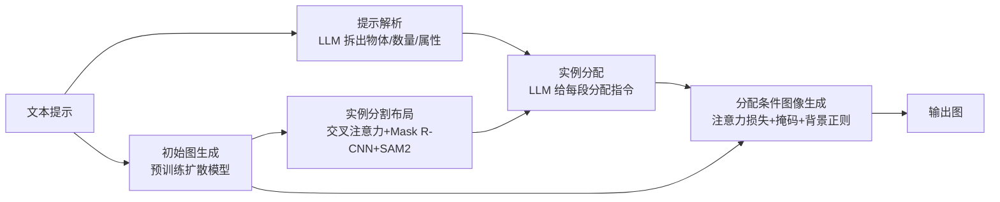

## 一句话总结

InstanceGen 是一种免训练的推理期文本到图像方法：先用预训练扩散模型生成一张初始图，从中抽取细粒度的实例分割布局，再让大语言模型为每个分割块分配实例级指令，最后通过注意力优化重新生成，使图像精确满足复杂提示中的物体数量、实例级属性和空间关系。

## 研究背景

- 领域现状：SDXL、Flux、Emu 等扩散模型在图像质量和文本一致性上持续进步，但面对"多物体 + 各自属性 + 空间关系"这类复合提示时仍力不从心。
- 核心痛点：现有可控生成方法多依赖粗糙的边界框布局——要么需要用户手动提供，要么由大语言模型生成。大语言模型生成的边界框往往不真实、不精确，而且框内区域语义模糊，给图像模型的结构信号很弱，导致物体与属性错配、数量出错。
- 本文 idea：与其用粗边界框，不如利用扩散模型自己生成的初始图作为"更精确、更真实"的结构锚点。作者从初始图中抽取实例级分割，把它交给大语言模型做实例级属性分配，再用注意力优化把这些指令落实到最终图像上，全程无需额外训练或用户输入。

## 方法

整体框架分三步：先用预训练扩散模型生成初始图并抽取细粒度实例分割布局；再把布局以文本形式喂给大语言模型，为每个分割块分配物体词与实例级属性（或标记删除）；最后在"分配条件图像生成"阶段用注意力损失、注意力掩码和背景保持正则重新采样，得到忠实于提示的输出图。

关键设计：

1. **细粒度实例分割布局**：初始图生成时会产出提示词与图像间的交叉注意力图。作者取聚合注意力图的局部极大值作为"锚点"（经验上每个实例至少产生一个锚点），用锚点筛掉无效分割并引导补全。分割本身融合两个现成模型——Mask R-CNN 倾向于分出完整实例但词表有限会漏检，SAM2 基于关键点分割但易把一个物体过度切成部件；两者结合既保证完整又不遗漏。每个分割块还会按其内部像素平均得到各物体词/属性词的注意力分数，连同大小、位置写成 json 供下游使用。

2. **鲁棒初始化的种子搜索**：如果初始布局的分割块数量不足以表达提示所需物体数（如需要六个但只分出四个），就换随机种子重生成，最多重试五次；五次仍不够时，随机复制已有实例掩码到背景空位补足。

3. **大语言模型实例分配**：LLM 接收提示、解析后的 json 和分割 json，为每个块分配"删除"或某个物体词，并可选地叠加实例级属性（如"正在挥手"）。它带一个主目标（输出正确表达提示的布局）和一个次目标（让输出与初始图的视觉差异尽量小，以保留初始图的良好构图）。在无空间约束时，LLM 倾向把物体/属性分给注意力分数最高的块，从而与初始图最吻合。分配还带上下文示例，若检测到错误（数量不对、给删除块分了属性等）会把错误当负例再调用一次。

4. **分配条件图像生成**：保留非删除块的二值掩码后，修改反向扩散过程施加三类约束——物体注意力损失用加权二元交叉熵把物体词的交叉注意力约束到对应分割块（前景权重 $$\lambda_i=1.5$$）；属性注意力损失改用简单交叉熵鼓励属性出现在指定块，避免像物体那样约束反而损害画质；注意力掩码则把物体/属性词在未分配块的注意力压低（$$\delta=-1.5$$），并配合自注意力的前景背景隔离，抑制语义泄漏。此外用背景保持正则 $$L_{bg}$$ 让优化图与初始图在背景潜变量上相似。总损失为 $$L = L_{obj} + \lambda_{att} L_{att} + \lambda_{bg} L_{bg}$$，其中 $$\lambda_{att}=0.8$$、$$\lambda_{bg}=0.3$$。

## 实验结果

作者提出了 CompoundPrompts 基准（540 条提示，分三档难度：A 只含物体计数，B 增加实例级属性，C 再加空间关系），用 GPT-4o 回答配套的是非题得到 VQA Acc（须全部问题答对才算命中），并用 VQAScore 得到 VQA Sim 衡量整体图文一致性。下表为 CompoundPrompts 主实验：

| 方法 | VQA Acc A↑ | VQA Acc B↑ | VQA Acc C↑ | VQA Acc 均值↑ | VQA Sim↑ |
|------|------|------|------|------|------|
| 本文 | 0.72 | 0.57 | 0.50 | 0.60 | 0.89 |
| Emu（基线） | 0.59 | 0.40 | 0.30 | 0.43 | 0.86 |
| Flux1-dev | 0.58 | 0.37 | 0.38 | 0.44 | 0.85 |
| SDXL | 0.42 | 0.18 | 0.11 | 0.23 | 0.78 |
| AttentionRefocusing | 0.63 | 0.13 | 0.07 | 0.27 | 0.68 |
| SLD | 0.44 | 0.14 | 0.07 | 0.21 | 0.76 |
| CountGen | 0.45 | 0.18 | 0.10 | 0.24 | 0.75 |

在 A 档各方法接近，但一旦进入含属性的 B 档和含空间关系的 C 档，本文优势明显拉开，说明竞品在实例级属性与空间安排上普遍吃力。在 DrawBench 上，本文的计数 F1 达到 0.91、空间准确率 0.67，同样领先所有基线（含其基线 Emu）。消融显示各组件都有贡献：注意力掩码对 C 档空间准确性影响最大，背景正则 $$L_{bg}$$ 对 VQA Sim（画质与合理性）影响显著，而种子搜索并非性能提升的主因。

## 亮点与局限

- 亮点：
  - 免训练、免额外用户输入，纯推理期方法，可直接叠在现有扩散模型上。
  - 用"模型自生成的初始图"替代粗糙边界框，提供更真实、更精确的结构锚点，这是核心洞见。
  - 图像信号（分割布局）与文本信号（LLM 实例指令）互补结合，专门攻克数量、属性、空间关系三类复合难题。
  - 贡献了 CompoundPrompts 分档基准，为后续复合提示评测提供资源。
- 局限：
  - 流程较重，串联了扩散生成、交叉注意力抽取、Mask R-CNN 与 SAM2 双分割、LLM 多轮分配、注意力优化多个环节，推理成本与工程复杂度较高。
  - 依赖初始图能提供足够且合理的实例；种子搜索最多五次，失败时靠随机复制掩码补足，属兜底手段。
  - 严重依赖 LLM（Llama 3.3）分配的正确性与 MLLM（GPT-4o）评测，正文未含独立的局限性小节（作者置于补充材料）。

## 延伸思考

- 该方法与 CountGen、Bounded Attention、SLD 等"注意力/布局引导"路线一脉相承，区别在于把结构先验从人工边界框升级为模型自生成的细粒度分割，值得思考这种"用生成模型自身产物做引导"的思路能否推广到视频、3D 等生成任务。
- 双分割（Mask R-CNN + SAM2）与锚点机制是解决"同一物体词多实例"分割的实用技巧，可迁移到需要实例级控制的其他编辑/生成场景。
- 随着基础文本到图像模型自身提示遵循能力增强，这类推理期纠偏方法的边际收益如何变化，是一个值得持续追问的问题。
