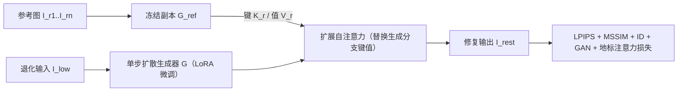

## 一句话总结

InstantRestore 用一个单步扩散模型加上"共享图像注意力"机制，在一次前向传播里（约 0.5 秒）完成个性化人脸修复，无需针对每个身份做微调，就能借助少量参考图恢复出高保真、身份一致的高清人脸。

## 研究背景

- 领域现状：人脸修复要从模糊、噪声、压缩、降采样等退化图像里恢复高清人脸。近年方法多借助 GAN 或扩散模型的生成先验，能产出位于自然图像流形上的合理结果。为提升身份保真，出现了以参考图引导的个性化方法（如 PFStorer、Dual-Pivot Tuning、MyStyle）。
- 核心痛点：一是通用修复模型（GFPGAN、CodeFormer、DiffBIR 等）在严重退化下难以还原身份专属细节（眼睛颜色、胡须、痣、皱纹等），常生成"看起来对但不是本人"的结果；二是现有个性化方法需要对每个身份微调专门模型，训练动辄一小时、推理约 11 秒，计算开销大、难以规模化；三是多步扩散模型从纯噪声起步，中间预测带噪，难以直接施加基于图像的监督（如身份损失）。
- 本文 idea：把修复问题重新表述为"用退化输入自身定义输出结构、再从参考图里检索并填补缺失的身份细节"。既然退化图已经给出了大致结构，就不必从噪声重新生成整张图，因此一次前向即可完成。作者利用自注意力隐式编码的跨图语义对应关系，让退化图的"查询"去参考图里找最相关的"补丁"，把身份信息迁移过来。

## 方法

整体框架：以预训练的单步扩散模型 Stable Diffusion Turbo 为骨干，通过 LoRA 适配器微调，直接把低质图 $$I_{low}$$ 映射为修复结果 $$I_{rest}$$。同时用一个冻结的模型副本 $$G_{ref}$$ 从约 4 张参考图中抽取自注意力的键与值，替换生成分支 UNet 解码器里的键值，从而把身份信息注入修复过程。因为是单步前向，训练时可以直接对输出图施加基于图像的损失。

关键设计：

1. **单步像素空间修复（是什么/为什么/怎么做）**：传统个性化修复用多步扩散 + 扩散损失（预测噪声与真实噪声的差异）。本文改为在像素空间直接学习映射，微调 SD-Turbo 让 $$I_{low}$$ 一步到 $$I_{rest}$$。这样做的好处是可以直接对输出施加显式的图像级监督。架构上对 VAE 和 UNet 加 LoRA、并微调 VAE 第一层卷积，CLIP 文本编码器冻结、使用固定文本提示，尽量少改原结构。重建损失组合了感知损失 LPIPS、多尺度结构相似度 MSSIM、基于 ArcFace 的身份损失 $$L_{ID}=1-\langle R(I_{high}), R(I_{rest})\rangle$$，以及一个用 DINO-v2 骨干做判别器的对抗损失。身份损失能加进来，正是单步前馈"输出不带噪、可直接喂给识别网络"的直接收益。

2. **共享图像的扩展自注意力（核心）**：把标准自注意力改成"查询来自生成图、键值来自参考图"。即对解码器每一层，把各参考图的键 $$K_{ext}^{\ell}=K_{r1}^{\ell}\oplus\cdots\oplus K_{rn}^{\ell}$$、值 $$V_{ext}^{\ell}=V_{r1}^{\ell}\oplus\cdots\oplus V_{rn}^{\ell}$$ 拼接后，替换掉生成图自身的键值，注意力输出为 $$\text{softmax}\!\left(\frac{Q_{rest}^{\ell}\cdot (K_{ext}^{\ell})^{T}}{\sqrt{d}}\right)\cdot V_{ext}^{\ell}$$。与以往"把生成图键值和参考图键值一起拼接"的做法不同，本文完全丢弃生成图自身的键值、只用参考图的，因为退化图的粗结构已由查询承载，任务被简化成"按相关性检索并填补身份细节"。直觉上，鼻子处的查询会去参考图的鼻子区域取键值。

3. **参考值的 AdaIN 归一化（是什么/为什么/怎么做）**：参考图之间在光照、相机、妆容上差异很大，直接迁移会把不想要的风格带进结果。作者在注意力里对参考值做 AdaIN，使其分布对齐到当前修复值：$$\hat{V}_{ri}=\text{AdaIN}(V_{ri}, V_{rest})$$，再拼成扩展值集合。实验显示这一步把测试集 PSNR 从 23.47dB 提升到 23.82dB，还让皮肤等区域更平滑。

4. **地标注意力监督（LAS）损失（核心创新）**：为进一步引导注意力聚焦到正确的面部区域，作者在高清目标图和参考图上预计算 1349 个面部地标（鼻、眼、唇等），构造一张"理想注意力图"——例如修复图鼻子处的查询应给参考图鼻子区域更高权重。为避免注意力过度稀疏，理想图用 2D 高斯分布而非离散点对点表示。训练时用 L2 损失约束扩展自注意力层输出的注意力图：$$L_{LAS}=\lVert A_{ideal}-A_{rest}\rVert_{2}^{2}$$。完整目标为 $$L=L_{rec}+\lambda_{LAS}L_{LAS}$$。值得注意的是，地标只在训练时作监督，推理阶段不需要地标，因此避免了在退化输入上做地标检测这一容易失败的环节。

## 实验结果

训练数据用 CelebRef-HQ（1005 个身份、每人约 10 张，988 人训练、17 人测试），并按合成退化管线模拟真实噪声。评测时每个身份固定用 4 张参考图。主实验是在测试集上与两类方法对比（盲修复方法与基于参考的方法），指标为 PSNR、SSIM、LPIPS、身份相似度（CurricularFace 度量）和单张耗时。

| 方法 | PSNR↑ | SSIM↑ | LPIPS↓ | ID↑ | 耗时/秒↓ |
|------|-------|-------|--------|-----|---------|
| GFPGAN | 22.35 | 0.588 | 0.369 | 0.281 | 0.362 |
| CodeFormer | 22.88 | 0.599 | 0.255 | 0.343 | 0.123 |
| DiffBIR | 23.28 | 0.598 | 0.297 | 0.361 | 11.646 |
| DMDNet（参考型） | 21.94 | 0.569 | 0.336 | 0.238 | 0.298 |
| ASFFNet（参考型） | 21.73 | 0.584 | 0.320 | 0.237 | 0.397 |
| 本文 InstantRestore | 23.31 | 0.632 | 0.225 | 0.767 | 0.471 |

注：与参考型方法对比时，因它们依赖对退化输入检测地标（会失败），比较是在地标检测成功的 198 张有效子集上进行，本文在该子集上为 PSNR 23.21、ID 0.765。

最突出的结论是身份相似度：本文达到约 0.77，比次优方法高出 0.4 以上，而常规图像指标（PSNR/SSIM/LPIPS）也持平或更好；耗时不到 0.5 秒，相比 DiffBIR 的约 11 秒和 Dual-Pivot Tuning 需约 54 分钟的逐身份微调，可规模化优势明显。用户研究里，在身份保持上本文相对各基线的胜率至少 70%，整体质量胜率至少 93%。消融显示：参考图从 1 张增到 4 张，ID 相似度从 0.686 稳步升到 0.756 而画质保持；去掉 LAS 或 AdaIN 都会在眼睛等细节上退化。方法在真实退化图上也能泛化，能保住眼镜、痣等身份特征。

## 亮点与局限

- 亮点：
  - 把"从噪声生成"重构为"用退化输入定结构、从参考图检索填细节"，使单步前向修复成立，推理约 0.5 秒且无需逐身份微调，兼顾质量、身份保真与可扩展性。
  - 完全丢弃生成图自身键值、只用参考图键值的扩展自注意力设计，契合修复任务的问题结构。
  - 单步前馈使身份损失等图像级监督可直接施加，这是多步扩散难以做到的。
  - 地标注意力监督只在训练用、推理不依赖地标，规避了在退化图上检测地标的失败风险。
- 局限：
  - 配饰、独特纹身等细节难以还原，少量参考图可能不足以覆盖。
  - 极端姿态或夸张表情下，退化图与参考图难以对齐，效果下降。
  - 牙齿等更小的面部区域可能引入伪影。
  - 高度依赖参考图质量，低质参考会导致不想要的内容泄漏进结果。

## 延伸思考

- 本文的核心其实是"把扩散自注意力当作跨图检索器"的一种务实用法：结构由输入 query 决定、内容由参考 key/value 提供。这一范式或许可迁移到需要"少量参考 + 高效个性化"的其他生成任务，如物体或场景的参考引导修复、上色、风格保持编辑等，作者也在结论里点到这一方向。
- 作者提到未来可"动态精化注意力图、按相关性优选参考"，这与检索增强、参考图打分/加权的思路一致；对纹身、配饰这类稀有细节，或许需要显式的细节检索或更大参考集来突破。
- 用固定文本提示 + LoRA 微调 SD-Turbo 的轻量改法，说明一步式蒸馏模型很适合做条件明确、结构给定的图到图任务；把身份损失、地标监督等强先验注入训练，是在不增加推理成本前提下提升保真的一条通用路径。
