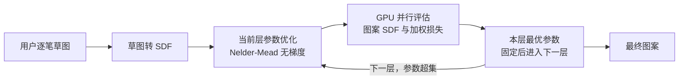

## 一句话总结

本文提出"脚手架化程序化图案（scaffolded procedural patterns）"：把一个程序化图案拆成从粗到细的一串程序（levels），让用户逐层手绘草图、逐层实时优化参数，从而快速、稳定地反推出匹配草图的程序化参数。

## 研究背景

- 领域现状：程序化建模里，改参数比重写程序更常用；为了免去手动调参，逆向程序化建模（inverse procedural modeling）用优化或神经网络，从目标图/草图反推参数。已有方法分两类——基于样例的匹配、以及直接操纵（click-and-drag）。
- 核心痛点：现有反推方法要么不够快、无法交互（基于优化的梯度方法在这类问题上收敛极慢），要么不够精确、缺乏直接控制（神经网络推断）。而且传统优化要求用户一次性画出整幅图案的全部细节，参数一多就容易陷入局部极小值。
- 本文 idea：借鉴手绘中的"脚手架"（辅助线）思想，把图案定义成一串参数逐级递增（后一级参数是前一级的超集）的程序序列，用户从粗到细逐层画、逐层优化，每层只解一小部分新参数，既好画又好优化。

## 方法

整体框架：图案被表示为有符号距离函数（SDF）。用户在画布上逐笔勾画，系统把草图转成 SDF，并在当前"层"上优化该层程序的参数，使程序生成图案的 SDF 与草图 SDF 尽量接近；优化在 GPU 上用无梯度算法实时完成，收敛后固定本层参数，进入下一层继续细化。

关键设计：

1. **脚手架化的分层程序序列**。把一个程序化图案定义为 $$K$$ 个程序函数 $$f^k_{\alpha_k}$$ 的预设序列，最后一级 $$f^K_{\alpha_K}=f_\alpha$$ 就是原始完整程序。约束是后一级参数集包含前一级：$$\alpha_k \supset \alpha_{k-1}$$，于是已优化好的参数可直接被后续层复用。每一层只需求解新增的参数子集 $$\tilde\alpha_k=\alpha_k \setminus \alpha_{k-1}$$，即 $$\tilde\alpha_k=\arg\min L(f^k_{\alpha_k}, s_k)$$。这既让用户能"从粗到细"分步画（不必一次画全），又把大优化拆成一串小优化，更快也更不容易卡在局部极小值。脚手架用大家熟悉的节点图（node graph）来创作：给图内部节点额外定义若干输出当作各层即可，作者称这对良好参数化的图几乎是"免费"的。

2. **基于 SDF 的损失**。图案与草图都表示为 SDF，损失取二者的 $$L2$$ 距离：$$L(f_\alpha,s)=\sum_{p\in I}\vert f_\alpha(p)-s(p)\vert ^2$$。相比在渲染出的纯色图像上算差异，SDF 在整幅画布上连续定义，对稀疏图案能捕捉整体结构，是更稳健的度量（消融实验佐证）。

3. **加权损失 + "void" 笔画支持局部草图**。交互时用户的笔画往往只覆盖画布一部分，若直接优化整幅 SDF，未画区域会主导优化导致失败。本文按到笔画的距离对逐像素损失加权 $$L(f^k_\alpha,s_k)=\sum_{p\in I} w_k(p)\vert f^k_\alpha(p)-s_k(p)\vert ^2$$，只关注已画区域及其邻域；权重由笔画 SDF 经一个截断多项式调制（经验取绘制区权重 $$w_s=4$$、忽略距离 $$w_d=0.5$$、指数 $$w_e=4$$）。此外还引入蓝色"void"笔画，标注应保持为空的区域，让用户主动删掉不想要的形状。

4. **GPU 上的无梯度优化**。作者对比了梯度下降与 Nelder-Mead 单纯形法（无需导数），发现在本问题域上无梯度法收敛更快（省去梯度计算开销），还能优化离散参数（如元素个数、瓦片朝向）。图案 SDF 评估与损失计算是最耗时的部分，被映射到 GPU：用 CUDA 把节点图自动编译成核函数、按像素并行评估 SDF，CPU/GPU 间只传参数与损失值。相比 CPU 实现最高提速约 12 倍。

## 实验结果

主实验是四个基础图案上的优化器对比（输入草图见论文），衡量在同等拟合质量下各方法的收敛总耗时（多次随机初始化的合计时间，单位毫秒）。三种配置为：CPU 梯度下降、CPU Nelder-Mead、GPU Nelder-Mead。各方法收敛后的最终损失基本一致（说明质量相当），差别主要在速度。

| 图案（参数数）| 梯度下降(CPU) 总时 | Nelder-Mead(CPU) 总时 | Nelder-Mead(GPU) 总时 |
|------|------|------|------|
| a（4）| 177963 | 14974 | 1968 |
| b（7）| 549507 | 80468 | 6668 |
| c（8）| 390692 | 93870 | 11537 |
| d（8）| 389294 | 54139 | 5470 |

无梯度法比梯度下降快一到两个数量级，再叠加 GPU 并行进一步大幅缩短，为实时交互奠定基础。

其余结论用文字补充：

- **实时性**：真实编辑会话中，图案含 7~24 个可优化参数、分 2~7 层；每次鼠标松开触发优化（15 个不同初始化实例、最多 75 次迭代），最复杂的图案也在 800 毫秒内完成，配合逐层细化，几秒内即可得到目标外观。
- **与现有方法对比**：与最接近的工作 Riso 等 2022 的梯度反传优化相比，复现其蜂窝图案时对方需约 566 秒收敛，本文仅约 13.231 毫秒，提速四万倍以上；对方因参数过多而失败的图案，本文借助脚手架逐层引导成功复现。
- **用户研究**：招募 20 名计算机方向博士生，在数位板上分别用/不用脚手架临摹六个目标图案并打分。脚手架方案在"图案质量"和"编辑体验"两项评分上都明显更高，且在最终二选一偏好中全部用户都选择了脚手架方案。

## 亮点与局限

- 亮点：
  - 把手绘中的"脚手架"思想迁移到程序化参数反推，用"参数超集的分层序列"把难优化的大问题拆成一串稳健的小问题，思路简洁且通用。
  - 无梯度优化 + GPU 并行，实现真正实时的"自动补全式"草图交互，相较前作有数量级级别的提速。
  - 复用艺术家熟悉的节点图接口来定义脚手架层，落地成本低；加权损失与"void"笔画让局部、渐进式草图成为可能。
  - 用户研究结论一致且强（全体偏好脚手架），支撑了"更好更快"的主张。
- 局限：
  - 表达力受限于固定的程序与脚手架序列，用户可能画出程序无法表示的图案，只能得到近似拟合，对新手容易造成困惑。
  - 脚手架序列本身固定、不能在交互中修改；序列设计不佳会让编辑体验别扭。
  - 创作或修改脚手架需要编程，对非技术用户构成门槛。

## 延伸思考

- 作者提出的未来方向很自然：从已有节点图或带标注的样例中自动抽取脚手架（利用重复母题、显式网格等结构），免去手写代码，这也是让方法真正普及的关键一步。
- 交互期缺乏"可达性"提示是一个可补的体验缺口——文中设想用基于损失的可视化线索或预测叠加，实时告诉用户当前脚手架能表达什么、约束在哪，值得探索。
- "把难优化问题按参数超集分层、逐层固定"的思想不止适用于 2D 图案，或可推广到 3D 程序化形状、材质图等参数更多、更易陷入局部极小值的逆向程序化建模场景。
- 方法依赖 SDF 表示的离散元素图案，对于连续纹理、非几何外观（如复杂 SVBRDF）是否同样适用，是一个值得追问的边界。
