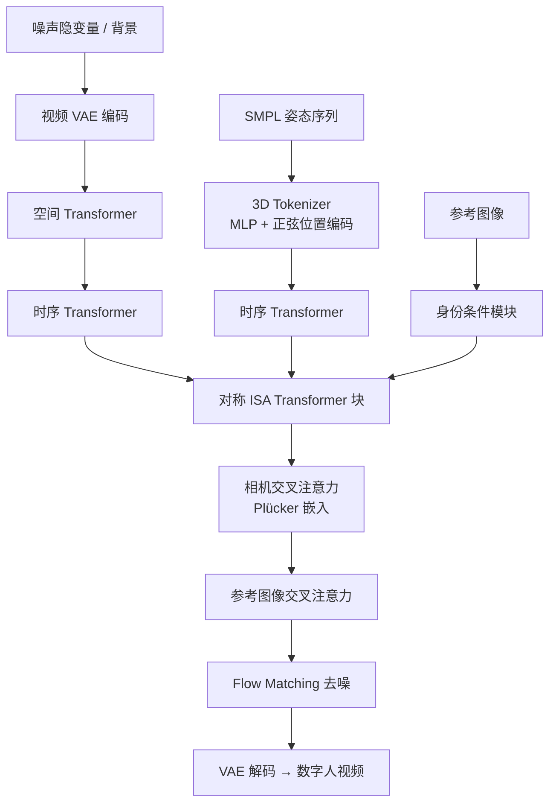

## 一句话总结

提出一种「空间间注意力」（Interspatial Attention, ISA）机制作为扩散 Transformer 的可扩展基本模块，通过 3D SMPL 模板与 2D 视频特征之间的对称交叉注意力和相对位置编码，实现高质量、可控（相机、姿态、多人物、背景）且保持身份一致的 4D 数字人视频生成。

## 研究背景

生成可精细控制相机视角与人体动作的写实数字人视频，对影视特效、游戏、远程会议、AR/VR、虚拟试衣、机器人等场景越来越重要。现有方法主要分两类，各有短板：

- **基于模板的 3D 表示方法**（如 SMPL 配合 NeRF / DMTeT / Gaussian Splatting）能保证严格的多视角一致性，但难以刻画头发、衣物等可变形部件，写实度受限。
- **新兴视频生成模型**在写实度和可控性上表现出色，但缺乏对数字人动态 3D 本质的理解（不使用 3D 模型或模板），导致多帧一致性差、身份难以保持、无法很好地处理多角色以及被遮挡的身体部位。

作者进一步归纳出限制当前人体视频生成的两大核心难题：

1. **VAE 建模不足**：现有隐空间视频扩散模型的变分自编码器无法很好地表示人体的快速运动，重建模糊、隐空间分布不佳，妨碍扩散模型训练。
2. **缺乏显式 3D 参数化人体建模**：以往方法把 3D SMPL 投影到 2D 平面（如法线图），丢失了 3D 结构信息，难以应对自遮挡与多人交互等复杂场景。

本文针对这两点分别提出全新的视频 VAE 与 ISA 注意力机制。

## 方法

整体框架 ISA-DiT 由两部分组成：一个专为人体快速运动设计的视频 VAE，以及围绕对称 ISA 模块搭建的扩散 Transformer。模型输入包括参考图像、每个角色的 SMPL 动作序列，可选相机轨迹与背景视频，输出遵循这些条件的数字人视频。

### 关键设计一：从零构建的视频 VAE

在 SD3 图像 VAE 基础上，把所有卷积扩展为时序因果 3D 卷积，实现图像—视频联合压缩、支持任意长度视频；默认空间下采样 $f_s=8$、时序下采样 $f_t=4$、隐通道 $c=16$。并引入 3D 判别器捕捉时序动态。为解决人体快速运动带来的重建困难，提出两项训练策略：

- **时空数据增强**：随机结构化运动（对每帧随机平移、变速，学习大空间位移如下蹲、跳跃）和动态速度调整（调制帧率，增强对快速局部运动如手部动作的鲁棒性）。
- **图像解码正则化**：作者发现单纯 KL 惩罚会造成「末帧偏置」——隐变量主要压缩每个时间窗内的最后一帧，导致窗口边界处出现明显伪影。为此把 16 通道隐变量拆成 4 个 4 通道子隐变量，用辅助图像解码器分别独立解码各帧，作为隐式约束促使时序信息均衡分布。

VAE 总损失为：

$$\mathcal{L} = \lambda_{L1}\mathcal{L}_{L1} + \lambda_{p}\mathcal{L}_{p} + \lambda_{KL}\mathcal{L}_{KL} + \lambda_{reg}\mathcal{L}_{reg} + \lambda_{3DGAN}\mathcal{L}_{3DGAN} + \lambda_{2DGAN}\mathcal{L}_{2DGAN}$$

### 关键设计二：空间间注意力 ISA

核心直觉：以 SMPL 姿态为条件生成视频时，SMPL 模板本身在不同帧之间提供了粗略的对应关系，可用来告诉网络「该到哪里去找相关的对应特征」，从而避免全局暴力配对。

先在 SMPL 网格表面采样点，构造全局坐标序列，经浅层 MLP 与正弦位置编码转成 3D token：

$$Y_i = F_{mlp}(PE(G_i))$$

**空间间位置编码（ISPE）**是关键。仅靠朴素交叉注意力收敛差、姿态条件不准。ISPE 借助相机参数把 3D 与 2D token 统一到归一化设备坐标（NDC）空间：3D SMPL 点经模型—视图—投影矩阵 $M$ 变换到裁剪空间再做透视除法得到 $g_{ndc}$；2D 视频 token 则映射到零深度平面 $s_{ndc}=(2s_x/w-1,\,2s_y/h-1,\,0)$。对二者施加正弦编码并加到 token 上，为注意力提供显式几何引导。

**对称设计**是 ISA 的最大创新（受 SD3 的 mm-DiT 启发）：让 3D 与 2D 特征互为 query 与 key/value，实现双向信息流：

$$Y'_j = \mathrm{ISAttention}(Q(Y_j + PE(g_{ndc})),\, K(z_j + PE(s_{ndc})),\, V(z_j + PE(s_{ndc})))$$

$$z'_j = \mathrm{ISAttention}(Q(z_j + PE(s_{ndc})),\, K(Y_j + PE(g_{ndc})),\, V(Y_j + PE(g_{ndc})))$$

其中 3D→2D 方向相当于隐式渲染，2D→3D 方向相当于隐式重建，二者在注意力内部同时进行，因而能自然处理自遮挡与多人物场景。

### 关键设计三：ISA-DiT 架构与条件注入

- **对称扩散分支**：2D 视频 token 依次经空间 Transformer 与时序 Transformer；3D SMPL token 经时序 Transformer；两者通过对称 ISA Transformer 块交互。
- **身份条件模块**：对 3D 分支，用参考图像的 VAE 特征做像素对齐传播 $Y = Y + \mathrm{GridSample}(z_{ref}, \pi_y(Y))$；对 2D 分支，同时用局部拼接（保留细节）和 CLIP 全局交叉注意力（保证整体身份一致）。
- **相机条件模块**：把相机位姿编码为 Plücker 图，多帧沿通道拼接后经交叉注入。
- **背景条件模块**：背景视频经 VAE 编码后与主隐变量拼接，无背景时用零隐变量占位，实现灵活合成。
- **扩散建模**：采用 flow matching，扰动 $x_t=(1-t)x_0 + t\epsilon$，网络预测流场 $v = x_0 - \epsilon$。

## 实验结果

**训练数据**：VAE 使用 Kinetics-600 与 Human4DiT 共约 60 万视频；DiT 使用 100 万真实人体视频 + 10 万合成视频（PointOdyssey 管线，200 个数字人模型 + CMU/AMASS 动作，1000 种环境贴图）。真实视频用 Humans-in-4D 获取 SMPL 标注、SAM2 分割背景。

**视频 VAE 比较（表 1）**：在快速运动 / 自遮挡评测集上，本文 VAE（去正则版）取得 PSNR 36.71、SSIM 0.980、LPIPS 0.014、FVD 11.57；带正则版 PSNR 36.59、SSIM 0.981、LPIPS 0.015、FVD 12.16。对比 Cosmos 4×8×8（PSNR 35.31、FVD 15.72）、CogVideoX（32.54 / 25.85）、Mochi（31.78 / 31.94）均更优。加正则虽略降重建指标，却让扩散训练更高效。

**生成视频比较（表 2）**：在 Video / Camera / Mask 三种场景下全面领先各基线（AnimateAnyone、Champ、MusePose、Animate-X、Human4DiT）。ISA-DiT 结果：

- PSNR：Video 28.34 / Camera 27.78 / Mask 32.06（次优 Human4DiT 为 24.71 / 22.24 / 27.68）
- SSIM：0.931 / 0.855 / 0.976
- LPIPS：0.049 / 0.071 / 0.014
- FVD：143.6 / 227.9 / 81.3（相比次优大幅降低，尤其相机运动场景 227.9 vs 608.4）

**VBench 图生视频比较（表 3）**：ISA-DiT 仅 4B 参数，Quality 0.724、Aesthetics 0.579、Consistency 0.953。相较 14B 的 Cosmos（0.693 / 0.528 / 0.896）、Hunyuan（0.705 / 0.546 / 0.904）、WAN2.1（0.738 / 0.582 / 0.929），在一致性上最高，其余指标与大模型相当，但模型更小、更高效。

**消融（表 4）**：去掉 ISPE 时 PSNR 25.21、FVD 230.2；改用 2D ControlNet 注入时 PSNR 26.45、FVD 195.7；完整 ISA 达 PSNR 28.34、FVD 143.6。验证损失曲线显示带位置编码的 ISA 收敛更快、损失更低。把 3D 模板从 SMPL 换成更精细的 FLAME 面部模型后，面部生成从 PSNR 30.42 / FVD 112.4 提升到 31.05 / 101.9。

## 亮点与局限

**亮点**

- 对称 ISA 把「隐式渲染（3D→2D）」和「隐式重建（2D→3D）」统一进单个注意力模块，用 3D 模板对应关系替代全局暴力配对，天然支持自遮挡与多人物。
- ISPE 通过 NDC 统一坐标系提供显式几何引导，显著改善收敛与姿态精度。
- 专门为人体快速运动定制的视频 VAE（时空增强 + 图像解码正则）解决了末帧偏置问题，得到更接近高斯的隐空间分布。
- 仅 4B 参数即可在一致性上超越 14B 级开源大模型，效率优势明显；且可扩展支持相机控制、多角色、背景合成、FLAME 面部等多种应用。

**局限**

- 依赖输入的 SMPL 估计，当多人交互中的遮挡关系估计错误时会产生明显伪影。
- 极端相机变化（如接近 360 度大视角）下背景生成一致性差，作者认为需要更大模型和更多训练数据。

## 延伸思考

ISA 的对称交叉注意力本质上是把「可微渲染 + 可微重建」的循环内化到 Transformer 注意力中，这种以几何模板作为跨帧对应先验的思路，可能推广到其他有强结构先验的生成任务（如物体、手部、场景网格驱动的视频生成）。ISPE 用统一坐标系桥接不同维度 token 的做法，也为多模态、多分辨率条件注入提供了通用范式。另一方面，方法对 SMPL/FLAME 估计精度的强依赖提示：把姿态估计与生成联合优化，或让模型对遮挡关系具备一定纠错能力，可能是提升鲁棒性的下一步；而 360 度背景一致性问题则指向将该框架与显式 3D 场景表示（如 Gaussian Splatting）结合的潜在方向。
