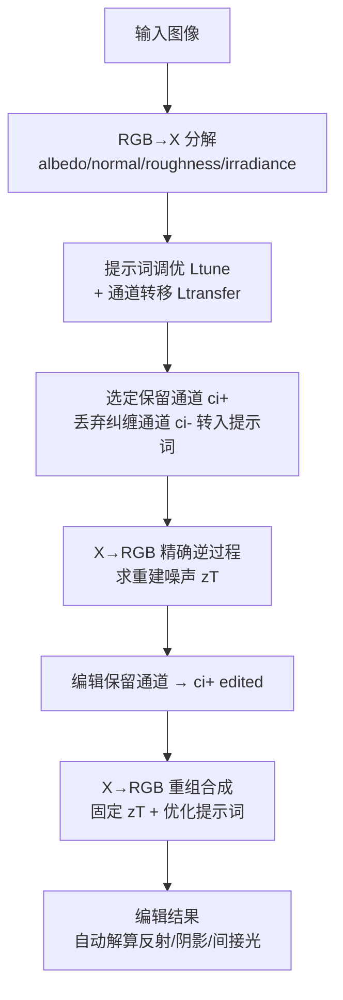

## 一句话总结

IntrinsicEdit 在"本征图像（albedo/normal/roughness/irradiance）"这一可解释的隐空间里做像素级精确编辑，借助 X→RGB 扩散模型的精确逆过程与提示词优化，解决了 RGB↔X 框架的身份漂移与通道纠缠两大顽疾，在物体增删、材质编辑、重打光等多任务上无需针对性微调即可自动解算全局光照效果。

## 研究背景

- 领域现状：扩散模型让图像编辑进入了"提示词、涂鸦、语义绘制"等直观交互时代，但这些接口都是高层控制，难以精确指定编辑范围又保留其余内容不变。经典 3D 工作流里几何、外观、光照可以各自独立操控，这正是本征图像方法想在 2D 图像上复刻的能力。
- 核心痛点：RGB↔X 框架（Zeng 等 2024a）设想了"RGB→X 分解 → 编辑本征通道 → X→RGB 重组"的编辑管线，但落地时有两个致命问题。其一是身份漂移：X→RGB 是生成式模型，即便不做任何编辑，重组出的图像也会因为采样随机性而偏离原图。其二是通道纠缠：本征通道之间信息冗余，比如删除一个物体不仅要修改 albedo，还要在 irradiance 里同步处理阴影和间接光，几乎等价于做一次不可行的光照仿真。
- 本文 idea：完全在推理阶段（无需再训练）修复这两个缺陷。先对 X→RGB 做精确逆过程，找到能忠实重建原图的噪声；再优化原本闲置的文本提示词嵌入，把噪声里"烘焙"的图像身份信息转移出来；进一步把与编辑冲突的通道也转移进提示词后丢弃，从而只需编辑最合适的单个通道即可得到合理结果。

## 方法

管线整体是"分解 → 提示词调优与转移 → 逆过程求噪声 → 编辑本征通道 → 重组合成"五步，其中前三步都是为了在保持身份的前提下换取可编辑性。

关键设计一：精确 DDIM 逆过程锚定身份。X→RGB 是一个隐空间扩散模型，DDIM 采样可看作"神经照片级渲染器"，把噪声、本征通道、提示词映射为图像：

$$z_0 = \text{X}{\to}\text{RGB}(z_T, c_i, c_p)$$

为了在不编辑时也能忠实重建原图，需要反解出对应噪声 $z_T$。作者采用逐步梯度下降的精确逆过程，每一步求解使 DDIM 采样能把 $z_t$ 映回上一步 $z_{t-1}$ 的点：

$$z_t = \arg\min_{z'_t} \left\| z_{t-1} - z'_{t-1}(z_t, t, c_i, c_p) \right\|^2$$

作者验证精确逆过程明显优于朴素 DDIM 逆过程（可编辑但丢身份）和 edit-friendly DDPM 逆过程（能重建但把太多信息烘焙进残差噪声、编辑时出现鬼影）。

关键设计二：提示词调优（prompt tuning）缓解噪声与图像的过度纠缠。精确逆过程会把本征通道未覆盖的身份信息全烘焙进噪声，使这些部分被"钉死"无法编辑。作者在逆过程之前先优化原本闲置的提示词嵌入 $c_p$，用与训练目标相同的损失去吸收这些残余身份信息：

$$L_{\text{tune}}(c_p) = \mathbb{E}_{t,\varepsilon}\left\| \varepsilon - \varepsilon_\theta(z_t, t, c_i, c_p) \right\|^2$$

关键设计三：通道到提示词的转移（channel-to-prompt transfer）解除通道间纠缠。对每个编辑任务，先挑出最适合直接操控的通道子集 $c_{i+}$，把其余与编辑冲突的通道 $c_{i-}$ 丢弃，并优化提示词使"仅用保留通道 + 提示词"的生成结果逼近"用全部通道 + 空提示词"的结果：

$$L_{\text{transfer}}(c_p) = \mathbb{E}_{t,\varepsilon}\left\| \varepsilon_\theta(z_t, t, \{c_{i+}, c_{i-}\}, \varnothing_p) - \varepsilon_\theta(z_t, t, \{c_{i+}, \varnothing_i\}, c_p) \right\|^2$$

这一步得以成立，是因为 X→RGB 训练时用了通道 dropout，天然支持任意"有效+空"通道组合。实际训练把两项合并为单次优化：

$$L_{\text{prompt}}(c_p) = L_{\text{tune}}(c_p) + \lambda\, L_{\text{transfer}}(c_p)$$

其中 $\lambda \in [0.1, 10]$ 平衡调优与转移。这样提示词就以更抽象、灵活的方式保留了非编辑属性，而保留通道则显式承载待编辑内容。

关键设计四：编辑与最终合成。拿到保留通道、优化提示词、以及为它们反解出的固定噪声后，直接编辑本征通道并重新调用 X→RGB 合成：

$$z_0^{\text{edited}} = \text{X}{\to}\text{RGB}(z_T, \{c_{i+}^{\text{edited}}, \varnothing_i\}, c_p)$$

推理阶段不用经典 CFG，而是用一种以初始本征条件 $c_i$（而非空条件）作为负向的引导形式：

$$\varepsilon_\theta^{\text{guided}} = \omega\, \varepsilon_\theta(z_t, t, c_i^{\text{edited}}, c_p) + (1-\omega)\, \varepsilon_\theta(z_t, t, c_i, c_p)$$

默认引导强度 $\omega = 1.5$（roughness 编辑用 $\omega = 6$）。每个任务的通道取舍不同：颜色编辑保留全部、编辑 albedo、丢弃 irradiance；法线编辑丢弃 albedo；重打光保留几何外观通道、编辑并转移 irradiance；物体删除只编辑 albedo、丢弃其余；物体插入通过 albedo（或 albedo+normal）完成。

## 实验结果

实现基于 Zeng 等 2024a 的公开代码与模型。提示词优化用 AdamW、学习率 0.1、跑 200 次迭代；逆过程针对 50 步 X→RGB 推理、每个扩散步做 2-3 次优化迭代。所有结果都以原始 RGB→X→RGB 作为基线（除重打光外均使用其 inpainting 版 X→RGB 模型作对比，因为它在删除/插入上更好）。

- 定性评测覆盖四大任务：材质编辑（颜色/纹理/法线/roughness）、物体删除、物体插入、重打光。材质编辑对比原始 RGB→X→RGB、Intrinsic Image Diffusion、Grounded-Instruct-Pix2Pix、TurboEdit——只有本方法能对单个材质属性做精细操控，红墙案例同时正确调整了台面上的反射；使地板由亮变哑光时能保持场景光照。物体删除对比 Photoshop 生成式填充与 SD-XL inpainting，能连同物体的反射与投射阴影一起干净移除，且因本征通道 inpainting 掩码可紧贴物体，背景身份保留优于需要大掩码的图像空间方法。物体插入对比 IntrinsicComp、ZeroComp、Anydoor、Poisson cloning，是唯一能同时协调插入物与场景（处理反射、匹配光照）的方法。
- 定量评测用带前后真值的合成与真实数据集，报告 PSNR 与 LPIPS。合成材质编辑数据来自 10 个 3D 场景（颜色编辑 10 例、roughness 编辑 4 例），本方法产出的图像在视觉与数值上都比所有对比方法更接近参考编辑结果。真实物体删除数据集为 12 对"放置物体前后"实拍图；全图指标上本方法紧随 Photoshop 之后（Photoshop 在其掩码外能做到像素完美保留，本方法受隐空间编解码不一致影响），而在 Photoshop 掩码区域内本方法表现最佳（因为该掩码必须比本方法的 albedo inpainting 掩码更大以容纳阴影与反射）。
- 消融研究：逆过程方法上，精确 DDIM 逆过程对身份保留至关重要，换成 edit-friendly DDPM 会因残差噪声烘焙过多信息而严重失真，朴素 DDIM 则可编辑但丢身份。提示词优化上，去掉调优或转移都会带来负面后果——仅调优会算错光照或去不掉阴影，仅转移会丢背景身份，保留未编辑通道会因错误几何提示产生鬼影，不做逆过程用随机噪声则细节无法复现。

## 亮点与局限

亮点：

- 提供了一个可解释的编辑隐空间——本征图像本身，用户可用传统或现代图像工具做像素级操控，同时自动传播反射、阴影、间接光等全局光照效果。
- 完全在推理阶段实现，无需任何任务专属微调，一套框架统一覆盖材质编辑、物体增删、整场景重打光及其组合。
- 精确逆过程 + 提示词调优/转移的组合，巧妙地在"身份保留"与"可编辑性"之间取得平衡，并把繁琐的多通道对齐编辑降维成单通道编辑。

局限：

- 身份保留仍不完美，主因是底层 SD 2.1 的 VAE 隐空间编码会损失高频细节；直接编解码 $D(E(I))$ 损失明显，反解码器 $D(D^{-1}(I))$ 能缓解但无法根除。
- 编辑精度依赖用户操作：albedo 编辑越界会与 normal 条件冲突产生伪影，丢弃 normal 虽合理却会改变物体形状。
- 继承 RGB↔X 的局限——训练数据以室内场景为主，roughness 编辑不如 albedo 可靠，金属、透明物体、镜面、皮肤/毛发/织物仍难处理，室外与人物属分布外场景。
- 速度慢且分辨率受限：512×512 图在 H100 上编辑前约 75 秒（分解 20 秒、提示词优化 15 秒、逆过程 40 秒）、编辑后合成 5 秒；1920×1080 约需 500 秒；4K 因显存受限暂不可行。

## 延伸思考

- 论文最有价值的洞见是把"随机性即身份漂移"这一生成式编辑的根本矛盾，转化为一个"逆过程求确定噪声 + 提示词吸收残余信息"的推理时优化问题，这套思路对任何 decompose-edit-recompose 类管线都可迁移。
- 通道到提示词的转移本质上是把"像素精确但难以手工对齐"的稠密条件，压缩成"抽象但自动协调"的文本条件，用一种模态的可编辑性去换另一种模态的免维护性，是很值得借鉴的条件解耦范式。
- 瓶颈几乎都压在底层基础模型上：VAE 的信息损失限制了身份保真上界，RGB↔X 的分布限制了适用场景。未来若有蒸馏出的少步 X→RGB 模型，既能大幅加速逆过程与提示词优化，也可能松动分辨率与交互性的天花板。
- 作者主动声明了伦理风险——这类逼真生成式编辑可能助长虚假信息传播，这提示该方向落地时需要配套的溯源或水印机制。
