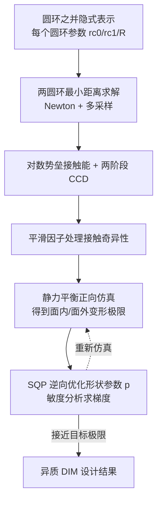

## 一句话总结

针对"离散互锁材料"（Discrete Interlocking Materials, DIM，即广义链甲织物），本文提出用"多个椭圆截面圆环之并"的隐式表示来高效模拟其由内部接触主导的运动学变形极限，并据此做梯度驱动的逆向设计，自动求解每个互锁单元的形状参数，使材料呈现指定的面内 / 面外力学行为。

## 研究背景

- 领域现状：柔性超材料可以通过精心设计的微结构实现丰富的宏观力学性能，图形学界已探索过点阵、体素、泡沫、板状、片状等多种可打印超材料。近年离散互锁材料（由准刚性互锁单元构成的广义链甲）因为能同时兼顾"柔顺"与"强度"而受到关注：松弛阶段几乎无回复力、自由变形；一旦接触链完全形成进入绷紧阶段，材料强度被激活。
- 核心痛点：以往超材料工作几乎都聚焦"弹性行为"，而 DIM 的行为由内部接触而非弹性变形主导，其变形极限是各向异性且高度耦合的运动学量，取决于单元的形状与拓扑。此前 Tang 等人（2023）只解决了均质 DIM 的正向表征问题；如何反过来给定目标力学性能去求单元形状参数，基本还是空白。而已有的正向手段——增量势接触（IPC）配合显式三角网格——用于逆向设计时计算代价高到无法接受。
- 本文 idea：抛弃显式网格，改用"圆环之并"的低维隐式表示来建模互锁单元。这样接触可以随参数平滑演化，从而能把"变形极限如何随形状参数变化"表达成可微函数，进而用基于梯度的优化来逆向设计异质 DIM。

## 方法

### 整体框架

方法建立在两块之上：一是能高效仿真 DIM 并给出可微导数的隐式接触模型（正向）；二是在此之上构造面内 / 面外变形极限的目标函数，用带约束优化求形状参数（逆向）。全流程忽略摩擦与弹性，只关注准刚性单元的运动学变形极限。

### 关键设计

1. **圆环之并的隐式接触模型**：每个互锁单元由若干带椭圆截面的圆环构成，圆环表面点用环半径 $$R$$ 与截面两半径 $$r_{c0}, r_{c1}$$ 参数化。两圆环间接触通过求最小平方距离 $$d(\mathbf{c}_{ij}, \mathbf{q}_{ij}) = \|V_i^t - V_j^t\|^2$$ 得到（用 Newton 法、梯度阈值 $$10^{-12}$$，并多点采样避免陷入局部极小）。当最小平方距离小于阈值 $$\hat d = 10^{-8}$$ 时纳入接触集，套用 IPC 式的对数势垒 $$b(d,\hat d)$$ 构成接触能，最终把所有单元的静力平衡写成无约束极小化 $$\min_{\mathbf q} E = E_e + E_c$$。相比显式网格，这个低维表示大幅降低了自由度与接触对数量。

2. **两阶段连续碰撞检测（CCD）**：线搜索步长需保证不穿透。宽阶段用包围球加哈希网格快速筛选可能重叠的单元；窄阶段把"最大安全步长"写成一维带约束极小化，通过对最优性条件 $$\nabla_{\mathbf c_{ij}} d = 0$$ 做敏度分析得到梯度，再用 L-BFGS-B 对候选集内所有圆环并行求解。若检测到穿透（$$d < d_{th}=10^{-20}$$）就把上界步长按 0.9 逐步收缩。

3. **接触奇异性的平滑处理（核心难点）**：两圆环相对旋转时，接触对数量会在 1 与 2 之间突变，新接触对可能带着小于 $$\hat d$$ 的距离骤然出现或消失，导致接触能出现"能量墙"式的不连续，使 Newton 步被拒。作者的关键观察是：距离极小化问题 Hessian 的最小特征值 $$\lambda_k$$ 会随第 $$k$$ 个接触对的出现从 0 平滑增大。据此用多项式构造平滑因子 $$h_k(\lambda_k)$$（取 $$n=5$$、$$\bar\lambda = 10^{-9}$$），再叠加一个同时依赖接触平方距离 $$d$$ 与 $$h_k$$ 的平滑因子 $$s_k(d,h_k)$$，把接触能改写为 $$E_c = \mu \sum_{k\in C} s_k b_k$$，从而在接触对增减时得到连续可微的能量。没有这一步，Newton 法根本找不到能使能量下降的可行步长。

4. **面内 / 面外变形极限的逆向设计**：面内在可平铺单元胞上加周期边界条件，用对称变形梯度 $$F = U(\varepsilon) + I$$ 驱动，令 $$\min_{\mathbf y} E_{planar} = \tfrac12(\varepsilon - \hat\varepsilon)^2 + E_c(\mathbf y)$$，通过设置一个大到不可达的目标应变 $$\hat\varepsilon$$ 来"逼出"某方向的变形极限。面外则让圆盘状单元片去拟合抛物面 $$z = Ax^2 + By^2 + Cxy$$，用曲率 $$\kappa=(A,B,C)^T$$ 刻画弯曲极限。逆向问题统一写成带静力平衡约束、单元互锁可行性约束 $$C_{ij}(\mathbf p) > \epsilon_c$$（保证圆环截面小于邻居的孔）与可打印参数范围约束的形式，用序列二次规划（SQP）加回溯线搜索求解；设计目标梯度 $$\dfrac{dT}{d\mathbf p} = \dfrac{\partial T}{\partial \mathbf y}\dfrac{d\mathbf y}{d\mathbf p} + \dfrac{\partial T}{\partial \mathbf p}$$ 经敏度分析得到，Hessian 用 BFGS 近似并把负特征值平移到 $$10^{-6}$$ 保正定，另设 parameter-CCD 防止改参数时穿透。

## 实验结果

正向仿真上，隐式方法相对"IPC + 显式网格"在计算同一面内变形极限时有明显加速；而且随着显式网格分辨率提高，刚体配置会收敛到隐式方法的解，说明结果一致可信。

| 示例（单元胞） | 圆环数 #Tori | 本文用时 [s] | IPC 用时 [s] | 加速比 |
|------|------|------|------|------|
| 三重对称（Threefold） | 16 | 2.134 | 29.287 | 13.7x |
| 四重对称（Fourfold） | 18 | 12.375 | 56.325 | 4.6x |
| 4-in-1 链甲（Chainmail） | 8 | 5.444 | 41.745 | 7.7x |

逆向设计在三类材料上验证：三重对称链甲、四重对称材料、经典 4-in-1 链甲。方法能把初始均质设计的单轴变形极限剖面拟合到正交异性、各向异性、各向同性等多种目标；面外还能拟合出显著更大曲率的正交 / 各向同性单轴弯曲极限。逆向设计统计（Table 2）显示迭代数从几十到两百多、每次迭代平均耗时从十几秒到四百多秒不等（在 AMD EPYC 7742 云端运行）。作者对 3D 打印实物做了拉压（面内，报告 Cauchy 应变式相对量 $$\eta = \dfrac{\varepsilon_s - \varepsilon_c}{1 + \varepsilon_c}$$）与弯曲（面外）测量，仿真与实测总体吻合良好；仅在 4-in-1 链甲拟合各向同性时落到局部最优、在 30 度方向偏差较大，但 0 度方向的变形极限相比初始设计仍提高约 4 倍达到目标。

## 亮点与局限

- 亮点：
  - 首个针对离散互锁材料的逆向设计计算框架，把此前只做"正向表征"的能力推进到"给目标求形状参数"。
  - "圆环之并"的低维隐式表示是关键，既大幅降低仿真代价（相对 IPC 显式网格 4.6~13.7 倍加速），又让接触随参数平滑演化、支持可微优化。
  - 对接触奇异性（接触对突增突减导致能量不连续）给出了基于 Hessian 最小特征值的平滑处理，实验证明它是 Newton 法能收敛的必要条件。
  - 面内 + 面外、多种对称性材料上都验证，并有 3D 打印实物测量佐证。

- 局限：
  - 只用圆环作基元，非"圆环之并"型的 DIM 需扩展参数化模型（框架本身声称可推广）。
  - 平滑公式在"第二接触点以 $$d < d_2$$ 且最小特征值 $$\lambda = 0$$ 出现"时不保证能量平滑，只是实验中未出问题。
  - CCD 无形式化鲁棒性保证（不保证总能找到时间区间内最早接触），依赖圆环几何光滑这一经验性质。
  - 把单元当刚体、忽略弹性与摩擦，是理想化假设；对紧接触的 DIM，摩擦可能主导宏观性能。
  - 目前面向二维 DIM，三维架构材料与曲面 / 空间变连接性的异质材料尚待未来工作。

## 延伸思考

这项工作把"接触主导的运动学材料"纳入可微设计的范式，隐式几何 + 平滑接触能 + 敏度分析的组合思路，对其他接触密集、显式网格代价高的仿真设计问题（针织、装配体、颗粒堵塞类可调刚度结构）都有借鉴意义。作者指出的三条延伸最值得追问：一是把弹性与摩擦引入接触模型——因为像真空堵塞那样"靠法向压力控制阻力"的机制本质依赖摩擦，只有加入摩擦才能刻画这类接触主导材料；二是从二维扩展到三维架构互锁材料的设计；三是支持曲面几何与空间变连接性的异质材料设计。另一个值得思考的点是奇异性平滑与 CCD 缺乏形式化保证，未来若要用于对安全性敏感的工程件（防护装备、航空航天），需要更强的鲁棒性论证。
