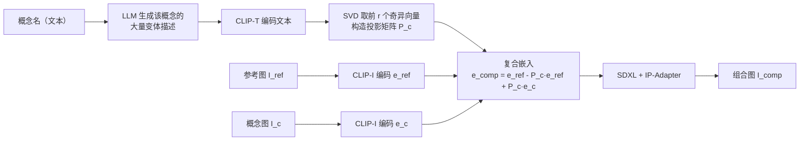

## 一句话总结

IP-Composer 是一种无需训练的组合式图像生成方法：用自然语言描述"要从每张参考图里抽取哪个概念"，再把多张图在对应的 CLIP 子空间上的投影拼接成一个复合嵌入，喂给现成的 IP-Adapter，就能把多个视觉概念融合进一张新图。

## 研究背景

- 领域现状：扩散模型已能很好地做文本引导的组合式生成，语言天然可组合，拼几个不相关的概念很容易。基于图像参考的方法则能捕捉文字难以表达的细腻视觉细节。
- 核心痛点：文本控制在精细视觉细节上不够精确；而现有的图像组合方法要么能处理的概念范围受限，要么需要按概念做昂贵的逐概念训练或专门数据，实用性和可扩展性差。
- 本文 idea：作者借鉴了"CLIP 的注意力头张成若干语义子空间、且这些子空间可用文本描述来刻画"这一发现。既然能在不破坏其余语义的前提下从嵌入里"减去"某个概念（如去掉"水面背景"以消除虚假相关），那也应当能把它"替换"成来自另一张图的同类概念实例。由此用文本选概念、用图像定实例，二者结合。

## 方法

### 整体框架

方法核心是从 CLIP 图像嵌入中隔离出"概念 $$c$$ 的分量"。给定一张参考图 $$I_{ref}$$（通常提供背景或场景布局）和一张概念图 $$I_c$$，目标是生成一张图：概念 $$c$$ 来自 $$I_c$$，其余属性来自 $$I_{ref}$$。整个流程分两步——先为每个概念构造一个投影矩阵 $$P_c$$，再用它做嵌入层面的"替换"，最后交给 IP-Adapter 生成。

### 关键设计

- **用文本+SVD 构造概念子空间（是什么/为什么/怎么做）**：为了刻画"概念 $$c$$"到底占据 CLIP 空间的哪一块，作者让 LLM 生成一批尽量覆盖该概念属性空间的文本（如概念是"花的种类"，就生成"一朵玫瑰""一朵郁金香"等），共约 150 条，需要更高维子空间的任务（如物体插入）则用 500 条。把这些文本用 CLIP 文本编码器编码，堆成矩阵 $$E=[CLIP_t(t_1),\dots,CLIP_t(t_n)]^T$$，做奇异值分解 $$E=U\Sigma V^T$$，取前 $$r$$ 个右奇异向量 $$V_r$$ 张成该概念子空间。之所以用文本来定义子空间，是因为语言便于描述"我想要哪个概念"这一高层意图。作者发现用未归一化嵌入效果更好，因为它保留了数据的自然变化幅度。
- **投影矩阵与嵌入替换**：投影矩阵取 $$P_c = V_r^T V_r$$（对称投影到概念子空间）。组合的关键操作非常简洁——把参考图嵌入在该子空间上的分量换成概念图的对应分量：$$e_{comp} = e_{ref} - P_c e_{ref} + P_c e_c$$。前两项去掉参考图在概念子空间上的投影，第三项加入概念图在同一子空间上的投影，其余维度保持不变，从而保留了参考图的整体属性。
- **秩 $$r$$ 的选择**：$$r$$ 凭经验选取，取决于概念的"宽窄"。多数概念可共用一个 $$r$$；像"动物"这类宽泛概念需要更多方向，而"狗的品种"这类具体概念用较少方向即可。实验里低变化任务（如换装）用 $$r=30$$，高变化任务（如换花纹）用 $$r=120$$。
- **推广到多概念**：对 $$K$$ 个概念，复合嵌入为 $$e_{comp} = e_{ref} - \sum_{k=1}^{K} P_{c_k} e_{ref} + \sum_{k=1}^{K} P_{c_k} e_{c_k}$$。作者特意不去互相减掉各概念在其他概念子空间上的投影，因为经验上那样会让结果对每个概念所用奇异向量个数 $$r_{c_k}$$ 过于敏感。多概念时也可以"两两合成、逐步迭代"（每步生成的图作为下一步的参考图），在某些情况下能减少泄漏，但也可能丢失输入细节。

实现上，方法搭建在预训练 SDXL 之上，使用基于 OpenCLIP-ViT-H-14 的 IP-Adapter 编码器，概念变体描述由 GPT-4o 生成。整个流程无需任何训练或微调。

## 实验结果

作者在一个覆盖 4 类场景（换装、物体插入、花纹迁移、主体+背景等）的小集上，与三个基线对比：pOps（需按任务训练、每任务约 5 万样本）、ProSpect（需逐图长时间优化反演）、以及 Describe & Compose（先用视觉语言模型描述再用 Composable-Diffusion 生成）。定量评估用 CLIP 空间距离衡量"生成图与目标概念描述的相似度"（越高越好）和"与无关属性描述的相似度即泄漏"（越低越好）。定量图表显示 IP-Composer 在概念相似度上与最强方法相当，同时对参考图保持更高相似度、泄漏显著更低。

下面取论文的用户研究（2 选 1 强制选择，35 名用户共 560 次作答）作为主实验，数字为"更偏好本文方法"的比例：

| 对比基线 | 偏好本文（Ours） | 偏好基线 |
|----------|------------------|----------|
| Describe & Compose | 85.87% | 14.13% |
| pOps | 78.65% | 21.35% |
| ProSpect | 88.04% | 11.96% |

可见即便与需要训练/优化的方法相比，用户也普遍更偏好本文的无训练方法。消融实验（评估集扩到 150 张图）进一步表明：相比直接插值 CLIP 嵌入、拼接 IP-Adapter tokens、或用图像（而非文本）来张成概念子空间，本文的文本子空间投影方案在概念可控性和抑制泄漏上都更好——用图像张成子空间时，生成图会填入与概念无关的内容（如自动补背景），这些内容在 SVD 里占据主导方向，反而加重泄漏。

## 亮点与局限

- 亮点：
  - 完全无需训练，直接复用现成 SDXL + IP-Adapter，靠一次线性代数运算（投影替换）完成组合，简洁且可扩展到任意概念。
  - "文本选概念、图像定实例"的分工，兼顾了高层概念控制与细粒度视觉细节。
  - 能覆盖数据难以收集的多样任务（换装、加物体、迁花纹、模仿姿态、按时段调光照等），并可无缝加入文本条件。
- 局限：
  - CLIP 与扩散特征空间中存在意外纠缠：把斑马身体与豹纹组合时，模型可能生成带长颈鹿头部特征的动物（两张输入图里都没有长颈鹿）。
  - CLIP 空间的解耦有时与人的直觉不符：仅用"服装类型"描述张成的子空间不会迁移服装颜色，需在描述里显式加入颜色才行。
  - 受限于嵌入空间维度，概念数量过多或需高维子空间时会出现泄漏；也受 IP-Adapter 本身细节捕捉能力限制，难以还原精确身份等细腻细节。

## 延伸思考

- 方法本质是"在语义子空间上做投影替换"，与 GAN 时代寻找可解释编辑方向的工作一脉相承，但把"找方向"换成了"找子空间"，思路值得迁移到其他共享嵌入空间（如更强的视觉编码器或多模态大模型的表征）。
- 组合中出现的"斑马+豹纹→长颈鹿"现象，暗示扩散模型可能把某些概念表示为更基础视觉部件的组合，这与可解释性研究相关，值得深入。
- 无训练、纯线性运算的特性意味着极低的部署成本，天然适合做成交互式创作工具；后续若能自动搜索合适的秩 $$r$$、或缓解高维概念下的泄漏，实用性会进一步提升。
