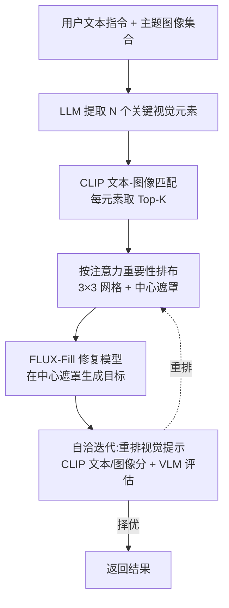

## 一句话总结

把参考图像像"文本上下文"一样直接拼进图像修复模型的画布里当作视觉提示，配合一套动态匹配、排布、自洽迭代的流程，实现无需训练、无需改模型结构的主题一致图像生成。

## 研究背景

- 领域现状：文本到图像生成的个性化定制已经很成熟，主流做法有三类——微调模型（DreamBooth、LoRA）、加装辅助控制网络（ControlNet、T2I-Adapter、IP-Adapter），以及在注意力层交换特征来注入概念（StyleAligned、ConsiStory 等）。
- 核心痛点：作者把"主题图像"（TSI，theme-specific image）定义为在统一艺术风格或叙事框架下把角色、物体、环境融为一体的画面。与只学"单个物体"的对象定制不同，主题生成要同时处理多角色、多概念、连续叙事，元素高度多样。已有方法在这里都吃力：微调类切换概念慢、算力与时间开销大、易过拟合；辅助网络与注意力交换类往往难以保持角色/物体的身份一致，还要改动大型预训练模型结构。
- 本文 idea：受大语言模型"用文本上下文当知识"的启发，作者提出把这一范式迁移到视觉——图像生成本身就有大量现成的角色/物体/背景图可用作上下文。于是用图像修复（inpainting）模型作为载体，把参考图直接"拼接"进画布充当视觉提示（visual prompting），既不训练也不改结构，还能保证引导信息和目标输出处在同一视觉域，从而更精确。

## 方法

整体框架：核心是动态视觉提示（Dynamic Visual Prompting, DVP）。用户只需提供一组主题图像集合和一句文本指令，DVP 就自动完成"理解意图 → 从图库匹配合适的参考图 → 按注意力重要性排布成网格视觉提示 → 送入 inpainting 模型在中心遮罩里生成 → 自洽迭代挑最优结果"这一条流水线。整个过程无需针对主题做任何训练。

关键设计：

1. 用户意图理解与关键元素抽取。DVP 先用一条结构化指令（形如"从这段话里抽取 $$N$$ 个关键视觉元素"）从用户文本里提取核心要素，可由 LLM 自动完成也可人工指定，默认 $$N=3$$。这一步决定了后续视觉提示是否携带足够语义细节，抽取失败会导致生成内容缺失关键信息。

2. 视觉提示匹配与生成。用 CLIP 把关键元素和图库图像映射到同一嵌入空间，按余弦相似度 $$similarity_{i,j} = \dfrac{E_i \cdot I_j}{\lVert E_i \rVert \lVert I_j \rVert}$$ 为每个元素选出相似度最高的 Top-$$K$$ 张图。取 $$N=3$$、$$K=3$$，得到一个 3×3 的图像模板。这一步把"文本要什么"和"图库里有什么"对齐了起来。

3. 基于注意力的排布。网格里参考图放在什么位置会显著影响生成效果。作者做了注意力可视化实验：对同一组参考图用不同排布反复推理，统计参考图到生成区域的平均注意力图，发现某些固定位置（标星区域）注意力强度更高。于是把最重要的图放到这些高注意力位置，中心留白作为待生成遮罩，一起喂给 inpainting 模型；实验统一用三个视觉元素在行间做全排列得到的六种排布。

4. 自洽提示更新与评估。即便同一组图，排布不同结果也会有差异——这类似 LLM 里语义相同的提示会给出不同输出。作者借鉴 LLM 的自洽（self-consistency）思路，让模型对一组视觉提示反复重排产生多个候选，再用量化指标择优：文本-图像一致性（CLIP 文本分）、主题一致性（CLIP 图像分）、以及用视觉语言模型评估的视觉质量。这样既提升了稳定性，也减轻了用户手动挑图的负担。

实现上使用 FLUX-Fill 1.0，引导尺度 30、推理步数 50；每个角色 15 张参考图已能有不错效果，30 张更佳。匹配与评估约 10 秒，一张 512×512 图合成约 30 秒，与训练无关基线相当，明显快于分钟级微调方法和天级适配器方法。

## 实验结果

作者在十个常见主题上、每主题五条提示、每提示十张不同随机种子的图（每种方法共 500 张）做定量评估，指标为参考图与生成图的成对 CLIP 图像相似度（主题保真度，越高越好）和生成图与文本条件的 CLIP 相似度（可编辑性，越高越好），并请 50 位参与者对 10 个主题按 0 到 5 打分。论文以散点图与用户研究呈现结论：本方法在主题一致性上取得最高分，同时文本跟随能力与 FLUX 相当，整体表现追平用 DreamBooth+LoRA 微调过的 FLUX，用户偏好最高。

由于原文的定量对比以散点图形式给出、未列出逐方法的精确数值，这里据定性对比章节整理主实验的"方法族 × 能力"结论表（忠于原文描述，不含编造数字）：

| 方法（族） | 是否需训练/改结构 | 身份一致性 | 文本对齐 | 主要短板 |
|------|------|------|------|------|
| 本文 IP-Prompter | 否（训练无关、结构无关） | 强，含服饰 logo 等细节 | 强 | 依赖足够数量参考图 |
| DreamBooth+LoRA（FLUX） | 需分概念训练 | 较强（基线中最好） | 较强 | 风格与身份偶有轻微妥协 |
| Textual Inversion（SDXL） | 需反演训练 | 动作变化大时易丢失外观 | 较好 | 复杂角色外观难捕捉 |
| IP-Adapter / Kolors-Character（FLUX） | 单图引导 | 精细角色控制弱、多例身份丢失 | 较强 | 难以精确控制角色 |
| EasyRef | 控制网络 | 非人类域（卡通/动物）身份丢失 | 中 | 跨域泛化差 |
| FreeCustom | 训练无关（改注意力） | 物体一致但动作/背景变化差 | 中 | 动作与背景难改 |
| ConsiStory | 训练无关（改注意力） | 文生图连贯，图像引导控制不精确 | 中 | 图引导任务控制弱 |

消融方面：去掉自洽提示更新后，模型难以把最合适的图放到最重要位置，出现细节缺失（如丢失红色外套）；再去掉基于注意力的排布，身份直接丢失；去掉提示匹配，则引导图与目标内容错位、角色不一致。参考图数量实验显示，从九张减到四张再到两张，风格退化甚至角色身份丢失越发严重——参考图太少无法提供充分上下文，模型会忽略参考图的影响，缩小网格会让图像分显著下降。

方法还展示了多概念组合生成、真实感角色融入摄影背景、新角色设计、故事连续生成与表情包生成等应用。

## 亮点与局限

- 亮点：
  - 把"视觉提示 = 拼进画布的上下文"这一简洁范式落地，训练无关、结构无关，避免了改动大模型带来的一系列麻烦，引导信息与输出同域从而更精确。
  - DVP 把提示工程搬到视觉侧：自动抽取元素、CLIP 匹配、注意力驱动排布、自洽迭代择优，形成可复用的闭环，还能无缝切换创作主题、适配多轮交互。
  - 效率好（秒级），且定量/用户研究上追平微调过的 FLUX，覆盖故事、角色设计、真实感生成、风格引导等多种应用。

- 局限：
  - 强依赖参考图的数量与多样性，图太少直接退化；对图库质量有要求。
  - 精度与可控性上，作者也承认训练类方法（如 LoRA）在适配性和精细控制上仍更强，本方法胜在便捷与通用。
  - 定量评估以散点图+用户研究为主，缺少逐方法精确数值表；管线里依赖 LLM、CLIP、VLM 多个外部模型，匹配/评估质量受这些模型能力制约。

## 延伸思考

- 这条思路和 In-Context LoRA、OminiControl、Diptych Prompting 等"把参考图当上下文"的工作同源，但区别在于把图库当成独立的"提示银行"、按需组织，而不是把数据信息塞进模型参数——这更接近 LLM 的检索增强式用法，值得思考能否引入更强的检索与重排策略替代 CLIP 匹配。
- 注意力重要性位置是通过可视化实验统计出来的固定先验，换底模（非 FLUX-Fill）时这套排布是否还成立、能否自适应学习最优排布，是一个可追问的点。
- 自洽迭代靠多次推理+VLM 打分择优，成本随候选数上升；如何在质量与推理开销间取得更好平衡，或用更廉价的评估信号，是实用化方向。
- 对连续故事、表情包这类需要跨帧长程一致的场景，当前逐图生成能否保证角色在长序列里的稳定身份，仍值得进一步验证。
