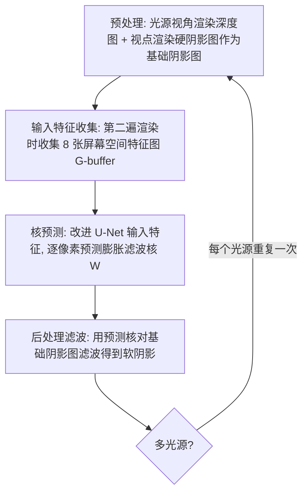

## 一句话总结

不再像已有神经阴影方法那样直接预测软阴影值，而是用神经网络逐像素预测屏幕空间的**滤波核权重**，再对经典硬阴影（或矩阵阴影图）做局部滤波得到软阴影，从而在实时帧率下获得质量更高、时序更稳定、且能泛化到未见场景的软阴影。

## 研究背景

阴影为渲染提供关键的光照与空间线索。由于逐像素追踪阴影射线代价高，实时图形普遍采用阴影贴图（shadow mapping）这一类技术来快速生成阴影。自 Williams 1978 年提出以来，阴影贴图在抗锯齿、软阴影、高效预滤波、级联阴影等方面不断改进。但这些方法依赖启发式参数，容易产生接触硬化不足、漏光等瑕疵。

近年 Datta 等人提出了神经阴影贴图（NSM），直接从少量精心设计的屏幕空间特征（G-buffer）预测软阴影，用简化版 U-Net 实现实时推理。它在复杂场景中比经典方法更准确，但**泛化能力有限**：必须为每个场景单独训练一个网络，严重限制了实用性。

作者的出发点是：软阴影值可以近似看作其屏幕空间邻域内硬阴影值的加权平均。因此与其直接预测软阴影值，不如预测屏幕空间的滤波核权重，再通过滤波计算软阴影。借鉴去噪领域的核预测卷积网络（KPCN）的经验，核预测比直接预测值有更强的正则化效果，逼近误差更小、泛化性更好。

## 方法

### 整体框架

核心假设是：屏幕空间中每个像素 $$i$$ 的软阴影值 $$e_i$$，可由其局部邻域 $$N(i)$$ 内的硬阴影值 $$s_j$$ 做局部滤波很好地近似：

$$e_i = \sum_{j\in N(i)} w_{ij} s_j$$

其中 $$w_{ij}$$ 是归一化滤波权重，满足 $$\sum_j w_{ij}=1$$。选择在屏幕空间而非光源空间滤波，是因为网络中的图像卷积在屏幕空间更自然高效，避免了两个空间之间复杂的坐标变换。

整套渲染流程分四步：

### 关键设计

**膨胀滤波核（dilated filters）作为核表示。** 滤波核需要在紧凑性与感受野之间权衡。作者采用膨胀滤波（又称 À-trous 滤波）：由一系列小核以逐步加倍的步长串联应用组成，用少量参数即可覆盖大感受野。具体用 4 个 5×5 核，膨胀率分别为 1、2、4、8，得到 61×61 的方形感受野，每个像素的膨胀核仅含 $$4\times5\times5=100$$ 个可调参数；相比之下同等感受野的朴素密集核需要 $$61\times61=3721$$ 个参数。

**输入特征。** 大体沿用 NSM，包含 8 张特征图 $$I=\{c_e, c_v/d, z, z_b, z_b/z, z-z_b, p, s\}$$：余弦图 $$c_e$$（接收面法线与光源方向点积）、比值图 $$c_v/d$$、两张深度图 $$z$$（光源到接收点）与 $$z_b$$（光源到遮挡物）、比值图 $$z_b/z$$、差值图 $$z-z_b$$、半影宽度图 $$p$$，以及渲染出的硬阴影图 $$s$$。其中半影宽度是与 NSM 的一个区别：先按 PCSS 假设遮挡物、接收面、光源平行估计光源空间半影宽度 $$p_{pcss}=\frac{z-z_b}{z_b}\cdot R_e$$（$$R_e$$ 为光源半径），再投影到屏幕空间得到 $$p=\sqrt{\frac{c_v}{c_e}}\cdot p_{pcss}$$，作为独立特征图输入。

**紧凑的核预测网络。** 采用改进的 U-Net $$W=\mathcal{N}(I)$$，含 4 个下采样层（通道数 64、64、128、256），最大池化下采样、转置卷积上采样，跳连从拼接改为相加以省显存与计算，外层下/上采样替换为 pixel-shuffle 下采样与双线性上采样以加速高分辨率推理。全网仅 1.81M 可训练参数。

**损失函数。** 采用 L1 损失、VGG 感知损失与时序损失的加权组合：

$$L = L_1 + \beta_v L_{VGG} + \beta_t L_t(V,V')$$

其中 $$\beta_v=0.1$$、$$\beta_t=1.0$$。与 NSM 直接逐像素比较不同，时序损失先用运动向量做 warping 对齐再比较：

$$L_t(V,V') = L_1(V, \mathcal{W}(V')) + \beta_v L_{VGG}(V, \mathcal{W}(V'))$$

并对未通过重投影检验的像素做掩膜。

**用矩阵阴影图增强。** 一个重要优势是核预测方案可以对任意基础阴影生成器的输出做滤波。作者把基础阴影从经典硬阴影替换为矩阵阴影图（MSM，4 阶深度矩加双线性滤波），仅需在预处理与后处理滤波两步做小改动，特征收集与核预测步骤不变，就能以很小开销显著降低误差。作者认为原因有二：MSM 利用了更多光源空间信息，与主要利用屏幕空间特征的核预测互补；且 MSM 输出比经典硬阴影更平滑、瑕疵更少，是更好的滤波输入。这也是与 NSM 的关键差异——NSM 的值预测方案无法享有这一性质。

## 实验结果

实验在 AMD Ryzen 9 7950X 加 NVIDIA RTX 4090 上完成，渲染分辨率固定为 2048×1024，阴影贴图分辨率 6×2048×2048。训练数据来自 5 个场景（Grand Room、Staircase、Kitchen、Classroom、Living Room），每场景 6000 组随机渲染设置。对比对象为 NSM（因官方实现不可得而自行复现，并用更大解码器保证参数量不少于本方法，分 NSM-single 逐场景训练与 NSM-joint 联合训练两版）、MSM-15、PCSS。本方法两个版本 ours-basic（经典硬阴影为基础）与 ours-enhanced（MSM 为基础）均在全部 5 场景上联合训练。

训练场景上的平均误差与耗时（MSE 越低越好，SSIM 越高越好）：

| 方法 | MSE（×10⁻⁴） | SSIM | 耗时 |
|------|------------|------|------|
| Ours basic | 14.59 | 0.973 | 8.8ms |
| Ours enhanced | 9.67 | 0.979 | 8.9ms |
| NSM single | 45.88 | 0.906 | 5.0ms |
| NSM joint | 64.38 | 0.915 | 5.0ms |
| MSM-15 | 65.49 | 0.892 | 3.7ms |
| PCSS | 28.58 | 0.960 | 9.0ms |

两个版本在所有指标上都稳定超过其它方法，同时保持实时（2048×1024 下 >100fps）；对典型室内场景，ours-enhanced 单帧 8.9ms（两遍光栅化 0.9ms、网络推理 6.4ms、后处理滤波 1.6ms）。在 5 个未见场景上的测试进一步验证了泛化性：NSM 与 MSM 更易出现错误阴影或过模糊，本方法凭借核预测带来的额外正则化（软阴影始终被局部硬阴影约束）表现最佳。与硬件光追的等时间对比中，虽然光追 MSE 更低，但因明显噪声与时序闪烁而在感知质量（PIQE）上更差，SVGF 去噪又引入额外偏差与模糊。

消融实验表明：4 层网络配 4 个膨胀核（感受野 61）的组合表现最优，网络与滤波的感受野需要平衡；时序损失使时序误差从 4.01/3.91 降到 3.72/3.68（×10⁻²）；把屏幕空间半影宽度 $$p$$ 作为输入特征优于直接用光源半径 $$R_e$$、$$c_e+R_e$$ 或光源空间半影宽度 $$p_{pcss}$$；基础阴影生成器换成 PCF 加双线性插值则不如 MSM，主要因更受阴影贴图锯齿影响。

## 亮点与局限

亮点：把去噪领域成熟的核预测思想迁移到实时软阴影生成，用"预测滤波核而非阴影值"的方式，使输出天然被局部硬阴影约束，训练更稳、逼近误差更小、泛化显著更强（联合训练与未见场景均优）；膨胀滤波以 100 参数覆盖 61×61 感受野，兼顾效率与感受野；核预测方案可插拔任意基础阴影生成器，接上 MSM 即以极小开销进一步提质，这是值预测方案（NSM）不具备的解耦优势。

局限（作者自述）：一是与已有阴影贴图方法一样，主算法需对每个光源执行一次，计算量正比于光源数，缺乏与光源数无关的方案；二是屏幕空间工作已发现阴影的各向异性并用手工各向异性双边滤波处理，本方法虽能隐式建模各向异性，但如何显式引入仍待研究；三是可进一步扩展到反射阴影图等实时间接光照。

## 延伸思考

这篇工作最具启发性的一点，是把"预测核而非预测值"这一在蒙特卡洛去噪中被反复验证的范式，干净地搬到了阴影生成上，并顺势带来一个漂亮的解耦：网络只负责预测滤波核，基础阴影的质量则交给可任意替换的传统阴影生成器。这意味着传统实时阴影几十年的积累（MSM、PCF、乃至未来更强的变体）都能作为"前端"被复用，而神经网络只在"后端"补足其形状假设的不足。相比 NSM 把一切端到端塞进网络的做法，这种分工既降低了学习难度、又提升了泛化与可解释性，为神经渲染与传统实时管线的融合提供了一个务实且可迁移的模板。
