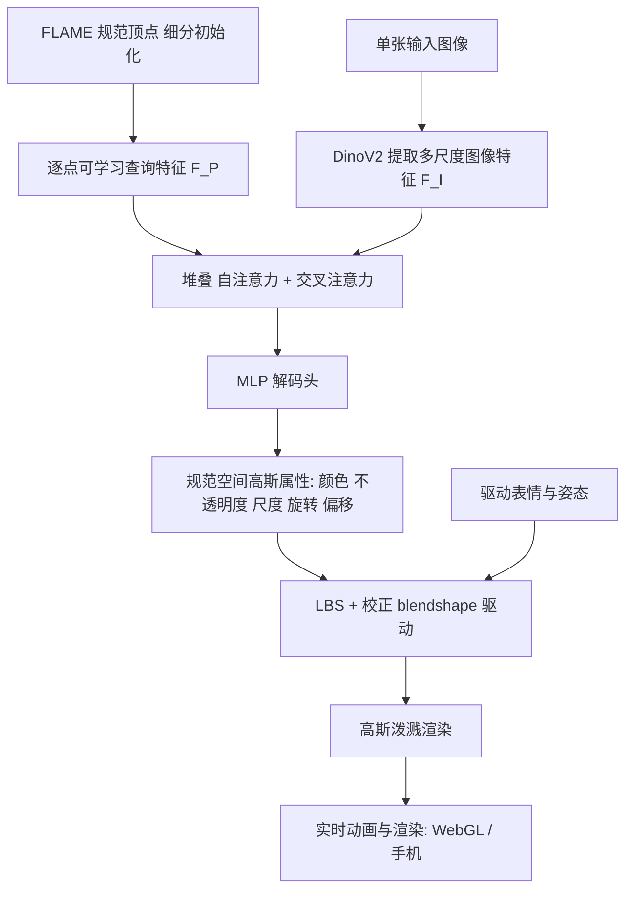

## 一句话总结

LAM 用一个以 FLAME 规范点云为查询、与多尺度图像特征做交叉注意力的 Transformer，从单张图像一次前向就重建出可动画、可渲染的高斯头像，且动画与渲染全程不依赖任何额外神经网络，能在包括手机在内的多种平台实时运行。

## 研究背景

从单张图像重建并驱动头部虚拟形象，在在线会议、影视、游戏、虚拟现实等场景都有广泛需求。现有路线各有短板：

- 2D 方法（基于 CNN、GAN 或扩散模型的变形场）生成耗时、算力需求大，且缺乏显式三维结构，在大幅度姿态或表情变化下容易出现失真或身份漂移。
- NeRF 类 3D 方法几何一致性好、支持自由视角，但通常需要对每个身份做大量优化，渲染速度慢，难以满足实时需求。
- 最新的单张高斯方法（如 GAGAvatar）借助高斯泼溅的快速渲染，但严重依赖复杂的 2D 神经后处理，本质上不是纯 3D 方案，也难以嵌入传统渲染管线并跨平台部署。

LAM 的目标是：单张图像一次前向即生成高斯头像，无需任何后处理网络即可即时驱动与渲染，从而无缝接入既有渲染管线并在广泛设备上高效运行。

## 方法

### 整体框架

框架用 DinoV2 提取图像的多层特征，用 FLAME 规范空间下的（细分后）顶点作为高斯点的初始位置，并给每个点附加可学习查询特征；查询特征通过堆叠的自注意力推理点云几何关系、通过堆叠的交叉注意力从图像特征中提取外观信息，最后由 MLP 解码头预测每个点的高斯属性与位置偏移。规范空间的高斯头像随后用 FLAME 标准的线性混合蒙皮（LBS）与校正 blendshape 驱动到目标表情姿态，并通过泼溅实时渲染。

### 关键设计

**规范高斯属性生成器（核心）。** 以 FLAME 规范顶点作为查询点，逐层与展平后的多尺度图像特征做交叉注意力：

$$F_{P_i} = C_i(F_{P_{i-1}}, F_I)$$

其中 $$C_i$$ 是第 $$i$$ 个交叉注意力模块，$$F_{P_1}=F_P$$。解码头 $$D$$ 预测每个点的高斯属性与位置偏移：

$$\{c_k, o_k, s_k, R_k, O_k\}_{k=1}^{M} = D(F_{P_L})$$

包含颜色 $$c_k\in\mathbb{R}^3$$、不透明度 $$o_k\in\mathbb{R}$$、尺度 $$s_k$$、旋转 $$R_k\in SO(3)$$，以及用于补足 FLAME 未建模细节（头发等）的偏移 $$O_k\in\mathbb{R}^3$$。

三个核心设计动机：其一，用显式点云（由 FLAME 规范顶点初始化）代替三平面或图像平面表示，直接借用 FLAME 的形状先验降低重建难度；其二，把所有形象统一重建到同一规范表情与姿态的规范空间，既便于推理期驱动，又通过减少形状与姿态多样性降低重建复杂度；其三，同时利用局部与全局图像特征做交叉注意力，而非仅用投影得到的"painted"特征，从而提升重建质量与纹理保真度。

**FLAME 细分。** 原始 FLAME 模板仅 5023 个顶点，不足以刻画头发、胡须、牙齿等细节。每次细分在每条边中点插入新顶点、每个面拆成四个新面，blendshape 属性按边两端点取平均传递。默认细分两次得到 $$M=81{,}424$$ 个顶点作为初始化，是重建质量与渲染速度的最佳折中。

**新表情驱动。** 回顾 FLAME 模型：

$$F(\vec{\beta}, \vec{\theta}, \vec{\phi}) = S(T_P(\vec{\beta}, \vec{\theta}, \vec{\phi}), J(\vec{\beta}), \vec{\theta}, W)$$

LAM 把网络预测的偏移并入形状混合后的规范高斯位置 $$\bar{G} = \bar{T} + B_S(\vec{\beta}; S) + O$$，其中 $$O$$ 是网络输出偏移，且形状混合只计算一次；随后仅用姿态与表情 blendshape 加 LBS 完成驱动：

$$F_G(\vec{\theta}, \vec{\phi}) = S(T_G(\vec{\theta}, \vec{\phi}), \bar{J}, \vec{\theta}, W)$$

整个驱动与渲染过程不含任何神经网络，可直接嵌入传统渲染管线。

**部署。** 选用 WebGL：将 blendshape 与 LBS 信息作为纹理传给 GLSL 顶点着色器，用 transform feedback 做高并行 GPU 计算，并实现了 WebGL 版高斯泼溅，交互查看器是配合 JavaScript 的 HTML 网页。

**训练目标。** 从同一视频采样 $$N_f$$ 帧，一帧作参考重建规范高斯，其余作驱动与目标。RGB 用 L1 加感知损失监督 $$L_{rgb} = \lambda_1 L_1 + \lambda_2 L_{lpips}$$，并监督轮廓 $$L_{mask}$$；对偏移加正则 $$L_o = L_2(O, \epsilon)$$（$$\epsilon$$ 近 0，避免点漂移破坏驱动）。总损失为：

$$L = \lambda_1 L_1 + \lambda_2 L_{lpips} + \lambda_3 L_{mask} + \lambda_4 L_o$$

**文本到形象与风格编辑。** 借助 DinoV2 的泛化力与 Transformer 的扩展性，可先用文生图（如 Stable Diffusion）产出人像再喂入 LAM 得到可动画形象；也可先用图到图翻译改变风格（年龄、卡通化等）再重建，实现无需多视角迭代训练的高效风格编辑。

## 实验结果

训练集为 VFHQ（15,204 段视频、约 300 万帧，人脸裁剪并对齐到 512×512，估计相机位姿与 FLAME 参数、去背景），评测在 VFHQ 与 HDTF 测试集，指标含 PSNR、SSIM、LPIPS、CSIM、AED、APD、AKD。Transformer 为 10 层、16 头、1024 维，冻结 DINOv2 主干，ADAM 训练 200 epoch，$$N_f=8$$，$$\lambda_1=\lambda_2=\lambda_3=1$$，$$\lambda_4=0.1$$。

VFHQ 数据集（部分方法，自重演 / 跨重演）：

| Method | PSNR↑ | SSIM↑ | LPIPS↓ | CSIM↑ | AED↓ | APD↓ | AKD↓ |
|---|---|---|---|---|---|---|---|
| GPAvatar | 21.04 | 0.807 | 0.150 | 0.772 | 0.132 | 0.189 | 4.226 |
| Portrait4D-v2 | 21.34 | 0.791 | 0.144 | 0.803 | 0.117 | 0.187 | 3.749 |
| GAGAvatar | 21.83 | 0.818 | 0.122 | 0.816 | 0.111 | 0.135 | 3.349 |
| Ours | 22.65 | 0.829 | 0.109 | 0.822 | 0.102 | 0.134 | 2.059 |

HDTF 数据集（部分方法，自重演）：

| Method | PSNR↑ | SSIM↑ | LPIPS↓ | CSIM↑ | AED↓ | APD↓ | AKD↓ |
|---|---|---|---|---|---|---|---|
| GPAvatar | 23.06 | 0.855 | 0.104 | 0.855 | 0.114 | 0.135 | 3.293 |
| Portrait4D-v2 | 22.87 | 0.860 | 0.105 | 0.860 | 0.111 | 0.111 | 3.292 |
| GAGAvatar | 23.13 | 0.863 | 0.103 | 0.862 | 0.110 | 0.111 | 2.985 |
| Ours | 23.43 | 0.873 | 0.097 | 0.865 | 0.101 | 0.093 | 1.965 |

LAM 在图像重建质量（PSNR/SSIM/LPIPS）、身份一致性（CSIM）与表情姿态一致性（AED/APD/AKD）多数指标上取得最好或领先结果。

运行速度（FPS，重演加渲染，不含重建与参数估计，100 帧平均）：

| 平台/方法 | StyleHeat | HideNeRF | Real3D | P4D-v2 | GAGavatar | Ours (A100) |
|---|---|---|---|---|---|---|
| FPS | 19.82 | 9.73 | 4.55 | 9.62 | 67.12 | 280.96 |

在 A100 上 LAM 达 280.96 FPS，远快于其它方法；跨平台上 MacBook（M1 Pro）120 FPS、iPhone 16 为 35 FPS、小米 14 为 26 FPS，均可实时。

消融（VFHQ，Table 4）：高斯点数 5K/20K/80K 的 PSNR 分别为 20.96/21.43/22.65，FPS 为 705.63/562.97/280.96，80K 点为质量与速度的最佳折中；点云查询（80K，PSNR 22.65）优于三平面查询（Tri. 21.33）；规范空间生成优于直接在参考表情姿态生成再驱动（PE 20.96）；直接在图像特征上做交叉注意力优于仅用 painted 特征（Paint 20.87）。

## 亮点与局限

亮点：

- 单张图像一次前向即得可动画、可渲染的高斯头像，动画与渲染全程无神经网络后处理，能无缝接入传统渲染管线并跨平台（含手机）实时运行。
- 以 FLAME 规范点云为查询、与多尺度图像特征交叉注意力的设计，充分借用形状先验，兼顾重建质量与纹理保真。
- 规范空间统一建模显著降低重建复杂度；Transformer 架构具备可扩展性；额外支持文本生成与风格编辑。

局限：

- 受限于 FLAME 表达能力，无法复现 FLAME 未建模的表情（如舌头运动）。
- 去掉 2D 后处理网络后，动态皱纹等表情相关细节难以完全建模。
- 依赖从视频估计的 FLAME 参数，估计不准会影响结果，单张输入也限制了表情中性化能力。

## 延伸思考

LAM 的核心思路是把"可驱动性"这一难题外包给成熟的参数化模型（FLAME 的 LBS 与 blendshape），网络只负责在规范空间做外观与细节重建，从而彻底剥离了推理期的神经后处理。这种"先验模型承担驱动、大模型承担重建"的解耦范式，让实时跨平台部署成为可能，也提示：当某个子问题已有可靠且可微/可解析的先验管线时，把学习集中在先验覆盖不到的残差上，往往能同时换来质量与效率。其瓶颈也清晰地落在先验本身的表达上限（FLAME 不建模舌头、动态皱纹），后续若能引入更富表现力的可解析驱动模型，或在保持无后处理的前提下补充轻量表情相关细节，是值得探索的方向。
