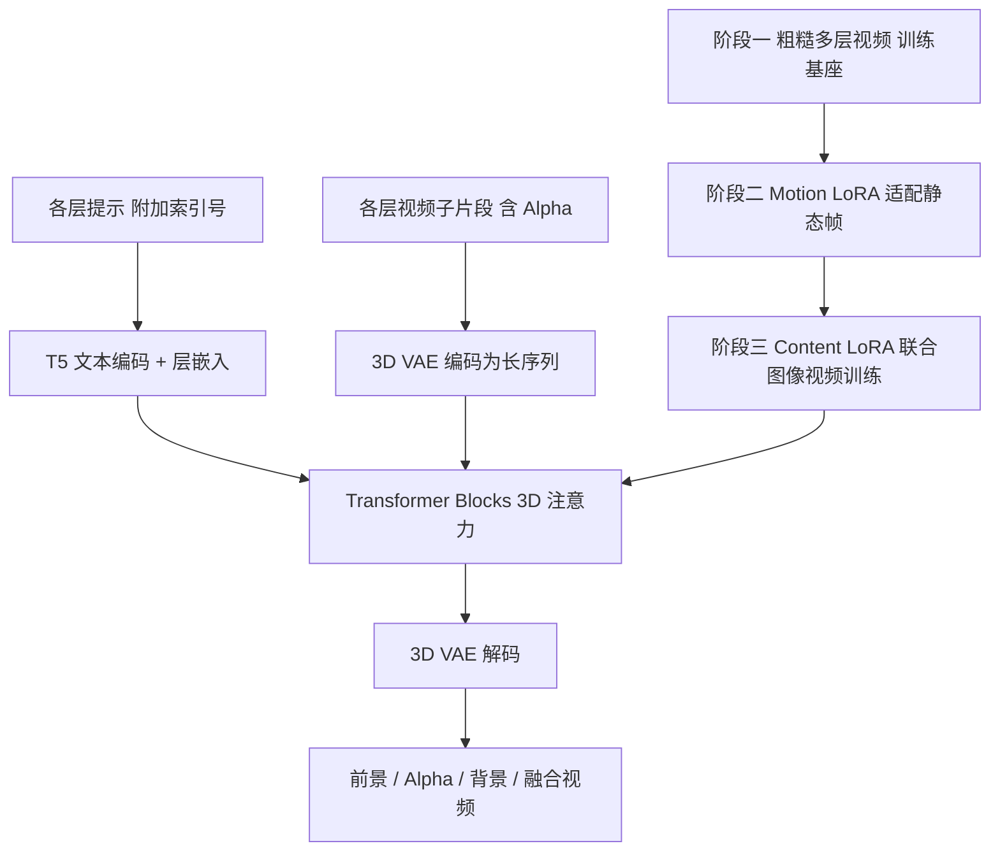

## 一句话总结

本文提出 LayerFlow，一个统一的分层视频生成模型：给定各层文本提示，即可同时生成透明前景、干净背景与融合场景，并支持视频分解、以前景/背景为条件补全另一层等多种衍生任务，通过将各层视频拼成子片段并配以层嵌入实现层感知。

## 研究背景

- 领域现状：文本到视频（T2V）生成快速发展，并逐渐扩展出用光流、深度图等序列条件增强可控性的工作；图像域的分层生成已有 LayerDiffuse、Alfie 等探索带透明通道（Alpha 通道）的 RGBA 图像生成。
- 核心痛点：分层视频生成仍相对空白，主要有两大障碍。其一，视频中不同层与 Alpha 遮罩的表示方式尚未被充分研究，时间维度的引入使透明通道建模更复杂；其二，多层视频数据极度稀缺，高质量分层视频数据集难以构建，限制了泛化与多样性。作者指出据其所知目前尚无可用的多层视频合成方案。
- 本文 idea：从 DiT 结构的 T2V 模型出发，把各层视频段（含 Alpha 序列）拼接成一条长序列，用层嵌入区分每个子片段及其对应的层级提示，从而在一个统一框架内支持分层生成、分解与条件补全；针对数据稀缺，设计三阶段训练策略，借助两个 LoRA 联合利用静态图像与动态视频数据。

## 方法

### 整体框架

LayerFlow 基于 DiT 的 T2V 模型改造为层感知设置。它将前景、Alpha、背景、融合等各层的视觉嵌入沿时间维拼接为一条长序列送入 3D VAE 与 Transformer，借助 3D 注意力在文本与视频之间、以及各层之间共享信息以保证层间一致性；同时在文本侧为每层提示附加索引号并加上可学习的层嵌入，把每层视频显式绑定到对应描述。训练采用三阶段方案，用 Motion LoRA 与 Content LoRA 联合利用图像与视频数据；推理时丢弃 Motion LoRA 以恢复视频动态，仅保留 Content LoRA 做质量精修。

### 关键设计

层级视频表示。作者提出把每层的视觉嵌入（含 Alpha 遮罩）拼接为长序列这一简洁而有效的形式，后续 3D 注意力在文本与视频、各层之间建立关联，提升层间连贯性。前景被拆分为 RGB 序列与 Alpha 序列以表示透明度，二者可组合成"RGBA 视频"用于再合成。

层级文本提示。为让各视频片段分别对应各自提示，作者在文本输入与编码嵌入两处做修改注入层感知：在每层描述经 T5 编码前，以"索引号, 层描述"的格式附上索引；编码后由可学习的层嵌入器把索引号投影为与文本嵌入等尺寸的层嵌入并相加。配合位置嵌入，显式与隐式地建立每层文本与视觉嵌入的对应关系。

条件层生成。对框架做简单改造即可支持多种条件变体。以前景条件生成为例：把前景片段的视觉嵌入去噪并从训练损失中剔除，使前景序列仅作为条件参与注意力共享以建模层间关系，从而合成其余片段；背景条件生成与层分解采用类似改造，统一在一个框架内实现。

三阶段训练。第一阶段基座训练：用低质量多层视频数据（借助 SAM-Track 分割前景、视频修复模型生成背景、CogVLM2 逐层描述获得 {前景, Alpha, 背景, 融合} 配对）赋予模型初步层感知能力，去噪网络以 MSE 损失预测噪声，损失中显式包含层索引 $$i_l$$ 对应的层嵌入 $$\tau_l(i_l)$$ 。第二阶段 Motion LoRA 训练：在由复制帧构成的静态视频上训练，作用于 $$W_Q,W_K,W_V$$ 投影，即 $$Q=W_Q z+\alpha\cdot AB^{T}z$$，通过把标量 $$\alpha$$ 设为 1 或 0 在"冻结/动态"两种运动模式间切换，使模型适配图像数据；为对齐第一阶段的特征分布，从视频中随机采帧复制而非直接复制图像。第三阶段 Content LoRA 训练：在同样的 Transformer 块上再引入 Content LoRA，即 $$Q=W_Q z+\alpha\cdot AB^{T}z+CD^{T}z$$，复制粘贴视频取 $$\alpha=0$$、多层复制图像作为冻结视频取 $$\alpha=1$$，用高质量图像抠像数据（如 MULAN 及经修复与描述后处理的抠像数据集）提升保真度且不损失运动先验。推理时丢弃 Motion LoRA、保留 Content LoRA。

## 实验结果

作者基于 2B 参数的 CogVideoX 实现 LayerFlow，每层采样 16 帧、拼接后为 64 帧、分辨率 480 × 720，三阶段均只用 MSE 损失，基座/Motion LoRA/Content LoRA 学习率分别为 $$1e{-}4$$、$$1e{-}3$$、$$5e{-}3$$，LoRA 挂在可训练的 1/6 Transformer 块上，8 张 A800、每卡批量 12 训练；推理 50 步采样、无分类器引导尺度为 6。由于这是全新问题、无同设定先前工作，作者与"生成后动画"流水线（LayerDiffuse + 运动模块）及"Channel-concatenate"（沿层维而非时间维拼接的替代架构）对比，用 VBench 的动态度、美学质量、文本对齐、帧一致性四项指标评测。多层生成的主实验如下（FG/BG/BL 分别指前景/背景/融合层，背景多为近静态场景故不计动态度）：

| 方法 | 动态度 FG/BL | 美学 FG/BG/BL | 文本对齐 FG/BG/BL | 帧一致 FG/BG/BL |
|------|------|------|------|------|
| Ours（纯视频数据） | 0.32 / 0.60 | 0.4189 / 0.4364 / 0.4959 | 0.1757 / 0.1861 / 0.2428 | 0.9612 / 0.9643 / 0.9608 |
| LayerDiffuse + 运动模块 | 0.05 / 0.36 | 0.4487 / 0.3701 / 0.4868 | 0.1841 / 0.1695 / 0.1674 | 0.9669 / 0.9888 / 0.9747 |
| Channel-concatenate | 0.02 / 0.01 | 0.3454 / 0.2899 / 0.3871 | 0.1348 / 0.0404 / 0.1585 | 0.9493 / 0.9543 / 0.9549 |
| Ours（联合图像视频数据） | 0.62 / 0.66 | 0.4859 / 0.5753 / 0.5742 | 0.1972 / 0.2312 / 0.2350 | 0.9621 / 0.9777 / 0.9633 |

即便仅用纯视频数据，LayerFlow 也在生成与分解任务上全面优于两种替代架构；联合图像视频训练进一步在动态度、美学、文本对齐上大幅提升。用户研究中 25 组描述由 30 名标注者按 1~4 打分（满分 100），LayerFlow（联合数据）在美学、前景、背景、融合、文本对齐五项分别达 89.15、91.75、94.46、91.17、95.90，显著领先。消融显示：不加两个 LoRA 时前景边界模糊、背景严重虚化，联合训练后前景美感与背景清晰度均改善；"Channel-concatenate"因轻量投影层难以在层间保留足够视觉信息而表现不佳。

## 亮点与局限

亮点：提出把多层视频（含 Alpha）沿时间维拼接为长序列、辅以层嵌入的统一表示，用一套 3D 注意力天然建模层间关系；一个框架内统一了多层生成、视频分解、前景/背景条件补全等多种任务，并支持迭代式分解与再合成；针对多层视频数据稀缺，设计 Motion LoRA + Content LoRA 的三阶段联合图像视频训练，用高质量静态抠像图像"借知识"提升保真度，同时通过丢弃 Motion LoRA 保住运动先验。

局限：作者指出当前模型只能处理固定层数，无法支持可变层数的多层生成，期望未来实现层数灵活的视频生成以支持更复杂的场景组合。

## 延伸思考

LayerFlow 最巧的一点是把"如何表示视频多层"这个看似棘手的问题化简为序列拼接——不新增专门的层通道或分支，而是复用 DiT 已有的长序列注意力来共享层间信息，这既降低了架构改造成本，也让分解与条件生成能以"去噪/剔除损失"的统一开关自然导出，体现了"表述即框架"的设计哲学。

数据侧的三阶段策略同样有借鉴意义：用 Motion LoRA 把"静态图像"伪装成"冻结视频"塞进视频模型的分布，再让 Content LoRA 从高质量抠像图像里汲取保真度，最后推理时摘掉 Motion LoRA 复原动态。这套"以 LoRA 为开关在图像/视频数据间切换"的思路，为其他缺乏高质量视频标注的生成任务提供了缓解数据稀缺的通用范式，其质量上限受制于分割、修复等预处理模型的精度。

若能补上可变层数支持，并把 Alpha 序列的建模精度进一步提升到非二值的连贯软遮罩，这套框架有望成为分层视频创作的基础工具，衔接影视合成、独立层级编辑等真实生产流程。
