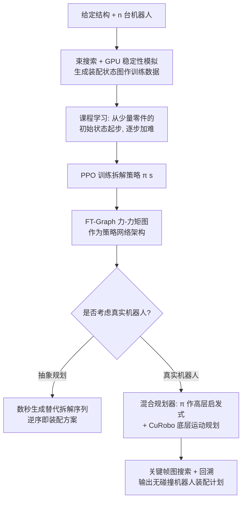

## 一句话总结

本文提出一套强化学习框架，为由刚性零件组成的结构（如砌体拱、穹顶、拱顶）训练一个"拆解策略"网络，让多台机器人在无脚手架的情况下协同装配；一旦真实施工被打乱，网络可在数秒内在线生成可行的替代装配方案，比重跑传统搜索快数百倍。

## 研究背景

砌体建筑、桥梁等由刚性零件组成的结构，传统装配依赖密集脚手架来稳定每一个中间步骤，费时费力。近年的思路是用多台机器人协同装配：机器人临时"托住"零件充当临时支撑，从而免去脚手架。

难点在于**规划**：要保证每一个中间装配状态在重力下都结构稳定，同时零件可沿无碰撞轨迹装入。这本质是一个组合爆炸的 NP 难问题。现有方法几乎都靠离线搜索预计算出**单一**装配方案，一旦真实执行中出现意外——机器人布局改动、零件到货延迟、后续维修更换——预计算方案就失效，而用传统离线方法重算又会造成巨大延误。

作者的核心主张是：不要只算一条方案，而是训练一个能针对**同一结构**快速生成**多种替代方案**的策略，从而在线应对扰动。方法沿用"装配即逆拆解"（assembly-by-disassembly）思路：先规划拆解序列，再逆序得到装配序列——因为逐步移除零件会让问题规模递减，更易处理。文中一个直观反例是：对拱结构，简单的"从高到低"拆解策略会导致中间态失稳，说明拆解策略并不平凡，值得学习。

## 方法

问题抽象为：用 $n$ 台机器人拆解含 $m$ 个刚性零件的结构（$n<m$），机器人可临时托住零件提供支撑。拆解状态 $\bm{s}$ 中每个零件用两个二值标记（是否仍在结构中、是否被机器人托住）；拆解动作 $\bm{a}$ 也用两个二值标记（是否移除、是否托住）。规则：每个零件最多被托一次；同时最多托 $n$ 个；移除前必须先被托住；每步只执行一个动作。目标是训练拆解策略 $\pi(\cdot\mid\bm{s})$，把当前状态映射为下一步动作的概率分布；发生扰动时，从更新后的状态采样 $\bm{a}'\sim\pi(\cdot\mid\bm{s}')$ 即可即时得到替代动作。

关键设计：

**1. GPU 并行稳定性模拟器（ADMM-QP）。** 结构稳定性判定被写成一个二次规划（QP）：

$$\min_{\bm{x}}\ \tfrac{1}{2}\bm{x}^T\bm{Q}(s)\bm{x}+\bm{q}(\bm{s})^T\bm{x}\quad \text{s.t.}\ \bm{b}_l(\bm{s})\le \bm{A}(s)\bm{x}\le \bm{b}_u(\bm{s})$$

关键观察是：改变拆解状态 $\bm{s}$ 并不改变二次项 $\bm{Q}$ 与约束矩阵 $\bm{A}$，只改变边界。作者据此改造 OSQP 的 ADMM 迭代，使核心线性系统的矩阵 $\bm{L}=\bm{Q}+\sigma\bm{I}+\bm{A}^T\bm{\rho}\bm{A}$ 保持常量，可预先求逆 $\bm{L}^{-1}$。由于每步只剩矩阵乘法，同一结构的大批不同拆解状态能在 GPU 上一次性并行求解。为处理"托住零件"改变投影矩阵 $\bm{P}$ 的问题，引入支撑力变量 $\bm{f}$，改写平衡方程为

$$\bm{J}_n^T\bm{\lambda}_n+\bm{J}_t^T\bm{\lambda}_t+\bm{g}+\bm{f}=0,\qquad -[1-\bm{P}]\bm{f}_u\le \bm{f}\le[1-\bm{P}]\bm{f}_u$$

用残余速度 $\bm{v}=\bm{M}^{-1}(\bm{J}_n^T\bm{\lambda}_n+\bm{J}_t^T\bm{\lambda}_t+\bm{g}+\bm{f})$ 判稳：$\|\bm{v}\|_\infty\le 10^{-3}$ 视为稳定。摩擦系数取 $\mu=0.55$，摩擦锥用 8 个切向近似。求解在 H100 上以 FP64 双精度执行。

**2. 课程学习解决稀疏奖励。** 每个训练回合只在结束时给奖励（成功拆完 $+1$、遇到失稳 $-1$），奖励极其稀疏，现成 PPO 对超过 10 个零件的结构几乎采不到一条可行方案，会收敛到"卡住"的局部最优。作者的洞见是：不要一上来就拆整个结构，而从只含少量零件的**部分拆解状态**起步，让 PPO 先拿到正奖励，再随能力提升逐步增加初始零件数。合法初始状态从搜索式装配规划的副产物——**装配状态图**（束搜索生成，节点为稳定状态、边为可行动作）中采样，保证每个节点都有可达的可行拆解路径。

**3. 力-力矩图注意力网络（FT-Graph）。** 策略网络需满足零件索引置换不变、且能利用接触几何（接触点与法向），MLP 不适用。作者提出异构图：含**零件节点**（带"是否被托住"二值与质量属性）、**力节点**（存接触法向 $\bm{n}$）、**力矩节点**（存相对接触点 $\bm{r}_1,\bm{r}_2$，对质心相对以保证平移不变）。共享同一法向的力节点合并；所有零件节点即使不接触也用跳连相连。图经 8 层 GAT（每层 16 隐藏特征，PyG 实现）处理后接线性层输出动作概率。该架构还支持跨结构策略迁移。

**4. 两态间拆解与数据增强。** 扩展策略 $\pi(\cdot\mid\bm{s},\bm{s}_{\text{target}})$ 可规划到非空目标态（用于地震后局部坍塌修复）。相比简单地对基线策略做动作屏蔽，作者把非空目标态的拆解任务加入训练数据，并用后见经验回放（HER）复用失败方案中的成功子段来提数据效率。

**5. 真实机器人混合规划。** 加入零件"可拆解性"约束：预计算 $d\times m\times m$ 的二值查找表 $T$（采样 $d=1000$ 条线性移除轨迹判碰撞），用动作屏蔽禁止非法移除。混合规划器（算法 1）用预训练策略 $\pi$ 作高层启发式采样动作，CuRobo 作底层无碰撞运动规划；引入"关键帧图"——同一抽象状态对应多种机器人关节配置，仅在存在无碰撞过渡轨迹（且假设一次只动一台机器人）的关键帧间连边，用带回溯的树搜索找从完整态到空态的路径。

## 实验结果

**GPU 稳定性模拟器（表 2，与 Gurobi 对比，256 批量）：** 精度均在 99.8% 以上——Bottle-12 为 99.86%、Dog-35 与 Vault-62 达 99.99%、Dome-72 为 99.96%；最差 99.82%。耗时上，Vault-62 从 Gurobi 的 90.32 ms 降至 16.84 ms，Dome-72 从 101.16 ms 降至 15.13 ms；最大结构上平均约 6 倍加速。作者强调该模拟器不会把不稳定态误判为稳定，但可能因迭代不收敛把稳定态误判为不稳定。

**拆解策略（表 3，训练束宽 $W=64$、测试束宽 $W=128$）：** 多数结构测试精度良好——Dog-35 达 98.98%、Dome-72 达 96.40%、Tetris-17 为 92.64%、Bottle-12 为 86.53%。Vault-62 用两台机器人时测试精度仅 38.90%（作者归因于该几何极具挑战、测试分布与训练差异大）；随机器人增多难度下降、精度回升：3 台 53.44%、4 台 69.04%、5 台 70.77%、6 台 78.39%。跨结构迁移上，直接把 Bottle 上训练的策略用于 Dog，在 Dog 训练集上仍达 66% 精度。

**两态间拆解（表 4）：** 扩展策略 $\pi(\cdot\mid\bm{s},\bm{s}_{\text{target}})$ 全面碾压屏蔽式基线 $\pi(\cdot\mid\bm{s})$，例如 Cube-13 从 2.00% 提升到 90.89%、Dog-35 从 0.04% 提升到 90.49%、Tetris-17 从 3.46% 提升到 81.03%。

**网络架构对比（表 5）：** GNN 相比 MLP 泛化显著更好。Bottle-12（2 臂）测试精度 GNN 95.86% vs MLP 88.97%；Vault-62（4 臂）测试精度 GNN 69.04% vs MLP 17.85%，且 GNN 达到该水平所需训练步数更少（67,131 vs 558,351 步）。MLP 还无法做跨结构迁移。

**与深度优先搜索对比：** DFS 能在 0.54 s、82 步内解出 Bottle-12，但在 100,000 步上限内无法为 Dome-37 找到可行方案，印证了可行方案在搜索空间中占比极低的稀疏性问题。

**真实与机器人实验：** 对 Vault，训练好的 RL 策略可在 8 秒内生成替代拆解方案，比重跑搜索式方法（53 分钟）快约 400 倍；两台机器人训练约 21 小时、三台约 9 小时。混合规划器用两台 ABB IRB 2600 装配 Dome-37 平均耗时约 5 分钟，用三台装配 Vault 平均约 96 分钟。物理演示中用两台 ABB GoFa（真空吸盘）装配 Bottle：当底部三个零件到货延迟打乱预定序列时，策略即时生成替代装配方案，真实与仿真位置平均偏差 1.67 mm、最大 5 mm。

## 亮点与局限

**亮点：**
- 把"应对施工扰动"这一真实痛点转化为"针对同一结构快速生成替代方案"，思路清晰且实用；在线推理 8 秒对比离线搜索 53 分钟的 400 倍提速极具说服力。
- ADMM-QP 抓住"状态改变不影响 $\bm{Q}$ 与 $\bm{A}$"这一结构性质，把稳定性判定变成常量矩阵乘法，是让 GPU 大批并行、进而支撑 RL 训练的关键工程洞见。
- FT-Graph 从物理稳定性方程反推出的图结构，天然置换不变、无冗余编码接触几何，并展现出跨结构迁移的潜力，作者展望其作为装配规划"基础模型"的方向。
- 课程学习 + 装配状态图作为合法初始态数据集，干净地绕开稀疏奖励，无需改动奖励函数。

**局限：**
- 一次只允许一台机器人动作、每步只移一个零件、且仅限线性移除轨迹；因此无法处理需要同时移除多个零件的"死锁"结构（如 Bookshelf 例子），也不支持旋拧等非线性动作。
- 刚体平衡法无法检测滑移失稳（会把本应滑落的零件误判为稳定）；交错投影法可修复但即便 GPU 加速也太慢，不适合 RL 训练。
- 不支持"重抓"（放下再重拿），因为会带来无限规划视界。
- 最大测试规模仅 72 个零件；虽然模拟器可验证到 150 个零件，但训练大规模策略仍极耗时，且策略需为每个新模型重训、迁移性有限。
- 混合机器人规划器受运动规划器瓶颈与组合复杂度限制，本文最多只用到三台机械臂。

## 延伸思考

- 作者反复强调 FT-Graph 的跨结构迁移与"基础模型"愿景。若能预训练一个通用装配策略、在新结构上少样本微调，将从"每个模型重训"跃迁到"通用规划器"，这是最有想象空间的方向。
- ADMM-QP"抓住不变量、把重计算变成常量矩阵乘法"的做法，对其他需要在同一系统上反复评估大量微变状态的图形/仿真问题（如接触、约束求解）具有普适的加速启发。
- 当前把装配简化为逆拆解并抽象掉机器人差异，换来了训练可行性，但也把多机并行、动态任务分配、重抓等能真正压缩施工时间的自由度挡在门外；如何在保持训练可行的同时逐步放开这些约束，是通向"真正实时机器人装配规划"的核心张力。
- 课程学习依赖搜索式方法生成的状态图作"脚手架"数据——这形成一个有趣的耦合：学习方法仍需要传统搜索来引导起步，二者是互补而非替代关系。
