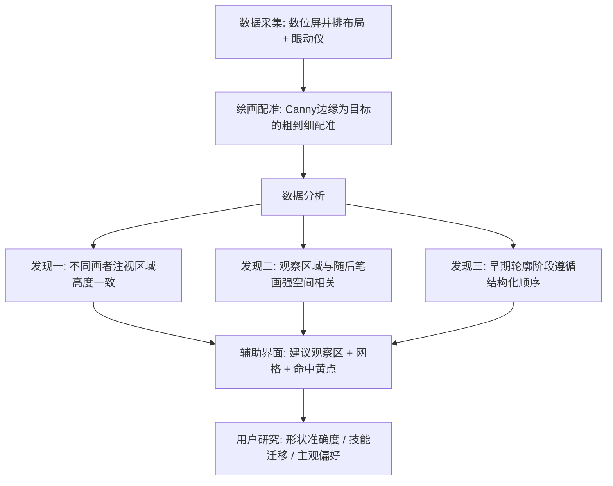

## 一句话总结

用"看参考图、在旁边空白画布上画"的图像到图像（image-to-image）实验范式，同步采集十位专业画者的眼动与笔画数据，量化揭示了"观察区域与随后笔画之间的强空间相关"和"早期轮廓阶段的结构化绘制顺序"，并据此做出一个用专家注视数据实时引导新手观察与落笔的辅助绘画界面，用户研究证明它能显著提升新手的形状准确度。

## 研究背景

绘画的本质在很大程度上是观察。艺术教育界长期认为，多数人手眼协调足以画出清晰线条，真正欠缺的是专业画者那种视觉感知能力（Betty Edwards 的观点）。已有眼动研究也表明，专业画者的注视更受控、更有目的，与手部动作在时间上更一致，而新手的注视则分散低效。

但已有研究有两大局限。其一，以笔画为中心的研究（如识别笔画摆放规律）往往不采集眼动，眼手耦合仍是黑箱。其二，多数感知研究采用传统的"看模型—在纸上画"（model-to-paper）范式，题材狭窄（多为肖像）、度量简单，观察与执行之间存在空间和时间上的错位，使得注视与笔画难以对齐，也难以推广到更一般的绘画任务。因此现有眼动研究大多停留在粗糙的"注视到画布"映射。

本文用图像到图像的并排布局（参考图在左、画布在右，都在同一块数位屏上）来消除这种错位，从而建立注视与笔画之间更直接、更精确的对应关系，进而理解专业画者"边看边画"的机制，并把这种机制转化为对新手的实时辅助。

## 方法

整体框架分三步：先在受控的图像到图像范式下采集专业画者的同步眼动与笔画数据并做配准，再统计分析注视与笔画的空间、时序关系得出三条关键发现，最后把发现落地为一个自适应的实时辅助绘画界面。

关键设计一：数据采集与配准。招募十名画者（六人有三年以上正规训练，四人一年训练，均为右利手），每人画 15 张图、每张限时两分钟，其中前三张对所有人相同以便找共性。设备为 Wacom Cintiq Pro 24 PT 数位屏配 Tobii Pro Spark 眼动仪（60 Hz），自定义网页界面记录带时间戳、笔宽、颜色、不透明度的压感矢量笔画。刺激图取自 SpeedTracer 的 120 张图（从简单物体到复杂场景），共得 156 张画。为把徒手画与图像提示对齐，作者改造了一种粗到细的配准方法：先做全局仿射、再做多尺度 B 样条变换，通过梯度下降最大化徒手画与目标的相关性；与原方法不同，这里用从原图提取的 Canny 边缘作为配准目标，并人工标注每图 20 到 40 个基准点初始化形变场。

关键概念定义了四类数据：注视点（gaze point，眼动仪每秒 60 次记录的屏幕位置）、定影点（fixation point，多个连续注视点落在小圆区域内时取圆心）、笔画（stroke，配准后徒手画中的一笔）、以及定影—笔画对（fixation-strokes pair，一个定影点与从该定影点开始到下一个定影点开始之间所画的笔画）。

关键设计二：三条数据分析发现。

发现一，不同画者是否看相似区域。把每张图划成 $$16\times16$$ 网格统计定影点、归一化成个体热力图，再与所有画者的平均分布做皮尔逊相关，结果 30 个个体分布中有 28 个与平均分布强相关（$$r>0.6$$）。进一步统计定影点两两最近距离直方图：三张提示图上超过 $$65\%$$ 的定影点与另一幅画中的某定影点相距 10 像素以内，只有约 $$1\%$$ 相距超过 50 像素，说明关注区域高度一致。

发现二，人是否画在所看之处。把数据组织成定影—笔画对，用定影点坐标代理观察区、用对应折线所有顶点的几何中心代理笔画位置（多个定影点合并时按定影时长加权平均），得到两组等长二维点。用典范相关分析（CCA）评估两者关系，全部 156 张图 $$p$$ 值均小于 0.05；再用多元线性混合效应模型，把画者 ID 作为分组变量，扣除画者随机效应后固定效应矩阵近似单位阵 $$\begin{bmatrix}0.92 & 0.02\\ 0.02 & 1.06\end{bmatrix}$$，进一步证实观察区域与随后笔画之间存在强空间相关。

发现三，观察与绘制如何随时间演化。与以往沿 $$x$$、$$y$$ 轴分别做时序分析不同，作者用 CCA 把二维定影点和笔画几何中心投影到单一向量上，得到一维坐标序列再与时间相关。散点图显示定影与笔画都呈相似的、类似交错锯齿的循环模式：早期一致地先画轮廓等重要线条，后期细节线条则变异大、无严格顺序。针对每张画前 24 秒，用 CCA 找投影向量 $$v$$ 最大化投影笔画中心坐标与时间的线性相关，156 张画中有 111 张达到显著（$$p<0.05$$ 且 $$r>0.6$$）。再把所有笔画组中心投影到 $$v$$，用 24 秒滑窗做类卷积操作算窗内相关系数波形，同时计算已画笔画凸包面积占最终完整画凸包面积的比例；以相关曲线首次达到最小值处作为轮廓阶段结束点。验证显示轮廓阶段结束时凸包面积比平均达 $$87\%$$，且平均在前 $$37\%$$ 的时间内即完成轮廓，说明画者遵循相似的结构化顺序来完成轮廓。

关键设计三：辅助绘画界面。三条发现分别支撑三点设计：既然注视高度一致，就能用专家注视数据引导画同一张图的新手；又因观察与笔画强相关，可退而用笔画数据来引导观察与落笔顺序，因此系统即便面对没有眼动信息、只有笔画的数据集也能工作，扩大了适用面。界面上用大小不一的红圈标注一次只出现一个的"建议观察区"，在参考图和画布上叠加网格辅助定位，并在参考图上用黄色命中点实时高亮画得准的部分作为反馈；网格与命中点充当空间锚点，抵消用户绘制时的缩放和平移误差，使算法无需重新配准即可理解用户意图。

机制上，把眼动与绘画数据构造成定影—笔画对，每个对内笔画作为一组 $$G_i$$，$$S_{ij}$$ 表示第 $$i$$ 组第 $$j$$ 笔；对每组计算包含所有笔画的外接圆作为候选建议区。开始前，系统以专业画者最初笔画序列对应的组为首个建议区。绘制中在参考图上高亮黄点：把某组内所有专家笔画的顶点设为检查点，用户笔画进入某检查点 10 像素阈值内即"激活"该点，激活点以黄点显示，检查点用 $$kd$$ 树组织以降低计算开销；当一组 $$80\%$$ 的检查点被激活即判定该组完成。当前组完成后，系统在所有组中找最近的下一组，最小化距离函数

$$d(G_j\mid G_i, p) = w_1\cdot d_g(G_i,G_j) + w_2\cdot d_l(p,G_j) + w_3\cdot r(G_j)$$

其中 $$d_g$$ 是 $$G_i$$ 与 $$G_j$$ 检查点间的豪斯多夫距离（每个检查点为三维点 $$(x,y,t)$$，$$t$$ 为归一化时间戳），鼓励自然的局部顺序；$$d_l(p,G_j)$$ 是用户笔画终点 $$p$$ 到 $$G_j$$ 任一检查点的最小距离，尊重用户个人习惯；$$r(G_j)$$ 是 $$G_j$$ 的完成率，用于优先未画区域；权重取 $$w_1=10$$、$$w_2=w_3=1$$。当笔画终点落在当前建议区之外时，用类似的 $$j^{*}=\arg\min_j d(G_i,p,G_j)$$ 搜索，区别在于允许 $$j=i$$ 且 $$d_g(G_i,G_i)=0$$。由此建议区顺序能随用户个人习惯动态调整，而非简单回放专家顺序。

## 实验结果

评价核心指标是绘画准确度 AVGD，即原始画所有折线顶点与配准画对应顶点的平均距离，并用缩放 $$s$$ 和偏移 $$\vec{o}$$ 消除缩放平移带来的非误差偏差：

$$AVGD(V,V') = \min_{s\in\mathbb{R},\ \vec{o}\in\mathbb{R}^2}\ \frac{1}{\vert V\vert }\sum_{i=0}^{\vert V\vert }\lVert s\cdot v_i + \vec{o} - v'_i\rVert$$

主用户研究招募十名几乎无绘画经验的新手，每人画四张图、每张画两次（一次用辅助工具、一次不用），并用交错顺序平衡顺序效应；四张图中两张来自本文含眼动的数据集，一张来自仅含笔画的既有数据集，一张为仅含笔画的描摹数据（后两者按单笔成组适配算法）。

| 研究 | 设置 | 关键结果 |
|---|---|---|
| 形状准确度（主研究） | 10 名新手，40 对画（辅助/无辅助） | 33 对辅助后更准；配对 $$t$$ 检验 $$p=8.07\times10^{-7}$$ |
| 技能迁移研究 | 5 名初学者，先无助画→用界面训练四张→再无助重画 | 5 人中 4 人重画时 AVGD 下降，显示学习迁移 |
| 主观偏好研究 | 25 组三联图，42 名评分者从优到劣排序 | 辅助画平均排名 1.946 优于无辅助 2.572（$$p=6.18\times10^{-64}$$），专家画为 1.482 |

主研究失败的七例主要有两类原因：一是多物体提示图，面向单物体场景调优的注视引导策略难以恰当分配注意力，导致对齐变差；二是细节聚集，当精细特征集中在很小区域时黄色命中点会在该区饱和、遮住参考，妨碍描绘。

## 亮点与局限

亮点在于用图像到图像的并排范式首次较干净地对齐了注视与笔画，避免了传统"看模型—在纸上画"范式的时空错位；贡献了一个含 156 张画、带时间戳笔画与同步眼动的公开数据集；用 CCA、混合效应模型、滑窗相关、凸包面积比等一套统计方法量化出"画在所看之处"和"早期结构化轮廓（平均前 37% 时间完成 87% 凸包）"两条可复用的规律；并把规律转化为一个能容忍缩放平移、且在无眼动数据时仍可工作的自适应辅助界面，三项用户研究一致证明其提升准确度、可迁移、被主观偏好。

局限在于：策略针对单物体场景调优，多物体提示下注意力分配不当；细节高度聚集时命中点会遮挡参考；仍有相当数量（156 张中 45 张）画在早期阶段未表现出显著线性顺序；对那些"看了却没有立即落笔"的定影点只作了简化处理，未深入分析其真实用途。

## 延伸思考

这项工作最有启发的一点，是把"专家的观察策略"当成一种可迁移、可实时投影给新手的显式信号——把难以言传的"会看"拆成注视一致性、注视—笔画相关、结构化轮廓顺序三条可度量的规律，再用界面把它还原为红圈、网格、黄点这类直觉可循的提示。尤其值得注意的是它证明了即便没有眼动设备、仅凭笔画数据也能驱动引导，这意味着这套方法有望脱离昂贵的眼动仪、直接从海量既有笔画数据集扩展开来。顺着作者指出的方向，如何从非眼动数据合成可信的注视引导、如何为多物体和高细节场景重新设计注意力分配与提示密度、以及如何解读那些"只看不画"的定影点，都是把观察建模推向更通用创造力支持工具的自然下一步；更长远看，这类"感知层面的示范"或许比笔画层面的纠正更接近绘画教学的本质。
