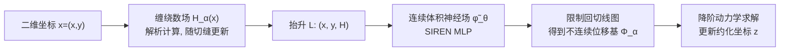

## 一句话总结

本文提出 Wind Lifter：用广义缠绕数（generalized winding number）把二维坐标"抬升"到三维，从而让本来天生连续的神经场能够精确表示切割带来的位移不连续，并支撑可实时、可交互编辑切缝的降阶物理仿真。

## 研究背景

- 领域现状：降阶模型（ROM）通过离线预计算一小组运动模态，在线只解算少量自由度，能把可变形体仿真加速几个数量级。近年来还出现了用神经场表示模态基的做法，其预计算与具体网格离散无关，可跨几何泛化。
- 核心痛点：切割薄壁结构（纸、叶片、织物）会在原本连续的位移场里引入严格的空间不连续。传统基于网格的 ROM 把基函数与离散绑定，切缝一变就要重划网格并重新预计算；而神经场天生连续（谱偏置偏好低频、平滑输出），要么无法表达不连续，要么把不连续"烤进"网络权重里，只能复现训练时见过的那一条切缝，且切缝边界精度受限。
- 本文 idea：不去硬改神经场表达不连续的能力，而是把"学一个不连续场"这个难题转化为"学一个处处连续的体积场"这个更容易的任务——用切线的广义缠绕数作为额外输入维度，把定义域从二维抬升到三维，让切缝两侧原本相邻的点在三维中被拉开距离，不连续则通过把连续场限制回切线图上而自然浮现。

## 方法

整体框架：设二维待求场 $$f:\Omega\to\mathbb{R}$$ 在曲线 $$\Gamma$$ 上不连续。方法引入一个解析的、在 $$\Gamma$$ 上跳变的高度函数 $$H(\boldsymbol{x})$$，用它把点抬升为 $$L(\boldsymbol{x})=(\boldsymbol{x},H(\boldsymbol{x}))$$；再训练一个处处连续的体积神经场 $$\tilde f_\theta$$，最终二维场定义为它在抬升图上的限制 $$f=\tilde f_\theta\circ L$$。切缝的几何完全由 $$H$$ 承载，与网络权重解耦。

关键设计：

1. **抬升与限制（核心）**：因为 $$H$$ 在 $$\Gamma$$ 上跳变，抬升图 $$L$$ 把切缝的正反两侧 $$\Gamma^+$$ 与 $$\Gamma^-$$ 分离到三维空间的不同高度。于是神经场只需拟合一个光滑体积函数，不用去逼近任何尖锐跳变；不连续来自"把连续场限制回这张分离的图"。这既回避了谱偏置难题，又让编辑切缝变成直接修改高度函数 $$H$$ 的事。

2. **缠绕数作为高度函数**：任何在 $$\Gamma$$ 上不连续的函数都可当高度，本文选广义缠绕数场，它是带跳变边界条件的调和函数、可快速求值，形如 $$H(\boldsymbol{x})=\int_0^1 \frac{\Gamma'(s)\cdot(\Gamma(s)-\boldsymbol{x})^{\perp}}{\vert \Gamma(s)-\boldsymbol{x}\vert ^2}\,ds$$。它对开曲线仍有定义（软内外判定），适合表示还没切通的部分切缝，这是 SDF、占据函数等仅适用于闭合边界的描述子做不到的。

3. **渐进切割参数化**：引入 $$\alpha\in[0,1]$$ 表示已切割的比例，只需把缠绕数积分上限改成 $$\alpha$$，即 $$H_\alpha(\boldsymbol{x})=\int_0^{\alpha}\frac{\Gamma'(s)\cdot(\Gamma(s)-\boldsymbol{x})^{\perp}}{\vert \Gamma(s)-\boldsymbol{x}\vert ^2}\,ds$$，同时把体积神经场也以 $$\alpha$$ 为条件。切缝延长、移动或改形只需在运行时重新解析计算缠绕数，无需重训网络、无需重划网格。

4. **降阶建模与训练**：位移场用线性降阶 $$\boldsymbol{u}=\boldsymbol{z}^{T}\boldsymbol{\Phi}_\alpha$$，$$k$$ 个位移基用同一套网络权重输出 $$k$$ 维实现联合训练。训练兼容两种范式：数据驱动（最小化对仿真快照的重建损失）和无数据（直接最小化 StVK 等弹性能，仅靠采样定义域，不需全阶仿真数据）。仿真时每步通过优化更新约化坐标 $$\boldsymbol{z}$$，变形梯度由神经场的空间梯度经自动微分高效得到。此外对裂尖处缠绕数梯度发散（力学中的裂尖应变奇异）用三次样条核在端点邻域做光滑处理。

## 实验结果

主实验为各示例的规模与时间统计（在 NVIDIA RTX 4090 + AMD 7950X 上测得）。相比全空间仿真每帧约 1.1s，本文方法在有切缝变化时仍达 28.5～42.4 fps、无变化时 62～166 fps，速度提升约 30×～183×；训练时间从不到一分钟到不足一小时，远低于动辄数小时/数天的许多神经方法。

| 示例 | 顶点数（k） | 训练时间（s） | 有切缝变化每步（ms） | 无切缝变化每步（ms） |
|------|------|------|------|------|
| hand | 50 | 53 | 23.56 | 8.57 |
| leaf | 50 | 78 | 25.40 | 9.96 |
| butterfly | 90 | 73 | 34.86 | 14.89 |
| helical | 100 | 161 | 35.32 | 14.77 |
| generalization | 100 | 81 | 35.11 | 15.15 |
| kirigami | 137 | 2760 | 30.95 | 16.01 |
| slit | 20 | 1740 | 25.33 | 6.02 |

其余关键结论以文字补充：在数据驱动设置下与 LiCROM、Simplicits、以及把 LiCROM 的 MLP 换成 DANN 的基线对比，训练集上所有数据驱动方法重建误差均低于 0.14%，本文误差最低；在相同网络规模与激活下，本文相较 LiCROM 把均方误差降低约一个数量级且收敛更快。对训练中未见的切缝形状，仅需把 $$\Gamma$$ 更新到新位置即可适应而无需重训，当测试与训练切缝的归一化间隙差异低于 15% 时无明显视觉瑕疵；无数据基线 Simplicits 因内建连续性会把切缝两侧"粘"在一起。作者还用真实纸张剪出螺旋切缝，其最终下垂状态与仿真结果吻合。

## 亮点与局限

- 亮点：
  - 把"学不连续场"这一神经场公认难题巧妙转化为"学连续体积场"，思路干净、数学清晰。
  - 不连续与网络权重解耦，切缝可在仿真过程中实时延长、移动、改形，支持交互式切缝设计——这是把不连续烤进权重的纯神经场方法（如 LiCROM）和依赖网格的方法都难以做到的。
  - 无数据训练也能表示不连续，且做到实时（数十 fps），相对全空间仿真有几十到上百倍加速。
  - 对未见切缝位置具备一次性泛化能力。

- 局限：
  - 未处理碰撞与自碰撞，而真实应用中相互接触的响应往往关键。
  - 切缝表示限于分段线性折线，尚未支持贝塞尔等高阶参数曲线。
  - 面对与训练分布差异显著的缠绕数分布（明显的分布外场景）性能下降，泛化仍有边界。
  - 方法聚焦二维域上的薄壁结构。

## 延伸思考

- 缠绕数天然支持开曲线的"软内外判定"，这一点是它优于 SDF / 占据函数的关键，也提示在其他需要表示演化中开放边界（如渐进裂纹、未闭合边界层）的问题里，缠绕数抬升可能同样有用。
- 论文末尾提到一个值得追问的方向：既然神经场本身是体积的，能否用多张缠绕数图（多个候选切缝位置）同时监督同一个体积场，从而进一步提升切缝泛化能力，这几乎是"一份连续表示服务一族不连续"的自然延伸。
- 把切缝几何与网络权重解耦、让编辑等价于改一个解析高度函数，这种"连续骨架 + 解析调制"的范式或可迁移到其他需要可编辑不连续/尖锐特征的神经表示任务（如带锐边的隐式几何、带界面跳变的物理场）。
