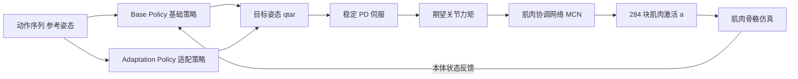

## 一句话总结

MAGNET 通过一套"两级控制器 + 三阶段学习"的肌肉骨骼仿真框架，让一个装配 284 块肌肉的类人角色在追踪大规模、跨度极广的人类动作（从走路到后空翻）时，重建出全身、生理上可信的肌肉激活信号，并进一步蒸馏出可解下游任务和可在边缘设备实时预测的两个轻量版本。

## 研究背景

- 领域现状：理解人在运动中的肌肉激活对揭示运动本质、评估疲劳与疾病都很关键。但采集肌肉激活的手段仍很受限——表面肌电（EMG）受皮下组织与脂肪干扰、测不到深层肌肉（如胫骨后肌）；针式/线式的肌内 EMG 虽准但限制动作范围、还有感染风险。基于深度强化学习的肌肉驱动角色被视为一种非侵入式的替代方案。
- 核心痛点：现有的肌肉驱动控制器能力有限——要么只能做走路等特定动作、需逐动作训练，要么只在动作幅度小的小规模数据上训练。把肌肉驱动控制器扩展到大规模数据集很难，根源在于肌肉动力学本身的复杂性和肌肉骨骼仿真的高计算开销，力矩驱动角色那套强化学习范式直接搬过来往往会失败。
- 本文 idea：提出一个可扩展框架 MAGNET，用约六小时的多样人类动作（LAFAN 数据集加镜像增广，再叠加 Mixamo 里的高难动作如后空翻、侧手翻）训练。核心是一个新的分层控制器结构配合三阶段学习法，显著提升可扩展性与稳定性；再通过蒸馏得到面向下游任务的 DT-MAGNET 和面向实时的 RT-MAGNET。

## 方法

整体框架：MAGNET 把"控制策略"与"肌肉动力学"解耦。一段人体动作序列输入后，两个策略网络给出相对参考姿态的偏移，合成目标姿态交给稳定 PD 伺服算出期望关节力矩；再由肌肉协调网络（MCN）反解出这套力矩对应的 284 块肌肉激活，最后把肌肉力作为外力驱动刚体骨架仿真前进。

关键设计分为以下几点：

- **肌肉骨骼角色建模**：骨架由 23 块刚体骨骼经机械关节连成铰接刚体系统，肢体用胶囊、躯干与头用长方体做碰撞近似；共 284 块肌肉做驱动，多数用线段建模，起止点取自人体解剖，大肌肉（如股直肌）用多段线段近似、跨多关节的肌肉（如腰大肌）用线段序列表示。肌肉激活经 Hill 型模型转为物理力。关节处肌肉能产生的力矩可写成 $$\tau_t = J(q)F_a(l,\dot l)\,a + J(q)F_p(l,\dot l) = A a + p$$ ，其中激活 $$a \in [0,1]$$ 缩放主动收缩力。

- **两级控制器 + 适配策略**：基础策略网络与适配策略网络各输出一份姿态偏移，二者相加得到 $$\Delta q_{tar} = \Delta q_{base} + \Delta q_{adapt}$$ ，与参考姿态相加即目标姿态。这一两级设计的灵感来自已有工作，但本文额外加入"适配策略网络"，专门吸收把控制器扩展到多样动态动作时产生的误差。为应对海量动作，基础策略采用专家混合（mixture-of-experts）：把大数据集切成子集、各训一个专家，再用门控网络协调。

- **三阶段学习**：解耦虽然让监督学习专注肌肉动力学、降低强化学习维度，但当参考动作变得多样时，MCN 的损失无法回传给策略网络，导致策略可能索要 MCN 根本给不出的力矩，越训越糟。为此拆成三阶段——**阶段一**只对力矩驱动的类人角色训基础策略，奖励项 $$r_t = r_q\cdot r_v\cdot r_{com}\cdot r_{ee} + r_\tau$$ 分别约束关节角、角速度、质心、末端执行器并惩罚过大力矩；**阶段二**换上肌肉驱动角色、加入 MCN，用仿真采样元组以监督方式训练 MCN，使其反解力矩逼近期望；**阶段三**再加入适配策略网络，与 MCN 联合微调、基础策略冻结。

- **期望力矩裁剪**：阶段一里把期望力矩按当前姿态下肌肉可产生的力矩上下界裁剪 $$\tau^{des,clip}_t = \mathrm{clip}(\tau^{des}_t, \tau^{max}_t, \tau^{min}_t)$$ ，确保策略输出落在肌肉动力学真正可实现的范围内，避免策略与 MCN 失谐。阶段三里因两者已协调好，裁剪被关闭。

- **两个蒸馏版本**：DT-MAGNET 用条件 VAE 做关节级蒸馏，模仿两条策略网络的合成输出，训练后把编码器换成任务策略、在低维隐空间里探索即可高效解下游任务；RT-MAGNET 是轻量网络，直接吃 3D 关节位置序列（23 关节、90 帧对应 3 秒），用卷积提局部时序特征、Transformer 抓全局时序、MLP 预测肌肉激活，绕过运行时仿真。

## 实验结果

论文的验证以定性演示和图示为主，最具体的量化结论集中在三阶段学习与力矩裁剪的消融，以及与现有方法 MuscleVAE 的训练效率对比。下表按"配置/方法 × 任务 × 训练消耗 × 结果"整理这些核心对比（数字忠于原文）：

| 配置/方法 | 任务 | 训练消耗 | 结果 |
|------|------|--------|------|
| MAGNET 三阶段 | 后空翻（动态） | 少于 50M 仿真元组，壁钟快 2~3 倍 | 成功，质量更高 |
| 单阶段方法 MASS[2019] | 后空翻（动态） | 更多 | 奖励低于 150，失败 |
| 带力矩裁剪 | 后空翻 阶段三 | 少于 3M 元组 | 成功追踪 |
| 不带力矩裁剪 | 后空翻 阶段三 | 超过 10M 步 | 仍失败 |
| MAGNET | 与 MuscleVAE 同数据集 | 单台桌面 48 小时 | 稳定追踪 |
| MuscleVAE[2023] | 同上 | 约一周 | 俯卧撑完全失败等 |

其余关键结论用文字补充：

- **多样动作追踪**：对转身、跳舞等中低能量动作，后空翻、侧手翻、跳踢等高动态动作，以及跌倒、爬行等接触密集动作，MAGNET 都能追踪并生成与动作物理上自洽的激活模式（如侧手翻时支撑肢的股直肌、肱二头肌被适时激活）。对训练集内外的动作都能免额外训练地追踪。
- **生理可信度**：在生物力学有共识的对照上，MAGNET 复现出正确规律——长弓步更多调动髋伸肌（如臀大肌）、短弓步更多调动膝伸肌（如股四头肌）；宽蹲比窄蹲更多激活内收肌与臀大肌。与真实 EMG 对比（深蹲、出拳、二头弯举）时，股直肌、肱三头肌、肱二头肌的预测激活与 EMG 趋势相近；差异主要出现在深蹲时的胫骨前肌与出拳时的肱二头肌，作者归因于仿真角色与真人体型差异或视频动捕噪声。
- **实时性**：RT-MAGNET 的推理速度约为原始 MAGNET 的 8 倍，代价是缺少后端仿真、生理可信度略降，适合边缘设备实时应用。
- **下游任务**：用 DT-MAGNET 的解码器作低层策略、由高层强化学习策略调制隐变量，可完成交互式方向控制，表现敏捷稳健。

## 亮点与局限

- 亮点：
  - 用两级控制器加三阶段学习 + 力矩裁剪，实打实解决了"肌肉驱动控制器难以扩展到大规模多样动作"的老问题，训练效率相较此前方法有数量级差距（48 小时 vs 约一周）。
  - 覆盖动作谱系极广，且生成的激活能与生物力学与真实 EMG 的已知规律对上，说明结果不是"看起来像"而是有生理依据。
  - 一套框架蒸馏出下游任务版和实时版，工程落地价值明确，覆盖从虚拟制作到生物力学分析与健康医疗。

- 局限：
  - 某些行为（如起身）在控制出问题、角色进入不可恢复状态时会失败。
  - 肌肉骨骼系统本身"过定"——同一关节状态可由不同肌肉激活组合产生（如无外载时肌肉松弛或紧张），对这类歧义情形处理吃力；作者认为引入稀疏 EMG 等多模态输入或可缓解。

## 延伸思考

- 本文把"物理仿真产生的肌肉激活"当作一种可规模化生产的标注来源，天然适合喂给机器学习：既能训练 RT-MAGNET 这类"动作到激活"的生成模型，也可能成为动作理解、动作生成任务的新监督信号，这条"用仿真造数据"的路线值得关注。
- 与近期"用仿真肌肉激活理解人体动作"的数据集类工作（如 Muscles in Time）思路互补：一边造大规模仿真标注、一边学理解，二者结合或能推动无侵入肌肉活动估计走向实用。
- 过定系统带来的激活歧义是根本难点，把稀疏 EMG、外载估计等物理先验作为额外约束融入控制与反解，可能是提升生理可信度的关键方向。
