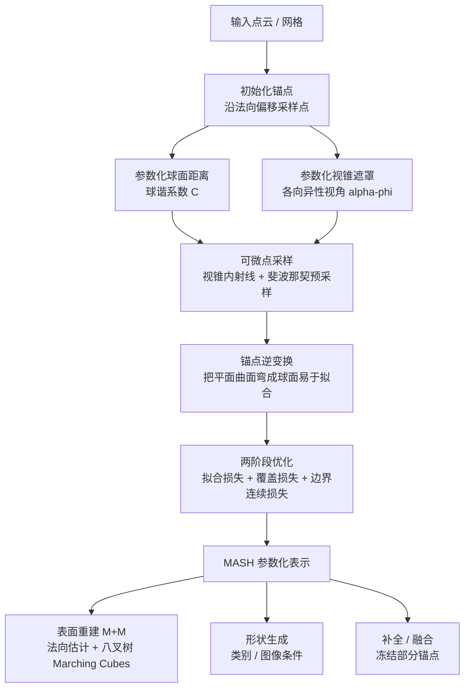

## 一句话总结

MASH 把一个 3D 形状表示为一组"锚点 + 带遮罩的球面距离函数"，用球谐系数紧凑编码每个锚点观察到的局部曲面片，并配套一套可微优化把任意点云转成该参数化表示，从而在表面重建、形状生成、补全与融合等任务上同时具备隐式表示的连续性与显式表示的可编辑性。

## 研究背景

3D 形状表示长期在"表达能力"与"紧凑性、可编辑性"之间难以两全。点云无序难处理，网格拓扑复杂难以编码与生成，体素随分辨率内存爆炸。神经隐式表示（尤其以有符号距离函数 SDF 为核心）虽然连续、能处理复杂拓扑，但一个采样点只存储一个到表面的最近距离，信息量低、需要大量采样才能刻画表面，且隐式特征难以进行显式编辑。

作者从多视角几何的视角重新审视这个问题：把空间中每个点看作一个"观察视点"，从该点向各方向投射射线，可以观察到丰富的局部表面信息。当每个点携带的信息量提升后，刻画同一表面所需的点（视点）数量就能大幅减少，从而在表达能力与紧凑性之间取得更好平衡。这种"感知式"的表示还天然强化了对形状的整体理解，对单视图重建、形状补全、文本生成 3D 等因输入稀疏而病态的任务尤为关键。与之最相关的先前工作 ARO-Net 也利用一组锚点的局部观察，但其观察是面向查询点做占据预测，既无参数化也无优化过程；MASH 则通过直接从点云优化得到显式的参数化表示。

## 方法

### 整体框架

MASH 用一组锚点表示形状，每个锚点 $$A = \{p, v, C, V\}$$ 包含：位置 $$p$$、视向 $$v$$、刻画球面距离的球谐系数集合 $$C$$、以及定义视锥遮罩的参数集合 $$V$$。给定形状后，通过可微优化求解全部锚点参数，再从中采样点并做等值面提取得到网格。

### 关键设计

参数化球面距离：用球谐（SH）的线性组合表示以锚点为中心的球面距离函数

$$d_C(\theta,\phi) = \sum_{l=0}^{L}\sum_{m=-l}^{l} C_l^m Y_l^m(\theta,\phi)$$

其中 $$Y_l^m$$ 是频率 $$l$$ 的球谐基，$$C_l^m$$ 为组合系数。直接用 SH 逼近整个球面距离函数会遇到跨越不连通曲面区域或视界时的不连续问题，这正是 MASH 引入遮罩的动机。

参数化视锥遮罩：普通右圆锥只能在球面上界定圆形区域，无法刻画自由形状的曲面边界。作者把视锥推广为带各向异性视角 $$\alpha(\phi)$$ 的广义视锥，$$\alpha(\phi)$$ 是周期函数，用三角插值逼近

$$\alpha(\phi) = \pi\sigma\left(a_0 + \sum_{k=1}^{K} a_k \cos(k\phi) + \sum_{k=1}^{K} b_k \sin(k\phi)\right)$$

配合 sigmoid $$\sigma(x) = \frac{1}{1+e^{-x}}$$ 把视角限制在合理范围。遮罩把 SH 逼近区域约束在一个局部片上，使得低阶 SH 也能忠实拟合。

可微点采样：在视锥内采样射线等价于在曲面片上采样点。每条射线由 $$\{\omega,\phi\}$$ 两参数确定，$$\phi$$ 定位遮罩边界点，$$\omega\in[0,1]$$ 通过球面线性插值 slerp 确定从中心到边界的内部方向。最终曲面点为

$$\hat{p}(\omega,\phi) = p + R_v \cdot d(\omega\alpha(\phi),\phi) \cdot r(\omega,\phi)$$

其中 $$R_v$$ 是由 $$v$$（存旋转轴与旋转角而非直接视向）决定的旋转矩阵。为避免均匀采样在远端稀疏，作者先用斐波那契采样在单位球上预采点，再筛选落在视锥内的方向作为射线，保证曲面片上采样更均匀。

锚点逆变换：目标是在固定 SH 阶数下增大单个锚点可覆盖的可见区域。借助逆变换把待拟合曲面绕锚点"弯曲"成更接近球面的形状，使 SH 更易拟合、拟合误差更低，从而单锚点覆盖区域更大。逆变换以 $$O = -h\cdot z$$ 为中心（$$h$$ 用首个 SH 系数 $$C_0^0$$ 近似），逆球半径 $$R = 2C_0^0$$。

损失函数：基于 L1 Chamfer Distance 拆出拟合损失 $$L_f$$（让采样点靠近输入）与覆盖损失 $$L_c$$（让采样点尽量覆盖输入），并新增边界连续损失 $$L_b$$ 提升相邻锚点遮罩边界处的连通性。总损失

$$L = \omega_f L_f + \omega_c L_c + \omega_b L_b$$

所有公式均有解析表达，可用链式法则对全部参数求导，整套优化可微。

两阶段优化：先设 $$\omega_b=0$$、$$\omega_f=1$$、$$\omega_c$$ 从 0.5 线性升到 1，让锚点展开覆盖表面；当覆盖率达到 80% 后进入第二阶段，把 $$\omega_b$$ 从 0 线性升到 1，在继续拟合表面的同时增强相邻锚点的连通性，直至收敛。

## 实验结果

默认设置 $$M=400$$、$$K=3$$、$$L=2$$，单个物体在单张 RTX 4090 上平均约 39 秒拟合完成，其中损失项计算约占 80% 时间。

表面重建（ShapeNet-V2，L1-CD 已乘 1000；M+M 为 MASH 转网格方案，FPS 为最远点采样变体）：

| 方法 | L1-CD↓ | L2-CD↓ | FScore↑ | $$D_H$$↓ | $$S_{cos}$$↑ | NIC↓ |
|------|--------|--------|---------|------|---------|------|
| SPR | 89.565 | 429.112 | 0.497 | 0.272 | 0.684 | 65.023 |
| PGR | 6.381 | 26.876 | 0.988 | 0.023 | 0.974 | 19.178 |
| CONet | 17.732 | 72.523 | 0.812 | 0.131 | 0.821 | 29.810 |
| ARO | 15.697 | 66.051 | 0.880 | 0.117 | 0.898 | 23.035 |
| M+M | 5.450 | 22.523 | 0.997 | 0.019 | 0.980 | 18.040 |
| MASH | 4.944 | 2.268 | 0.998 | 0.013 | 0.984 | 13.346 |
| FPS | 4.782 | 1.871 | 0.999 | 0.012 | 0.991 | 6.230 |

MASH 在全部指标上优于各基线，尤其在细节（薄结构、密集网格）与噪声鲁棒性方面表现更好。

类别条件生成（ShapeNet-V2）：

| 方法 | R-KID↓ | R-FID↓ | P-KID↓ | P-FID↓ |
|------|--------|--------|--------|--------|
| LN3Diff | 0.222 | 247.379 | 0.792 | 150.578 |
| 3DShape2VecSet | 0.138 | 173.649 | 0.146 | 38.021 |
| Ours | 0.136 | 163.473 | 0.093 | 30.344 |

在相同网络骨干下，训练与采样时间均不到 3DShape2VecSet 的三分之一，得益于 MASH 的紧凑性。

图像条件生成（Objaverse-82K）：

| 方法 | L1-CD↓ | R-KID↓ | R-FID↓ | P-KID↓ | P-FID↓ | ULIP-I↑ |
|------|--------|--------|--------|--------|--------|---------|
| InstantMesh | 23.112 | 0.056 | 179.755 | 0.079 | 74.720 | 5.552 |
| Make-a-Shape | 31.105 | 0.032 | 161.428 | 0.074 | 49.857 | 7.360 |
| Hunyuan3D-1 | 11.227 | 0.023 | 160.322 | 0.036 | 51.534 | 6.367 |
| Ours | 9.555 | 0.018 | 156.141 | 0.005 | 25.074 | 7.530 |

MASH 生成结果在多数指标上更优，能更好地保持输入图像中物体的拓扑并恢复完整几何。

## 亮点与局限

亮点：

- 单个球面距离函数比 SDF 的单一最近距离信息量大得多，约 400 个球谐函数即可紧凑刻画一个形状，同时保持局部曲面的平滑与连续。
- 遮罩机制让低阶 SH 也能忠实逼近每个曲面片，并在不同锚点间平衡以避免冗余；逆变换进一步扩大单锚点覆盖范围。
- 参数化表示天然可作为形状嵌入直接用于生成，生成网络输出可解释的 MASH 参数而非不可解释的隐式特征，收敛更快、训练/采样成本显著更低。
- 基于块的局部支撑使得冻结任意锚点子集即可实现部件条件生成、补全与融合，这是纯隐式表示难以做到的显式编辑能力。

局限：

- 当前表示只考虑几何，未纳入纹理。
- 初始化把锚点均匀分布在数据上，有时导致次优拟合，缺乏对形状自适应的锚点分布。
- 训练所用数据集与生成网络规模都相对较小，生成结果的几何细节仍有较大提升空间。

## 延伸思考

MASH 的核心洞见是"用信息更丰富的局部观察换取更少的采样单元"，这条思路与近年 3D 表示追求的紧凑可编辑嵌入高度契合。把球谐 + 遮罩视锥当作一种"参数化局部曲面片字典"，不同形状可以共享相似局部片，这也是其生成模型易训练的原因之一，值得思考能否迁移到纹理、材质甚至动态形状的联合参数化。另一方面，锚点分布的自适应（例如让优化在高曲率或薄结构区域自动加密锚点）与更大规模数据上的生成器扩展，是把该表示从"精确重建工具"推向"通用 3D 生成骨干"的两个关键缺口。逆变换把平面弯成球面以适配 SH 的技巧也颇具启发，提示在选定基函数后，通过对目标域做可逆几何重参数化来降低拟合难度，是一种通用的表示设计策略。
