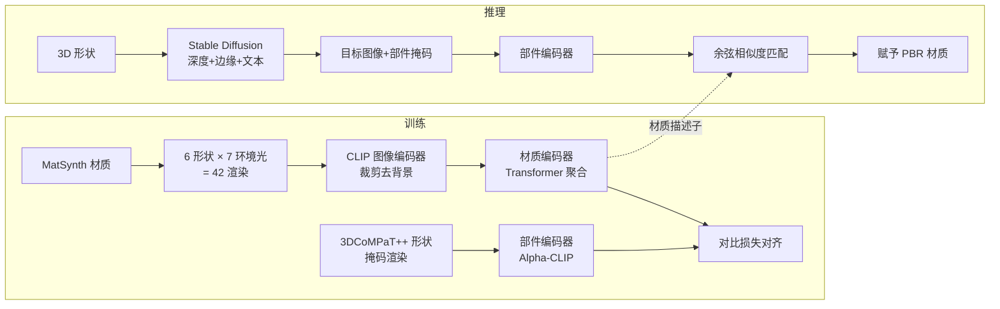

## 一句话总结

MatCLIP 通过在多种形状与光照下渲染材质、并扩展 Alpha-CLIP 学习一套对形状和光照不敏感的材质描述子，使得可以直接从一张图片（如扩散模型输出或照片）为 3D 物体各部件稳健地匹配数据库中的 PBR 材质，Top-1 分类准确率达到 76.69%，比 PhotoShape、MatAtlas 等方法高出 15 个百分点以上。

## 研究背景

- 领域现状：给 3D 模型赋予逼真材质是长期难题。现有做法一类是从材质库里程序化地按预定义"物质类别"（如布料、皮革）挑选材质；另一类是把 3D 形状匹配到纹理相似的库存照片。条件化的潜在扩散模型（LDM，如 Stable Diffusion、Flux）能根据深度图与文本提示生成看起来合理的 RGB 图像。
- 核心痛点：程序化方法只保证材质落在正确的物质类别里，却无法考虑部件之间的相互关系，也难以与几何、风格对齐，结果往往不协调。库存照片匹配会带来几何错配且受限于已有设计。而 LDM 只能产出静态 RGB 图像，无法直接给出可用于实时渲染的、带贴图的 PBR 材质。更根本的问题是：PBR 材质在不同视角、形状、光照下呈现出动态外观，要把这种材质与一张静态图片对应起来本身就很困难。
- 本文 idea：不去生成材质，而是从公开的高质量材质库（MatSynth）里"检索并赋值"。为此需要一种对形状与光照鲁棒的材质表征——把每种材质在多种基础形状 × 多种环境光下渲染成一组图像，用 CLIP 编码成一个"外观分布"式的描述子；同时用 Alpha-CLIP 编码输入图像中被掩码的部件，两者在同一 CLIP 空间里用对比学习对齐，从而实现从图片到 PBR 材质的稳健匹配。

## 方法

整体框架：MatCLIP 是一个双编码器的对比学习模型。材质编码器 $$E_{material}$$ 把一种 PBR 材质在 42 种渲染条件下的图像编码成一组向量再经 Transformer 聚合成鲁棒描述子；部件编码器 $$E_{part}$$ 把输入图像中被掩码的某个部件编码成一个 CLIP 式向量。训练时用对比损失把"材质"与"对应部件"在 CLIP 空间对齐。推理时，先用 Stable Diffusion 从 3D 模型的深度、边缘、文本条件生成一张合理的目标图像并分部件掩码，再用余弦相似度把每个部件匹配到 MatSynth 里最合适的材质。

关键设计：

1. **形状/光照鲁棒的材质表征**：作者认为 Alpha-CLIP 直接对材质渲染做掩码嵌入并不合适，因为它会保留掩码形状和背景上下文，引入无关信息。为此改用另一种预处理——由于材质渲染用的是规则参考形状（球、锥、平面、环面等），直接在感兴趣区域内计算最大内接矩形裁剪出纯材质纹理区域（不含任何背景像素），再送入标准 CLIP 图像编码器。每种材质用 $$n_{env}=7$$ 个环境光 × $$n_{shapes}=6$$ 个基础形状 = 42 张渲染，把这 42 个 CLIP 嵌入排成序列输入材质分支，让模型学到一种更鲁棒的"外观分布"而非单张外观。

2. **借用 Alpha-CLIP 架构做材质对齐**：MatCLIP 的骨架借鉴 Alpha-CLIP（它把文本与图像的掩码区域对齐）。这里把 Alpha-CLIP 的文本编码器替换成 $$E_{material}$$，用它处理 PBR 材质的渲染集合，经一个线性层映射到 Transformer 输入维度后再过 Transformer 得到材质描述子；并行地，$$E_{part}$$ 以 RGBA 图像为输入编码被掩码的部件。训练遵循 CLIP 的对比损失，把对应的材质-部件对拉近、无关对推远。基础模型为预训练的 ViT-B/16 版 Alpha-CLIP。

3. **公开可复现的数据构造**：材质来自 MatSynth（4000+ 张 4K 高分辨率 PBR 材质，含 basecolor、normal、height、roughness、metallic 等贴图），针对椅子选取 5 个适用物质类别共 1600 种材质，渲染出 67200 张材质图。形状来自 3DCoMPaT++，随机给部件赋材质、随机视角（360° 方位、0°–90° 仰角）与同一组 HDR 环境光渲染，得到 5.3 万张图、超过 20 万个部件样本。渲染用 Blender 的物理路径追踪器，固定 UV 映射以保证材质物理尺度一致。

4. **用扩散模型驱动材质选择**：由于材质赋值的真实分布未知，作者借助 LDM 隐含的"部件间材质如何搭配"的知识。目标图像 $$I_{target}$$ 由 Stable Diffusion（或 Flux）在深度图 $$I_{depth}$$、Canny 边缘（在灰模渲染上提取，保留细线、布条等细节）与 ChatGPT 建议的文本提示共同条件下生成，兼顾几何精度与材质多样性；随后按部件生成掩码，交给 MatCLIP 匹配材质。

## 实验结果

主实验为跨四种条件的材质分类准确率对比（在 MatSynth/3DCoMPaT++ 上，用余弦相似度从整个材质库检索，不限制到物质类别）。MatCLIP 在主评测上 Top-1 达 76.69%、Top-5 达 89.02%，全面超越加强过骨架（ViT-B/16）的 PhotoShape 与 MatAtlas；在未见形状、未见光照、未见材质三种泛化设定下也均领先。注意"未见材质"一栏是在人工标注的 LDM 输出上做物质级评估，与其他列不直接可比。

| 方法 | 主评测 T-1↑ | 主评测 T-5↑ | 未见形状 T-1↑ | 未见光照 T-1↑ | 未见材质 T-1↑ |
|------|------|------|------|------|------|
| PhotoShape (ViT-B/16) | 60.86 | 78.23 | 40.42 | 19.70 | 44.27 |
| PhotoShape (ResNet-50) | 58.76 | 77.62 | 38.71 | 20.67 | 49.07 |
| OpenCLIP (v2) | 19.90 | 35.34 | 16.07 | 13.70 | 44.65 |
| MatAtlas (v1) | 18.77 | 36.79 | 14.20 | 11.97 | 52.94 |
| MatCLIP（本文） | 76.69 | 89.02 | 54.74 | 35.31 | 55.47 |

其余实验用文字补充：消融研究表明形状与光照的多样性都很关键——只用单一平面形状 + 单一环境光时验证准确率仅 7.01%，而完整模型（6 形状 × 7 环境光）达到 60.54%（该消融用的是前 9000 步的验证准确率，与主表指标口径不同）。用户研究（MTurk，506 张贴图椅子、1012 次成对判断）中，77.37% 的判断认为 MatCLIP 的赋值比 3DCoMPaT++ 的程序化方法更合理。泛化到未见材质时 Top-1 从 76.69% 降到 55.47%，作者归因于人工标注真值本身存在主观不确定性。

## 亮点与局限

- 亮点：
  - 抓住了 PBR 材质"动态外观"这一核心难点，用"多形状 × 多光照渲染 + CLIP 嵌入序列 + Transformer 聚合"构造出对形状与光照鲁棒的材质描述子，且仍处在 CLIP 空间内，这是相对以往 CLIP 材质检索工作的关键新意。
  - 全流程依赖公开数据集（MatSynth、3DCoMPaT++）与开源基础模型，强调可复现与可访问性，承诺公开代码与数据。
  - 检索式赋值绕开了纹理生成与 SVBRDF 估计的高分辨率、一致性难题，直接复用高质量 4K 材质。
- 局限：
  - 依赖 Stable Diffusion 生成目标图像，当扩散模型引入原形状不存在的几何细节（如额外褶皱）时，会导致材质匹配失真。
  - 当材质库中没有真正匹配的材质时无解，检索天花板受限于库。
  - 定量泛化到未见材质仍有明显差距（55.47%），且训练只用了椅子这一类形状，作者认为扩充形状与光照种类可进一步提升。

## 延伸思考

- 方法本质是"用扩散模型的搭配知识引导 + 用鲁棒嵌入做检索"，把生成模型的语义先验与材质库的物理质量解耦，这种"生成提议、检索落地"的思路可迁移到纹理、贴图、甚至光照/相机参数的赋值上。
- 作者提到的未来方向很自然：把 MatCLIP 从"检索"扩展为"分类器引导的扩散式材质优化"，即用这套鲁棒嵌入作为可微引导信号去优化材质，而不仅是最近邻匹配，这可能突破材质库上限。
- 材质描述子对光照/形状不变的构造，与逆向渲染、SVBRDF 解耦中"分离材质与光照"的目标相通，值得思考能否与内在图像分解、可微渲染结合以获得更强的物理一致性。
