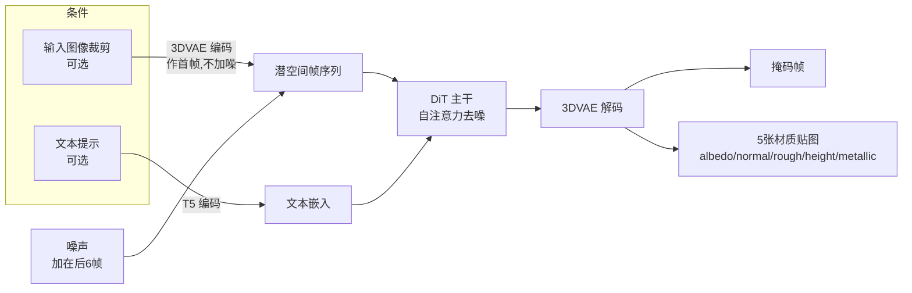

## 一句话总结

把一个预训练的文生视频 DiT 模型微调成"材质生成器"——将 PBR 材质的各张贴图当作视频里的连续帧来生成，从而支持用文本、图像（哪怕是带扭曲、遮挡、斜视角的自然照片）或两者混合作为条件，"一键"抠出高质量、已矫正透视的可渲染材质。

## 研究背景

高质量材质是照片级渲染与虚拟环境搭建的核心资产。传统材质采集要在已知光照与相机位姿下拍摄几十到上百张样本；即便近年的单/少图采集方法也普遍施加严格约束：要求相机闪光灯作为唯一光源、要求正面平行（fronto-parallel）拍摄平整样本。这让"随手用自然照片造材质"变得困难——真实照片里的材质往往被斜视、透视扭曲甚至部分遮挡。

另一条路是生成式材质模型。GAN 与扩散模型让无条件/文本条件的材质生成成为可能，但这些方法几乎都存在两个共性问题：

- 大多**从零训练**，只用合成材质数据（数据集规模有限），因此生成多样性受限，远不及在大规模自然图像上训练的通用文生图/文生视频模型。
- 为了输出多通道材质，往往需要**大改架构**（例如改造 VAE 让其输出多通道），这又进一步破坏了原有的大模型先验；而依赖 ControlNet 对齐输入的方法（如 ControlMat）要求输入与输出像素对齐，无法处理透视扭曲。

与本文最接近的 Material Palette 虽支持单张非正面照片抽取材质，但它对每张图都要用 LoRA/DreamBooth 优化一个"概念"，单图耗时长达 3 分钟，且难以复现结构化纹理。作者由此提出 MaterialPicker，目标是既继承大规模视频扩散先验、又能鲁棒地从"野外照片"中抠材质。

## 方法

### 核心思路：材质贴图 = 视频帧

材质用一组 2D 贴图表示：albedo（基础色）、normal（法线）、roughness（粗糙度）、height（高度）、metallic（金属度）。作者的关键洞察是：把这 5 张贴图**堆叠成一段 5 帧、fps=1 的"视频"**，就能直接复用文生视频 DiT 模型（架构类似公开的 HunyuanVideo），只需极小的架构改动。这样做的好处：

- DiT 处理的是 token 化数据（而非 U-Net 那样的固定尺寸张量），帧数可变，天然支持"生成任意张贴图"，未来还能在序列末尾追加新帧（如 opacity 贴图）来扩展。
- 视频模型自带的**时序一致性**先验，在这里被转译为"各张材质贴图之间的空间对齐一致性"——模型隐式学到"首帧之后的帧应保持时序连贯"，正好契合各贴图通道需要保持一致的需求。
- 相比卷积架构（如 SDXL），DiT 不偏好输入-输出的像素对齐，因而能容忍透视扭曲与相机位姿变化带来的像素错位。作者初步实验显示卷积架构结果更差。

### 图像条件与掩码

对于图像条件生成，输入图像 $I$ 被当作"第一帧"，模型像做视频续帧一样生成后续的材质帧；自注意力机制得以在输入图像与预测贴图间联合推理，同时容忍透视错位。

此外模型还会自动预测一张**主导材质掩码** $S$ 作为"第二帧"——用户随手框的裁剪区域通常不止一种材质，模型自动识别其中的主导材质，免去了额外的分割网络或人工掩码。最终训练样本堆叠为：

$$x = \mathrm{stack}(I, S, M) \in \mathbb{R}^{7 \times 3 \times H \times W}$$

即 7 张 RGB 帧：输入图、掩码、以及 5 张材质贴图（掩码/高度/粗糙度/金属度是单通道，先转成 RGB 再拼接）。噪声 $\epsilon_t$ 只加在后 6 帧（$S$ 与 $M$）上，首帧输入图保持无噪。训练目标为：

$$\mathbb{E}_{x \sim p_\text{data},\, t \sim U(0,T)} \left\| \epsilon_t - f_\theta(x_t; c, t)[-6:] \right\|^2$$

其中 $c$ 为文本材质描述，$[-6:]$ 表示只对 Transformer 生成的后 6 帧计损失。这本质上是"给定输入图与文本条件，补全掩码与材质通道"。当只有文本无图像时，$x = \mathrm{stack}(S, M)$，$S$ 用纯白 RGB 图占位，损失计算不变。

### 两个数据集

- **Scenes 数据集**：搭建带平面地板/墙壁与随机 3D 物体（立方体、球、圆柱等，类似随机 Cornell box）的合成室内场景，每个物体随机赋予约 3000 种平稳（近似平移不变）材质之一，用 Blender 的 Disney Principled BSDF 渲染，配合点光源/面光源模拟复杂真实光照，随机放置相机，共渲染 10 万张高分辨率图。再裁剪出"输入图-材质贴图-二值掩码-材质名（可选文本）"四元组，裁剪时保证主导材质占区域至少 70%，并**按 UV 坐标重缩放材质贴图**以保证裁剪图与目标贴图的纹理尺度匹配。最终得到 80 万条元组。
- **Materials 数据集**：因 Scenes 只含平稳材质、难覆盖野外纹理多样性，额外引入并增广出 80 万张裁剪材质贴图（来自 Martin et al. 2022），以材质名作文本提示，形成文本-材质对，显著提升对非平稳纹理的泛化。

### 训练与推理

在 8 张 A100 上用 AdamW 微调，学习率 $0.99 \times 10^{-4}$，有效 batch size 64，在 256×256 分辨率上微调约 70K 步（约 90 小时）。训练时 Scenes 与 Materials 数据以 5:3 比例喂入，优先图像条件任务。推理用 DDIM、50 步，单次生成约 12 秒；原生输出 256 分辨率，再用一个上采样器提升到 512×512。

## 实验结果

**材质抽取（合成数据集，对比 Material Palette）**：作者用 PolyHaven 的 531 种材质、应用到 3 个独立室内场景，渲染 1593 张图评测。由于不做像素对齐采集，采用 CLIP-I（ViT-L-14）与 DINO（ViT-L-16）的外观相似度指标。定量结果（越高越好，附 95% 置信区间）：

| CLIP↑ | Albedo | Normal | Roughness | Render |
|---|---|---|---|---|
| Mat-Palette | 0.816±0.03 | 0.867±0.03 | 0.791±0.03 | 0.955±0.01 |
| Ours | 0.857±0.02 | 0.874±0.02 | 0.866±0.03 | 0.967±0.01 |

| DINO↑ | Albedo | Normal | Roughness | Render |
|---|---|---|---|---|
| Mat-Palette | 0.503±0.1 | 0.631±0.09 | 0.502±0.09 | 0.797±0.05 |
| Ours | 0.494±0.1 | 0.672±0.08 | 0.566±0.1 | 0.863±0.04 |

绝大多数通道本方法更优（仅 Albedo 的 DINO 指标区间重叠），重渲染图与真值对齐一致性也更高。速度上本方法 12 秒 vs Material Palette 3 分钟，约 **15 倍加速**，且可批量生成。

**与 ControlMat / 纹理矫正方法对比**：ControlMat 依赖 ControlNet 做输入对齐，无法处理不完美透视与扭曲，且其多通道生成改了 VAE 需从零训练、缺乏图像/视频先验，在复杂纹理与未见光照下泛化差。对纹理矫正方法（Hao et al. 2023），后者对非正面/非平行的真实照片泛化不佳、无法矫正扭曲，而本方法能合成正面平行视图并在各种光照/视角下保持鲁棒，且不需要精细输入掩码。

**文本条件生成（对比 MatGen、MatFuse）**：本方法文生材质质量与 SOTA 相当。以渲染图与文本的 CLIP 相似度报告：例如 "Patterned leather tiles, woven style"（Ours 0.291 / MatGen 0.260 / MatFuse 0.243）、"Paper mat, floral print"（Ours 0.237 / MatGen 0.220 / MatFuse 0.132）等，Ours 均领先。得益于文生视频先验，模型能理解 "wood rings"、"floral" 等超出材质专用训练集的复杂语义。

**消融与鲁棒性**：

- **多模态**：文本给高层引导、图像给外观线索但存在光照/位姿歧义，两者结合能借文本消歧（如区分金属/非金属）。
- **混合数据集**：只用 Scenes 会削弱对复杂非平稳纹理（编织、井盖）的泛化，混入 Materials 后明显改善。
- **掩码作输出 vs 输入**：模型自动预测掩码，质量与"把掩码当输入"的变体相当，无需人工掩码。
- **输入尺度**：因训练时对齐了输入与贴图尺度，输出材质能匹配输入纹理尺度。
- **扭曲/光照鲁棒性**：对单应变换、薄板样条扭曲、拉伸、模糊均鲁棒；镜面高光与阴影不会"泄漏"进材质贴图。还能泛化到蛇皮、青蛙皮、虎毛、猫毛、草莓、树叶、月面等复杂图案（Pixabay 免版权图）。
- **可平铺生成**：虽未专门训练，套用 ControlMat 的 noise rolling 测试时技巧即可生成无缝材质，并拼接出 1024×1024 结果。

## 亮点与局限

**亮点**：

- "材质贴图当视频帧"这一转译极为巧妙，用**最小侵入式改动**就复用了大规模文生视频扩散先验，避免了改 VAE/从零训练带来的先验损失，泛化与鲁棒性双赢。
- 天然支持文本、图像、图文混合多模态条件，且对野外照片的扭曲、遮挡、斜视角鲁棒，还能自动做透视矫正与主导材质分割。
- 相比逐图优化的 Material Palette 有 15 倍速度优势并可批量生成；架构可扩展（追加帧即可增加 opacity 等新通道）。

**局限**：

- 可能混淆着色阴影与 albedo 变化；难处理带镂空/孔洞的材质（不输出 opacity 贴图）。
- 难以保留语义性图案（如文字）。
- 无法处理透明、折射、半透效果（如 "ice" 只能用 albedo 近似），因缺乏相关训练数据。
- 原生分辨率仅 256（受算力限制），靠外接上采样器提到 512。

## 延伸思考

这篇工作最有启发的一点是：**当目标模态（多通道材质）与某个已有强先验模型（视频）在结构上"同构"时，与其改架构，不如改数据的组织形式去贴合模型**。把材质通道伪装成时间帧、把"通道一致性"借用视频的"时序一致性"来免费获得，是一种典型的"用表示对齐换先验复用"的思路，可能迁移到其它多通道生成任务（如多视角图、G-buffer、光照分解）。

作者也指明了清晰的扩展路径：架构天生支持追加输出帧，只要有足够大规模的复杂标注数据（specular、coat、subsurface scattering、translucency 贴图），就能自然扩展到透明/半透等更复杂 BRDF 分量。这把"能不能做"转化为了"有没有数据"的问题。另一个可深挖的方向是——视频模型的运动/多帧建模能力目前被完全当作"静态一致性"用（帧间无运动预测），未来若引入真正的时序（如动态材质、BTF、随时间变化的外观）或许能进一步释放这一先验的价值。
