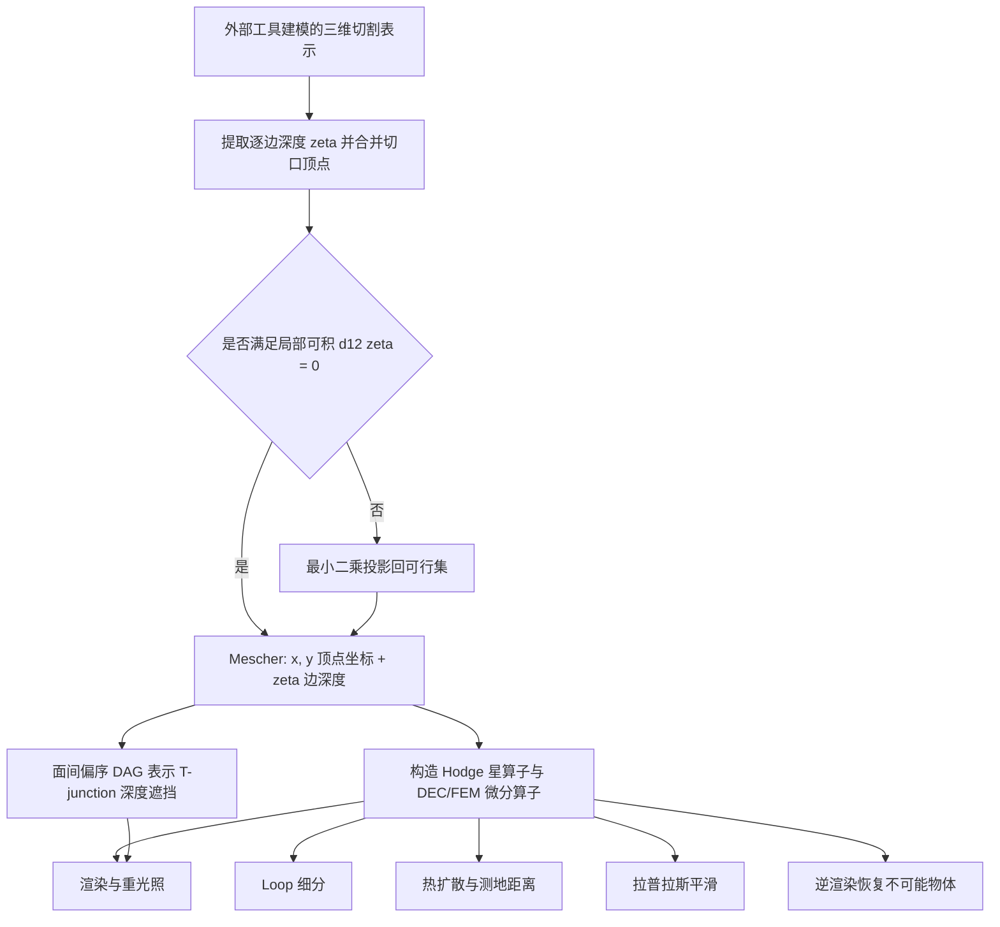

## 一句话总结

提出 mescher（mesh + Escher）这一新几何表示：用"逐边相对深度"的离散 1-form 编码不可能物体，只要求局部可积、不要求全局可积，从而在不切割、不弯曲的前提下对彭罗斯三角形一类"不可能物体"做渲染、重光照、平滑、测地距离与逆渲染。

## 研究背景

不可能物体（impossible objects）是人类能感知、却无法在现实中存在的几何构造，最著名的是 M.C. Escher 的版画与彭罗斯三角形。它们在视觉艺术、感知科学与图形学中长期引人入胜，但一直缺少令人满意的计算机表示。

问题的关键在于：不可能性只在我们试图把物体嵌入三维时才出现。人的视觉是局部的——受视网膜中央凹限制，我们通过一系列局部注视点拼接出全局感知（Marr 称之为"2.5 维草图"）。局部深度线索始终一致，只有当把这些局部信息"积分"成全局几何时才产生矛盾。

以往方法只有两条路：

- 切割表示（cut）：把物体拆成若干局部一致的片段，各片段拼在一起全局不一致。切割会改变切口处的局部几何，破坏平滑等下游操作。
- 弯曲表示（bent）：对一个"可能物体"做与视角相关的形变，使其从特定视角看起来不可能。但它实际表示的几何与人的感知不同（例如把彭罗斯三角形本该平的面弯曲了），重光照会产生伪影，内蕴几何计算（如高斯曲率）也不符合直觉。

两类方法都会破坏几何处理流水线。本文的目标是设计一种既符合感知、又能跑通常规图形与几何处理任务的表示。

## 方法

核心洞察：既然不可能性来自"全局积分"，那就干脆不做全局积分。mescher 只存拓扑、屏幕空间顶点坐标与逐边相对深度，永远不把物体积分成三维绝对坐标，从而绕开切割与弯曲。

数据结构上，mescher 与普通带（或不带）边界的可定向流形三角网格拓扑相同，含面集 $F$、边集 $E$、顶点集 $V$。几何上存两样东西：每顶点的屏幕空间坐标 $\boldsymbol{x}, \boldsymbol{y} \in \mathbb{R}^{|V|}$，以及每条边一个相对深度 $\boldsymbol{\zeta} \in \mathbb{R}^{|E|}$。若边 $i$ 连接顶点 $p$ 到 $q$，则 $\zeta_i$ 表示从 $p$ 到 $q$ 的带符号深度变化。

用离散外微积分（DEC）的语言看：$\boldsymbol{x}, \boldsymbol{y}$ 是原始 0-form（每顶点一个标量），$\boldsymbol{\zeta}$ 是原始 1-form（每边一个值）。由于离散外导数 $d_{01}, d_{12}$ 只依赖拓扑，可直接照搬普通网格的构造。

关键设计：

局部可积而非全局可积。把 $\boldsymbol{\zeta}$ 解释为逐边深度差，三角形内三条边的深度差之和必须为零，即局部可积约束

$$d_{12}\boldsymbol{\zeta} = 0.$$

它保证每个三角形能局部嵌入，从而拥有法向、面积、内角与余切拉普拉斯算子。局部可积不蕴含全局可积——后者对 mescher 并不必要，这正是它能表示不可能物体的原因。

Hodge 分解与可能/不可能判据。满足约束的 1-form 无散度分量，可分解为

$$\boldsymbol{\zeta} = d_{01}\boldsymbol{z} + \boldsymbol{\omega},$$

其中 $d_{01}\boldsymbol{z}$ 是旋度自由（curl-free）分量，$\boldsymbol{\omega}$ 是调和分量。当 $\boldsymbol{\omega}=0$ 时 mescher 可嵌入三维；因此可用"调和分量是否为零"来判定一个 mescher 是可能还是不可能物体。

投影到可行集。当从切割网格提取 $\boldsymbol{\zeta}$ 或合并顶点导致冲突时，用最小二乘把任意 $\boldsymbol{\zeta}'$ 投回可行集：

$$\min_{\boldsymbol{\zeta}} \tfrac{1}{2}\lVert \boldsymbol{\zeta}-\boldsymbol{\zeta}' \rVert^2 \quad \text{s.t.}\quad d_{12}\boldsymbol{\zeta}=0,$$

通过引入拉格朗日乘子解一个线性系统即可。为避开"没有一致 $\boldsymbol{\zeta}$ 就算不出几何 Hodge 星"的鸡生蛋问题，投影时用纯拓扑权重 $\star_1 := 1$。

深度排序。T-junction 是强深度/连通性线索。为表示互不相连局部片的全局遮挡关系，用一个有向无环图对面做偏序：边 $i \to j$ 表示 $i$ 被感知在 $j$ 之后。偏序意味着大多数面之间无深度关系，避免给局部片强加绝对深度序。渲染时对该图做拓扑排序得到线性扩展，按序叠加各三角形。存在无有效排序的构造，但在细分下这类环通常消失。

有限元算子。虽然 mescher 无法全局嵌入，但可为每个面构造局部坐标系；梯度等微分量只依赖局部切空间。因此除 DEC 外还能构造一阶有限元算子（梯度 $G_x, G_y, G_z$ 与面积矩阵 $A$），并满足 $G^\top A G = d_{01}^\top \star_1 d_{01}$。

在此之上实现的操作：

- 渲染：把三角形绝对深度置零"压平"，用从 $\boldsymbol{\zeta}$ 导出的法向做着色。因平移不变性，只兼容方向光与环境贴图光照，不兼容面光源。
- 细分：采用 Loop 细分；因正交相机下深度线性变化，细分边的 $\zeta$ 等于原边的一半。
- 热扩散与测地：解 $(I + t\Delta)\boldsymbol{u} = \boldsymbol{u}_0$，再套用热方法（heat method）计算最短路径。
- 平滑：调和分量在拉普拉斯零空间中无法进一步平滑，只对旋度自由分量的势 $\boldsymbol{z}$ 做拉普拉斯平滑再合回，$\boldsymbol{\zeta}_1 = \boldsymbol{\omega}_0 + d_{01}\big((I+t\Delta)^{-1}\boldsymbol{z} - \boldsymbol{z}\big)$。
- 逆渲染：用 SoftRas 可微光栅化器匹配目标图像，采用 Sobolev 梯度 $\hat{\boldsymbol{g}} = (I+\lambda\Delta)^{-1}\boldsymbol{g}$ 平滑稀疏梯度，交替优化 $\boldsymbol{x},\boldsymbol{y}$ 与 $\boldsymbol{\zeta}$。

## 实验结果

本文以定性演示与能力对比为主，没有定量主表。核心结果包括：

- Impossibagel（不可能贝果）：在不可能物体上同时展示渲染重光照、热扩散（中）与测地距离查询（右），验证内蕴几何处理可行。
- Impawssible Dog：同一 mescher 在四种光照下重光照，显示某些光照条件比其他条件产生更强的错觉感。
- Window（窗）：全局可积时朴素渲染会让横竖两杆在同一深度相交；引入深度排序后可渲染成不可能物体，再细分并平滑以制造强调不可能深度差的高光。
- Penrose triangle（彭罗斯三角形）逆渲染：从一个标准（可能的）圆环初始化，优化后逼近不可能三角形；通过检查其非零调和分量 $\boldsymbol{\omega}$ 验证确实恢复出了不可能几何。
- Mission: Impossible 对比：与切割、弯曲两类现有方法比较。三者都支持渲染，但弯曲表示重光照时因法向被扰动产生伪影，切割与弯曲在平滑和测地距离计算时都产生伪影；只有 mescher 支持全套渲染与几何处理操作。
- 嵌入互转：mescher 可通过沿用户指定切口的广度优先积分恢复切割表示，或移除调和分量后全局积分（用 Hodge 分解中的 $\boldsymbol{z}$）恢复弯曲表示，是二者的自然推广。

实现基于 PyTorch，用 NetworkX 处理深度排序图，ModernGL 与 Dear ImGui 做界面与渲染，PyTorch3D 提供 SoftRas；实验在 Intel i9-13900、32 GB 内存、RTX 4090 上完成。

## 亮点与局限

亮点：

- 把"不可能"这一感知现象精确翻译为数学语言——全局可积性与 de Rham 上同调中的调和分量，用 $\boldsymbol{\omega} \ne 0$ 干净地刻画不可能性。
- 不切割、不弯曲，是切割与弯曲两类方法的统一推广，且能反向恢复出这两种表示。
- 建立在成熟 DEC 机制上，直接复用余切拉普拉斯、热方法、Sobolev 逆渲染等经典工具，无需为不可能物体重新发明算法。
- 首次给出不可能物体的逆渲染概念验证。

局限：

- 依赖 DEC，要求输入可定向且流形；非可定向不可能物体（如把"Impossible Lettuce"塞进贝果）需要另寻表述。
- 所有 mescher 都先在外部工具建模再用软件变"不可能"，缺少直接建模 mescher 的可用交互界面。
- 未处理旋转：对微分坐标施加旋转会把调和分量"混入" $\boldsymbol{x}, \boldsymbol{y}$，需重新投影回恰当形空间。
- 只兼容方向光与环境贴图光照，暂不支持面光源、阴影或透明；逆渲染仍是初步概念验证。

## 延伸思考

这项工作把"感知优先"作为几何表示的设计原则：既然人的视觉本就是局部拼接而非全局一致，那么放宽全局可积、只保留局部一致，反而恰好是大量几何处理算法真正需要的最小条件。这种"用感知约束替代物理约束"的思路，与多视角全景、透视模糊图像等一脉相承，可能延伸到更广的"透视不一致场景"表示。

几个值得追问的方向：能否设计出基于逆渲染的直接建模界面，让用户在可能物体上"涂抹"调和分量来生成不可能物体？能否发展类似有向距离场那样可在优化中改变拓扑的隐式 mescher 表示？以及一个反哺视觉科学的问题——mescher 上计算出的最短路径，是否与人类手工描绘的路径一致？这让该表示不仅是图形工具，也可能成为研究人类视觉的计算探针。
