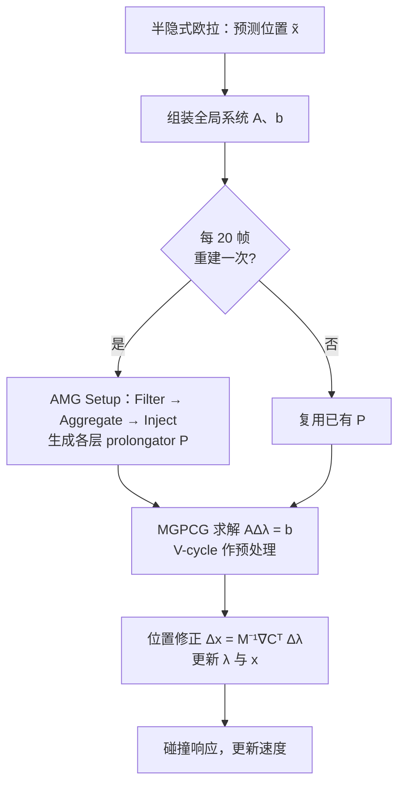

## 一句话总结

本文把代数多重网格（AMG）预处理的共轭梯度求解器搬进 XPBD 的全局对偶系统，配合"惰性 setup"和简化的近核构造，让 XPBD 在高分辨率、高刚度形变仿真中不再停滞或发散。

## 研究背景

- 领域现状：PBD / XPBD 因为简单、鲁棒、快，被广泛用于软体、布料、刚体、流体的形变仿真；它们用一个高度简化的非线性 Gauss-Seidel / Jacobi 迭代来求解约束系统。
- 核心痛点：XPBD 的迭代求解器只保留系统矩阵的对角项、丢掉了刻画相邻约束耦合的非对角项，本质上是一个"局部"求解器。它能快速压掉高频误差，但对低频误差束手无策——于是在高分辨率网格、大时间步、极高刚度（$$10^9$$ 量级）场景下，即便迭代上千次也难以收敛，常常出现非物理软化、停滞（stalling）甚至发散崩溃。已有的层次化 PBD（HPBD）、多层 PBD 属于"多分辨率"而非真正的"多重网格"，难以保证层间物理一致性；而把传统多重网格直接套到 XPBD 全局系统上又会引发数值不稳定，且每步都要重建网格层级，setup 阶段吃掉大部分时间。
- 本文 idea：在 XPBD 的**对偶空间**（而非以往工作的原空间）里引入非光滑聚合（Unsmoothed Aggregation, UA）代数多重网格，用它作为 PCG 的预处理器来求解全局系统；同时针对多重网格最贵的 setup 阶段提出惰性复用策略，并用简化方法构造近核分量，兼顾收敛性与效率。

## 方法

整体框架：MGPBD 在标准 XPBD 循环上做两处关键改动——一是**组装全局对偶系统矩阵** $$A = \nabla C M^{-1} \nabla C^\top + \tilde{\alpha}$$（XPBD 只用它的对角），二是用 **MGPCG（多重网格预处理共轭梯度）** 求解 $$A \Delta\lambda = b$$ 而不是简化的局部迭代。求得 $$\Delta\lambda$$ 后回代得到位置修正 $$\Delta x = M^{-1}\nabla C^\top \Delta\lambda$$，再更新拉格朗日乘子与位置，最后做碰撞响应。整个 AMG 的 setup 阶段每隔若干帧（例如 20 帧）才重建一次。

关键设计：

1. **对偶空间的 UA-AMG setup（Filter → Aggregate → Inject）**。setup 分三步：先按 $$\vert A_{ij}\vert  < \theta_s \sqrt{\vert A_{ii}\vert \vert A_{jj}\vert }$$ 过滤弱连接、得到强连接矩阵 S（软体取阈值 $$\theta_s = 0.1$$ 最优）；再把约束节点按强连接聚合成若干组；最后把近核分量注入形成 prolongator P，每层用 QR 分解，把 R 作为下一层的近核，逐层粗化直到矩阵规模小于 400。这里选择**非光滑聚合（UA）而非光滑聚合（SA）**，因为 SA 的光滑步会让粗层矩阵变稠密、大幅增加开销；UA 得到的粗层矩阵稀疏得多（论文中一例第 1 层非零元 136K vs SA 的 587K），从而更快，且收敛率几乎相同。

2. **惰性 setup 策略（lazy setup）**。作者观察到：setup 阶段占了单步总时间的近三分之二，而它只依赖矩阵的稀疏结构与非零元的相对值。当网格拓扑不变时，非对角项 $$A_{ij}=\sum_k m_{sv}^{-1} g_{ik}\cdot g_{jk}$$ 只随梯度及其夹角的显著变化而变，通常变化很小；对于距离约束系统，对角项 $$A_{ii}$$ 甚至保持不变。因此 prolongator 可以跨帧复用。实验显示，间隔 1/10/20/50 甚至 100 帧更新几乎不影响收敛，实际取保守的 20 帧，把 setup 时间从"每帧近 2/3 总时间"降到只占 2%。矩阵还预先以 CSR 三定长数组存储（每行非对角在前、对角在后），进一步提速。

3. **简化的近核 / 近零空间分量构造**。近核分量 B 是齐次系统 $$Ax=0$$ 的近似解（对应最小特征值的代数光滑误差），是聚合型 AMG 里决定 prolongator 效果的关键。传统全 1 向量对非泊松方程不灵，刚体模态在对偶系统里又难辨识，自适应 SA 虽通用但要再跑一个 AMG、代价高。本文受自适应 SA 启发，改用极简做法：对 $$Ax=0$$ 跑几趟迭代法（约 20 趟 GS，初值在 $$(0, \max(\vert A_{ij}\vert ))$$ 随机采样），重复六次得到六个 B（对应固体运动的六个刚体模态）。该法收敛与自适应 SA 相当，达到同一收敛水平只需 UA 一半的迭代数。

4. **求解阶段与光滑子**。粗层矩阵用 Galerkin 原则 $$A_{l+1} = P_l^\top A_l P_l$$ 构造；用 MGPCG（每次 PCG 迭代跑一步 V-cycle 作预处理）求解，比单独用 AMG 更稳更快。实现了三种 GPU 光滑子：加权 Jacobi、并行 GS、Chebyshev；软体用加权 Jacobi 最好，布料用 Chebyshev 最好。加权 Jacobi 的最优权 $$\omega_{opt} = \frac{2}{\lambda_{max}(D^{-1}A)+\lambda_{min}(D^{-1}A)}$$ 中，$$\lambda_{max}$$ 用幂法算、$$\lambda_{min}$$ 用经验估计（如 0.1）近似，在 850K 四面体兔子案例上提速 24%。光滑子权重和 Chebyshev 系数同样可以随 setup 惰性更新。

## 实验结果

主实验为单次迭代耗时与主流 AMG 库 / 直接求解器的对比（数据取自论文性能图，均为单次迭代时间），最能体现方法优势——比第三方库快约 2~3 个数量级：

| 求解器 | 单次迭代耗时 | 相对本文 |
|--------|-------------|---------|
| MGPBD（本文） | 0.54 s | 1× |
| AMGCL（CPU） | 1.63 s | 约 3× |
| AMGX（GPU） | 3.85 s | 约 7× |
| PARDISO（直接求解器） | 91.98 s | 约 170× |

其余实验用文字概述：与原空间多重网格方法对比（Bar Twist 扭转 180° 释放，刚度 $$7\times10^7 / 10^8 / 10^9$$），最高刚度下 Xian 等人的原空间方法在前 7 次迭代内就失败、XPBD 停滞，而本文能量持续稳定下降。性能上，达到 $$10^{-2}$$ 相对对偶残差的单次迭代耗时随分辨率近似线性增长（线性回归 $$R^2 = 0.9978$$），体现 AMG 的良好可扩展性。场景实验覆盖 Bunny Squash（5K/12K/270K/850K 四面体，850K 下 XPBD 崩溃而本文稳定收敛）、Beam（时间步 10/20/30ms、刚度 $$10^{12}$$，XPBD 出现非物理软化）、Ball（同刚度下 XPBD 呈现分辨率相关的软化）、Cloth（$$10^5$$ 迭代求到 $$10^{-4}$$，高分辨率下 XPBD 停滞无法收敛）、Monster（72K 四面体行走，XPBD 崩溃，本文平均 2.3 s/帧）、以及肌骨人体（166.7 万四面体、14 万外部约束，平均 40.6 s/帧）。碰撞用静态 SDF 的位置式碰撞响应作后处理。

## 亮点与局限

- 亮点：
  - 首次把 AMG 用于 XPBD 的**对偶空间**全局系统求解；对偶形式对刚度-质量比不敏感，特别适合高刚度肌肉这类原空间方法失效的场景。
  - 惰性 setup 抓住了"拓扑不变 ⇒ 矩阵结构稳定"的物理特性，把多重网格最贵的一步开销从约 2/3 压到 2%，是性能可用的关键。
  - 简化近核构造以极低成本逼近自适应 SA 的收敛；UA 让粗层矩阵更稀疏，进一步降低稀疏矩阵-向量乘的瓶颈。
  - 与现有 PBD/XPBD 管线无缝衔接（输入输出与 XPBD 相同），可与 Houdini Vellum 等现成实现混用，作为难场景的补充；已开源。
- 局限：
  - 仍需显式组装稀疏系统矩阵，且框架面向**静态拓扑**——撕裂、断裂等动态拓扑暂不支持（作者计划探索 matrix-free AMG 来解决）。
  - 全局系统会引入额外振荡，需要阻尼处理。
  - 碰撞处理较简单（静态 SDF + 位置式响应作后处理），复杂碰撞尚未纳入统一框架。

## 延伸思考

- 惰性复用 prolongator 的思路本质上是在"求解质量"与"重建开销"之间做时间维度的摊销，与图形学里常见的"缓存 / 增量更新"哲学一致；对动态拓扑，能否设计增量式的 setup 更新而非全量重建，是很自然的下一步，也正对应作者提出的 matrix-free 方向。
- 论文把"六次 GS 求近核对应六个刚体模态"这一物理直觉与代数多重网格衔接得很巧妙，可以进一步追问：对布料这类以拉伸/弯曲为主、刚体模态不完整的系统，近核的数量与构造是否应随约束类型自适应调整（论文中软体用 Jacobi、布料用 Chebyshev 已暗示了这种差异）。
- 对偶空间 AMG 与原空间多重网格（如 Xian 2019、MiNNIE）在高刚度下的分野值得深挖：本文实验显示原空间在 $$10^9$$ 刚度下迅速失败，这为"何时该选对偶、何时选原空间"提供了经验证据，可作为选择求解器架构的参考。
