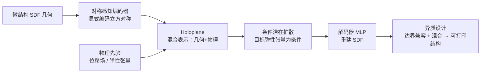

## 一句话总结

本文提出 MIND，一个基于潜在扩散模型与混合神经表示 Holoplane 的生成框架，能够按目标力学性能反向生成几何有效、可平铺、可打印的 3D 微结构。

## 研究背景

- 领域现状：超材料常以周期性微结构实现，其几何拓扑决定了轻量化、弹性、抗冲击等宏观物理性能。传统正向设计依赖经验规则和参数化模板（桁架、壳、板等），难以穷举庞大的组合设计空间；反向设计（inverse design）则从目标性能出发反推几何，近年借助拓扑优化和数据驱动方法快速发展。
- 核心痛点：微结构的几何与性能高度耦合且非线性——微小的几何改动会显著改变物理性能，反之亦然，且反问题本身病态（多个拓扑可对应相近性能）。已有方法多依赖体素或参数化表示：体素受分辨率限制且忽略连通性约束，参数化表示又被预定义的结构族束缚，限制了结构多样性与几何自由度。近期用自条件扩散模型的工作虽放宽了族的限制、匹配精度较高，但结构完整性仍难保证。
- 本文 idea：设计一种同时显式编码几何对称性、隐式编码弹性张量的混合神经表示 Holoplane，把几何与性能对齐到统一潜在空间；再在该潜在空间上训练条件扩散模型，按目标弹性张量生成多样、可平铺、边界兼容的微结构候选。

## 方法

MIND 的主干是"自编码器把微结构压到 Holoplane 潜在表示 → 条件扩散模型在潜在空间按目标性能采样 → 解码回 SDF 几何 → 面向异质设计做边界兼容优化"。核心在于让潜在空间既能忠实还原几何，又能与物理性能对齐，从而让扩散生成"既准又有效"。

关键设计：

1. **混合对称表示（Hybrid Symmetry-aware Representation）**：把微结构几何用 SDF $$\phi_\Omega(x): \mathbb{R}^3 \to \mathbb{R}$$ 表达，并要求其在晶格平移下不变 $$\phi(x) = \phi(x + n t)$$ 以保证可平铺。表示同时结合体素（显式，便于精确捕捉对称）与 SDF（隐式，连续且分辨率无关）。编码时把 SDF 投影到对称群对应的平面上得到 $$P_k = E(\phi_\Omega; \theta, k)$$；解码时把查询点投影回对称平面采样特征，经轻量 MLP 融合重建神经场，用重建损失 $$L_\phi = \sum_x \lVert \phi_\Omega(x) - D_\phi(P_\Omega, x) \rVert^2$$ 约束。这解决了纯体素在 $$128^3$$ 分辨率下都无法忠实表达细结构的问题。
2. **物理感知嵌入（Physics-aware Neural Embedding）**：只编码几何会让自编码器学到虚假相关、破坏潜在空间的可条件性。作者把均匀化（homogenization）过程中的位移场 $$\chi$$ 引入训练，用它在几何（SDF）与性能之间架桥：以 $$L_\chi$$ 拟合位移场、再由位移场与 SDF 联合预测弹性张量 $$L_E = \lVert C_\Omega - \sum_{x\in\Omega} f_E(D_\chi(x), D_\phi(x); P_\Omega) \rVert^2$$。t-SNE 可视化显示，加入物理先验后，几何相近但性能差异大的样本被重新组织，潜在空间显著更平滑、更利于扩散条件生成。三者结合即得到 Holoplane $$P \in \mathbb{R}^{r\times r\times c}$$——一张对齐了几何与物理的对称 2D 特征快照。
3. **条件扩散生成（Guided Generation）**：以 EDM 框架为生成主干，在 Holoplane 潜在空间训练去噪器 $$\mathbb{E}_{P}\mathbb{E}_{\epsilon} \lVert \Psi(P+\epsilon; \sigma) - P \rVert_2^2$$，并用无分类器引导（CFG）在条件与无条件输出间插值 $$\Psi(P; \sigma, C) = \Psi_0 + w(\Psi_C - \Psi_0)$$ 平衡多样性与性能匹配（取 $$w=7$$）。
4. **边界兼容增强（Boundary Compatibility）**：异质设计中相邻单元必须边界连续。作者用兼容性损失 $$L_{compat} = \int_\Gamma \lVert P_A - P_B \rVert^2 dx$$ 的梯度改写采样 ODE 来引导对齐；再对两个加噪 Holoplane 做球面线性插值 $$P^\sigma_\alpha = \mathrm{slerp}(P^\sigma_A, P^\sigma_B; \alpha)$$ 并反向扩散，用插值结果重建边界区域做混合。仅用兼容性梯度可达 70.1% 边界相似度，叠加混合后达到 100% 的完美连通。

## 实验结果

主实验在测试集上以其真实物理性能为条件做反向生成，每个目标生成 8 个候选、共 8000 个结构，用均匀化重新计算性能并按归一化误差 $$\mathrm{Err} = \lVert C_{pred} - C_{target} \rVert / (C_{max} - C_{min})$$ 评估。下表对比 MIND、此前的自条件扩散方法与三平面（NFD）表示的消融配置（$$C_{best}$$ 为每组 8 个中最优的平均，其余列为全部 8000 个的平均，数值越低越好）：

| 方法 | Cbest↓ | Call↓ | C11↓ | C12↓ | C44↓ |
|------|--------|-------|------|------|------|
| MIND（本文） | 0.29% | 1.27% | 1.13% | 1.33% | 1.34% |
| NFD + Phy（三平面+物理嵌入） | 0.44% | 1.68% | 1.49% | 1.80% | 1.75% |
| NFD（三平面） | 0.63% | 5.39% | 5.28% | 4.86% | 6.01% |
| 此前自条件扩散方法 | 1.33% | 2.96% | 2.50% | 3.68% | 2.70% |

MIND 在所有误差指标上均取得最优。消融显示：物理感知嵌入让三平面基线的 $$C_{all}$$ 误差从 5.39% 降到 1.68%，是精度提升的关键；对称感知的 Holoplane 表示相比普通三平面进一步降低误差。几何有效性方面，物理有效率从此前方法的 95.7%、三平面的 97.8% 提升到 MIND 的 99.2%。

其余实验用文字补充：多样性上，MIND 生成结构与训练集的平均相似度为 81.52%，低于此前方法的 93.48%（相似度越低说明越不是在"背题"、形态更丰富）；给定同一目标性能能生成多种不同形态且性能相近的结构。生成速度约每个微结构 0.13 秒、SDF 解码 0.02 秒（4×A40）。此外还验证了跨类别插值（桁架平滑过渡到板结构）、在 0.6 mm 与 1.2 mm 打印精度下的可打印性，以及在枕形支架模型上的异质设计——优化后位移由平均 0.016 m 降到 0.008 m，填充生成结构后为 0.008 m，与优化目标高度吻合且相邻单元完美兼容。数据集含 18 万样本（桁架 33%、管 38%、壳 17%、板 12%，体积分数 5%~65%），聚焦立方对称 $$O_h$$，此时弹性性能约化为 $$C_{11}, C_{12}, C_{44}$$ 三个独立分量。

## 亮点与局限

- 亮点：
  - Holoplane 把几何对称性显式编码、把弹性张量隐式编码于统一潜在空间，直击"几何—性能耦合且病态"的核心难题，让扩散生成同时兼顾精度与几何有效性。
  - 引入均匀化中的位移场作为物理桥梁，绕开了直接预测弹性张量既昂贵又易过拟合的困境，物理感知嵌入被消融证明是精度提升主因。
  - 摆脱预定义参数化族的束缚，可跨桁架/管/壳/板多类生成并做跨类插值，还能通过兼容性梯度+球面插值混合实现异质、可打印设计。
- 局限：
  - 自支撑性、无封闭内腔等更强的可制造性约束尚未纳入损失函数，目前只能靠后处理过滤保证。
  - 仅覆盖立方对称与线性弹性（杨氏模量、泊松比、剪切模量），未涉及各向异性、热导、光学等更广的性能维度。
  - 精度评估依赖均匀化重算，生成的多样性提升也部分以更宽松的相似度度量为参照。

## 延伸思考

- 用"位移场作为几何与物性之间的可微桥梁"这一思路，可能迁移到其他结构—性能耦合的反向设计问题（如热学、声学超材料），关键在于找到类似均匀化那样物理意义明确、又能被神经场高效逼近的中间量。
- Holoplane 本质是带对称约束的三平面变体，若把对称群从立方 $$O_h$$ 推广到更一般的晶体对称，或与近期可制造性可微约束结合，有望直接生成"生成即可打印"的结构，省去后过滤。
- 边界兼容通过潜在空间插值+混合实现，这为大规模异质填充中的单元衔接提供了通用范式，值得思考它与图结构/场景级装配生成方法结合的可能。
