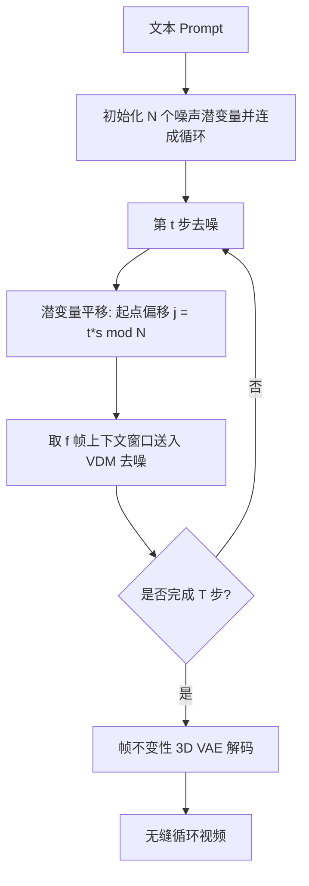

## 一句话总结

Mobius 提出一种无需训练的推理方案，通过在去噪过程中把首帧潜变量循环平移到末尾，直接用预训练文本到视频扩散模型生成任意长度、首尾无缝衔接的循环视频。

## 研究背景

循环视频（也称 cinemagraph）通过周期性运动呈现某一瞬间的动态，广泛用于短视频、动图和屏保。传统做法需要大量人工：稳定相机、标注运动物体、挑选动画帧等，而且此前的学习类方法只能针对特定类型（水面、周期性纹理、人像、全景）制作循环视频，运动幅度有限。

作者提出一个新问题：直接从文本描述生成开放域的无缝循环视频。相比只重复画面中部分元素、依赖稳定相机的旧方法，目标是借助文本到视频模型的生成先验，产生包含物体运动、相机运动在内的更丰富动态。

要复用预训练模型完成这一任务存在两个核心挑战：其一，文本到视频扩散模型是在自然视频上训练的，如何让它适配循环生成并不清楚；其二，现有模型推理时只能生成固定长度的若干帧，短视频难以充分表达真实世界的动态。

## 方法

### 整体框架

方法基于预训练的文本到视频潜扩散模型（实现中采用 CogVideoX-5B），核心洞察是：循环视频中每一帧都应被同等对待，即每一帧都可能成为"首帧"。整体推理流程如下：

### 关键设计

1. 潜变量平移（Latent Shifting）。把从首帧到末帧的所有噪声潜变量连成一个循环列表，在每个去噪步把起点平移 $$j = (t \times s) \bmod N$$，其中 $$s$$ 是每步的跳跃步长，$$N = n \times f$$（$$f$$ 为模型上下文长度，$$n$$ 为放大循环长度的倍数）。每步仍只对 $$f$$ 帧窗口去噪：$$[z^{j}_{t-1}; ...; z^{j+f-1}_{t-1}] = \Phi([z^{j}_{t}; ...; z^{j+f-1}_{t}], t, c; \epsilon_\theta)$$。当窗口越过末尾时，用首部潜变量拼接补齐，从而在保持视频扩散模型时序一致性的同时让每帧被平等去噪。因为长度可任意设置，方法天然支持任意长度循环视频乃至长视频生成。

2. 帧不变性潜变量解码（Frame-Invariance Latent Decoding）。CogVideoX 的 3D VAE 对首帧做特殊编码而不压缩，后续帧则做 $$4\times$$ 时序压缩，这种不一致会让循环生成的首帧出现伪影。作者把最后三个潜变量复制并插到首帧之前作为冗余帧来抵消特殊压缩，解码后再移除这些冗余生成帧。

3. 旋转位置编码插值（RoPE Interpolation）。为支持超出训练上下文的长循环视频，借鉴大语言模型的 NTK-Aware 插值，对时序维度的 RoPE 进行缩放：$$b' = b \cdot k^{d/(d-2)}$$，其中 $$k$$ 为视频长度增加的倍数，$$d$$ 为潜向量维度。作者比较了随潜变量移动的 shifted 版本与保持不变的 fixed 版本，实验表明固定 RoPE-Interp 更利于让每帧被当作首帧处理，循环效果更好。

## 实验结果

实现基于 CogVideoX-5B，分辨率 480x720，DDIM 采样 50 步，单张 NVIDIA H100 上运行；评测选取 VBench 与 EvalCrafter 的 140 条 prompt 并用 GPT 扩写。由于循环视频首末帧相同，用首末帧 MSE 衡量循环质量，用 FVD、CLIP Score 衡量整体质量，并给出运动平滑度与动态分。带 * 的插值基线以本方法生成的首帧作为起止关键帧，因此其 MSE 为参考上限值。

| 方法 | MSE↓ | FVD↓ | CLIP↑ | Motion Smooth↑ | Dynamic Score↑ |
| --- | --- | --- | --- | --- | --- |
| Svd-Interp.* | 18.30 | 5.66 | 32.08 | 0.9950 | 0.0667 |
| CogX-Interp.* | 15.59 | 28.60 | 31.88 | 0.9830 | 0.3333 |
| CogVideoX | 66.89 | 56.02 | 32.19 | 0.9738 | 0.7056 |
| Latent Mix | 45.17 | 60.02 | 31.99 | 0.9749 | 0.7273 |
| Ours | 25.43 | 40.78 | 32.24 | 0.9850 | 0.4722 |

插值基线常产生静止画面或偏离起止帧的内容，Latent Mix 混合首末潜变量会在末帧产生伪影。本方法在 CLIP Score 上最优，并在保证较低首末帧 MSE（真正循环）的同时兼顾运动平滑与动态。作者还邀请 23 名参与者对五种方法做主观排序（共 690 份意见），Mobius 在时序一致性（4.30）、视觉质量（4.15）、视频动态（4.10）三项上均居首。此外在长视频生成对比中，本方法 FVD 达到 29.89，优于 Gen-L-Video、FreeNoise、FIFO、DiTCtrl 等方法。

## 亮点与局限

亮点：完全无需训练，仅修改扩散模型的潜变量输入即可复用预训练模型，推理速度与直接生成相近；首次面向开放域文本到循环视频这一新问题，并可生成任意长度的循环视频；潜变量平移思路可自然迁移到长视频生成任务。

局限：作为无训练方法，运动先验受限于所用的预训练视频扩散模型。在插画等定制域中，生成结果可能不够平滑、服饰等细节不一致且缺乏明显运动；作者认为使用更强的潜扩散模型有望改善。

## 延伸思考

Mobius 展示了"训练自由 + 推理期潜变量操控"这一范式的潜力：把生成任务的结构约束（首尾相接的循环）编码进去噪调度，而非靠数据微调。这种把周期性作为循环边界、逐步平移的做法，与长视频生成里对潜变量重组的思路一脉相承，值得思考是否能推广到其他带结构约束的生成任务（如镜像对称、节拍对齐）。同时其对基座模型运动先验的强依赖也提示：推理期技巧的上限往往由底座模型决定，方法的通用性需在更强、更新的视频扩散模型上进一步验证。
