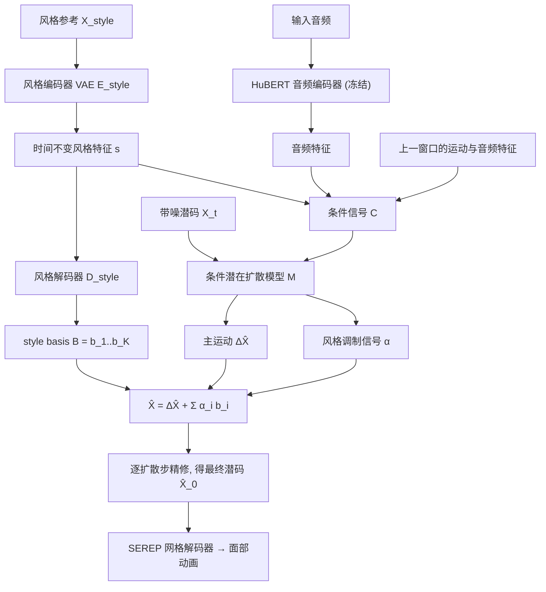

## 一句话总结

本文提出 MSMD（Model See Model Do），一个基于示例（style reference）的语音驱动 3D 面部动画框架，通过与运动扩散模型联合训练的风格编码器，以及名为 style basis 的新型条件机制，在保证唇形同步的同时忠实复现参考片段的细腻表演风格。

## 研究背景

从语音自动生成逼真的 3D 面部动画，长期是计算机图形学中一个既有吸引力又具挑战的目标，广泛应用于电影、虚拟现实、游戏与教育。

近年的深度生成方法已能产出唇形同步准确的面部运动，但作者指出一个被忽视的关键点：同一句台词有许多种表达方式，很多面部运动（如眉毛、额头的动作、嘴部张合的幅度）与音频只是弱相关。也就是说，「说了什么」由语音内容决定，而「怎么说」——表演风格——才是生成有感染力表演的难点，且难以直观控制。

已有的可控方法各有局限：

- 用情绪标签或文本作为控制信号，但表演受角色癖好、情绪基调、说话人身份等诸多因素影响，很难在不强加僵硬类别的前提下标注或离散化这些维度。
- DiffPoseTalk 首次尝试为语音驱动面部动画引入基于示例的控制，但它用对比损失在独立步骤中单独训练风格编码器。这带来两个问题：风格编码器与主生成任务脱节，无法区分哪些面部运动由语音内容决定、哪些是随表演变化的风格选择；对比学习把所有不匹配样本都当作同等疏远的负例，无法捕捉风格相似度的自然层级——例如两段愤怒表演会被推得和「愤怒 vs 高兴」一样远。

作者还访谈了某大型游戏公司的五位专业动画师，发现基于示例的方法能同时满足两类需求：低层级动画（如游戏内演出）倾向全自动、极少介入；中层级动画（脚本化演出）希望先自动生成再做细粒度精修。基于示例的标签无需重训模型即可新增，且能表达难以言述的风格。

## 方法

### 整体框架

模型输入一段音频 $$A$$ 和一段可选的风格参考 $$X_{style} = [x_1, ..., x_M]$$，输出一段既唇形同步于音频、又符合参考风格的新运动序列 $$\hat{X}_0$$。三个组件端到端联合训练：

- 一个变分自编码器（VAE），把运动片段映射为时间不变的风格特征 $$s$$；
- 一个风格解码器，从 $$s$$ 生成一组静态姿态 $$B = [b_1, ..., b_K]$$，即 style basis；
- 一个条件潜在扩散模型，预测主运动 $$\Delta \hat{X}$$ 以及风格调制信号 $$\alpha$$，后者随时间控制 style basis 对主运动的影响强度。

模型工作在 SEREP 的表情潜空间（该空间解耦了说话人身份与表情），生成后再用 SEREP 的网格解码器还原最终网格动画。

核心洞见是：富有表现力的语音运动可以分解为两个互补成分——时间不变的表情（贯穿整句台词的整体表情，如眯眼、皱眉）和运动动态（与音素内容直接相关的运动，即如何咬字发音）。前者在扩散过程中迭代地调制后者。

### 条件潜在扩散建模

模型不直接预测 3D 几何，而是在表情潜空间中操作。扩散包含前向加噪与反向去噪两条马尔可夫链，反向过程 $$p(X_{t-1} \mid X_t, t, C)$$ 以条件向量 $$C$$ 与扩散步 $$t$$ 为条件。模型 $$M(X_t, t, C)$$ 被训练来直接预测干净潜信号，最小化 simple 损失：

$$\mathbb{E}_{t \sim U[1,T],\, X_0, C \sim q(X_0, C)} \left[ \| X_0 - M(X_t, t, C) \|^2 \right]$$

为处理任意长度语音，采用窗口化策略：把音频切成固定长度 $$N_w$$ 的窗口逐个扩散，并把前一窗口的 $$N_p$$ 帧音频与运动特征纳入条件，保证窗口间平滑过渡。此外用速度损失 $$L_{vel}$$ 和平滑损失 $$L_{smooth}$$ 约束运动动态、防止抖动。

### 条件信号与风格编码

条件信号由多部分组成：音频特征 $$A$$、风格特征 $$s$$、上一窗口最后 $$N_p$$ 帧运动潜码 $$X_{prev}$$ 及其音频特征 $$A_{prev}$$。音频特征由预训练的 HuBERT 编码器产出并全程冻结，以避免过拟合训练数据。风格特征 $$s$$ 由 VAE 风格编码器 $$E_{style}$$ 从任意长度的参考片段中提取：先用 transformer 编码器生成逐帧风格特征（考虑各帧不同的重要性），再沿时间做均值池化以适配任意长度。VAE 预测潜分布的均值 $$\mu$$ 与方差 $$\sigma^2$$，用重参数化技巧采样：

$$s = \mu + \sigma \odot \epsilon, \quad \epsilon \sim \mathcal{N}(0, I)$$

并用 KL 散度损失约束潜空间接近标准正态先验，促成平滑连续的风格空间。

### 关键设计：用 style basis 引导扩散

这是全文核心。style basis $$B = [b_1, b_2, ..., b_K]$$ 中每个 $$b_k \in \mathbb{R}^{1 \times D}$$ 是一个潜表情编码，概念上捕捉参考片段中低频、持续的、构成说话习惯的表情。灵感来自游戏动画师的做法：在高频唇形同步之上叠加协同语音表情（co-speech expressions）。

模型把扩散输出 $$X \in \mathbb{R}^{N \times D}$$ 建模为主运动与 style basis 线性组合之和，组合权重由随时间变化的调制信号 $$\alpha_i \in \mathbb{R}^{N \times 1}$$ 缩放：

$$\hat{X} = \Delta \hat{X} + \sum_{i=0}^{K} \alpha_i b_i$$

每个系数 $$\alpha_i$$ 随时间变化，控制对应 style basis 在整段动画中影响主运动的程度。借助扩散的迭代特性，style basis 的影响被逐步融入主运动，从而在不破坏唇形同步质量的前提下贴合风格。

### 训练策略

总损失由 simple 损失与多项正则项组成：

$$L = \lambda_{simple} L_{simple} + \lambda_{vel} L_{vel} + \lambda_{smooth} L_{smooth} + \lambda_{KL} L_{KL}$$

窗口化模型需处理两种情形：（a）以可学习的起始特征为条件生成首窗口；（b）以前一窗口的语音与运动参数为条件生成后续窗口。训练时采样总长 $$2N_w$$ 的音频与运动片段（不足则补零），拆成两个窗口分别覆盖两种情形。

针对 DiffPoseTalk「假设一段内风格一致」并采用跨窗口条件的做法，作者指出富有表现力的语音在一段内常有强度变化，该假设不可靠。因此本文交替使用跨条件（cross-conditioning，用对侧窗口的运动特征作为风格输入）与自条件（self-conditioning，用同窗口的运动特征），以缓解纯自条件下的风格泄漏——即风格编码器可能编码序列特有的运动特征而非时间不变的表达风格。

此外引入无分类器引导（CFG）：训练时随机丢弃 10% 的音频与风格引导（替换为习得的空条件 $$\varnothing$$），推理时按加权公式融合有条件与空条件预测，从而支持更细腻的控制与生成无风格化语音的选项。

## 实验结果

数据集组合 CelebV-Text 与 RAVDESS。前者是每段不同说话人的野外视频（10 到 15 秒），后者是同一批说话人表达不同情绪的视频（3 到 6 秒）。作者用数据集文本标签与 MediaPipe 头姿/人脸框检测过滤掉非说话、遮挡、进食、侧脸超过 45 度等片段，从 CelebV-Text 随机采样 26.5 小时以对齐 DiffPoseTalk 的数据规模，并使用全部 3 小时 RAVDESS。表情用 SEREP 提取为 64 维表情编码，MediaPipe 提取 3 维头姿，每帧潜表示共 67 维。

实现上：风格编码器为 4 层 transformer 编码器（隐维 512、4 头），风格码维度 128；音频用冻结特征提取器的 HuBERT；运动解码器为 8 层 transformer 解码器（隐维 512、8 个交叉注意力头）；风格解码器用 $$K$$ 组各 3 层全连接映射出 $$K$$ 个 style basis，评测取 $$K = 4$$；CFG 强度取 1。用 Adam（学习率 0.0001）、批大小 16，窗口 $$N = 100$$ 帧、重叠 $$N_p = 10$$ 帧，在单张 NVIDIA A4000 上训练 450000 次迭代，约 4 天。

量化指标（均越低越好）：整脸顶点均方误差 MSE、唇部顶点误差 LVE、上脸动态偏差 FDD、嘴部张合差异 MOD。测试时风格参考取自与真值同一视频中相邻但不重叠的窗口，以保证评估的是风格条件生成而非运动复刻。与两个基线（对比学习预训练风格编码器的 DiffPoseTalk、联合训练的 VAE-baseline）对比：

| 模型 | MSE (mm) ↓ | LVE (mm) ↓ | FDD (×10⁻⁵m) ↓ | MOD (mm) ↓ |
| --- | --- | --- | --- | --- |
| Unconditioned | 4.50 | 11.0 | 52.4 | 3.24 |
| DiffPoseTalk | 3.86 | 10.0 | 48.3 | 3.46 |
| VAE-baseline | 3.61 | 9.13 | 47.4 | 3.10 |
| MSMD（本文）| 3.46 | 8.54 | 43.4 | 2.96 |

本文方法在所有指标上均优于基线。消融实验显示，LVE 与 MSE 的提升大多来自 style basis，而跨条件让模型更好捕捉上脸动态、改善 FDD：

| 模型 | MSE (mm) ↓ | LVE (mm) ↓ | FDD (×10⁻⁵m) ↓ | MOD (mm) ↓ |
| --- | --- | --- | --- | --- |
| 去掉 style basis | 3.61 | 9.13 | 47.4 | 3.10 |
| 去掉跨条件 | 3.59 | 8.96 | 46.3 | 3.01 |
| MSMD（本文）| 3.46 | 8.54 | 43.4 | 2.96 |

定性上，作者用 RAVDESS 情绪表演做风格参考、CelebV-Text 音频做输入（完全在训练分布之外），本文方法能同时贴合下脸动态与上脸表情，而 DiffPoseTalk 常出现夸张表情或无法准确复现风格，VAE-baseline 则常遗漏细腻的上脸表情。

用户研究选 10 个视频，覆盖「匹配风格」与「对比风格」两种场景，分别评估风格迁移与唇形同步（0 到 5 分）。共收集 34 份风格评分与 32 份唇形同步评分。本文模型在两方面都显著优于对比方法（配对 t 检验 $$p < 0.0005$$），尤其在 RAVDESS 高表现力语音（对比风格）上优势明显。作者推测增益来自 style basis 有效解耦了语音与风格，避免风格破坏关键的口型形状。

## 亮点与局限

亮点：

- 提出基于示例的语音驱动面部动画框架，能捕捉参考风格的说话习惯，并以严格的用户研究验证其在保留风格细腻之处上的有效性。
- 提出新型条件机制 style basis：把持续性表情提取为一组潜姿态，用随时间变化的调制信号叠加到主运动上，在不牺牲唇形同步的前提下贴合风格；消融证明其对运动精度与表现力的贡献。
- 风格编码器与扩散模型联合训练，配合跨条件/自条件交替策略，缓解风格泄漏、更好分离「内容」与「风格」。
- 公开训练代码与数据整理流程，便于后续用野外视频做训练与评测。

局限：

- 不判断参考风格的语气、节奏、时长是否与输入音频匹配，可能把愤怒风格套到语气轻快的音频上，产生诡异动画。
- 基于「风格在一句台词内不变」的假设设计，无法内在控制风格切换（如中性到愤怒），需动画师手动切分音频并为各段指定风格。
- 不复现孤立的标志性表情动作（如某人特有的挑眉、翻白眼），而这些对表演风格可能很关键。

## 延伸思考

本文最值得玩味的是「时间不变表情 + 运动动态」的显式解耦，以及把这一分解落到扩散过程中的 style basis 机制。它呼应了动画师「在唇形同步之上叠加协同语音表情」的直觉，用一组可加、可随时间调制的潜姿态基去承载风格，既保住了唇形这条高频主线，又给风格留出独立的低频通道。相比 DiffPoseTalk 那种单独用对比损失学风格再冻结的思路，联合训练让风格编码器真正学会「哪些运动属于内容、哪些属于风格」，这提示我们在多因素解耦任务中，端到端联合优化往往比分阶段的表示学习更能抓住任务相关的区分度。

作者提出的延伸方向也很有想象空间：从多个参考片段分别抽取上脸与唇部特征并混合、把 VAE 风格空间与 CLIP 等语义丰富的表示打通以实现文本+视频多模态条件。style-conditioned 生成在配音（dubbing）上的应用尤其实用——用原表演当风格参考、换一种语言的音频做输入，就能在保留表情对齐的同时适配不同时长的配音，比单纯替换口型灵活得多。
