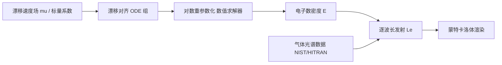

## 一句话总结

本文从物理出发为辉光放电（Neon 灯、气体放电灯里那种发光的电致放电）建立了一个可逐点求解发射强度的模型，把复杂的等离子体动力学蒸馏成一组可解释参数，并且天然嵌入标准体渲染管线，成为一种新型可用于全场景照明的光源。

## 研究背景

- 领域现状：现代渲染在材质与表面散射建模上已经非常成熟，但对"光源"本身的建模相对稀缺。面光源、聚光灯、方向光加上异质体积基本够用，因此少有人去深挖光源的物理成因。
- 核心痛点：一旦要模拟闪电、极光、荧光、辉光放电这类由复杂物理过程主导的发光现象，现有光源原语就难以胜任；而物理界求解这些过程多用有限元（FEM）在固定边界、二维域上做全局求解，离散化代价高、精度受限，且难以适应边界随时间变化的动态场景，本质上与渲染想要的"任意点、无需预计算的逐点发射查询"目标相悖。
- 本文 idea：借鉴计算物理中描述电子与离子数密度演化的方程，通过一系列简化把原始偏微分方程降为沿漂移速度的常微分方程，从而得到一个无需预计算、可在任意点估计发射的高效局部求解器，并结合气体光谱特性算出逐波长辐射，直接接入体渲染。

## 方法

整体框架：辉光放电被当作纯发射体积处理（散射与消光系数取零），于是出射辐亮度只是沿光线对发射项的积分。发射强度正比于电子数密度与漂移速度大小的乘积，所以核心任务就是在任意点高效求出电子数密度。方法链条为：物理过程建模 → 简化为漂移对齐的常微分方程 → 沿漂移速度积分求数密度 → 结合光谱得到逐波长发射 → 蒙特卡洛体渲染。

关键设计：

1. **从物理过程到方程**：辉光放电是受电场主导的非热非平衡等离子体。自由电子在强电场下加速引发电子碰撞电离，形成雪崩（Townsend 雪崩）。作者梳理了电离、复合、附着、激发/退激发几类碰撞过程——其中激发后退激发释放的可见光子才是辉光的主要视觉来源，而复合发射的光子多在紫外不可见。这些过程对应电子数密度 $$E$$、正离子 $$P$$、负离子 $$N$$ 的一组含电离系数 $$\alpha$$、复合系数 $$\beta$$、附着系数 $$\eta$$、扩散 $$D$$ 与对流项的演化方程。

2. **漂移对齐与均一化**：为得到高效局部求解器，先假设系统处于平衡态（对时间导数为零）并忽略扩散项（$$D=0$$）。再把散度项展开，把方程改写成沿各自漂移速度的梯度形式，使偏微分方程沿漂移速度的积分曲线退化为常微分方程。由于三种粒子的漂移速度不同仍难以联立，作者进一步令离子漂移速度为电子漂移速度的固定倍数 $$\vec v_P=\vec v_N=\rho\,\vec\mu$$（$$\rho>1$$，因为质量更小的电子更易偏离路径），把所有方程统一到同一均一化漂移速度 $$\vec\mu$$ 上。并假设 $$\vec\mu$$ 近似为无旋的势流（与电场本身是势场一致），保证无分叉、便于数值实现。

3. **逐点积分与对数重参数化**：在有界域上以 $$\vec\mu(\bm x)\cdot\hat n<0$$ 的入流边界设定 $$E=P=N=1$$ 的边界条件。对任意点，先沿漂移场反向追踪到边界，再正向积分数密度即可。由于辉光放电常涉及数百万粒子，直接积分数值不稳定，于是用对数表示 $$X=\exp\tilde X$$ 重参数化，把乘性增长转成加性、抑制数值爆炸。完整算法分为 TraceBackwards（确定到边界的时间与位置，配自适应步长）与 IntegrateDensities（前向欧拉积分数密度）两步，两阶段用不同步数 $$N_1$$、$$N_2$$ 解耦。

4. **光谱发射与漂移速度造型**：借鉴火焰渲染的思路，用温度相关的 Maxwell-Boltzmann 分布给出光子取某波长的概率 $$P_\lambda$$，其中跃迁波长由普朗克定律 $$\lambda=\dfrac{hc}{E_h-E_l}$$ 给出，跃迁强度取自 NIST、HITRAN 等数据库的爱因斯坦系数；温度由电子热速度近似。为让艺术家可控地"造型"，漂移速度场 $$\vec\mu$$ 用二次贝塞尔曲线作原语（活跃区是固定半径的胶囊体），并定义了层流与挤出流两种模式来塑造辉光的形状。渲染时用一维单样本蒙特卡洛估计沿光线的发射积分，并用包围盒界定活跃区，使其能与其他图元自然共存、参与全局光传输。

## 实验结果

实现基于 Vulkan 光线追踪的体积路径追踪器（仅 BRDF 采样），在 NVIDIA RTX 4090 上运行，图像 1024 spp 后用 Intel Open Image Denoise 去噪。下表为各场景在文中给出的帧时间（数字忠于原文）：

| 场景 | 曲线数 | 帧时间（ms） |
|------|--------|--------------|
| Car | 188 | 195 |
| Horse | 224 | 139 |
| Siggraph | 236 | 230 |
| Tunnel | 504 | 110 |
| Spoon | 1024 | 1166 |
| Chess | 1216 | 200 |

此外，作者以 FEM 求解器为基准评估了忽略扩散项的影响：当扩散系数较小（$$D\le 10^{-4}$$）时本方法与 FEM 结果视觉相当，超过约 $$10^{-2}$$ 后两者明显发散。求解器迭代参数实验表明，反向追踪步数 $$N_1$$ 对结果的影响明显大于积分步数 $$N_2$$，说明求解质量更依赖反向追踪阶段。真实世界对比中，作者用曲线原语复现了金属勺表面的电晕放电细丝，近勺端偏白、向外过渡为紫（氮气 N2 主导），与真实观察吻合。

## 亮点与局限

- 亮点：
  - 把辉光放电这一少被图形学触及的发光现象做成了物理驱动、参数可解释的逐点发射光源，填补了"光源建模"这块空白。
  - 无需预计算、无需全局离散化求解，天然接入标准体渲染并参与折射、光泽反射等全局光传输；帧时间维持在交互级别。
  - 通过贝塞尔曲线漂移场把物理模型与艺术造型结合，可自由塑形并模拟不同气体（钠、氢、氦、汞、氪、氮、氖、氩、氙）的特征颜色。
- 局限：
  - 为求可解性做的简化（如平衡态、忽略扩散、离子漂移速度按固定比例）会削弱参数的物理意义，电离率等经验测量值无法直接映射到模型系数。
  - 缩放系数 $$\rho$$ 与复合系数 $$\beta$$ 的效果高度相似，暗示两者存在冗余。
  - 路径追踪器目前只用 BRDF 采样，缺乏下一事件估计与针对该模型的重要性采样，渲染效率与精度仍有提升空间。

## 延伸思考

- 作者把辉光放电定位为"更可控、时间上更相干"的小尺度电致放电，并明确指出方法可向更大时空尺度、动力学更复杂的火花放电（如闪电）延伸，这与文中大量引用的闪电、流光传播文献形成呼应，是一个自然的后续方向。
- 该模型与网格无关的思路，和近年 Walk-on-Spheres / Walk-on-Stars 等蒙特卡洛 PDE 方法在"无离散化求解物理场"上目标相通；作者也提到当前方程尚不完全落在这类方法可解的范畴内，若能打通，或可进一步统一求解框架。
- 除渲染外，作者提到直流溅射镀膜、高压输电电晕放电等工程场景，这个快速近似求解器可作为预可视化工具，让用户指定漂移速度后即时观察带电粒子分布，具备跨领域应用潜力。
