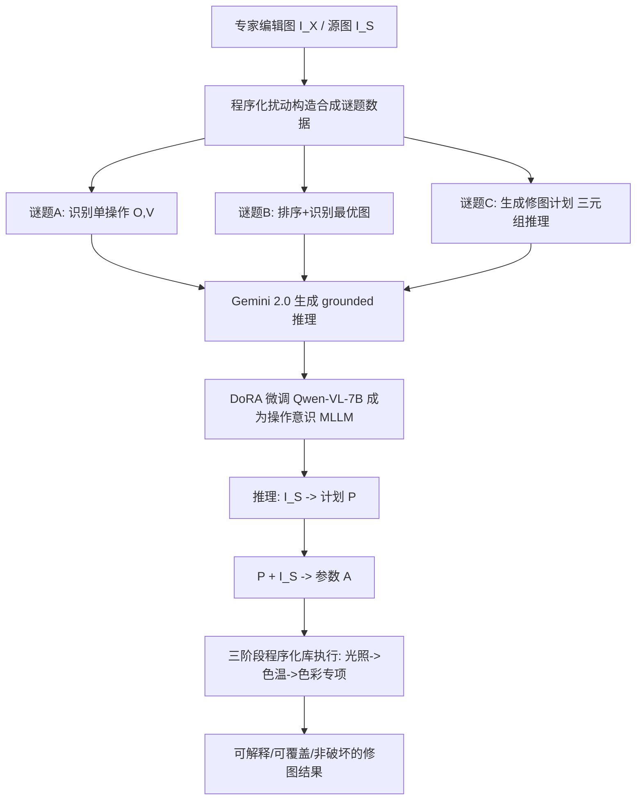

## 一句话总结

MonetGPT 通过让多模态大语言模型（MLLM）先去"解视觉谜题"来建立对图像处理操作的内在认知，再让这个具备操作意识的 MLLM 分阶段规划并输出可解释、可覆盖、非破坏性的程序化修图序列（操作 + 参数），在保持原图身份与分辨率的同时给出媲美商业软件的润饰效果。

## 研究背景

修图是原始照片后期处理中的核心环节。当前主流有两条路径，各有短板。生成式编辑（文本或笔触引导，如 InstructPix2Pix、MGIE）上手容易，但会重新生成每个像素，常常不可预测地改变人脸、手、物体的身份，且难以局部覆盖或按需回退。程序化编辑（如 Gimp、Lightroom 支持的曝光、对比度、色彩调整）保守、非破坏、可在不同分辨率下应用、可解释，因此更受专业用户青睐，但对新手门槛很高。

作者把程序化修图的困难拆成两类知识：一是"命令知识"，即如何在工具里操作某个滑块，靠练习即可掌握；二是"策略知识"，即面对一张具体图片该用哪些操作、给什么参数、按什么顺序执行，这是开放式规划问题，本质上更难。早期的 Exposure 框架用强化学习从艺术家修图样例中学习程序化编辑序列，但受限于专家编辑数据稀缺。

作者提出的核心问题是：能否利用在海量数据上预训练的前沿 MLLM 的知识，用少量专家数据把它适配到修图任务上。他们发现现有 MLLM 虽然通用但不擅长直接给出有意义的修图方案，直接在艺术家编辑序列上微调也只带来部分改善——根本原因是 MLLM 缺乏对每个图像编辑操作"到底做了什么"的内在心智模型。

## 方法

MonetGPT 的关键思路是：不直接教 MLLM 输出参数，而是先用"视觉谜题"作为代理损失，让模型对操作产生视觉理解，再让它规划编辑。作者设计了一个精简参数空间的程序化操作库 L，分三个阶段/类别组织：（一）光照调整（黑色、对比度、曝光、高光、白色、阴影）；（二）色彩与色温调整（饱和度、色温、色调）；（三）针对八种颜色的色彩专项调整（色相、明度、饱和度）。库中共 33 个操作，每个操作由单一主参数控制，参数取值大致落在感知线性的 $$[-100, +100]$$ 区间。

训练围绕三个逐级递进的谜题展开，每个谜题都用预训练 MLLM（Gemini 2.0 Flash）在给定"正确答案"的前提下生成基于可见视觉变化的推理文本，以此避免幻觉、并作为微调监督：

- 谜题 A（理解单个操作）：随机采样操作 $$O \in L$$ 与调整值 $$V$$，作用于源图 $$I_S$$ 得到 $$I_E$$，把 $$(I_S, I_E)$$ 拼接给 MLLM，要求预测 $$(O, V)$$。目标是建立"源图—单操作—结果图"之间的对应关系。
- 谜题 B（理解图像美学）：对专家编辑过的图 $$I_X$$ 用同一操作施加四个不同扰动值，得到打乱顺序的五张图，要求模型按调整值高低排序、识别出最优图 $$I_X$$、并估计把任意变体变回 $$I_X$$ 所需的调整量。隐含假设是对专家图的扰动都会使其变差、且操作可逆。
- 谜题 C（生成修图计划）：把专家图 $$I_X$$ 劣化成待增强的 $$I_S$$，要求模型给出把 $$I_S$$ 变回 $$I_X$$ 的操作序列与参数。推理被结构化为每个操作的三元组 <Adjustment, Issue, Solution>（调整、问题、解法）。同时特别训练模型判断"某一阶段无需再调整"，以避免过度编辑。

推理阶段把"推理作为回归的通路"：给定 $$I_S$$，先让模型生成编辑计划 $$M(\cdot \mid I_S) := P$$，再基于计划回归出精确参数 $$M(\cdot \mid P, I_S) := A$$。整个流程分光照、色温、色彩专项三阶段顺序执行，每阶段的结果反馈给下一阶段。模型以结构化 JSON 输出操作与参数，由库直接执行，无需写代码，且天然非破坏、支持高分辨率 16 位图像。

实现上，作者微调 Qwen-VL-7B-Instruct，使用 DoRA 适配器（dropout 0.2、rank 256、alpha 512），学习率 $$1\times10^{-4}$$、余弦调度、单轮训练，H100 上约 8 小时（直接回归基线约 2.5 小时）。谜题数据从 PPR10K 专家图采样合成，约 7k（A）、5k（B）、13k（C）样本。数据生成不使用配对信息（unpaired 设置）。

## 实验结果

作者在单一专家（PPR10K 的 expert A）上训练，并在 Adobe5k 随机采样的 400 张图上测试泛化能力。评测指标含 SSIM、LPIPS、PSNR 和基于 Hu 等人的直方图交集（对比度/亮度/饱和度三个直方图取均值）。Adobe5k 有五位专家的编辑版本，除直方图外每个样本取与任一专家匹配的最高分。Adobe5k 泛化结果（表 1）如下：

| 方法 | SSIM ↑ | LPIPS ↓ | PSNR ↑ | Histogram ↑ |
|------|--------|---------|--------|-------------|
| Exposure | 0.63 | 0.14 | 15.12 | 47.21 |
| Unpaired | 0.83 | 0.12 | 21.73 | 83.98 |
| RSFNet | 0.88 | 0.08 | 21.85 | 80.26 |
| InstructP2P | 0.61 | 0.22 | 16.99 | 73.90 |
| MGIE | 0.74 | 0.08 | 22.94 | 79.95 |
| GeminiCoT + 本文库 | 0.80 | 0.14 | 17.83 | 63.71 |
| GooglePhotos | 0.90 | 0.06 | 25.86 | 86.47 |
| MLLM Regression | 0.84 | 0.10 | 20.89 | 82.05 |
| Ours | 0.90 | 0.07 | 23.75 | 79.50 |

本文方法在四项指标中的三项上超过所有开源基线，并与闭源的 Google Photos 表现相当。作者强调，仅用 PPR10K（多为人像）训练使泛化更具挑战；MGIE 因需 100 万级以上数据、Google Photos 因闭源，均未重新训练。

由于修图主观性强、传统指标难以刻画增强质量，作者还做了用户研究：从 Adobe5k 与 Reddit 选取 50 张图，将本文结果与 Exposure、MGIE 等基线随机配对，收集 15 位新手用户与 10 位摄影专家的偏好。结果显示无论专家还是新手都更偏好本文结果。定性上，生成式方法（IP2P、MGIE）受分辨率限制且常丢失源图内容；Exposure 与 Gemini CoT+库常产生过曝、高对比、过亮或过暗结果；MLLM 直接回归基线几乎学不到有意义信号（小提琴图显示它过拟合、总预测相近的值），而 MonetGPT 会用满整个取值范围、并对不同光照输入给出差异化方案。

推理耗时方面：完整分阶段流程约 25 秒（RTX 4090），直接回归约 10 秒，Exposure 约 2 秒。

## 亮点与局限

亮点：这是首个用 MLLM 引导、可解释的程序化修图框架，支持对高分辨率 16 位图像做非破坏编辑。用"解谜"建立操作意识的思路巧妙——把难以直接监督的"策略知识"转化为可合成、可扩展的视觉谜题任务，并用"推理作为回归通路"把高层意图落到精确参数。方法在 unpaired 设置下工作、数据需求小，输出的每一步都带 <调整—问题—解法> 解释，用户可在任意阶段编辑计划（利用 MLLM 的自回归特性，后续阶段会随之保持一致），也可通过风格标签（如"复古""均衡""鲜艳明快"）实现个性化修图。无需推理时迭代优化，兼容现有 MLLM。

局限：（一）目前仅支持有限的全局操作，不含裁剪或区域性编辑，若要支持局部操作需引入语义分割，但带区域掩膜的艺术家编辑数据难以获取；（二）训练数据约 8k 张专家图，会带入单一艺术家的审美偏好/偏差；（三）修图本身主观、无唯一最优解，模型偶尔会出错并产生如局部过饱和的伪影；（四）本工作聚焦程序化操作、未纳入生成式滤镜，未来若把特定生成式编辑做成神经符号模块可能会损害当前的程序化可解释性。

## 延伸思考

MonetGPT 最有启发性的地方在于它对"如何让大模型掌握一门技能"给出了一个可迁移的范式：当目标任务缺乏直接监督信号、且解空间庞大主观时，可以设计一组"自洽可验证的代理任务"（这里是视觉谜题），用现成预训练模型在已知答案下生成 grounded 推理来做监督，从而把隐性技能显性化。这套"合成扰动 + 逆问题 + 推理蒸馏"的组合思路，理论上可推广到色彩分级、音频后期、3D 材质调参等一大类"参数化程序库 + 主观审美"的创作任务。

另一个值得注意的取舍是"程序化 vs 生成式"的路线之争。MonetGPT 用可解释、可覆盖、身份保持作为卖点，回应了生成式编辑不可控的痛点；但这也意味着它天花板受限于操作库的表达力。未来把生成式滤镜封装为神经符号模块、在保持可解释性的前提下扩展能力边界，是一个自然但棘手的方向——如何让"黑盒生成"与"白盒程序"在同一个规划框架内共存，可能是这条路线继续演进的关键。
