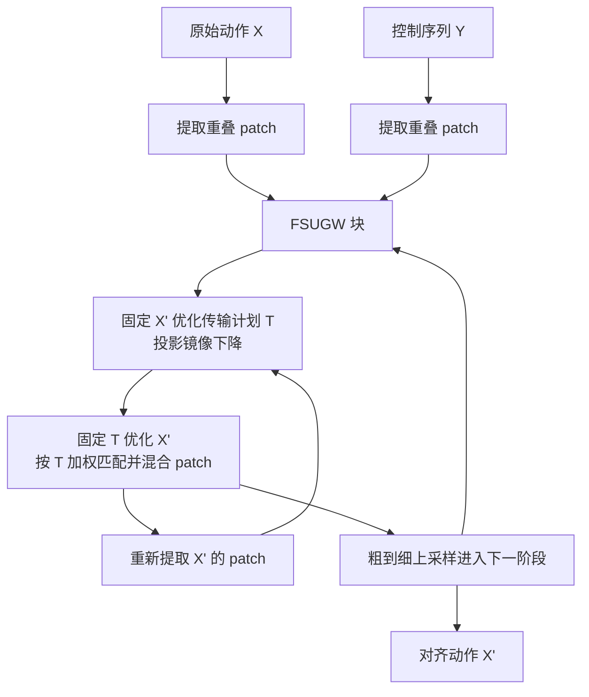

## 一句话总结

不依赖任何跨域映射或标注训练，仅用"域内两两距离"就把一段原始动作对齐到任意控制序列（草图、波形、标签、音频或另一段动作）——通过融合半非平衡 Gromov-Wasserstein 最优传输，让对齐动作的内部距离结构去逼近控制序列的距离结构。

## 研究背景

把一段动作序列与控制序列对齐，是驱动动作控制、重定向、舞蹈与音频同步等一系列任务的核心问题。难点在于：控制域与动作域往往在结构、维度、时长、复杂度上差异巨大（比如"音乐"与"动作"），却又要求精确的时间对应与结构一致。

传统做法要么依赖人工设计的跨域映射函数与策略，要么用大规模学习框架去学两域之间的直接映射或共享嵌入。前者需要专家逐任务定义映射，后者依赖大量成对或标注数据以及漫长训练。即便是近年从少量样本生成动作的方法（GANimator、GenMM、SinDDM），对复杂时序控制也缺乏内建的对齐机制，常常还得补充标注或人工干预。

作者的关键观察是：跨域映射之所以难，是因为要直接度量"动作"和"音乐"之间的距离；但每个域内部的两两距离（帧与帧之间、patch 与 patch 之间）却是天然可得、无需人工设计的。于是他们提出只用域内距离来完成对齐——借助 Gromov-Wasserstein 最优传输这类"只看结构、不看跨域距离"的工具，实现跨域耦合。

## 方法

### 整体框架

方法命名为 Metric-Aligning Motion Matching（MAMM）。记原始动作为 $$X$$、控制序列为 $$Y$$、输出的对齐动作为 $$X'$$。目标是让 $$X'$$ 既保留对 $$X$$ 的相似性，又在结构上对齐 $$Y$$。核心直觉：让 $$X'$$ 各帧的两两距离矩阵尽量贴近 $$Y$$ 的距离矩阵，同时 $$X'$$ 仍像 $$X$$。

技术上定义为融合半非平衡 Gromov-Wasserstein（FSUGW）损失的最小化问题，沿用 Xu 和 Gould（2024）的公式与投影镜像下降算法。整体损失由三部分构成：

$$L_{FSUGW} = \alpha \cdot L_{GW}(\tilde{Y}, \tilde{X}, T) + (1-\alpha)\cdot L_{W}(\tilde{X'}, \tilde{X}, T) + \lambda \cdot D_{KL}(T^{\top}\mathbf{1} \parallel b) - \epsilon \cdot H(T)$$

其中 $$L_W$$ 通过传输计划 $$T$$ 约束 $$X'$$ 贴近 $$X$$，$$L_{GW}$$ 鼓励 $$T$$ 是"度量对齐"的（从而使 $$X'$$ 与 $$Y$$ 结构相似），$$D_{KL}$$ 是软边缘正则，$$H(T)$$ 是熵约束。值得注意的是，$$L_{GW}$$ 完全不使用 $$X$$ 与 $$Y$$ 之间的跨域距离。

### 关键设计

**Patch 级的度量对齐。** 把 $$X$$、$$Y$$、$$X'$$ 都以逐帧步长切成重叠时间 patch（原始动作 patch 长 11 帧）。$$L_W$$（Wasserstein 损失）建立 $$X'$$ 与 $$X$$ 之间的直接对应；$$L_{GW}$$（Gromov-Wasserstein 损失）比较两域内部的两两距离结构。在 patch 级度量损失，能捕捉局部时序结构并保证连续性。

**交替优化 + patch 提取融入循环。** FSUGW 块交替执行三步：先用当前 $$X'$$ 重新提取 patch；再固定 $$X'$$ 用投影镜像下降求传输计划 $$T$$；最后固定 $$T$$，按 $$T$$ 加权匹配并对重叠区域做平均混合来更新 $$X'$$。把 patch 提取与混合放进优化循环，使得 $$X$$ 中时空相邻的 patch 在 $$X'$$ 里也倾向保持相邻——若混合了时空上相距很远的 patch 会推高 $$L_W$$，从而被优化自然排除。每阶段迭代 $$M=20$$ 次。

**粗到细对齐。** 由于 GW 问题非凸，初始化很关键。方法从比最终长度短 4 倍的粗尺度起步（仅用 $$L_{GW}$$ 初始化 $$T$$），逐级上采样细化，共 $$N=6$$ 个阶段。控制序列距离矩阵越复杂（如跨骨架动作到动作对齐），粗到细越关键。

**软/硬关键帧等时空约束。** 支持"软关键帧"（控制域与动作域的样本对样本对应，可放在画布任意位置，甚至充当"负关键帧"使动作远离某些姿态）、"硬关键帧"（绑定到具体时间点、必须耦合的 patch 对）以及无限循环约束（首尾 patch 强制匹配以无缝循环）。两个平衡参数：$$\alpha$$ 越大越强调控制输入（过大则不自然），$$\lambda$$ 越大越保持原动作整体分布（过大则削弱控制影响），推荐 $$\alpha=0.8$$、$$\lambda=0.05$$、$$\epsilon=1$$。

## 实验结果

论文以定性演示与用户研究为主，未提供跨方法定量基准表。所有数据来自 Mixamo 与 Truebones（人形与非人形骨架），音乐用 AIST 舞蹈数据库、语音用 BEAT 数据集，音频统一表示为 40 维 MFCC 特征。实验在配备 NVIDIA GeForce RTX 4080 的个人电脑上完成，单次生成通常在 10 秒内。下表汇总论文中报告的关键实验配置与规模数字：

| 项目 | 数值 |
|------|------|
| 序列长度范围 | 约 50–600 帧（30 fps） |
| 原始动作 patch 大小 / 步长 | 11 帧 / 1 帧 |
| 粗到细阶段数 $$N$$ | 6 |
| FSUGW 块迭代次数 $$M$$ | 20 |
| 推荐参数 $$\alpha$$ / $$\lambda$$ / $$\epsilon$$ | 0.8 / 0.05 / 1 |
| 音频（MFCC）维度 | 40 |
| 音频示例时长 | 3–20 秒 |
| 最大规模测试（动作 594 帧 + 音频 1441 MFCC 特征） | 约 7 秒计算 |
| 用户研究参与者 | 5 名无动画编辑经验的计算机专业学生 |

用户研究中，5 名参与者经 10 分钟教程加 15 分钟练习后，均成功复现出与给定视频相似的动作序列，反馈总体正面（"没有动画编辑经验也能用""用关键帧改动画很方便"），也指出草图与动画的对应关系有时不够清晰、希望能推荐关键帧候选等改进点。

## 亮点与局限

亮点：一是提出仅用域内距离即可完成跨域动作对齐的统一框架，无需跨域映射、无需标注训练；二是同一套 FSUGW 优化不改算法就能服务波形、草图、标签、音频、动作等多种控制，其中波形到动作、草图到动作、按编号编排（motion-by-numbers）三种交互据作者所知是首创；三是秒级生成，摆脱了大数据集与长训练的依赖，适合小数据场景。

局限（作者自述）：一是需要先给出完整控制序列才能计算，无法实时交互；二是 $$L_{GW}$$ 基于度量，对刚体变换与对称性不变，例如无法区分对称的左右迈步，需靠关键帧纠正；三是距离函数 $$d_X$$、$$d_Y$$ 的设计与归一化是难点，尝试在优化中学习缩放因子未获稳定收益；四是可扩展性受限——距离矩阵随序列变长在空间和时间上都膨胀，面对动辄十万帧的数据集会难以承受。

## 延伸思考

这项工作最启发人的地方在于把问题从"学习跨域映射"彻底重构为"对齐域内结构"。跨域映射难，本质是因为要在异构空间之间硬造距离；而 Gromov-Wasserstein 只比较各自内部的关系矩阵，天然绕开了这道坎。这种"只看结构、不看跨域距离"的思路，其实可迁移到任何两个异构序列（甚至非序列）的对齐问题上，比如把传感器信号映射到动画、把文本节奏映射到运镜。

同时它也暴露了纯度量方法的边界：对称与刚体不变性意味着模型看不到"方向/手性"这类语义信息，只能靠人工关键帧补齐。一个自然的后续方向是把少量语义先验或可学习的距离度量注入到 $$d_X$$、$$d_Y$$ 中，在保持"无需大数据训练"优势的同时，缓解对称歧义与缩放难题；而针对十万帧级数据的分层或近似 FSUGW 求解，则是让它走向工业规模的关键一步。
