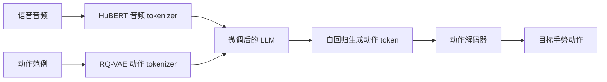

## 一句话总结

MECo 把语音音频和"动作范例"都离散化成 token 喂给一个微调后的大语言模型，让模型在与语音节奏对齐的同时，生成保留范例细节风格的协同语音手势，并支持动作片段、静态姿势、视频、文本等多种控制输入。

## 研究背景

- 领域现状：协同语音手势（co-speech gesture，人说话时自然伴随的手臂、手、脚部动作）生成已从早期规则法转向数据驱动的生成模型（normalizing flow、VAE、VQVAE、GAN、扩散模型等）。可控生成主要分两条路线：基于标签（说话人身份、情绪、手部高度半径等）和基于范例（用一段参考动作作为风格来源）。
- 核心痛点：标签法受限于标注的可得性与粒度，标注成本高；范例法通常把任意长度的参考动作压成一个"风格向量"或隐式伪标签，只保留了情绪等粗粒度语义，把范例里丰富的运动学细节都丢掉了。像 ZeroEGGS 就把整段序列坍缩成单个风格向量，GestureDiffuCLIP、SynTalker 依赖 CLIP 或专门的文本-动作对齐空间，推理时还要手动平衡多模态权重。
- 本文 idea：借助大语言模型对结构化输入的原生理解能力，把动作范例当作"显式的查询上下文"直接放进 prompt 里作为生成前缀，而不是抽成伪标签。这样既保住了范例的运动学细节，又能让生成结果与语音保持一致。

## 方法

整体框架：动作和音频先各自经 tokenizer 转成离散 token 序列，拼成 LLM 的输入；音频充当"用户提问"、动作范例充当"系统提示"，LLM 自回归地生成手势动作 token，再经动作解码器还原成目标手势序列。作者选用 Qwen2.5-0.5B-instruct 作为骨干。

关键设计分四点：

1. **残差量化的动作表示**：每帧姿态由根节点角速度、XZ 平面线速度、根高度和各关节的 6D 旋转组成。动作先经 1D 卷积编码器降采样成隐向量，再进入一个基础量化层加多层残差量化层（RQ-VAE），把各层量化向量求和得到最终编码。训练时随机丢弃基础层之后的残差层，逼基础层尽量多地编码信息；推理时只用基础量化层。为解决全身范例（尤其含手指）难获取的问题，作者把身体按上半身、下半身、双手三个功能区分别 tokenize、分别训练，生成时三部分同时产出——这也天然支持给不同身体部位喂不同范例做局部控制。

2. **token 嵌入初始化**：LLM 原本没有音频和动作 token，直接用随机初始化的新 token 会与已有嵌入分布错位，导致训练早期不稳定并损害模型原有能力。作者先冻结 LLM 主体，只训练新增 token 的嵌入层和最后的输出投影层，用 LLM 原本的自回归预训练目标 $$L(\theta_0)=-\sum_t \log p(a_t\mid a_{<t}) - \sum_t \log p(c_t\mid c_{<t})$$ 为新 token 找到更贴合原嵌入空间的初值。

3. **三阶段微调**：初始化之后分两个训练阶段。第一阶段做语音到手势的监督微调，建立音频与动作两个模态的映射；第二阶段引入动作范例条件，让模型同时依据语音内容和参考范例生成。为避免模型直接照抄范例而忽略音频，范例序列会先经过去重、打乱、随机丢弃处理 $$E_c=\mathrm{Drop\&Shuffle\&Dedup}(c_1,\dots,c_{T_c})$$ ，并在损失里加一个惩罚项，压低那些"不出现在原始范例中"的 token 概率，从而引导模型学范例、又能自动补齐范例里缺失的动作。渐进式训练在数据稀缺、范例过短时尤其提升鲁棒性。

4. **推理期可控采样**：为让用户连续调节"遵循范例的程度"，作者提出基于 logit 的采样策略——给范例对应 token 的 logit 加一个手动超参 $$\beta$$ ，并对已采样过的 token 施加衰减因子 $$\gamma$$ 以促进多样性，调整后的 logit 为 $$logits'_i=(logits_i+\beta)\cdot\gamma^t$$ ，其中 $$t$$ 是该 token 在已生成序列中出现的频次。长音频用分段生成，段间用上一段最后三个 code 作为衔接保证时间连续。

## 实验结果

在 BEAT2 数据集上与主流方法比较（FGD 越低越好，BC 与 Diversity 越高越好；FGD、BC 数值为原文 $$\times 10^{-1}$$ 口径）。MECo 在 FGD 和 Diversity 上明显领先，加入动作范例后 FGD 进一步降低：

| 方法 | FGD ↓ | BC ↑ | Diversity ↑ |
|------|-------|------|-------------|
| CaMN | 6.644 | 6.769 | 10.86 |
| TalkShow | 6.209 | 6.947 | 13.47 |
| SynTalker | 6.413 | 7.971 | 12.72 |
| EMAGE | 5.512 | 7.724 | 13.06 |
| MECo | 3.401 | 7.346 | 15.30 |
| MECo（含范例） | 2.999 | 7.472 | 15.01 |

范例相似度上，用 FGD1 与 FGD2 衡量生成结果与输入范例的接近程度：在 ZeroEGGS 数据集上 MECo 的测试集 FGD1 为 1.98，远优于 ZeroEGGS 的 4.54；在 BEAT2 上 MECo 测试集 FGD1 为 4.12，优于 SynTalker 的 8.21。用户研究（29 名参与者，三项主观指标）中 MECo 在拟人度、恰当度、范例一致性上均取得最好评分，其中范例一致性优势最突出。此外验证了对原始语言能力的保留：MECo 在 MMLU、GSM8K、PIQA 上相比原始 Qwen2.5-0.5B-instruct 基本持平（如 MMLU 46.27 对 46.50），而"不冻结主体"的消融会让 MMLU 骤降到 24.63，证明分层冻结策略既学会新模态又护住了旧能力。

## 亮点与局限

- 亮点：
  - 把动作范例当"显式 prompt 前缀"而非伪标签，保留了运动学细节，配合去重/打乱/丢弃与惩罚项，既学范例又不照抄、还能补全缺失动作。
  - 三阶段微调 + 只训嵌入层/输出层的初始化策略，在引入音频与动作模态的同时几乎不损伤 LLM 原有文本理解能力。
  - 用 0.5B 小模型即达到 SOTA，推理高效（vLLM 下 270 token/s，约 1 秒生成 36 秒动作），并统一支持动作片段、姿势、视频、文本多模态控制与身体分区局部控制。
- 局限：
  - 视频输入下表现下降，源于单目动捕得到的 SMPL-X 参数经 VQ-VAE 后重建误差大，暴露动作 VQ-VAE 对分布外数据泛化不足。
  - 生成动作存在脚底滑动等物理不合理伪影，需靠逆运动学或物理仿真后处理缓解。
  - 参数扩到 7B 未见收益反而略降，作者归因于协同语音手势数据规模太小（BEAT2 测试用的第二位说话人仅约 2 小时），小模型已够用。

## 延伸思考

把"多模态控制信号统一映射为动作 token、再作为 LLM 的 prompt 前缀"是个很通用的思路，理论上可迁移到舞蹈生成、全身动作合成等其他条件运动任务。数据稀缺被明确指出是限制扩大模型规模的瓶颈，未来若能在更大规模、更多说话人的高质量动捕数据上训练，或引入更强的动作 tokenizer（提升分布外泛化）与物理约束，可能同时改善视频控制质量与物理合理性。另一个值得追问的点是 logit 采样中 $$\beta$$、$$\gamma$$ 两个超参如何自动化调节，以减少人工调参对"范例遵循程度"的依赖。
