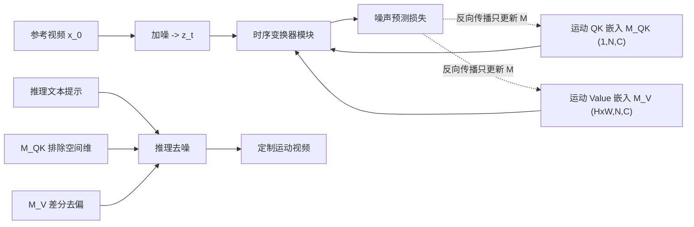

## 一句话总结

本文提出 Motion Embeddings（运动嵌入），从一段参考视频中学习一组显式、时序连贯的嵌入，直接嵌入视频扩散模型的时序变换器，调制跨帧自注意力，从而在不破坏空间完整性的前提下把源视频的运动迁移到全新文本描述的内容上。

## 研究背景

图像定制（customization）已经很成熟：模型能从用户提供的少量图像中学到特定的物体或风格概念，再与模型自身的先验结合生成多样化结果。人们自然希望把这种能力扩展到快速发展的文本到视频（Text-to-Video, T2V）生成模型上。

但视频具有时空双重属性，除了外观还包含运动，把图像定制技术直接搬到视频上会遇到新挑战。现有定制方法（如 Textual Inversion、DreamBooth、LoRA 等）主要针对外观，忽略了视频中至关重要的运动。运动定制（motion customization）需要把某段视频的特定运动迁移到形状、类别都不同的物体上，这要求在时间维度上理解物体的动态变化，是外观定制方法难以胜任的。

作者归纳出当前运动定制方法的三个核心局限：

- 缺乏对运动的显式表征，运动只是通过推理时的损失构造间接注入（如 DMT），带来额外计算开销。
- 把运动参数化后仍与生成模型耦合（如 VMC 直接微调 T2V 模型参数），学完运动后损害了生成模型的多样性。
- 用 LoRA 等低秩适配把运动表征从模型中分离出来（如 Motion Director），但缺乏明确的时序设计，捕捉运动动态的能力有限，且难以叠加多段参考运动。

本文正面解决"运动表征"这一关键问题。

## 方法

### 整体框架

T2V 扩散模型相比 T2I 模型的关键区别在于引入了时序变换器模块，用逐帧的自注意力机制建模帧间关联。给定输入的时空特征张量 $$X \in \mathbb{R}^{1 \times C \times N \times H \times W}$$（$$C, N, H, W$$ 分别为通道、帧数、高、宽），它被重排为 $$F \in \mathbb{R}^{(H \times W) \times N \times C}$$，时序注意力（TA）在帧维 $$N$$ 上计算：

$$TA(F) = \mathrm{softmax}\!\left(\frac{QK^{T}}{\sqrt{d_k}}\right) V$$

其中 $$Q = W_q F$$、$$K = W_k F$$、$$V = W_v F$$ 分别由三个线性层投影得到。

本文的做法是：冻结整个 T2V 模型，只从参考视频学习一组运动嵌入 $$\mathcal{M} = \{\mathcal{M}_{QK}, \mathcal{M}_{V}\}$$，把它们加到特征张量 $$F$$ 上再参与注意力计算，从而调制帧间动态。

### 关键设计 1：两类运动嵌入

运动嵌入分为两种，分别作用于时序注意力计算的不同部分：

- Motion Query-Key Embedding $$m^{QK}_i \in \mathbb{R}^{1 \times N \times C}$$：一个可学习向量，加到 $$F$$ 上再投影为 Query 和 Key，从而调制帧间注意力图（QK），捕捉帧与帧之间的全局运动关系（如相机运动）。
- Motion Value Embedding $$m^{V}_i \in \mathbb{R}^{(H \times W) \times N \times C}$$：一个可学习矩阵，加到 $$F$$ 上再投影为 Value，因保留了空间维度，能表征每个空间位置随时间的运动（如局部物体运动）。

两者共同作用于第 $$i$$ 个时序注意力模块（$$L$$ 为模块总数）：

$$TA_i(F) = \mathrm{softmax}\!\left(\frac{(W_q(F + m^{QK}_i))(W_k(F + m^{QK}_i))^{T}}{\sqrt{d_k}}\right)(W_v(F + m^{V}_i))$$

### 关键设计 2：训练

训练高效且简单：把每个运动嵌入零初始化，冻结扩散模型，只对运动嵌入反向传播噪声预测损失：

$$\mathcal{M}^{*} = \arg\min_{\mathcal{M}} \mathbb{E}_{t,\epsilon}\left[\left\lVert \epsilon^{1:N}_t - \epsilon_\theta(x^{1:N}_t, t, \mathcal{M}) \right\rVert_2^2\right]$$

其中 $$\epsilon_\theta$$ 是预训练视频扩散模型的噪声预测。方法也兼容 VMC、Motion Director 的损失形式，实验中后者还能进一步提升性能。

### 关键设计 3：推理时的外观去偏

为让嵌入只聚焦运动、不带外观，作者设计了两条去偏策略：

- Motion QK Embedding 排除空间维度（$$H, W$$）。时序注意力图的形状为 $$(H \times W) \times N \times N$$，任取一张注意力图（形状 $$H \times W$$）都能看出物体形状，因此若嵌入包含空间维就会捕捉外观，妨碍运动迁移。把形状设为 $$1 \times N \times C$$ 即可避免。
- Motion Value Embedding 做差分去偏。因 $$m^V_i$$ 保留空间维仍可能捕捉静态外观，推理时对其做帧间差分，类似光流，只保留动态运动、剔除静态外观：

$$\tilde{m}^{V}_i[:, j, :] = \begin{cases} m^{V}_i[:, j, :], & j = 1 \\ m^{V}_i[:, j, :] - m^{V}_i[:, j-1, :], & j > 1 \end{cases}$$

## 实验结果

作者以三种运动定制方法为基线：DMT、VMC、Motion Director（MD），均集成同一 T2V 模型 ZeroScope 以保证公平。源视频取自 DAVIS、WebVID 及网络资源。评测在 66 组视频-编辑文本对（22 段独立视频）上进行，用户研究招募 121 名参与者、覆盖 10 个场景。

指标包括：文本相似度（CLIP 帧-文本相似度）、运动保真度（Motion Fidelity，基于跟踪轨迹的归一化互相关）、时序一致性（帧对 CLIP 特征平均余弦相似度）、FID、用户偏好。

| 方法 | 文本相似度↑ | 运动保真度↑ | 时序一致性↑ | FID↓ | 用户偏好↑ |
| --- | --- | --- | --- | --- | --- |
| DMT | 0.2883 | 0.7879 | 0.9357 | 614.21 | 16.19% |
| VMC | 0.2707 | 0.9372 | 0.9448 | 695.97 | 17.18% |
| MD | 0.3042 | 0.9391 | 0.9330 | 614.07 | 27.27% |
| Ours | 0.3113 | 0.9552 | 0.9354 | 550.38 | 39.35% |

本文方法在文本相似度、运动保真度、FID、用户偏好四项上均居首，用户偏好率 39.35% 显著领先。时序一致性略低于 VMC，作者归因于参数量更少；但 VMC 的单帧质量（FID）最差。消融研究从运动嵌入设计与推理策略两方面验证：本文的 1D $$M_{QK}$$ + 2D $$M_V$$ 组合在保留原视频运动与泛化到新文本之间取得最佳平衡，且采用差分推理策略后文本-视频相似度显著提升。

## 亮点与局限

亮点：

- 提出显式、时序连贯的运动表征，与生成模型解耦（冻结主模型只学嵌入），既不损害生成多样性，又便于叠加多段运动。
- 两类嵌入分工明确：1D QK 嵌入捕捉全局时序关系（相机运动），2D Value 嵌入配合差分捕捉局部空间运动（物体运动）。
- 两条去偏策略（排除空间维 + 帧间差分）从原理上把外观与运动解耦，类比光流，提升对新文本的泛化。
- 方法轻量、训练高效，能无缝集成到 ZeroScope、AnimateDiff 等多种 T2V 框架。

局限：

- 性能依赖 T2V 模型的生成先验，当目标物体与源运动的组合落在训练分布之外时可能失效。
- 从整段视频学习"整体运动"，当输入视频含多个物体的干扰运动时，难以聚焦单一实例的运动，影响嵌入质量。

## 延伸思考

- 论文把运动"反演"为可加的嵌入，与 Textual Inversion 把概念反演为词嵌入一脉相承，提示"把某种属性反演为可组合的轻量表征"可能是定制类任务的通用范式，值得推广到光照、材质等其他维度。
- QK 与 Value 分别承担全局/局部运动的分工，本质上利用了注意力机制中注意力图与值向量的语义差异，这种"按注意力子结构分配语义"的思路或可迁移到其他可控生成任务。
- 差分去偏借鉴光流思想且无需额外网络，成本极低，但只做一阶差分；引入更高阶或可学习的时序滤波是否能更好分离复杂运动，值得探索。
- 作者点出的实例级运动分离是明确的未来方向，结合分割或跟踪先验把嵌入限定到特定实例，有望解决多物体干扰问题。
