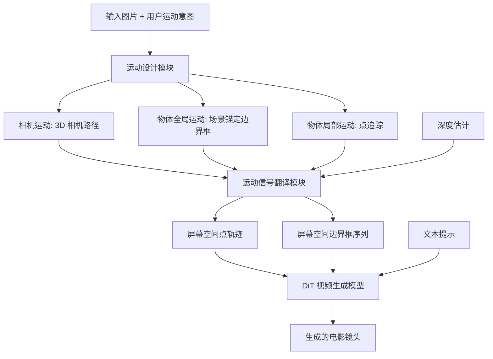

## 一句话总结

MotionCanvas 在图生视频（I2V）框架中引入电影镜头设计能力，让用户以场景空间的直觉方式联合规划相机运动与物体运动，并通过运动信号翻译模块把 3D 场景意图转换成视频扩散模型可用的 2D 屏幕空间条件信号，从而在无需昂贵 3D 训练数据的前提下实现 3D 感知的镜头控制。

## 研究背景

图生视频让静态图片"动起来"，但纯 I2V 方法主要依赖文本条件，难以精确表达运动意图。电影制作中的镜头设计需要同时规划相机移动与物体运动来构建连贯的视觉叙事，例如从同一张图出发，用户可能想让相机保持静止、后拉或环绕升高，同时让画面中的人物或物体朝不同方向移动。

现有可控视频生成方法通常只提供三类控制之一：边界框控制、点轨迹控制或相机控制，且彼此割裂。它们无法处理相机与物体运动交织带来的歧义——例如拖拽画面中角色的手臂，究竟意味着平移相机、移动角色还是仅仅移动手臂，方法难以区分。

作者指出两个核心挑战：一是如何捕捉用户对相机与物体运动的联合设计意图；二是如何把运动信息表示成视频扩散模型可有效利用的形式。为避免依赖昂贵且不可靠的 3D 标注（如相机外参、3D 物体轨迹），作者选择用可自动可靠估计的 2D 边界框与 2D 点轨迹来表示运动，从而几乎可以用任意视频进行训练。

## 方法

### 整体框架

MotionCanvas 由三个主要部分组成：（1）运动设计模块，捕捉场景感知的运动意图；（2）运动信号翻译模块，把场景空间意图转换为屏幕空间运动信号；（3）运动条件视频生成模型。核心思路是让用户在 3D 场景空间中规划运动，再把这些意图翻译成可从真实视频中可靠提取的屏幕空间信号（点轨迹与边界框序列），交给基于 DiT 的视频扩散模型合成。

### 关键设计

1. 场景感知的运动设计。以输入图片作为运动设计画布，建立起始场景。相机运动用标准针孔相机参数定义 3D 相机路径，用户在关键时刻指定相机位姿再插值得到完整路径，也可混合平移、推拉等基础运动模式。物体全局运动通过场景锚定边界框实现，用户只需最少指定起止框（可选中间关键框），并用 Catmull-Rom 样条插值生成平滑轨迹；物体局部运动（如抬手、转头）用稀疏点轨迹表示。时间控制则通过沿轨迹分配时间线来协调相机与物体运动。

2. 运动信号翻译模块。这是把场景空间意图翻译成屏幕空间信号的关键。相机运动借鉴人类视觉感知中"自我运动可由稀疏场景点追踪恢复"的洞见，用点追踪表示：推理时把 3D 相机路径转换为 2D 点轨迹，用 YOLOv11 掩码排除可能移动的物体区域以聚焦静态背景，再用单目深度估计器获得内参与深度图，最后依据 3D 相机路径与深度对点做变形。物体全局运动先把场景空间边界框升到 2.5D（初始框深度取 SAM2 掩码内平均深度），再用相机位姿投影回屏幕空间：$$b^l_{screen} = T^l_{camera}(b^l_{scene})$$。物体局部运动则做点轨迹分解，同时考虑相机与全局运动：$$p^l_{screen} = T^l_{camera}(T^l_{global}(p^l_{scene}))$$。

3. 运动条件视频生成。基于预训练的 DiT 图生视频模型微调。点轨迹用离散余弦变换（DCT）系数编码，利用点追踪的低时间频率特性把长轨迹压缩为 K 个系数（实验取 K=10），其中直流分量编码初始位置，每条轨迹作为一个 token 融入 DiT。边界框序列则先光栅化为唯一颜色编码掩码得到 RGB 序列，再用与基础模型相同的 3D-VAE 编码成时空嵌入，加到带噪视频隐 token 上。模型用流匹配损失训练：$$\min_{\theta} \mathbb{E}_{t,X_0,X_1}\left[\|V_t - v_\theta(X_t, t \mid C_{img}, C_{traj}, C_{bbox}, C_{txt})\|_2^2\right]$$。

4. 自回归可变长视频生成。为支持电影叙事，采用自回归生成。作者训练 MotionCanvasAR，额外以 16 帧短视频片段作为条件，通过重叠短片段策略让每步生成基于前一段时空上下文，从而获得自然过渡，并通过结合用户意图与回溯运动来重新计算屏幕空间运动信号以对齐训练设置。

## 实验结果

在 RealEstate10K 测试集（1K 视频）上评估相机运动控制质量，与 MotionCtrl、CameraCtrl 对比。值得注意的是后两者都在 RealEstate10K 训练集上训练（与测试集同域），而 MotionCanvas 是零样本，仍在所有指标上胜出。

| 方法 | RotErr↓ | TransErr↓ | CamMC↓ | FVD↓ | FID↓ |
|------|---------|-----------|--------|------|------|
| MotionCtrl | 0.8460 | 0.2567 | 1.2455 | 48.03 | 11.34 |
| CameraCtrl | 0.6355 | 0.2332 | 0.9532 | 39.46 | 13.14 |
| Ours（零样本） | 0.6334 | 0.2188 | 0.9453 | 34.09 | 7.60 |

在 VIPSeg 上评估物体运动控制，本文方法（Oursmap）在控制精度 ObjMC 上达到 25.72、帧质量 FID 达到 42.47，优于 DragAnything、MOFA-Video、TrackDiffusion 等基线。35 名参与者的用户研究中，本文方法在运动贴合度、运动质量、画面保真度三方面的偏好率分别为 75.24%、79.05%、77.14%，显著领先。消融实验显示，相比 Gaussian map 与 Plucker 嵌入，本文的 DCT 系数轨迹编码只引入 1.1% 的额外 token，延迟仅 32 秒，且无需 3D 相机位姿标注即可实现良好的内外参控制。

## 亮点与局限

亮点：把经典计算机图形学的场景建模思想与现代视频扩散技术结合，仅用可自动提取的 2D 信号（点轨迹、边界框）训练，却实现了 3D 感知的相机与物体联合运动控制，避免了昂贵且不可靠的 3D 标注，从而能利用几乎任意视频扩大训练数据来源。运动信号翻译模块能把用户的场景空间意图分解为分层变换并纠正潜在的错误输入。DCT 轨迹编码高效紧凑。框架还能自然扩展到运动迁移、视频编辑等应用。

局限：方法依赖单目深度估计与现成分割/追踪模型（YOLOv11、SAM2、DEVA、RAFT），这些前置模块的误差可能传导到最终结果。局部运动假设深度变化可忽略，对深度显著变化的局部运动可能不适用。自回归长视频生成需要短片段条件来缓解运动不连续。评估分辨率与帧数相对有限（如 640×352、14 帧）。

## 延伸思考

MotionCanvas 展示了一条"用 2D 可提取信号 + 场景空间到屏幕空间翻译"来规避 3D 标注瓶颈的思路，这对可控生成领域有普适启发：与其追求端到端处理 3D 场景信息，不如把难以大规模可靠获取的 3D 信息，转化为可从野外数据中稳定提取的中间表示。分层变换与信号翻译的设计也让相机与物体运动的歧义得以解耦。未来可探索把深度估计与生成模型更紧密地联合优化，减少前置模块误差累积；或把这种场景空间设计接口与更高分辨率、更长时序的视频基础模型结合，进一步提升电影级镜头设计的可用性与一致性。
