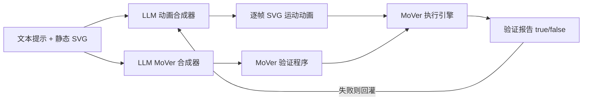

## 一句话总结

本文提出 MoVer——一个基于一阶逻辑的运动图形动画"验证"领域专用语言（DSL），并把它嵌入到 LLM 的"合成—验证—修正"闭环流水线中，让 LLM 能自动检查生成的动画是否满足文本提示中的时空要求，并据此迭代修正。

## 研究背景

- 领域现状：大型视觉语言模型可以把自然语言提示转成程序代码（如 SVG、CAD、动画 API），再执行生成可视内容。文本到动画的合成也已能产出看起来不错的结果。
- 核心痛点：生成出来的动画常常"看着像但不对"——无法覆盖提示里全部的时空属性（运动方向、时序先后、物体相对位置等）。而"自动验证生成结果是否符合提示"一直是难题。图像领域可用概念检测或视觉问答（VQA）来核对，但这类方法依赖概念检测器，且难以刻画运动的时空轨迹关系。
- 本文 idea：与其用感知模型去"看"结果，不如把提示翻译成一套可执行的一阶逻辑断言，直接在动画的结构化表示上做形式化验证。为此设计一个专门描述运动时空属性的 DSL，并借助 LLM 把提示同时翻译成"动画程序"和"验证程序"，用验证报告驱动自动修正。

## 方法

整体框架：流水线以"文本提示 + 一段设定场景的静态 SVG"为输入，用 LLM 的上下文学习式程序合成分别产出两个程序——动画合成器输出用高层动画 API（实现中用 GSAP）写的动画程序，MoVer 合成器输出对应的验证程序。动画被渲染成逐帧的 SVG 运动表示后，MoVer 执行引擎在其上运行验证程序，产出一份逐谓词标注 true/false 的验证报告；若有失败，报告连同 DSL 文档被自动回灌给动画合成器，触发下一轮修正。

关键设计：

1. MoVer 语言以认知心理学为依据。先前研究表明，人们描述动画时会把复杂轨迹拆成基本运动，即使平移、旋转、缩放同时发生也会分别描述，且偏好相对参照系而非绝对坐标。据此，MoVer 把一个运动 $$m_j$$ 抽象成七个原子属性：施动对象（agt）、类型（type：平移/旋转/缩放）、方向（dir）、幅度（mag）、原点（orig）、时长（dur）、后置条件（post）。物体则有形状、颜色、id 等属性谓词。这些谓词是布尔函数，可用 $$\land, \lor, \lnot$$ 和量词 $$\exists, \forall$$ 组合成完整逻辑语句，例如判断"黑色方块向上平移 100 像素"可写成 $$\exists m.\,\text{type}(m,\text{trn}) \land \text{dir}(m,[0,1]) \land \text{mag}(m,100) \land \text{agt}(m, \iota o.\,\text{clr}(o,\text{black}) \land \text{shp}(o,\text{square}))$$ 。

2. 用区间代数与矩形代数刻画相对关系。时间上的先后借助 Allen 区间代数的 13 种关系，空间上的相对位置借助其二维推广矩形代数的 169 种关系。为迁就自然语言的模糊性，MoVer 把底层关系用析取聚合成更高层的谓词：时间上聚合出 before()、while()、after()，其中 while() 就聚合了九种底层 Allen 关系；空间上聚合出 top()、bottom()、left()、right()、intersect()、border() 等十种，如 top() 聚合了 52 种底层矩形代数关系。

3. 基于"动画矩阵"的执行引擎。引擎先把逐帧 SVG 运动程序解析成一个二维动画矩阵：行是物体、列是帧，每个单元格存该物体该帧的原子运动属性（通过对逐帧变换矩阵做平移/旋转/缩放分解得到）。每个谓词在矩阵上逐单元格求值，得到一个同形状的布尔矩阵，谓词组合就是布尔矩阵的逐元素逻辑运算，量词则通过对矩阵做聚合实现，$$\iota$$ 算子返回满足条件的对象或运动所在行。对时空相对谓词这类需要比较起止帧或包围盒的复杂计算，用区间树表示来加速。引擎最终输出每条语句和谓词在哪些帧为 false，形成验证报告。

4. 验证报告驱动的迭代修正。报告是谓词级的、人类可读的。自动模式下，失败报告与 DSL 文档一并回灌给动画合成器，且合成器在每轮都能看到此前所有动画及其报告的对话历史，从而逐步纠错；人也可以直接读报告手动改程序或改提示。

## 实验结果

作者用模板加 LLM 构建了 5600 条"提示 + 真值 MoVer 程序"的合成测试集，分为单一原子运动、空间相对、时间相对、时空相对四类。关于 MoVer 合成器本身的准确率（要求与真值程序逐字符完全一致这一严苛标准），LLM 方法总体达 95.1%，明显优于规则式语义解析基线的 84.7%，且在各类提示上更具泛化性。

下面是核心实验——完整流水线的动画合成效果（Journal 版报告的主结果），按提示类型统计需要 0 轮修正即通过（pass@0）、需 1~49 轮修正后通过（pass@1+）、49 轮后仍失败（fail）的占比：

| 提示类型 | pass@0 | pass@1+ | fail |
|----------|--------|---------|------|
| 单一原子运动 | 88.3% | 11.3% | 0.3% |
| 空间相对 | 37.9% | 51.3% | 10.9% |
| 时间相对 | 88.5% | 11.2% | 0.3% |
| 时空相对 | 35.6% | 53.4% | 11.0% |
| 总体 | 58.8% | 34.8% | 6.4% |

可见自动验证与迭代修正把正确动画的比例从单次前向合成的 58.8%（pass@0）提升到约 93.6%（pass@0 与 pass@1+ 之和）；空间相对与时空相对类提示最受益于迭代修正。pass@1+ 情形的平均修正轮数为 5.8（范围 1~38）。

消融方面，作者对比了"无反馈"和"只报总体通过/失败的极简反馈"两种流水线：去掉谓词级反馈后，可被修正的比例从 34.8% 分别降到 12.1% 与 19.2%，失败比例从 6.4% 升到 29.0% 与 22.1%，说明细到谓词级的反馈才是迭代纠错有效的关键。此外，即便 MoVer 程序本身生成有误（约 4.9% 的提示），或换用 o3-mini、Gemini 2.0 Flash、Llama 3.1 8B、Llama 3.3 70B 等其他 LLM，自动验证加迭代修正都仍能提升正确动画数量。

## 亮点与局限

- 亮点：
  - 把"验证"这一形式化视角引入 LLM 视觉内容合成，用一阶逻辑 DSL 把模糊的自然语言时空描述变成可执行、可判定的断言，避开了对感知式概念检测器的依赖。
  - DSL 的谓词设计有认知心理学依据，既贴合人们描述运动的习惯，也贴合 LLM 训练数据中的概念，因而提示到程序的翻译准确率高。
  - 验证报告是谓词级、人类可读的，既能驱动全自动闭环修正，也能帮用户发现自己提示的歧义（如"旋转到相交"被理解成自转加平移），辅助调试提示。
- 局限：
  - MoVer 用低层运动属性表达，难以承接"走八字路径""让矩形跳舞"这类高层/复杂运动描述，这类提示本身也语义含糊。
  - 自相矛盾的提示（如同时向左又向右）能翻译成合法程序，但永远判 false；自动检测这类矛盾（如借助 SAT 求解器）尚是未来方向。
  - 用语言精确描述时空轨迹本就困难，草图、手势等其他模态的控制尚未支持。
  - 验证报告是被动的，只指出哪里错、不给出修复建议。

## 延伸思考

这项工作把软件工程里"规约—验证"的思路搬到了生成式视觉内容上：与其让模型端到端地"猜对"，不如给它一个可判定的正确性标准并把反馈闭环化。谓词级反馈显著优于粗粒度反馈这一点也呼应了"给 LLM 更结构化的错误信息更利于自我纠正"的普遍经验，对 agent 式迭代系统的反馈设计有参考价值。顺着作者提出的方向，值得追问的包括：如何为"跳舞"这类高层语义设计可组合的中间层谓词、如何用 SAT/SMT 检测提示自身的可满足性、以及能否把同样的"验证 DSL + LLM 闭环"范式迁移到 CAD、视频、图像等其他内容域，做成通用的自动优化框架。
