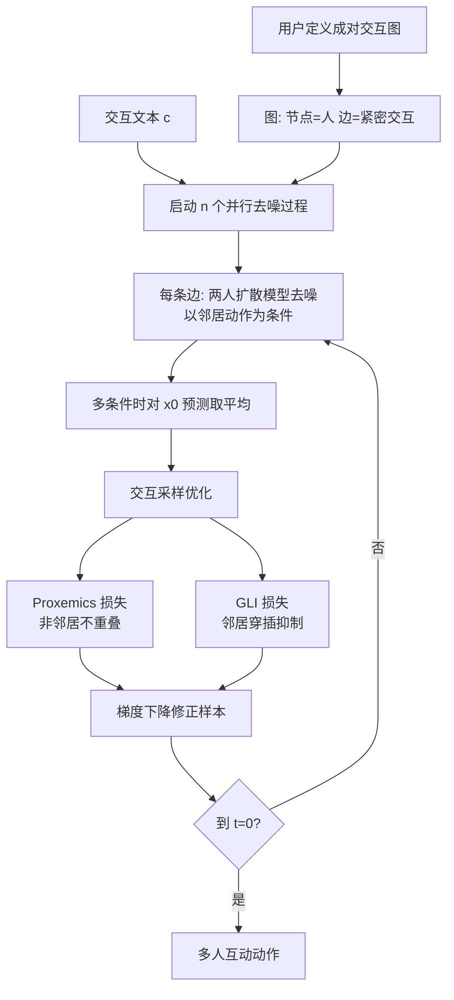

## 一句话总结

本文提出 Graph-driven Interaction Sampling：不训练新模型，而是把复杂的多人互动拆解成"成对交互图"（Pairwise Interaction Graph）上的若干两人交互，直接复用已有的两人动作扩散模型作为运动先验，再配合两个引导项抑制穿模，从而生成可精细控制、包含十多人的多人紧密互动。

## 研究背景

- 领域现状：文本驱动的人体动作生成近年进展很快，扩散模型能把语言描述较准确地翻译成动作序列。但绝大多数工作停留在单人设定，交互生成也主要局限于两人场景（如 InterGen 借助大规模两人交互数据集 InterHuman 生成高质量双人互动）。
- 核心痛点：多人互动几乎无从下手。一是数据稀缺——多人动捕数据远少于单人/双人数据，难以直接把现有流水线扩展到多人；二是现有方法多为固定人数设计，改变人数就要用对应规模的数据重训模型；三是少数尝试多人的工作（如 FreeMotion 顺序生成每个人的动作）实践中只能产出简单、重复、个体动作雷同、人际关系混乱的结果。
- 本文 idea：两人动作本身就是多人互动的宝贵先验。多人互动可以用一张图刻画——每个人是节点，紧密交互的一对之间连边（例如"一人对抗多名攻击者"就是众攻击者都连向主角）。于是把多人生成分解为图上邻居之间同时进行的、以对方动作为条件的单人生成，恰好是两人交互模型已经会做的事，无需任何重训。

## 方法

### 整体框架

框架分两部分。其一是基于图的多人采样：用户先定义一张有向的成对交互图，指定 $$n$$ 个人之间谁与谁紧密交互；框架据此同时启动 $$n$$ 个去噪过程，每个人的动作以图中指向它的邻居动作与交互文本为条件，逐步去噪并在每步互相更新。其二是交互采样优化：在每个去噪步引入两个图相关的引导损失（Proxemics 损失与 Gauss Linking Integral 损失），沿梯度方向修正采样，减少身体穿插等伪影。

### 关键设计

成对交互图与联合分布。把两人扩散模型学到的条件概率 $$p(x_j \mid x_i, c)$$ 解释为定义在图上的因子。多人动作的联合分布写成所有边上因子的乘积 $$p(x_1, x_2, \ldots, x_n) = \frac{1}{Z}\prod_{(i,j)\in\text{edges}} \phi_{i\to j}(x_i, x_j)$$，其中因子 $$\phi_{i\to j}(x_i, x_j) = p(x_j \mid x_i, c)$$。只要图连通，成对依赖就能在所有人的动作之间诱导出相关性，得到整体协调的互动。这个联合分布直接采样不可行，作者采用近似方案：同时跑 $$n$$ 个去噪过程，每步各自以邻居当前带噪动作为条件预测干净动作，若一个人同时被多个邻居约束，就把各因子给出的干净预测 $$\hat{x}_0$$ 求平均，再照常向其去噪一步。

时变交互图。真实互动里"谁和谁交互"会随时间变化（先与某人对打、后被另一人攻击）。作者把因子扩展到帧子序列 $$\phi_{i(f)\to j(f)}$$，让边随时间段切换；对帧上有多个因子重叠的情形，同样对各因子的干净预测取平均，从而产出时序连贯的动作。这让单个角色可以在不同时间段与不同对象交互。

Proxemics 损失（社交距离）。图中不相邻（非交互）的两人之间缺乏相关性，采样过程不会为其建立约束，容易严重穿插。作者对每个角色算包围盒，取非相邻角色对包围盒的重叠体积作为损失来惩罚重叠，必要时还可加入根节点距离惩罚把角色推开；遍历整张图对所有非相邻对求和。

Gauss Linking Integral（GLI）损失。受用 GLI 作软约束生成无碰撞紧密互动的经典思路启发，作者监控紧密交互双方身体部位的成对 GLI。GLI 是对两条有向曲线 $$G(\gamma_1, \gamma_2) = \frac{1}{4\pi}\int_{\gamma_1}\int_{\gamma_2}\frac{d r_1 \times d r_2 \cdot (r_1 - r_2)}{\lVert r_1 - r_2\rVert^3}$$ 的有符号标量，度量两曲线在所有视角下的平均交叉数。把每个角色骨架表示成 5 条串联链，计算两角色各链对之间的 GLI；当发生穿插时 GLI 会剧烈变化（甚至变号），因此对相邻两帧 GLI 差值超过经验阈值（0.4）的情况施加惩罚，鼓励 GLI 随时间平滑变化，从而避免穿模。

后验采样优化。整体沿用类似 Diffusion Posterior Sampling 的思路，但把重建误差替换为上述 GLI 与 Proxemics 损失。每个采样步基于当前样本计算损失并用梯度下降迭代更新，例如相邻的 $$i$$、$$j$$ 更新为 $$x_{t-1}^{i} \leftarrow x_{t-1}^{i} - \lambda_t \nabla_{x_t^{i}} L_G(\hat{x}_0^{i}, \hat{x}_0^{j})$$；再加入非相邻第三人 $$k$$ 时叠加 Proxemics 项 $$L_P$$。整个过程不改动预训练模型，即插即用、与骨干模型无关（论文验证了 InterGen、in2IN 等都能作骨干）。

## 实验结果

数据用 InterHuman 两人交互数据集（6022 段、30 Hz，SMPL-H 表示），并从测试集挑出约 2 万帧的紧密交互子集评测。指标含 R-Precision、FID、MM Dist、Diversity（文本对齐与质量），以及 PeneBone（骨骼级穿透深度，把每根"骨"建成半径 2cm 的盒子）、Skating（脚滑比例）、Jitter（抖动/平滑度）等伪影指标；多人场景另引入 Contact、CFrame 与 Pair-FID。

两人交互主实验（InterHuman 测试集，本文以 InterGen 为骨干）：

| 方法 | R-Precision Top3 ↑ | FID ↓ | Diversity ↑ | PeneBone（m）↓ | Jitter ↓ |
| --- | --- | --- | --- | --- | --- |
| Real | 0.705 | 0.291 | 7.782 | 0.256 | 7.083 |
| FreeMotion | 0.544 | 6.740 | 7.828 | 1.443 | 4.506 |
| InterGen | 0.663 | 6.883 | 7.807 | 0.899 | 4.292 |
| 本文（Ours） | 0.638 | 6.890 | 7.853 | 0.211 | 4.282 |

在保持文本对齐、FID、多样性与基线相当的前提下，本文把穿透深度 PeneBone 相对 InterGen 与 FreeMotion 分别降低约 76.53% 与 85.38%，甚至优于真实数据（0.211 对 0.256）。在紧密交互子集上，相对 InterGen 穿透深度与接触数分别下降约 77.52% 与 74.61%（PeneBone 从 2.335 降到 0.525，Contact 从 136.66 降到 34.69）。

多人场景（3~5 人，与 FreeMotion 用循环图公平对比）本文在所有指标上全面领先：Pair-FID 对人数增加更鲁棒，FreeMotion 在 4、5 人时的 Pair-FID 分别是本文的约 1.70、1.60 倍；穿透 PeneBone 上 FreeMotion 高出本文 3.67 到 20.25 倍（如 $$n=4$$ 时 6.137 对 0.303）。消融显示引入损失项后，$$n=3/4/5$$ 的穿透深度分别下降约 42.94%/96.33%/87.80%，接触数下降约 29.94%/91.60%/83.72%；换用 in2IN 作骨干效果相当，验证了方法的即插即用与模型无关性。相较简单的包围盒接触损失，GLI 损失在紧密交互子集上的穿透深度更低（代价是 R-Precision 略降）。作者也承认方法会略增脚滑，可能源于训练数据归一化。

## 亮点与局限

亮点：核心洞见"把多人互动分解成图上的两人交互"非常巧妙，让现有两人扩散模型零训练地泛化到任意人数、任意拓扑（1v1、1v多、循环、团战等），并通过成对交互图给了用户精细的关系控制权；时变交互图进一步支持随时间切换交互对象；GLI 与 Proxemics 两个引导损失以物理/拓扑直觉直接优化穿插伪影，且对紧密互动的双人场景同样有效，能生成十余人的复杂互动。

局限：交互图目前完全由用户给定（换来最大可控性，但也需人工设计）；方法无法完全消除穿插；由于完全建立在两人模型之上，不能刻画图中非直接相连节点之间的关系；此外会略微增加脚部滑动；多人结果因缺乏真值主要依赖定性评估。

## 延伸思考

这项工作提供了一个很有启发的范式：当高阶（多体）数据稀缺时，与其硬凑数据训练大模型，不如把高阶交互在概率图上分解为已被充分训练的低阶（成对）因子，再用采样期引导补齐分解损失的全局一致性。这与图模型/因子图的经典思想一脉相承，却漂亮地嫁接到了扩散采样上，且天然继承了骨干模型的进步（骨干越强，多人结果越好）。作者提出的两个方向都值得追问：用大语言模型自动推断交互图与轨迹，可把"人工设计图"这一瓶颈自动化；引入物理仿真或对非相邻节点的"辅助条件"（如量化周围占用信息喂给 Proxemics 计算），则有望突破"只能建模直接相连关系"的结构性限制。对做群体行为、战斗编排、社交场景动画的研究者，这种可控、可组合、免重训的思路在工程落地上尤其有吸引力。
