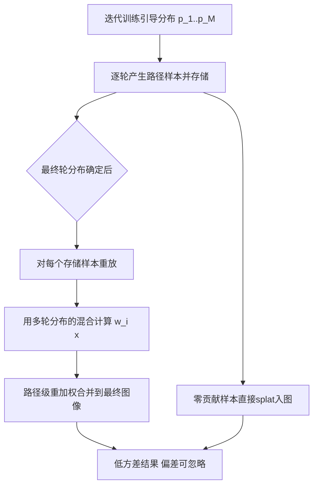

## 一句话总结

把路径引导中"多轮迭代产生的样本如何合并"这件事，从图像空间的加权求和，升级为在路径空间逐条路径计算权重的重加权过程；借鉴自适应多重重要性采样（AMIS）的思想，用多轮引导分布的混合来算每个样本的权重，从而在几乎不引入偏差的前提下显著降噪。

## 研究背景

蒙特卡洛路径追踪通过随机采样求解渲染方程，在复杂场景中收敛慢、噪声大。路径引导（path guiding）用迭代训练的方式，逐轮从历史样本中拟合辐射分布，把它作为提议分布来引导采样，能大幅降噪。

问题出在"训练"与"渲染"之间的割裂。每一轮迭代其实都产生了估计（样本），但传统做法要么直接丢弃早期训练样本，要么给每轮迭代一个常数权重、只在图像空间做加权合并。最优的逐像素权重理论上正比于像素方差的倒数，但由于总体方差不可得，只能用样本方差近似，且往往在全图上做平均以抑制偏差。

这套图像空间的合并有几个根本缺陷：

- 提议分布逐轮变化，路径空间不同区域的收敛速度差异很大（论文用图展示同一场景不同区域、不同光源方向的方差随迭代呈现完全不同的走势），一个常数或逐像素的权重无法刻画这种差异。
- 即便某个像素整体方差高，它在路径空间上的某些子区域可能已经被充分采样、估计得很好，但逐像素加权会把这些好样本一并压低。
- 逐像素方差与估计值强相关，会引入明显偏差。
- 图像空间合并完全忽略了提议分布本身携带的信息——分布密度其实能反映每轮迭代对某条路径的采样质量。

核心观察是：拟合出来的分布（尤其早期迭代）往往非常嘈杂，甚至漏掉目标分布的某些模式，导致某些路径的 $p_i(\bm{x})$ 极小而 $f(\bm{x})$ 仍很大，样本因此获得过高的重要性权重、注入巨大方差。这提示我们应当利用多轮分布的信息来稳定权重。

## 方法

### 整体思路

传统做法把每轮迭代的估计在图像空间用常数权重 $w_i$ 合并。本文改为引入随路径变化的权重因子 $w_i(\bm{x})$，得到路径级重加权估计：

$$\left\langle \int_{\mathcal{P}} f(\bm{x})\,\mathrm{d}\bm{x} \right\rangle = \sum_{i=1}^{M} \frac{1}{n_i} \sum_{j=1}^{n_i} \frac{w_i(\bm{X}_{i,j})\, f(\bm{X}_{i,j})}{p_i(\bm{X}_{i,j})}$$

其中共 $M$ 轮迭代，第 $i$ 轮从 $p_i$ 抽取 $n_i$ 个独立样本，权重需在迭代间归一化：对所有 $\bm{x}$ 满足 $\sum_{i=1}^{M} w_i(\bm{x}) = 1$。直觉上，对某条路径 $\bm{x}$，采样密度 $p_i(\bm{x})$ 越高或样本越多的那一轮，其权重 $w_i(\bm{x})$ 应越大。

### 关键设计一：混合式加权（balance heuristic / AMIS）

由于路径是增量构建的，其概率密度是若干条件密度之积；展开后几何项在权重计算中相互抵消，只剩一串方向概率密度之积。作者采用平衡启发式（balance heuristic）作为权重：

$$w_i(\bm{x}) = \frac{n_i\, p_i(\bm{x})}{\sum_{k=1}^{M} n_k\, p_k(\bm{x})}$$

这正是自适应多重重要性采样（AMIS）所用的方案，等价于把样本视作从"所有迭代分布的混合"中抽出。它的好处是：表现差的分布会随 $M$ 增大被逐渐淘汰，且该混合天然把多轮嘈杂分布融合成一个更鲁棒的分布来计算重要性权重，使算法对某几轮的过拟合不再敏感。作者指出该方案具有可证明的一致性（consistency，证明在补充材料中）。

重加权的实际效果：许多原本重要性权重过高的样本被压低，而大量低权重样本被抬高（论文用散点图展示"高值变低、低值变高"），从而在不改变采样过程的前提下稳定样本权重、降低噪声。

### 关键设计二：可选的方差感知因子

当最后几轮已经很好地拟合了目标（理想情况接近零方差）时，把早期分布纳入混合反而可能增大方差。为此可引入逐像素方差感知因子 $v_i$，即第二矩 $u_{2,i}$ 与样本方差 $\sigma_i^2$ 之比：

$$w_i(\bm{x}) = \frac{n_i\, v_i\, p_i(\bm{x})}{\sum_{k=1}^{M} n_k\, v_k\, p_k(\bm{x})}, \qquad v_i = \frac{u_{2,i}}{\sigma_i^2}$$

但方差感知不再有一致性保证，且实测会带来更多偏差；实际中提议分布很难精确拟合整个被积函数，方差因子通常很小（测试中小于 3），可挖掘的降方差空间有限。因此作者在正式实验中不启用方差感知。

### 关键设计三：常数样本存储

路径级重加权需要存样本，是主要开销来源。每条路径存贡献值与各顶点位置、防御性采样 PDF 及末顶点方向，单精度、方向压成两个 16 位定点数，一条长度为 $N$ 的路径约需 $16(N+1)$ 字节；零贡献样本不存、直接 splat 入图。

为控制内存，维护一个用户指定大小（默认 500 MB）的缓冲区，用重要性权重作键的二叉堆管理；超限时弹出权重最低的样本并 splat 入图。问题是这些被提前弹出的样本无法获得后续迭代的完整混合。朴素做法是不再重加权这些样本，但会引入偏差。作者的解法是用"截至当前第 $i$ 轮"的部分混合来重加权：

$$w_i(\bm{x}) = \frac{n_i\, p_i(\bm{x})}{\sum_{k=1}^{i} n_k\, p_k(\bm{x})} \cdot \frac{\sum_{k=1}^{i} n_k}{\sum_{k=1}^{M} n_k}$$

部分混合虽无一致性理论保证，但实测在方差、偏差、存储、计算开销上都表现良好。

### 计算加速

朴素实现每个样本需 $(N-1)M$ 次密度查询，时间复杂度 $O((C_S+C_D)NM)$（$C_S$、$C_D$ 分别为空间与方向结构查询代价）。大场景中 $C_S$ 远大于 $C_D$，故在空间层级的叶节点保留指向历史方向分布的指针，空间节点细分后只复制指针、避免冗余，把复杂度降到 $O(C_S N + C_D N M)$，几乎减半。

## 实验结果

方法实现在 Mitsuba 0.6 上的 Practical Path Guiding（PPG）之上，启用随机时空 splatting，误差用 RelMSE（$\epsilon=0.01$），部分实验附 SMAPE，24 核 i9-13900KF 计时。

主结果（24 spp，相对逆方差加权的方差降低倍数 / 渲染时间倍数，见统计表）：

- Aquarium：RelMSE 0.345，方差降低 3.0×，时间 1.13×
- Ajar：RelMSE 2.235，方差降低 6.8×，时间 1.08×
- Bathroom：RelMSE 0.268，方差降低 1.2×，时间 1.11×
- Cbox：RelMSE 0.477，方差降低 5.5×，时间 1.03×
- Glossy Kitchen：RelMSE 1.564，方差降低 2.8×，时间 1.16×
- Kitchen：RelMSE 6.438，方差降低 18.4×，时间 1.16×
- Pool：RelMSE 0.342，方差降低 3.2×，时间 1.17×
- Spaceship：RelMSE 0.041，方差降低 2.1×，时间 1.41×
- Torus：RelMSE 0.203，方差降低 1.5×，时间 0.97×

额外开销主要来自权重评估，约 30%；在大量路径未命中光源、需重加权的路径很少的场景中甚至可忽略。样本存储通常几百 MB（表中 S 列），可接受。

等时对比（equal-time）：

- Pool（5 秒）：Discard 2.45（1.00×）、Inverse Var 1.41（0.57×）、Ours 0.77（0.31×）
- Spaceship（5 秒）：Discard 0.55（1.00×）、Inverse Var 0.36（0.65×）、Ours 0.21（0.38×）

样本划分鲁棒性（RelMSE，Cbox / Ajar，32 spp）：随着样本在迭代间划分得更细，本方法优势越明显。以 Cbox 为例，分配方案 [1,2,4,9] 时 Inverse Var 2.55 / Ours 0.77（3.31×），细分到 [1]×16 时 Inverse Var 4.04 / Ours 0.42（9.71×）；Ajar 上对应从 4.46× 提升到 10.36×。

去相关变体验证：把一半样本 splat 入图、另一半用于拟合分布以降低相关性。Kitchen 场景（启用 Russian roulette）24 spp 下 Inverse Var 852.178、Ours Decorrelated 88.974、Ours 36.980；128 spp 下 43.507 / 5.755 / 4.638。说明降方差主要来自重加权本身，仅一小部分来自跨迭代相关性。

与像素级技术对比（Pool 24 spp，RelMSE）：Accumulate 4.83（1.00×）、Per-Pixel Var 0.44（0.09×）、Per-Pixel Var* 0.19（0.04×）、Removal 0.13（0.03×）、Ours+Removal 0.13（0.03×）、Ours 0.67（0.14×）。异常值剔除虽降方差但带来可见偏差，而本方法可与其结合，在 Ajar 上把偏差近乎减半。

常数存储 vs 无限存储（Ajar 256 spp）：Ours（973 MB）RelMSE 0.078、rBias 0.009；Ours*（500 MB 部分混合）0.077 / 0.009，与无限存储几乎一致；朴素不重加权（Naïve）偏差明显更大（0.080 / 0.024）。Glossy Kitchen 高分辨率（2560×1440，1024 spp）下 Ours* 亦逼近超过 10 GB 的无限存储。

通用性：在 Intel OpenPGL 库的三种分布（quadtree、vMF 混合、视差感知 vMF 混合）上，本方法（O）相对丢弃训练样本（D）与逆方差加权（I）一致取得最低方差。偏差评估显示偏差表现为能量损失，随样本数增加逐渐减小，经验上验证了一致性。

## 亮点与局限

亮点：

- 视角转换干净利落：把"跨迭代样本合并"重新表述为路径空间的重加权 / MIS 问题，理论上优雅（借用平衡启发式与 AMIS 的一致性），实践上简单。
- 几乎与底层引导方法无关，能叠加在 PPG、OpenPGL 的多种分布之上，也兼容传统像素级重加权和异常值剔除。
- 稳定权重带来的直接红利是允许更细的时空细分与更灵活的样本分配（不必每轮翻倍），在困难场景、低采样预算下收益尤为突出。
- 常数样本存储的部分混合方案，把内存从"随样本无限增长"压到用户可控的固定值，且几乎不损失效果。

局限：

- 存储与计算成本是主要瓶颈：分辨率与 spp 很高时开销更重，等时设定下改进可能变得微小。
- 路径样本存储对 GPU 实现不友好；对神经方法而言历史分布存储代价更高。
- 空间层级的指针优化主要适用于常规 kd-tree，对其他结构可能需要完整复制历史分布。
- 实验中关闭了下一事件估计（NEE）与 Russian roulette；接入 NEE 原理上直接，但需改动路径存储、实现更复杂。
- 部分混合方案缺乏一致性理论保证（尽管实测良好）；方差感知因子会引入更多偏差故未采用。

## 延伸思考

这项工作把渲染里由来已久的"训练样本要不要用、怎么用"的问题，纳入了 MIS 的统一语言，本质上是在问：当我们手里有一堆来自不同（且都在拟合同一目标的）提议分布的样本，如何最优地组合它们。这与统计中的自适应重要性采样、群体蒙特卡洛（population Monte Carlo）一脉相承，也和该团队其他工作（如条件混合路径引导）对"混合权重应逐路径 / 逐顶点条件化"的思路呼应。

一个自然的后续是把重加权推广到更复杂的算法族：带光源采样、双向连接、顶点合并的引导方法，作者也在展望中点到。另一个方向是在训练阶段就做重加权（如原始 AMIS），有望进一步降方差，但会增大复杂度与相关性带来的偏差风险，如何权衡值得探索。

对工程落地而言，最实际的启发或许是那条折中建议：早期迭代（分布嘈杂时）用路径级重加权，分布收敛后切回逆方差加权，兼顾降噪与开销。这也暗示"重加权的价值随分布质量下降而上升"这一普适规律——在样本预算紧、分布难拟合的场景，路径级信息最值钱。
