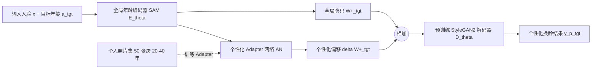

## 一句话总结

利用一个人 10~50 张跨越 20~40 年的个人照片，把全局衰老先验与个性化衰老特征通过一个轻量 Adapter 网络融合，实现既符合本人真实衰老规律、又能外推到未见年龄的人脸变老/返老，并可扩展到时序一致的视频换龄。

## 研究背景

人脸衰老是一个高度个体化的过程，受性别、种族、遗传、生活方式、健康状况等多重因素影响，因此很难用一个"全局衰老先验"准确预测任意个体的衰老轨迹。现有方法（如 SAM、CUSP、AgeTransGAN、FADING）通常在 FFHQ 等大规模数据集上学习"平均脸如何变老"，结果虽然逼真，但往往不像目标人物在该年龄时的真实样貌。论文用 Al Pacino 68 岁照片返老到 30 岁的例子说明：现有 SOTA 生成的年轻脸真实但"不是他本人"。

在很多实际应用里，个人照片集其实是可获得的：影视 VFX 中给演员换龄时可以拿到其过去 20~40 年的照片；普通人想模拟亲人未来样貌时也能拿到近十几年的照片。因此论文主张用个人照片集来个性化衰老模型。

一个自然的想法是直接对全局方法做微调（如 FADING + DreamBooth），但个人照片集在年龄跨度、姿态、光照、风格上都远比 FFHQ 有限，朴素微调会**过拟合**，无法泛化到未见年龄/姿态/风格。此外 FADING 基于扩散模型，存在典型的"反演-可编辑性权衡"问题。相比之下，StyleGAN2 训练良好的隐空间在这方面探索更充分，因此作者选择基于 StyleGAN2 构建个性化换龄方案。

## 方法

### 整体思路

方法记为 MyTM，构建在全局衰老网络 SAM 之上。SAM 用一个年龄编码器 $E_\theta$ 把输入图像 $x$ 与目标年龄 $a_{tgt}$ 映射到 StyleGAN 的 $W+$ 隐空间，再经预训练的 StyleGAN2 解码器 $D_\theta$ 生成换龄结果。MyTM 的核心是：**不重训全局先验，而是用一个个性化 Adapter 网络 $AN(\cdot)$ 对 SAM 产生的隐码做偏移修正**。

Adapter 采用 MLP 结构，输入 SAM 的隐码表示，输出一个隐码偏移。最终生成公式为：

$$y^{p}_{tgt} = D_\theta\big( E_\theta(x, a_{tgt}) + AN(E_\theta(x, a_{tgt}), a_{tgt}) \big)$$

其中前一项是全局衰老，后一项是个性化衰老。这样即可把仅从个人照片观测到的、局部年龄段的个性化衰老信息注入到全局衰老轨迹中。

### 三个关键损失函数

个人照片集记为 $D = \{(x_i, a_i)\}_{i=1}^{N}$。除沿用 SAM 原有的 $L_{sam}$（防止遗忘全局先验）外，作者提出三个损失：

**1）个性化衰老损失（Personalized Aging Loss）**

SAM 原本依赖一个全局年龄分类器来提供衰老监督，但该分类器对不同种族、风格、个体衰老模式并不鲁棒。作者改为：在训练集中采样一个目标年龄 $a_{tgt} \sim U(a_{min}, a_{max})$，构造该年龄附近（$a_{tgt} \pm 3$ 岁）的真实参考图集合 $D_{tgt}$，用 arcface 提取身份特征，让换龄结果与参考集里最相似的一张接近：

$$L_{pers\text{-}age} = 1 - \max\Big\{ \big\langle R(y^{p}_{tgt}),\, R(x_j) \big\rangle \Big\}_{j=1}^{M}$$

取"最大相似度"是为了避免身份识别网络被风格差异干扰。它鼓励换龄结果贴近本人在该年龄真实的长相，而忽略姿态、光照、风格差异。

**2）外推正则（Extrapolation Regularization）**

当目标年龄落在训练年龄范围 $[a_{min}, a_{max}]$ 之外时，模型容易在边界年龄处"卡住"（例如训练覆盖 30~70，要求 $a_{tgt}=10$ 时仍生成 30 岁的脸）。作者用经验回放思想，约束个性化输出在外推区间靠近预训练 SAM 的输出：

$$L_{reg\text{-}extra} = \lambda_{l2} L_2(y^{p}_{tgt}, y_{tgt}) + \lambda_{LPIPS} L_{LPIPS}(y^{p}_{tgt}, y_{tgt}) + \lambda_{ID} L_{ID}(y^{p}_{tgt}, y_{tgt})$$

即用全局先验来"接管"超出训练范围的衰老，防止外推失败。

**3）自适应 w-norm 正则（Adaptive w-norm Regularization）**

针对反演-可编辑性权衡：当目标年龄接近输入年龄时，希望隐码靠近 SAM 的输出以保真；当目标年龄偏离较大、需要更大的脸型形变时，希望隐码靠近隐空间中心 $W$ 以获得更强的可编辑性。作者把正则强度做成年龄差 $\Delta_{age} = |a_i - a_{tgt}|$ 的余弦函数：

$$L_{reg} = \lambda_{reg}(\Delta_{age}) \lVert W^{+}_{tgt} - W \rVert$$

$$\lambda_{reg}(\Delta_{age}) = 1 - \langle \pi \cdot \Delta_{age} / 100 \rangle$$

这样能在保身份的同时，让衰老带来的脸型与纹理变化更明显。

### 视频换龄

直接对每帧换龄再贴回原帧会遇到两类问题：人脸检测/关键点误差导致对齐错位；换龄是非刚性形变，贴回原帧在理论上就无法无失真对齐。作者改用换脸（face-swapping）思路：手动选一个接近正脸、遮挡与运动模糊都小的关键帧，用 MyTM 对其换龄，得到个性化的目标年龄人脸；再用黑盒换脸模型 Inswapper 把这张脸迁移到其余每一帧。整条流程只需要一张换龄脸，因此时序一致性强且保留个性化身份。

## 实验结果

数据集为作者自建的 12 位名人纵向衰老图集（7 男 5 女，含高加索、非裔、西语裔、亚裔），每人用 50 张训练，在 40 岁或 70 岁的测试图上评估。评价指标为年龄准确度 $Age_{MAE}$（越低越好，用 FP-Age 预测）与身份保持 $ID_{sim}$（越高越好，与目标年龄附近的参考图比对，而非与输入图比对，以避免识别网络偏爱"改动小"的方法）。

**返老（Age Regression，70 岁→更年轻）——表 1：** MyTM 在 $Age_{MAE}$ 与 $ID_{sim}$ 上综合最优。相比最强基线 FADING，$ID_{sim}$ 从 0.60 提升到 0.67（提升 11.7%）；在插值区间（$a_{tgt} \in 30\sim70$）从 0.66 提升到 0.72（提升 9.0%）。

| 方法 | $Age_{MAE}$ ($a_{tgt}\le70$) | $ID_{sim}$ ($a_{tgt}\in50\sim70$) | $ID_{sim}$ ($a_{tgt}\in30\sim70$) |
|---|---|---|---|
| SAM | 8.1 | 0.58 | 0.53 |
| CUSP | 11.0 | 0.44 | 0.42 |
| AgeTransGAN | 11.1 | 0.65 | 0.58 |
| FADING | 8.9 | 0.72 | 0.66 |
| FADING + DreamBooth | 25.9 / 23.0 | 0.78 | 0.70 |
| Ours (50~70) | 7.7 | 0.76 | - |
| Ours (30~70) | 7.8 | - | 0.72 |

FADING + DreamBooth 虽在 $ID_{sim}$ 上略高（0.78 vs 0.76），但 $Age_{MAE}$ 高达 25.9，说明它过拟合训练年龄段、无法泛化到未见年龄。

**变老（Age Progression，40 岁→更老）——表 2：** 该任务专门考察对未见年龄的外推能力。MyTM (20~40) 取得最佳年龄准确度 6.3 与最佳身份保持（$a_{tgt}\ge40$ 为 0.70，$a_{tgt}\in40\sim60$ 为 0.78）。FADING + DreamBooth 的 $Age_{MAE}$ 高达 20.2，外推能力差。

**用户研究：** 在两个返老任务与一个变老任务上做成对偏好测试，MyTM 相比 FADING、AgeTransGAN、SAM 在所有换龄任务中都被显著偏好。

**数据集规模消融（图 7）：** SAM 的 $ID_{sim}$ 为 0.49；MyTM 用 $N=10$ 得 0.58，$N=50$ 得 0.67，$N=100$ 仍为 0.67。从 10 到 50 提升显著，50 到 100 收益甚微，故默认用 50 张。

**非名人真人数据（表 3）：** 用 5 位在 YouTube 记录自己衰老过程的普通人（平均跨度 20~54 岁）验证。MyTM (20~40) 取得最佳：$Age_{MAE}$ 9.3、$ID_{sim}$ 0.83（20~40 插值）/ 0.74（>40 外推），均优于所有基线。

**损失/结构消融（图 8，训练 30~70，测试 $a_{tgt}\le70$）：** 从 SAM（$ID_{sim}$ 0.45）逐步加入组件。个性化衰老损失带来的 $ID_{sim}$ 提升最大；外推正则把 $Age_{MAE}$ 从 17.9 显著降到 11.0 而 $ID_{sim}$ 稳定在 0.65；完整模型达到 $ID_{sim}$ 0.67、$Age_{MAE}$ 10.5。

**视频：直接编辑 vs 换脸（表 4）：** 相比直接视频换龄方法，在时序一致性与身份保持的用户偏好上，本方法 vs STIT 为 86% / 93%，vs VideoEditGAN 为 71% / 79%。且直接编辑方法需逐帧 PTI 反演优化，单条视频 >3 小时（A6000），本方法同任务 <5 分钟。

## 亮点与局限

亮点：
- 把"全局衰老先验 + 少量个人照片"这一实际可得的设定形式化，并用轻量 Adapter 做隐码偏移，无需重训 StyleGAN2，训练数据可低至 10 张、理想 50 张。
- 三个损失各司其职：个性化衰老损失解决"像不像本人"，外推正则解决"训练范围外不失效"，自适应 w-norm 正则化解反演-可编辑性权衡。
- 用最大相似度的参考集身份损失，绕开了不鲁棒的全局年龄分类器，也让 $ID_{sim}$ 评测更公允（对齐目标年龄而非输入年龄）。
- 视频换龄用单关键帧 + 换脸的巧思，兼顾时序一致与效率，比逐帧优化快两个数量级。

局限：
- 受 e4e 编码器限制，对眼镜等配饰处理不佳。
- 预训练 SAM 难以改变发色，尤其是变白/去白（$a_{tgt}\ge80$ 头发不会变白）；生成老年脸时可能出现红眼伪影，w-norm 正则只能缓解、未彻底解决。
- 即便个性化，对代表性不足人群的鲁棒性仍可能不够。
- 存在被滥用于伪造真人图像的社会风险，作者呼吁负责任使用，并建议未来加入合成图检测与公平性评估等防护。

## 延伸思考

- "Adapter 修正隐码偏移 + 用真实参考图做身份监督"的范式，本质上是把个性化问题从"重训生成器"降级为"在冻结先验上学一个小残差"，这对数据稀缺的个体化生成任务有普适借鉴意义，也天然缓解过拟合。
- 外推正则用全局先验接管训练范围外区间，是一种朴素但有效的"分区间委托"策略；能否让全局与个性化的过渡更平滑（而非硬性对齐 SAM 输出），可能进一步提升极端年龄的真实感。
- 方法的天花板受限于底座（SAM/e4e/StyleGAN2 与 arcface）。发色、配饰、红眼等问题都根植于底座能力，若换用更强的扩散或 3D 感知生成器作为全局先验，个性化 Adapter 思路是否仍然成立、损失是否需要重新设计，值得探索。
- 视频用黑盒换脸迁移单关键帧，虽高效，但换脸模型本身的身份/纹理偏差会叠加进来；对多视角、大姿态或多人物场景的扩展性仍是开放问题。
