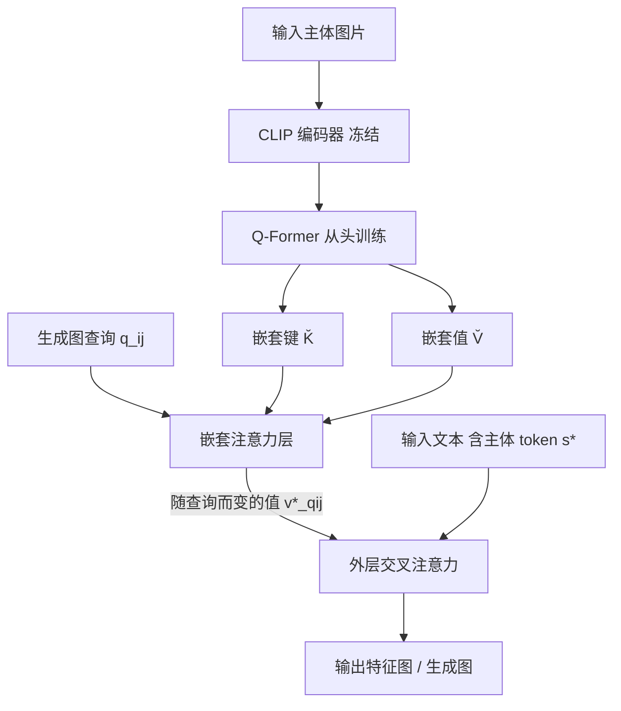

## 一句话总结

提出"嵌套注意力"（Nested Attention）机制，把主体的丰富多向量表示压进扩散模型已有的单个文本 token 上，通过一个内层注意力为每个图像区域生成"随查询而变"的注意力值，从而在个性化生成中同时兼顾身份保真与文本对齐，并支持在一张图里组合多个跨域概念。

## 研究背景

文本到图像模型的个性化（personalization）目标是：给定某个特定主体（一张人脸、一只宠物）的图片，让模型能在各种场景、风格、姿态下生成这个主体。早期做法是对每个主体做逐一优化（textual inversion、DreamBooth 一类），效果好但每个主体要花几分钟训练；后来主流转向训练图像编码器（encoder-based），一次前向就把主体注入模型。

这个领域的核心矛盾是身份保真与提示词对齐之间的平衡。作者把已有注入方式归成两类，各有硬伤：一类（如 IP-Adapter 的解耦交叉注意力）把主体编码成大量视觉 token，再用新增的交叉注意力层注入，表达力强、身份保真高，但会"压过"模型原有的先验，破坏文本对齐；另一类把主体绑到已有交叉注意力里的少量词嵌入上，能较好保住先验，但表达力受限、身份保真差。

作者想要"两全其美"：既用主体的丰富表示，又只把它系在单个文本 token 上、走模型原有的交叉注意力通道。此外，多数近期人脸个性化方法依赖人脸识别网络的特征或损失，只适用于人脸域，还需要含重复身份的专门数据集；本文方法是通用的，在小数据集（如 FFHQ 的 7 万张）上就能训练，也适用于宠物等非人脸域。

## 方法

整体框架建立在预训练扩散模型 SDXL 上：输入图片经编码器转成一组 token，这些 token 投影成"嵌套注意力层"的键和值；嵌套层为每个查询（生成图的每个空间位置）算出一个专属的主体值 $$V^*_q$$，用它替换掉主体 token $$s^*$$ 在原交叉注意力中的值。模型原权重全程冻结，只训练编码器与嵌套注意力层。

关键设计一：为什么要"随查询而变的值"。标准交叉注意力里，一个文本 token（比如"person"）在整张图上共用同一个值 $$V[s]$$，这个值被迫承载主体所有细节，表达力不足。作者的洞察来自已有分析：查询与键的点积决定"某区域该出现什么概念"，而值控制"外观长什么样"。既然值管外观，就让主体 token 的值按区域细分——眼睛区域的查询取到编码眼睛的值，头发区域取到编码头发的值，无需用单个嵌入塞下整张脸。

关键设计二：嵌套注意力的两级结构。外层是标准文本-图像交叉注意力，主体绑在给定文本 token 上；内层（即"嵌套"层）用生成图的查询 $$q_{ij}$$ 去注意编码器产出的多向量主体表示，算出局部化的、随查询而变的值。内层输出为 $$v^*_{qij} = \mathrm{softmax}(q_{ij}\breve{K}^T/\sqrt{d})\,\breve{V}$$，其中 $$\breve{K},\breve{V}$$ 是编码器 token 经线性投影得到的嵌套键值。随后外层交叉注意力用 $$\phi^\ell_{out}(z_t)_{ij} = \mathrm{softmax}(q_{ij}K^T/\sqrt{d})\,V_{q_{ij}}$$，且值向量满足：当 $$s = s^*$$ 时取 $$v^*_{qij}$$，否则取原始的 $$V[s]$$。这样既得到丰富的多 token 表示，又把全部主体特征系在单个提示词 token 上，可控性强。

关键设计三：值范数正则化。已有工作指出把新主体绑到已有交叉注意力会引发"注意力过拟合"——新 token 抢走所有查询的注意力，导致提示词其余部分被忽略。本文只预测值、保留原词的键，从设计上规避这一点。但若嵌套注意力生成的值 $$V_q[s^*]$$ 范数远大于原始值 $$V[s^*]$$，等效于抬高了对 $$s^*$$ 的注意力。因此把每个学到的值范数正则到 $$\alpha\vert V[s^*]\vert $$，实验取 $$\alpha = 2$$。

关键设计四：编码器与训练。编码器骨干是冻结的 CLIP，取池化前最后一层的 token，送入从头训练的 Q-Former；Q-Former 学习查询的数量决定了嵌套键值的数量。分析显示每个学习查询会捕捉不同的语义面部特征（眼睛、鼻子、眼镜等）。训练用（输入图、文本、目标图）三元组：人脸的输入是裁剪对齐的脸、目标是野外全身照；宠物的输入与目标相同。文本里的主体词（如"girl"）被替换成 $$s^*$$，人脸设为"person"、宠物设为"pet"，按扩散模型标准流程加噪去噪训练。推理时还可通过 $$Q K^T[s^*] = \max(Q K^T[s^*], \lambda Q K^T[s^*])$$ 调节 $$\lambda$$ 来控制身份保真与提示词对齐的权衡。

## 实验结果

用 SDXL 生成 1024×1024 图像，编码器分两阶段训练（先 512 分辨率 100 轮，再 1024 分辨率 100 轮），人脸模型仅在 FFHQ-Wild 上训练。与近期人脸个性化方法比较，用户研究以本文方法对各基线的胜率（winrate）呈现：

| 指标 | vs IPA-Face | vs InstantID | vs Lookahead | vs PulID |
|---|---|---|---|---|
| 提示词遵从度 | 65% | 68% | 55% | 42% |
| 身份相似度 | 86% | 47% | 52% | 50% |
| 整体偏好 | 71% | 66% | 56% | 39% |

胜率高于 50% 表示本文方法更受偏好。结论：相较 IPA-Face 在三项上全面领先；相较 InstantID，身份相似度上 InstantID 因保留输入人脸关键点而分数被"虚高"，用户研究显示两者身份保真相当（47%），但本文提示词对齐更好（68%）、整体更受偏好（66%），在需要改变姿态与表情的提示上尤其明显。PulID 在身份相似与提示对齐两项上超过本文方法（整体偏好 39%），但它用了约百万张精选图、且同时依赖身份网络骨干与身份损失，难以推广到其他域，其思路与本文正交、可考虑融合。

在注入机制对比上（同一 Q-Former 架构、同数据、同训练轮数、512 分辨率从头训练），本文与解耦交叉注意力（Decoupled CA / IP-Adapter）、Simple Adapter、Global V、Multiple Tokens 四种机制比较。定量曲线（CLIP 文本相似度对人脸识别身份相似度）显示嵌套注意力给出了身份保真与文本对齐之间最好的折中；其中 Global V（用全体 token 均值作单一值）与 Multiple Tokens（每个编码器输出各占一个 token）两个消融验证了"随查询而变的值"和"嵌套机制"各自的必要性。多主体方面，本文为每个域跑各自的编码器与嵌套层、把主体专属值注入原交叉注意力，可无需额外训练地在一张图里同时生成人和宠物，相较 IP-Adapter 身份保真与提示遵从都更好；但同域多主体因注意力图重叠与自注意力泄漏仍具挑战。此外，测试时提供同一主体的多张图片（各自编码后拼接 token）可进一步提升保真，无需重训。

## 亮点与局限

亮点在于用一个巧妙的两级注意力结构化解了个性化领域"表达力 vs 先验保持"的老矛盾：只改主体 token 的值、不动键与其它值，且让值随查询区域细分，等价于"把 IP-Adapter 锚定到单个文本 token 上"。这带来几个连锁好处——更好保住模型先验、支持推理时用 $$\lambda$$ 平滑调节权衡、天然支持跨域多概念组合、方法通用不依赖人脸识别网络与专门数据集，仅用小规模 FFHQ 即可训练并在非人脸域生效。文中对 Q-Former 查询、嵌套注意力图与值可视化的分析也较扎实地印证了"每个区域取到语义匹配的局部特征"这一直觉。

局限方面：同域多主体（如两个人）仍难处理，源于注意力图重叠与自注意力泄漏；对 PulID 这类重身份网络与身份损失的方法，本文在纯身份相似度指标上仍有差距；InstantID 一类保留关键点的方法在身份分数上存在"虚高"，也说明现有自动身份指标本身不够可靠，评测偏重用户研究。

## 延伸思考

这项工作最值得借鉴的是"把丰富表示的影响力约束在单一可控接口上"的思路：不是给模型增加旁路（新交叉注意力层）去硬塞信息，而是在原有通道内把"值"这一自由度做精细化、并用范数正则守住注意力预算，从而既表达丰富又不破坏先验。作者指出嵌套注意力可作为 IP-Adapter 解耦注意力的替换件，而后者是众多个性化编码器的核心组件，若能普遍替换，或可在保真与可编辑性上带来系统性提升。顺着这条线，把机制迁移到主体条件下的 inpainting、风格迁移，或把编码器做成域无关以应对未见类别，都是自然的下一步；而其上限仍取决于能否解决同域多主体的注意力泄漏，以及是否有比人脸识别分数更贴合人类感知的身份评测信号。
